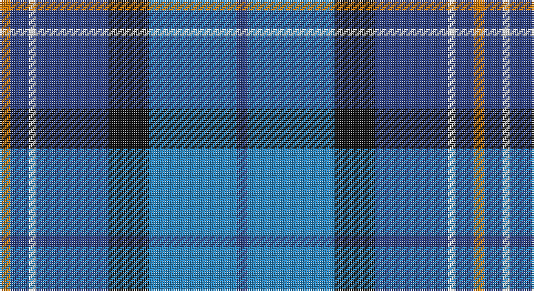

This page is one **sett** — a single exact thread-count. It belongs to the [tartan](/setts/db3t24k11db20w2db5lo3/)
(the same proportion at any scale), whose colour order is pattern [BBKBWBY](/stripes/bbkbwby/).

Sourced from register-of-tartans.  It is a [7 stripe tartan](/stripes/stripes7/).

Original link https://www.tartanregister.gov.uk/tartanDetails.aspx?ref=11498

## Register references

External register numbers recorded for this tartan.

- Scottish Register of Tartans: [11498](https://www.tartanregister.gov.uk/tartanDetails.aspx?ref=11498)

## Thread count
O/6 B10 W4 B40 K22 Ba48 B/6

One full sett is **260 threads**.

## Palette

Palette: <strong>Tartan Register</strong>
<table><thead><tr><th>Colour</th><th>Threads</th><th>Shade</th><th>Base</th><th>OKLCh</th></tr></thead><tbody><tr><td>O/</td><td style="text-align:right;font-variant-numeric:tabular-nums">6</td><td><code style="background-color:#D87C00;">#D87C00</code> <small style="color:#888">#D87C00</small></td><td>Y <code style="background-color:#F2BF00;">#F2BF00</code></td><td><small style="color:#888">oklch(67.3% 0.155 61.8)</small></td></tr><tr><td>B</td><td style="text-align:right;font-variant-numeric:tabular-nums">10</td><td><code style="background-color:#2C4084;">#2C4084</code> <small style="color:#888">#2C4084</small></td><td>B <code style="background-color:#2A418A;">#2A418A</code></td><td><small style="color:#888">oklch(39.4% 0.117 268.3)</small></td></tr><tr><td>W</td><td style="text-align:right;font-variant-numeric:tabular-nums">4</td><td><code style="background-color:#FFFFFF;">#FFFFFF</code> <small style="color:#888">#FFFFFF</small></td><td>W <code style="background-color:#F7F7F7;">#F7F7F7</code></td><td><small style="color:#888">oklch(100.0% 0.000 89.9)</small></td></tr><tr><td>B</td><td style="text-align:right;font-variant-numeric:tabular-nums">40</td><td><code style="background-color:#2C4084;">#2C4084</code> <small style="color:#888">#2C4084</small></td><td>B <code style="background-color:#2A418A;">#2A418A</code></td><td><small style="color:#888">oklch(39.4% 0.117 268.3)</small></td></tr><tr><td>K</td><td style="text-align:right;font-variant-numeric:tabular-nums">22</td><td><code style="background-color:#101010;">#101010</code> <small style="color:#888">#101010</small></td><td>K <code style="background-color:#000000;">#000000</code></td><td><small style="color:#888">oklch(17.3% 0.000 89.9)</small></td></tr><tr><td>Ba</td><td style="text-align:right;font-variant-numeric:tabular-nums">48</td><td><code style="background-color:#2888C4;">#2888C4</code> <small style="color:#888">#2888C4</small></td><td>B <code style="background-color:#2A418A;">#2A418A</code></td><td><small style="color:#888">oklch(60.1% 0.125 241.5)</small></td></tr><tr><td>B/</td><td style="text-align:right;font-variant-numeric:tabular-nums">6</td><td><code style="background-color:#2C4084;">#2C4084</code> <small style="color:#888">#2C4084</small></td><td>B <code style="background-color:#2A418A;">#2A418A</code></td><td><small style="color:#888">oklch(39.4% 0.117 268.3)</small></td></tr></tbody></table>

# Sample pattern

## Nearest tartans

The nearest existing variants by ΔTartan distance, with this tartan at the top so the swatches line up against it.

ΔTartan

Tartan

Sett

—

<a href="/ttd/edit/#slug=db3t24k11db20w2db5lo3~x2">Icelandair</a> <a class="nn-out" href="/variants/s7/db3t24k11db20w2db5lo3~x2/" title="open its dictionary page">↗</a>

0.75

<a href="/ttd/edit/#slug=db26w2db3dbi15t26dbi2t3ly4~x2&amp;base=db3t24k11db20w2db5lo3~x2">Banff and Buchan District Tartan</a> <a class="nn-out" href="/variants/s8/db26w2db3dbi15t26dbi2t3ly4~x2/" title="open its dictionary page">↗</a>

0.85

<a href="/ttd/edit/#slug=w4db24ly2dbi24t5db4ly4~x2&amp;base=db3t24k11db20w2db5lo3~x2">Mina Perhonen Japanese Corporate Tartan</a> <a class="nn-out" href="/variants/s7/w4db24ly2dbi24t5db4ly4~x2/" title="open its dictionary page">↗</a>

0.89

<a href="/ttd/edit/#slug=dbi26w2dbi3db15t26db2t3ly4~x2&amp;base=db3t24k11db20w2db5lo3~x2">Banff, and Buchan</a> <a class="nn-out" href="/variants/s8/dbi26w2dbi3db15t26db2t3ly4~x2/" title="open its dictionary page">↗</a>

0.96

<a href="/ttd/edit/#slug=db35w3db8t36dg9o3~x2&amp;base=db3t24k11db20w2db5lo3~x2">Georgian Bay, Waters of</a> <a class="nn-out" href="/variants/s6/db35w3db8t36dg9o3~x2/" title="open its dictionary page">↗</a>

1.03

<a href="/ttd/edit/#slug=db4p2dp3db24b24w3~x2&amp;base=db3t24k11db20w2db5lo3~x2">Aberdeen Academy of Performing Arts</a> <a class="nn-out" href="/variants/s6/db4p2dp3db24b24w3~x2/" title="open its dictionary page">↗</a>

1.06

<a href="/ttd/edit/#slug=db4dpi2dp3db24t24w3~x2&amp;base=db3t24k11db20w2db5lo3~x2">Aberdeen Academy of Performing Art</a> <a class="nn-out" href="/variants/s6/db4dpi2dp3db24t24w3~x2/" title="open its dictionary page">↗</a>

1.07

<a href="/ttd/edit/#slug=g5db15t11w2t1w1dg4~x4&amp;base=db3t24k11db20w2db5lo3~x2">Highlands Country Club</a> <a class="nn-out" href="/variants/s7/g5db15t11w2t1w1dg4~x4/" title="open its dictionary page">↗</a>

1.08

<a href="/ttd/edit/#slug=r2t2r2t21lg11k17lb2~x2&amp;base=db3t24k11db20w2db5lo3~x2">Loch Ness (Fashion)</a> <a class="nn-out" href="/variants/s7/r2t2r2t21lg11k17lb2~x2/" title="open its dictionary page">↗</a>

1.08

<a href="/ttd/edit/#slug=lb6lo6b21dt32r3~x2&amp;base=db3t24k11db20w2db5lo3~x2">Jamieson, Robert (Personal)</a> <a class="nn-out" href="/variants/s5/lb6lo6b21dt32r3~x2/" title="open its dictionary page">↗</a>

1.09

<a href="/ttd/edit/#slug=db12k4g4r1g4k1lo1~x4&amp;base=db3t24k11db20w2db5lo3~x2">MacLaren</a> <a class="nn-out" href="/variants/s7/db12k4g4r1g4k1lo1~x4/" title="open its dictionary page">↗</a>

## Neighbour map

Every grey dot is one of 14360 variants placed by the first two principal components of the ΔTartan feature space (44% of its variance). Red is this tartan; blue dots are its nearest — click one to open its page.

<svg viewBox="0 0 640 380" role="img" style="max-width:100%;height:auto;border:1px solid #e0e0e0;border-radius:4px;display:block" xmlns="http://www.w3.org/2000/svg"><image href="/nn/cloud.v1.png" width="640" height="380"/><a href="/variants/s8/db26w2db3dbi15t26dbi2t3ly4~x2/"><circle cx="196.0" cy="169.2" r="4" fill="#3465a4"><title>Banff and Buchan District Tartan</title></circle></a><a href="/variants/s7/w4db24ly2dbi24t5db4ly4~x2/"><circle cx="212.6" cy="177.3" r="4" fill="#3465a4"><title>Mina Perhonen Japanese Corporate Tartan</title></circle></a><a href="/variants/s8/dbi26w2dbi3db15t26db2t3ly4~x2/"><circle cx="182.0" cy="165.4" r="4" fill="#3465a4"><title>Banff, and Buchan</title></circle></a><a href="/variants/s6/db35w3db8t36dg9o3~x2/"><circle cx="247.7" cy="196.7" r="4" fill="#3465a4"><title>Georgian Bay, Waters of</title></circle></a><a href="/variants/s6/db4p2dp3db24b24w3~x2/"><circle cx="264.3" cy="188.9" r="4" fill="#3465a4"><title>Aberdeen Academy of Performing Arts</title></circle></a><a href="/variants/s6/db4dpi2dp3db24t24w3~x2/"><circle cx="265.6" cy="184.4" r="4" fill="#3465a4"><title>Aberdeen Academy of Performing Art</title></circle></a><a href="/variants/s7/g5db15t11w2t1w1dg4~x4/"><circle cx="198.6" cy="178.9" r="4" fill="#3465a4"><title>Highlands Country Club</title></circle></a><a href="/variants/s7/r2t2r2t21lg11k17lb2~x2/"><circle cx="169.2" cy="171.4" r="4" fill="#3465a4"><title>Loch Ness (Fashion)</title></circle></a><a href="/variants/s5/lb6lo6b21dt32r3~x2/"><circle cx="240.9" cy="214.8" r="4" fill="#3465a4"><title>Jamieson, Robert (Personal)</title></circle></a><a href="/variants/s7/db12k4g4r1g4k1lo1~x4/"><circle cx="236.6" cy="187.8" r="4" fill="#3465a4"><title>MacLaren</title></circle></a><circle cx="206.7" cy="188.5" r="5" fill="#c00000"/></svg>

ID: /variants/s7/db3t24k11db20w2db5lo3~x2/
