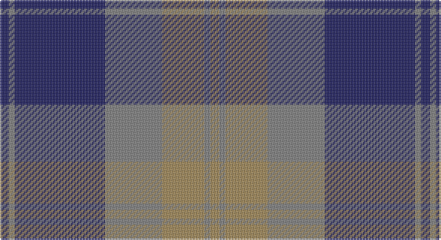

This page is one **sett** — a single exact thread-count. It belongs to the [tartan](/setts/db3y2db30y19lo14y2lo3/)
(the same proportion at any scale), whose colour order is pattern [BGBGYGY](/stripes/bgbgygy/).

Part of the [Bannockbane](/tartans/bannockbane/) tartan — the named design grouping this sett with its other cloths.

Sourced from register-of-tartans.  It is a [7 stripe tartan](/stripes/stripes7/).

Original link https://www.tartanregister.gov.uk/tartanDetails.aspx?ref=4977

## Also known as

This cloth is also recorded under:

- Bannockbane Blue
- Bannockbane Blue #1
- Bannockbane Blue #2
- Bannockbane Blue #3
- Bannockbane Brown #2
- Bannockbane Green
- Bannockbane Grey #1
- Bannockbane Grey #2
- Bannockbane Grey #3
- Bannockbane, Blue
- Bannockbane, Green
- Bannockbane, Grey
- Bannockbane, Light Tan

## Register references

External register numbers recorded for this tartan.

- Scottish Register of Tartans: [4977](https://www.tartanregister.gov.uk/tartanDetails.aspx?ref=4977)
- Scottish Tartans Authority (ITI): 3655

## Thread count
DB/6 N4 DB60 N38 LT28 N4 LT/6

One full sett is **280 threads**.

## Palette

Palette: <strong>Tartan Register</strong>
<table><thead><tr><th>Colour</th><th>Threads</th><th>Shade</th><th>Base</th><th>OKLCh</th></tr></thead><tbody><tr><td>DB/</td><td style="text-align:right;font-variant-numeric:tabular-nums">6</td><td><code style="background-color:#202060;">#202060</code> <small style="color:#888">#202060</small></td><td>B <code style="background-color:#2A418A;">#2A418A</code></td><td><small style="color:#888">oklch(28.9% 0.111 276.9)</small></td></tr><tr><td>N</td><td style="text-align:right;font-variant-numeric:tabular-nums">4</td><td><code style="background-color:#808080;">#808080</code> <small style="color:#888">#808080</small></td><td>G <code style="background-color:#006100;">#006100</code></td><td><small style="color:#888">oklch(60.0% 0.000 89.9)</small></td></tr><tr><td>DB</td><td style="text-align:right;font-variant-numeric:tabular-nums">60</td><td><code style="background-color:#202060;">#202060</code> <small style="color:#888">#202060</small></td><td>B <code style="background-color:#2A418A;">#2A418A</code></td><td><small style="color:#888">oklch(28.9% 0.111 276.9)</small></td></tr><tr><td>N</td><td style="text-align:right;font-variant-numeric:tabular-nums">38</td><td><code style="background-color:#808080;">#808080</code> <small style="color:#888">#808080</small></td><td>G <code style="background-color:#006100;">#006100</code></td><td><small style="color:#888">oklch(60.0% 0.000 89.9)</small></td></tr><tr><td>LT</td><td style="text-align:right;font-variant-numeric:tabular-nums">28</td><td><code style="background-color:#A08858;">#A08858</code> <small style="color:#888">#A08858</small></td><td>Y <code style="background-color:#F2BF00;">#F2BF00</code></td><td><small style="color:#888">oklch(63.7% 0.071 84.0)</small></td></tr><tr><td>N</td><td style="text-align:right;font-variant-numeric:tabular-nums">4</td><td><code style="background-color:#808080;">#808080</code> <small style="color:#888">#808080</small></td><td>G <code style="background-color:#006100;">#006100</code></td><td><small style="color:#888">oklch(60.0% 0.000 89.9)</small></td></tr><tr><td>LT/</td><td style="text-align:right;font-variant-numeric:tabular-nums">6</td><td><code style="background-color:#A08858;">#A08858</code> <small style="color:#888">#A08858</small></td><td>Y <code style="background-color:#F2BF00;">#F2BF00</code></td><td><small style="color:#888">oklch(63.7% 0.071 84.0)</small></td></tr></tbody></table>

# Sample pattern

## Compared to the master

This cloth is one sett of its design; the master sett (the exemplar the design is anchored on) is below for comparison.

<figure style="margin:0"><figcaption style="color:#888;font-size:smaller">this sett</figcaption></figure>
<figure style="margin:0"><figcaption style="color:#888;font-size:smaller"><a href="/setts/o2dy2o15dy2w10lo15dy2lo2/">master sett →</a></figcaption></figure>

## Nearest tartans

The nearest existing variants by ΔTartan distance, with this tartan at the top so the swatches line up against it.

ΔTartan

Tartan

Sett

—

<a href="/ttd/edit/#slug=db3y2db30y19lo14y2lo3~x2">Bannockbane Brown #2</a> <a class="nn-out" href="/variants/s7/db3y2db30y19lo14y2lo3~x2/" title="open its dictionary page">↗</a>

1.06

<a href="/ttd/edit/#slug=r3db1r1db11g10r2db2~x4&amp;base=db3y2db30y19lo14y2lo3~x2">Robertson of Struan 1816</a> <a class="nn-out" href="/variants/s7/r3db1r1db11g10r2db2~x4/" title="open its dictionary page">↗</a>

1.12

<a href="/ttd/edit/#slug=db3g21db3o21db35w3~x2&amp;base=db3y2db30y19lo14y2lo3~x2">Donnolly</a> <a class="nn-out" href="/variants/s6/db3g21db3o21db35w3~x2/" title="open its dictionary page">↗</a>

1.13

<a href="/ttd/edit/#slug=t4dp2t6dp2t10dp30g10dp2g9dp2~x2&amp;base=db3y2db30y19lo14y2lo3~x2">Lang</a> <a class="nn-out" href="/variants/s10/t4dp2t6dp2t10dp30g10dp2g9dp2~x2/" title="open its dictionary page">↗</a>

1.15

<a href="/ttd/edit/#slug=r6db2r2db21dg20r4dg4~x2&amp;base=db3y2db30y19lo14y2lo3~x2">Robertson of Struan</a> <a class="nn-out" href="/variants/s7/r6db2r2db21dg20r4dg4~x2/" title="open its dictionary page">↗</a>

1.16

<a href="/ttd/edit/#slug=db8r3db1r3dg14r3db1~x4&amp;base=db3y2db30y19lo14y2lo3~x2">Logan</a> <a class="nn-out" href="/variants/s7/db8r3db1r3dg14r3db1~x4/" title="open its dictionary page">↗</a>

1.24

<a href="/ttd/edit/#slug=db22g3db3g3db3g9o28g3o6~x2&amp;base=db3y2db30y19lo14y2lo3~x2">Manx Centenary District Tartan</a> <a class="nn-out" href="/variants/s9/db22g3db3g3db3g9o28g3o6~x2/" title="open its dictionary page">↗</a>

1.27

<a href="/ttd/edit/#slug=db9r3db1g9r3db1~x2&amp;base=db3y2db30y19lo14y2lo3~x2">Logan #5</a> <a class="nn-out" href="/variants/s6/db9r3db1g9r3db1~x2/" title="open its dictionary page">↗</a>

1.31

<a href="/ttd/edit/#slug=o33k4o4k5o4k7db41r4~x2&amp;base=db3y2db30y19lo14y2lo3~x2">Kinnaird (Australia) (Name)</a> <a class="nn-out" href="/variants/s8/o33k4o4k5o4k7db41r4~x2/" title="open its dictionary page">↗</a>

1.36

<a href="/ttd/edit/#slug=n32k3n3k3b5k8o21k4~x2&amp;base=db3y2db30y19lo14y2lo3~x2">Speyside Blue (Fashion)</a> <a class="nn-out" href="/variants/s8/n32k3n3k3b5k8o21k4~x2/" title="open its dictionary page">↗</a>

1.37

<a href="/ttd/edit/#slug=db4r11g11db22ly1g4~x2&amp;base=db3y2db30y19lo14y2lo3~x2">Harvey</a> <a class="nn-out" href="/variants/s6/db4r11g11db22ly1g4~x2/" title="open its dictionary page">↗</a>

## Neighbour map

Every grey dot is one of 14360 variants placed by the first two principal components of the ΔTartan feature space (44% of its variance). Red is this tartan; blue dots are its nearest — click one to open its page.

<svg viewBox="0 0 640 380" role="img" style="max-width:100%;height:auto;border:1px solid #e0e0e0;border-radius:4px;display:block" xmlns="http://www.w3.org/2000/svg"><image href="/nn/cloud.v1.png" width="640" height="380"/><a href="/variants/s7/r3db1r1db11g10r2db2~x4/"><circle cx="295.1" cy="220.1" r="4" fill="#3465a4"><title>Robertson of Struan 1816</title></circle></a><a href="/variants/s6/db3g21db3o21db35w3~x2/"><circle cx="264.6" cy="208.1" r="4" fill="#3465a4"><title>Donnolly</title></circle></a><a href="/variants/s10/t4dp2t6dp2t10dp30g10dp2g9dp2~x2/"><circle cx="325.6" cy="182.2" r="4" fill="#3465a4"><title>Lang</title></circle></a><a href="/variants/s7/r6db2r2db21dg20r4dg4~x2/"><circle cx="284.4" cy="229.6" r="4" fill="#3465a4"><title>Robertson of Struan</title></circle></a><a href="/variants/s7/db8r3db1r3dg14r3db1~x4/"><circle cx="288.6" cy="210.5" r="4" fill="#3465a4"><title>Logan</title></circle></a><a href="/variants/s9/db22g3db3g3db3g9o28g3o6~x2/"><circle cx="278.6" cy="215.9" r="4" fill="#3465a4"><title>Manx Centenary District Tartan</title></circle></a><a href="/variants/s6/db9r3db1g9r3db1~x2/"><circle cx="260.4" cy="243.6" r="4" fill="#3465a4"><title>Logan #5</title></circle></a><a href="/variants/s8/o33k4o4k5o4k7db41r4~x2/"><circle cx="247.7" cy="182.6" r="4" fill="#3465a4"><title>Kinnaird (Australia) (Name)</title></circle></a><a href="/variants/s8/n32k3n3k3b5k8o21k4~x2/"><circle cx="266.9" cy="198.4" r="4" fill="#3465a4"><title>Speyside Blue (Fashion)</title></circle></a><a href="/variants/s6/db4r11g11db22ly1g4~x2/"><circle cx="298.1" cy="194.8" r="4" fill="#3465a4"><title>Harvey</title></circle></a><circle cx="297.7" cy="202.6" r="5" fill="#c00000"/></svg>

ID: /variants/s7/db3y2db30y19lo14y2lo3~x2/
