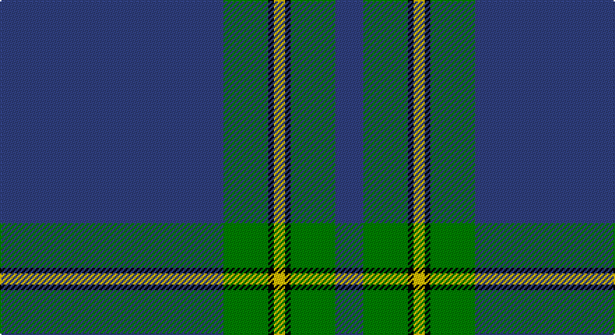

This page is one **sett** — a single exact thread-count. It belongs to the [tartan](/setts/db40g8k1ly2k1g8db5/)
(the same proportion at any scale), whose colour order is pattern [BGKYKGB](/stripes/bgkykgb/).

Part of the [Salvation Army Hunting](/tartans/salvation-army-hunting/) tartan — the named design grouping this sett with its other cloths.

Sourced from weddslist.  It is a [7 stripe tartan](/stripes/stripes7/).

Original link http://www.weddslist.com/cgi-bin/tartans/pg.pl?source=sts

## Provenance

Earliest known date: 1983 Designed to be ready for the Perth Citadel Corps Centenary. The hunting version replaces red with green.

## Also known as

This cloth is also recorded under:

- Salvation Army Htg
- Salvation Army, Hunting

2 attestations — the source records this cloth was collapsed from (oldest owns this page)

<ul>
<li>undated — Salvation Army, Hunting (weddslist, <a href="http://www.weddslist.com/cgi-bin/tartans/pg.pl?source=sts">record</a>)</li>
<li>undated — Salvation Army Hunting Corporate Tartan (house-of-tartan, <a href="http://www.house-of-tartan.scotland.net/house/TartanViewjs.asp?colr=Def&tnam=150">record</a>)</li>
</ul>

## Thread count
B/160 G32 K4 Y8 K4 G32 B/20

One full sett is **340 threads**.

## Palette

Palette: <strong>Ingles Buchan</strong> <small style="color:#888">(1 of 4 colours)</small>
<table><thead><tr><th>Colour</th><th>Threads</th><th>Shade</th><th>Base</th><th>OKLCh</th></tr></thead><tbody><tr><td>B/</td><td style="text-align:right;font-variant-numeric:tabular-nums">160</td><td><code style="background-color:#304080;">#304080</code> <small style="color:#888">#304080</small></td><td>B <code style="background-color:#2A418A;">#2A418A</code></td><td><small style="color:#888">oklch(39.4% 0.109 270.2)</small></td></tr><tr><td>G</td><td style="text-align:right;font-variant-numeric:tabular-nums">32</td><td><code style="background-color:#008000;">#008000</code> <small style="color:#888">#008000</small></td><td>G <code style="background-color:#006100;">#006100</code></td><td><small style="color:#888">oklch(52.0% 0.177 142.5)</small></td></tr><tr><td>K</td><td style="text-align:right;font-variant-numeric:tabular-nums">4</td><td><code style="background-color:#000000;">#000000</code> <small style="color:#888">#000000</small></td><td>K <code style="background-color:#000000;">#000000</code></td><td><small style="color:#888">oklch(0.0% 0.000 0.0)</small></td></tr><tr><td>Y</td><td style="text-align:right;font-variant-numeric:tabular-nums">8</td><td><code style="background-color:#F0C000;">#F0C000</code> <small style="color:#888">#F0C000</small></td><td>Y <code style="background-color:#F2BF00;">#F2BF00</code></td><td><small style="color:#888">oklch(82.7% 0.169 90.5)</small></td></tr><tr><td>K</td><td style="text-align:right;font-variant-numeric:tabular-nums">4</td><td><code style="background-color:#000000;">#000000</code> <small style="color:#888">#000000</small></td><td>K <code style="background-color:#000000;">#000000</code></td><td><small style="color:#888">oklch(0.0% 0.000 0.0)</small></td></tr><tr><td>G</td><td style="text-align:right;font-variant-numeric:tabular-nums">32</td><td><code style="background-color:#008000;">#008000</code> <small style="color:#888">#008000</small></td><td>G <code style="background-color:#006100;">#006100</code></td><td><small style="color:#888">oklch(52.0% 0.177 142.5)</small></td></tr><tr><td>B/</td><td style="text-align:right;font-variant-numeric:tabular-nums">20</td><td><code style="background-color:#304080;">#304080</code> <small style="color:#888">#304080</small></td><td>B <code style="background-color:#2A418A;">#2A418A</code></td><td><small style="color:#888">oklch(39.4% 0.109 270.2)</small></td></tr></tbody></table>

# Sample pattern

## Compared to the master

This cloth is one sett of its design; the master sett (the exemplar the design is anchored on) is below for comparison.

<figure style="margin:0"><figcaption style="color:#888;font-size:smaller">this sett</figcaption></figure>
<figure style="margin:0"><figcaption style="color:#888;font-size:smaller"><a href="/setts/dg8k1ly2k1dg8db4dg8k1ly2k1dg8db5/">master sett →</a></figcaption></figure>

## Nearest tartans

The nearest existing variants by ΔTartan distance, with this tartan at the top so the swatches line up against it.

ΔTartan

Tartan

Sett

—

<a href="/ttd/edit/#slug=db40g8k1ly2k1g8db5~x4">Salvation Army, Hunting</a> <a class="nn-out" href="/variants/s7/db40g8k1ly2k1g8db5~x4/" title="open its dictionary page">↗</a>

0.98

<a href="/ttd/edit/#slug=db8w4dt6db2dt6o10dt63w3&amp;base=db40g8k1ly2k1g8db5~x4">Pride of the Clyde</a> <a class="nn-out" href="/variants/s8/db8w4dt6db2dt6o10dt63w3/" title="open its dictionary page">↗</a>

1.05

<a href="/ttd/edit/#slug=dt5ly1g7r1dt45r5ly3dt4ly3~x2&amp;base=db40g8k1ly2k1g8db5~x4">Brooks Brothers Signature Corporate Tartan</a> <a class="nn-out" href="/variants/s9/dt5ly1g7r1dt45r5ly3dt4ly3~x2/" title="open its dictionary page">↗</a>

1.28

<a href="/ttd/edit/#slug=n36k3dy3t1dy3k3n4dy6k1t2~x4&amp;base=db40g8k1ly2k1g8db5~x4">Chateau</a> <a class="nn-out" href="/variants/s10/n36k3dy3t1dy3k3n4dy6k1t2~x4/" title="open its dictionary page">↗</a>

1.28

<a href="/ttd/edit/#slug=g44db11g5t3g4db8g4w1~x2&amp;base=db40g8k1ly2k1g8db5~x4">Hastings-Stephenson (Personal)</a> <a class="nn-out" href="/variants/s8/g44db11g5t3g4db8g4w1~x2/" title="open its dictionary page">↗</a>

1.35

<a href="/ttd/edit/#slug=b64k3g14k4b4k12lo4~x2&amp;base=db40g8k1ly2k1g8db5~x4">Murray of Elibank</a> <a class="nn-out" href="/variants/s7/b64k3g14k4b4k12lo4~x2/" title="open its dictionary page">↗</a>

1.35

<a href="/ttd/edit/#slug=do4t48do21t14lo3t6do1ly3~x2&amp;base=db40g8k1ly2k1g8db5~x4">Munster Ancestry</a> <a class="nn-out" href="/variants/s8/do4t48do21t14lo3t6do1ly3~x2/" title="open its dictionary page">↗</a>

1.43

<a href="/ttd/edit/#slug=db48g14r3g2r3g2~x2&amp;base=db40g8k1ly2k1g8db5~x4">Wilson</a> <a class="nn-out" href="/variants/s6/db48g14r3g2r3g2~x2/" title="open its dictionary page">↗</a>

1.45

<a href="/ttd/edit/#slug=dp11t90dy3t11dp7dy11dp13t11&amp;base=db40g8k1ly2k1g8db5~x4">Royal Conservatoire of Scotland</a> <a class="nn-out" href="/variants/s8/dp11t90dy3t11dp7dy11dp13t11/" title="open its dictionary page">↗</a>

1.54

<a href="/ttd/edit/#slug=n140k3w16k3do16k3do16&amp;base=db40g8k1ly2k1g8db5~x4">Crail</a> <a class="nn-out" href="/variants/s7/n140k3w16k3do16k3do16/" title="open its dictionary page">↗</a>

1.54

<a href="/ttd/edit/#slug=dt3g6dt2ly3dt42k6w3~x2&amp;base=db40g8k1ly2k1g8db5~x4">Bro-sant-Brieg</a> <a class="nn-out" href="/variants/s7/dt3g6dt2ly3dt42k6w3~x2/" title="open its dictionary page">↗</a>

## Neighbour map

Every grey dot is one of 14360 variants placed by the first two principal components of the ΔTartan feature space (44% of its variance). Red is this tartan; blue dots are its nearest — click one to open its page.

<svg viewBox="0 0 640 380" role="img" style="max-width:100%;height:auto;border:1px solid #e0e0e0;border-radius:4px;display:block" xmlns="http://www.w3.org/2000/svg"><image href="/nn/cloud.v1.png" width="640" height="380"/><a href="/variants/s8/db8w4dt6db2dt6o10dt63w3/"><circle cx="509.8" cy="146.4" r="4" fill="#3465a4"><title>Pride of the Clyde</title></circle></a><a href="/variants/s9/dt5ly1g7r1dt45r5ly3dt4ly3~x2/"><circle cx="507.0" cy="114.0" r="4" fill="#3465a4"><title>Brooks Brothers Signature Corporate Tartan</title></circle></a><a href="/variants/s10/n36k3dy3t1dy3k3n4dy6k1t2~x4/"><circle cx="450.4" cy="123.6" r="4" fill="#3465a4"><title>Chateau</title></circle></a><a href="/variants/s8/g44db11g5t3g4db8g4w1~x2/"><circle cx="501.6" cy="146.5" r="4" fill="#3465a4"><title>Hastings-Stephenson (Personal)</title></circle></a><a href="/variants/s7/b64k3g14k4b4k12lo4~x2/"><circle cx="413.1" cy="162.1" r="4" fill="#3465a4"><title>Murray of Elibank</title></circle></a><a href="/variants/s8/do4t48do21t14lo3t6do1ly3~x2/"><circle cx="503.7" cy="156.8" r="4" fill="#3465a4"><title>Munster Ancestry</title></circle></a><a href="/variants/s6/db48g14r3g2r3g2~x2/"><circle cx="489.6" cy="188.6" r="4" fill="#3465a4"><title>Wilson</title></circle></a><a href="/variants/s8/dp11t90dy3t11dp7dy11dp13t11/"><circle cx="513.6" cy="164.3" r="4" fill="#3465a4"><title>Royal Conservatoire of Scotland</title></circle></a><a href="/variants/s7/n140k3w16k3do16k3do16/"><circle cx="501.4" cy="111.6" r="4" fill="#3465a4"><title>Crail</title></circle></a><a href="/variants/s7/dt3g6dt2ly3dt42k6w3~x2/"><circle cx="455.0" cy="147.0" r="4" fill="#3465a4"><title>Bro-sant-Brieg</title></circle></a><circle cx="486.5" cy="143.3" r="5" fill="#c00000"/></svg>

ID: /variants/s7/db40g8k1ly2k1g8db5~x4/
