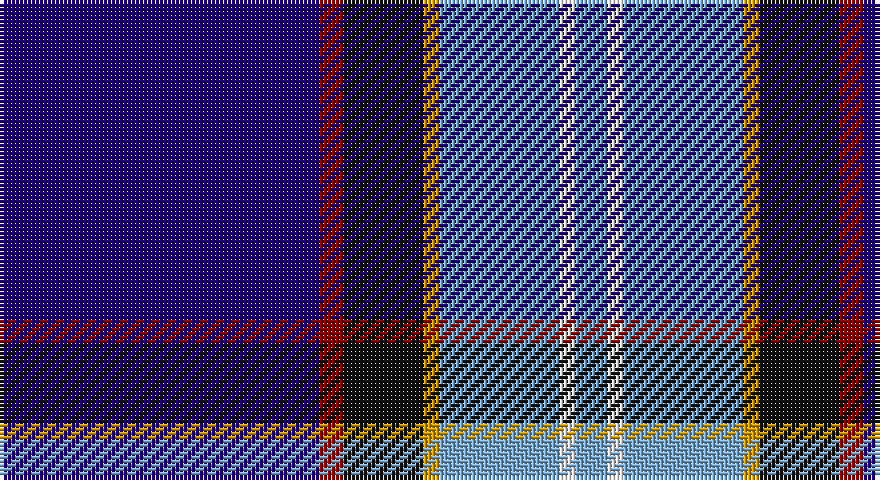

This page is one **sett** — a single exact thread-count. It belongs to the [tartan](/setts/db40r3k10lo2lr15w2lr4/)
(the same proportion at any scale), whose colour order is pattern [BRKYYWY](/stripes/brkyywy/).

Part of the [U.S. Forces Thurso](/tartans/u-s-forces-thurso/) tartan — the named design grouping this sett with its other cloths.

Sourced from tartans-authority.  It is a [7 stripe tartan](/stripes/stripes7/).

Original link http://www.tartansauthority.com/tartan-ferret/display/5074/

## Register references

External register numbers recorded for this tartan.

- Scottish Tartans Authority (ITI): 5074

## Thread count
DB/80 DR6 K20 DY4 B30 W4 B/8

One full sett is **216 threads**.

## Palette

Palette: <strong>Tartan Register</strong> <small style="color:#888">(4 of 6 colours)</small>
<table><thead><tr><th>Colour</th><th>Threads</th><th>Shade</th><th>Base</th><th>OKLCh</th></tr></thead><tbody><tr><td>DB/</td><td style="text-align:right;font-variant-numeric:tabular-nums">80</td><td><code style="background-color:#1C0070;">#1C0070</code> <small style="color:#888">#1C0070</small></td><td>B <code style="background-color:#2A418A;">#2A418A</code></td><td><small style="color:#888">oklch(26.3% 0.162 277.1)</small></td></tr><tr><td>DR</td><td style="text-align:right;font-variant-numeric:tabular-nums">6</td><td><code style="background-color:#880000;">#880000</code> <small style="color:#888">#880000</small></td><td>R <code style="background-color:#CC0000;">#CC0000</code></td><td><small style="color:#888">oklch(39.4% 0.162 29.2)</small></td></tr><tr><td>K</td><td style="text-align:right;font-variant-numeric:tabular-nums">20</td><td><code style="background-color:#101010;">#101010</code> <small style="color:#888">#101010</small></td><td>K <code style="background-color:#000000;">#000000</code></td><td><small style="color:#888">oklch(17.3% 0.000 89.9)</small></td></tr><tr><td>DY</td><td style="text-align:right;font-variant-numeric:tabular-nums">4</td><td><code style="background-color:#D09800;">#D09800</code> <small style="color:#888">#D09800</small></td><td>Y <code style="background-color:#F2BF00;">#F2BF00</code></td><td><small style="color:#888">oklch(71.4% 0.147 82.1)</small></td></tr><tr><td>B</td><td style="text-align:right;font-variant-numeric:tabular-nums">30</td><td><code style="background-color:#7CA8CC;">#7CA8CC</code> <small style="color:#888">#7CA8CC</small></td><td>Y <code style="background-color:#F2BF00;">#F2BF00</code></td><td><small style="color:#888">oklch(71.3% 0.071 243.7)</small></td></tr><tr><td>W</td><td style="text-align:right;font-variant-numeric:tabular-nums">4</td><td><code style="background-color:#FCFCFC;">#FCFCFC</code> <small style="color:#888">#FCFCFC</small></td><td>W <code style="background-color:#F7F7F7;">#F7F7F7</code></td><td><small style="color:#888">oklch(99.1% 0.000 89.9)</small></td></tr><tr><td>B/</td><td style="text-align:right;font-variant-numeric:tabular-nums">8</td><td><code style="background-color:#7CA8CC;">#7CA8CC</code> <small style="color:#888">#7CA8CC</small></td><td>Y <code style="background-color:#F2BF00;">#F2BF00</code></td><td><small style="color:#888">oklch(71.3% 0.071 243.7)</small></td></tr></tbody></table>

# Sample pattern

## Compared to the master

This cloth is one sett of its design; the master sett (the exemplar the design is anchored on) is below for comparison.

<figure style="margin:0"><figcaption style="color:#888;font-size:smaller">this sett</figcaption></figure>
<figure style="margin:0"><figcaption style="color:#888;font-size:smaller"><a href="/setts/db20r3k10lo2lr15w2lr4w2lr15lo2k10r3db20/">master sett →</a></figcaption></figure>

## Nearest tartans

The nearest existing variants by ΔTartan distance, with this tartan at the top so the swatches line up against it.

ΔTartan

Tartan

Sett

—

<a href="/ttd/edit/#slug=db40r3k10lo2lr15w2lr4~x2">U.S. Forces Thurso (Military)</a> <a class="nn-out" href="/variants/s7/db40r3k10lo2lr15w2lr4~x2/" title="open its dictionary page">↗</a>

0.82

<a href="/ttd/edit/#slug=m1g2t10r1db15w1~x4&amp;base=db40r3k10lo2lr15w2lr4~x2">Oren Peterson</a> <a class="nn-out" href="/variants/s6/m1g2t10r1db15w1~x4/" title="open its dictionary page">↗</a>

1.18

<a href="/ttd/edit/#slug=lb8db10dt69w6dt6r8b19lb3&amp;base=db40r3k10lo2lr15w2lr4~x2">Virginia International Tattoo Hixon</a> <a class="nn-out" href="/variants/s8/lb8db10dt69w6dt6r8b19lb3/" title="open its dictionary page">↗</a>

1.21

<a href="/ttd/edit/#slug=w3db3k1t16k1db8r3db24ly3~x2&amp;base=db40r3k10lo2lr15w2lr4~x2">MacCormick Festive</a> <a class="nn-out" href="/variants/s9/w3db3k1t16k1db8r3db24ly3~x2/" title="open its dictionary page">↗</a>

1.25

<a href="/ttd/edit/#slug=db4r2db40k11g2w16r2~x2&amp;base=db40r3k10lo2lr15w2lr4~x2">Sinclair, Blue (Personal)</a> <a class="nn-out" href="/variants/s7/db4r2db40k11g2w16r2~x2/" title="open its dictionary page">↗</a>

1.26

<a href="/ttd/edit/#slug=w3r5g5dp4dg7db38lo3~x2&amp;base=db40r3k10lo2lr15w2lr4~x2">Blairgowrie Golf Club, The</a> <a class="nn-out" href="/variants/s7/w3r5g5dp4dg7db38lo3~x2/" title="open its dictionary page">↗</a>

1.33

<a href="/ttd/edit/#slug=k4n4dt32r4t17w2~x2&amp;base=db40r3k10lo2lr15w2lr4~x2">Shearer (2016)</a> <a class="nn-out" href="/variants/s6/k4n4dt32r4t17w2~x2/" title="open its dictionary page">↗</a>

1.35

<a href="/ttd/edit/#slug=r2w6k12db36o12ly1~x2&amp;base=db40r3k10lo2lr15w2lr4~x2">Alan Stone Family (Personal)</a> <a class="nn-out" href="/variants/s6/r2w6k12db36o12ly1~x2/" title="open its dictionary page">↗</a>

1.35

<a href="/ttd/edit/#slug=r3db38k13w3o20ly2~x2&amp;base=db40r3k10lo2lr15w2lr4~x2">LLoyd of Astargus Canadian Family Tartan</a> <a class="nn-out" href="/variants/s6/r3db38k13w3o20ly2~x2/" title="open its dictionary page">↗</a>

1.36

<a href="/variants/s6/g6ni16db49n14db2w6~x2/">Gorman Family (Canada) (Personal)</a>

1.36

<a href="/ttd/edit/#slug=db35r2k16ly2b25w2b6~x2&amp;base=db40r3k10lo2lr15w2lr4~x2">Unidentified #23</a> <a class="nn-out" href="/variants/s7/db35r2k16ly2b25w2b6~x2/" title="open its dictionary page">↗</a>

## Neighbour map

Every grey dot is one of 14360 variants placed by the first two principal components of the ΔTartan feature space (44% of its variance). Red is this tartan; blue dots are its nearest — click one to open its page.

<svg viewBox="0 0 640 380" role="img" style="max-width:100%;height:auto;border:1px solid #e0e0e0;border-radius:4px;display:block" xmlns="http://www.w3.org/2000/svg"><image href="/nn/cloud.v1.png" width="640" height="380"/><a href="/variants/s6/m1g2t10r1db15w1~x4/"><circle cx="245.7" cy="144.8" r="4" fill="#3465a4"><title>Oren Peterson</title></circle></a><a href="/variants/s8/lb8db10dt69w6dt6r8b19lb3/"><circle cx="298.9" cy="110.6" r="4" fill="#3465a4"><title>Virginia International Tattoo Hixon</title></circle></a><a href="/variants/s9/w3db3k1t16k1db8r3db24ly3~x2/"><circle cx="297.1" cy="115.1" r="4" fill="#3465a4"><title>MacCormick Festive</title></circle></a><a href="/variants/s7/db4r2db40k11g2w16r2~x2/"><circle cx="290.2" cy="126.9" r="4" fill="#3465a4"><title>Sinclair, Blue (Personal)</title></circle></a><a href="/variants/s7/w3r5g5dp4dg7db38lo3~x2/"><circle cx="257.4" cy="121.3" r="4" fill="#3465a4"><title>Blairgowrie Golf Club, The</title></circle></a><a href="/variants/s6/k4n4dt32r4t17w2~x2/"><circle cx="249.0" cy="151.0" r="4" fill="#3465a4"><title>Shearer (2016)</title></circle></a><a href="/variants/s6/r2w6k12db36o12ly1~x2/"><circle cx="268.9" cy="114.7" r="4" fill="#3465a4"><title>Alan Stone Family (Personal)</title></circle></a><a href="/variants/s6/r3db38k13w3o20ly2~x2/"><circle cx="236.4" cy="146.3" r="4" fill="#3465a4"><title>LLoyd of Astargus Canadian Family Tartan</title></circle></a><a href="/variants/s6/g6ni16db49n14db2w6~x2/"><circle cx="305.6" cy="159.9" r="4" fill="#3465a4"><title>Gorman Family (Canada) (Personal)</title></circle></a><a href="/variants/s7/db35r2k16ly2b25w2b6~x2/"><circle cx="177.7" cy="139.7" r="4" fill="#3465a4"><title>Unidentified #23</title></circle></a><circle cx="259.3" cy="121.2" r="5" fill="#c00000"/></svg>

ID: /variants/s7/db40r3k10lo2lr15w2lr4~x2/
