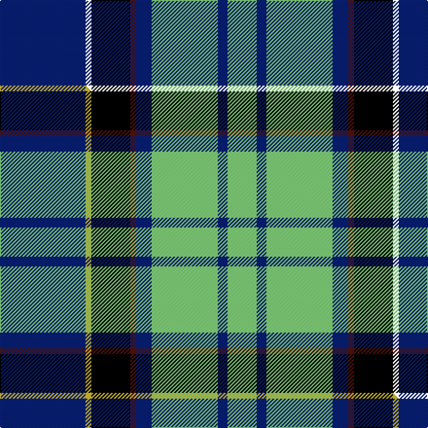

This is one **variant** — a specific cloth: this exact thread count and colourway, with its own
provenance below. It is one weaving of the [sett](/tartans/u/us/us-air-force-reserve-pipe-band/) (the scale-free proportion — the
same cloth at any scale or shade), whose colour order is pattern [BKKBBYBY](/stripes/bkkbbyby/).

Part of the [US Air Force Reserve Pipe Band](/tartans/u/us/us-air-force-reserve-pipe-band/) tartan — the named design grouping this sett with its other cloths.

Sourced from house-of-tartan.  It is a [7 stripe tartan](/stripes/stripes7/).

Original link [http://www.house-of-tartan.scotland.net/house/TartanViewjs.asp?colr=Def&tnam=2437](http://www.house-of-tartan.scotland.net/house/TartanViewjs.asp?colr=Def&tnam=2437)

## Provenance

Earliest known date: 01/01/1988 One of a series of US Military tartans woven exclusively by the Strathmore Woollen Company of Forfar and adopted by the Band of the Air Force Reserve, Georgia, USA in the early 1990s. Although this has no official US Military recognition, it has been widely accepted by US servicemen and their families with Air Force connections as a representative design. Originally called 'Lady Jane of St Cirus', the design was shown to members of the pipe band who liked it sufficiently to adopt it (with Strathmore's agreement).

Dataset <small>— provenance for this record, inherited from the source manifest</small>

<dl class="dataset-prov">
<dt>source</dt><dd><a href="/sources/house-of-tartan/">House of Tartan</a></dd>
<dt>data captured from</dt><dd><a href="https://github.com/thetartan/tartan-database/blob/master/data/house-of-tartan/data.csv">https://github.com/thetartan/tartan-database/blob/master/data/house-of-tartan/data.csv</a></dd>
<dt>data date</dt><dd>01/01/1988 <small>(this record)</small></dd>
<dt>licence</dt><dd><a href="https://creativecommons.org/licenses/by-nc-nd/4.0/">CC BY-NC-ND 4.0</a></dd>
</dl>

Capture chain <small>— the hands this data passed through, oldest first; each capture carries its own licence</small>

<ol class="capture-chain">
<li><a href="http://www.house-of-tartan.scotland.net/">House of Tartan</a> <small>the weaver/retailer's database — the site is now offline; the URL is kept as the ultimate source's identity</small></li>
<li><a href="https://github.com/thetartan/tartan-database">thetartan/tartan-database</a> <small>2016-2017</small> · <a href="https://creativecommons.org/licenses/by-nc-nd/4.0/">CC BY-NC-ND 4.0</a> <small>Levko Kravets's frozen compilation — the capture we vendored, and where its CC licence text came from</small></li>
<li>this dictionary <small>captured 2026-06-10 · commit 5bf86c7566</small> <small>each re-capture is a git commit to data/sources</small></li>
</ol>

## Thread count
DB/88 K6 K40 DR6 DB16 LG68 DB10 LG/30

One full sett is **410 threads**.

## Palette
<table><thead><tr><th>Colour</th><th>Shade</th><th>OKLCh</th></tr></thead><tbody><tr><td>T</td><td><code style="background-color:#00879F;">#00879F</code> <small style="color:#888">#00879F</small></td><td><small style="color:#888">oklch(57.4% 0.102 216.1)</small></td></tr><tr><td>LG</td><td><code style="background-color:#82D67A;">#82D67A</code> <small style="color:#888">#82D67A</small></td><td><small style="color:#888">oklch(80.1% 0.150 142.2)</small></td></tr><tr><td>DB</td><td><code style="background-color:#082077;">#082077</code> <small style="color:#888">#082077</small></td><td><small style="color:#888">oklch(30.0% 0.149 265.1)</small></td></tr><tr><td>DR</td><td><code style="background-color:#55120C;">#55120C</code> <small style="color:#888">#55120C</small></td><td><small style="color:#888">oklch(30.0% 0.099 29.3)</small></td></tr><tr><td>K</td><td><code style="background-color:#000000;">#000000</code> <small style="color:#888">#000000</small></td><td><small style="color:#888">oklch(0.0% 0.000 0.0)</small></td></tr><tr><td>DY</td><td><code style="background-color:#3A2B0D;">#3A2B0D</code> <small style="color:#888">#3A2B0D</small></td><td><small style="color:#888">oklch(30.0% 0.049 82.0)</small></td></tr></tbody></table>

# Sample pattern

[Sample sheet (PDF)](swatch.pdf) — the woven sample, thread count and palette on one printable A4, rendered on demand (the same sheet the TTD print page downloads).

## Compared to the master

This cloth is one sett of its design; the master sett (the exemplar the design is anchored on) is below for comparison.

Its **ΔTartan distance** from the master is **1.30** — the same measure the nearest-tartans table ranks by (0 is identical; a re-scale of the same cloth is near 0, a recolour or a different proportion further).

<figure class="master-compare" style="margin:0">

this sett
master sett ★

<figcaption style="color:#888;font-size:smaller">One weave of this sett against the <a href="/setts/db44ly3k20dr3db8lg34db5lg15/">master sett ★</a>, split on the diagonal: a shared proportion runs seamlessly across it with only the shades shifting; a different proportion breaks on it.</figcaption>
</figure>

## Nearest tartan variants

The nearest existing variants by ΔTartan distance, with this cloth at the top so the swatches line up against it.

ΔTartan

Threads

Variant

Sett

—

410

<a href="/variants/s7/db44k23dr3db8lg34db5lg15~x2/">US Air Force Reserve Pipe Band Military Tartan</a>

<a href="/ttd/edit/#slug=db44ly3k20dr3db8lg34db5lg15~x2&amp;base=db44k23dr3db8lg34db5lg15~x2" title="compare in the TTD">1.30</a>

410

<a href="/variants/s8/db44ly3k20dr3db8lg34db5lg15~x2/">US Air Force Reserve Pipe Band</a>

<a href="/ttd/edit/#slug=y4k4lb5t24y2k24w4~x2&amp;base=db44k23dr3db8lg34db5lg15~x2" title="compare in the TTD">2.02</a>

252

<a href="/variants/s7/y4k4lb5t24y2k24w4~x2/">Mina Perhonen</a>

<a href="/ttd/edit/#slug=db12k4g4r1g4k1lo1~x4&amp;base=db44k23dr3db8lg34db5lg15~x2" title="compare in the TTD">2.37</a>

164

<a href="/variants/s7/db12k4g4r1g4k1lo1~x4/">MacLaren (Clan)</a>

<a href="/ttd/edit/#slug=k6g15w2db22r2k4~x2&amp;base=db44k23dr3db8lg34db5lg15~x2" title="compare in the TTD">2.38</a>

184

<a href="/variants/s6/k6g15w2db22r2k4~x2/">Leslie, Hebridean</a>

<a href="/ttd/edit/#slug=db12k4g4dp1g4k1w1~x4&amp;base=db44k23dr3db8lg34db5lg15~x2" title="compare in the TTD">2.39</a>

164

<a href="/variants/s7/db12k4g4dp1g4k1w1~x4/">Alexander - 2000 (Name)</a>

<a href="/ttd/edit/#slug=r1t10k2w4k4y1~x6&amp;base=db44k23dr3db8lg34db5lg15~x2" title="compare in the TTD">2.40</a>

252

<a href="/variants/s6/r1t10k2w4k4y1~x6/">Thomson Dress (Blue)</a>

<a href="/ttd/edit/#slug=k6g15w2db22b2k4~x2&amp;base=db44k23dr3db8lg34db5lg15~x2" title="compare in the TTD">2.46</a>

184

<a href="/variants/s6/k6g15w2db22b2k4~x2/">Leslie, Hebridean</a>

<a href="/ttd/edit/#slug=db3r2db22k11g24b2g3~x2&amp;base=db44k23dr3db8lg34db5lg15~x2" title="compare in the TTD">2.55</a>

256

<a href="/variants/s7/db3r2db22k11g24b2g3~x2/">MacThomas</a>

<a href="/ttd/edit/#slug=db3r2db22k11g24o2g3~x2&amp;base=db44k23dr3db8lg34db5lg15~x2" title="compare in the TTD">2.56</a>

256

<a href="/variants/s7/db3r2db22k11g24o2g3~x2/">MacThomas Clan Tartan</a>

<a href="/ttd/edit/#slug=w3ly2g8k2ly3k2db15k1ly2~x4&amp;base=db44k23dr3db8lg34db5lg15~x2" title="compare in the TTD">2.56</a>

284

<a href="/variants/s9/w3ly2g8k2ly3k2db15k1ly2~x4/">MacManus (Estimated threadcount)</a>

## Neighbour map

Every grey dot is one of 13662 variants placed by the first two principal components of the ΔTartan feature space (42% of its variance). Red is this tartan; blue dots are its nearest — click one to open its page. The map is a flat projection of a many-dimensional space — [how to read it](/posts/neighbourhood-maps/).

<svg viewBox="0 0 640 380" role="img" style="max-width:100%;height:auto;border:1px solid #e0e0e0;border-radius:4px;display:block" xmlns="http://www.w3.org/2000/svg"><image href="/nn/cloud.v1.png" width="640" height="380"/><a href="/variants/s8/db44ly3k20dr3db8lg34db5lg15~x2/"><circle cx="173.5" cy="154.1" r="4" fill="#3465a4"><title>US Air Force Reserve Pipe Band</title></circle></a><a href="/variants/s7/y4k4lb5t24y2k24w4~x2/"><circle cx="158.2" cy="154.2" r="4" fill="#3465a4"><title>Mina Perhonen</title></circle></a><a href="/variants/s7/db12k4g4r1g4k1lo1~x4/"><circle cx="187.8" cy="162.9" r="4" fill="#3465a4"><title>MacLaren (Clan)</title></circle></a><a href="/variants/s6/k6g15w2db22r2k4~x2/"><circle cx="165.6" cy="170.6" r="4" fill="#3465a4"><title>Leslie, Hebridean</title></circle></a><a href="/variants/s7/db12k4g4dp1g4k1w1~x4/"><circle cx="186.8" cy="163.9" r="4" fill="#3465a4"><title>Alexander - 2000 (Name)</title></circle></a><a href="/variants/s6/r1t10k2w4k4y1~x6/"><circle cx="156.6" cy="174.9" r="4" fill="#3465a4"><title>Thomson Dress (Blue)</title></circle></a><a href="/variants/s6/k6g15w2db22b2k4~x2/"><circle cx="167.7" cy="172.6" r="4" fill="#3465a4"><title>Leslie, Hebridean</title></circle></a><a href="/variants/s7/db3r2db22k11g24b2g3~x2/"><circle cx="182.7" cy="167.8" r="4" fill="#3465a4"><title>MacThomas</title></circle></a><a href="/variants/s7/db3r2db22k11g24o2g3~x2/"><circle cx="181.4" cy="166.6" r="4" fill="#3465a4"><title>MacThomas Clan Tartan</title></circle></a><a href="/variants/s9/w3ly2g8k2ly3k2db15k1ly2~x4/"><circle cx="138.0" cy="136.5" r="4" fill="#3465a4"><title>MacManus (Estimated threadcount)</title></circle></a><circle cx="163.1" cy="147.0" r="5" fill="#c00000"/><text x="320" y="376" text-anchor="middle" font-size="11" fill="#999">ground</text><text x="11" y="190" text-anchor="middle" font-size="11" fill="#999" transform="rotate(-90 11 190)">complexity</text></svg>

ID: /variants/s7/db44k23dr3db8lg34db5lg15~x2/
