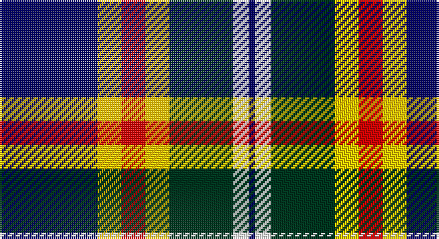

This page is one **sett** — a single exact thread-count. It belongs to the [tartan](/setts/db49ly12r12ly12dg32w8db3/)
(the same proportion at any scale), whose colour order is pattern [BWGYRYB](/stripes/bwgyryb/).

Sourced from register-of-tartans.  It is a [7 stripe tartan](/stripes/stripes7/).

Original link https://www.tartanregister.gov.uk/tartanDetails.aspx?ref=11012

2 attestations — the source records this cloth was collapsed from (oldest owns this page)

<ul>
<li>01/08/2013 — Kuznetsov (2014) (register-of-tartans, <a href="https://www.tartanregister.gov.uk/tartanDetails.aspx?ref=11012">record</a>)</li>
<li>2014 — Kuznetsov (2014) (tartans-authority, <a href="http://www.tartansauthority.com/tartan-ferret/display/11012/">record</a>)</li>
</ul>

## Register references

External register numbers recorded for this tartan.

- Scottish Register of Tartans: [11012](https://www.tartanregister.gov.uk/tartanDetails?ref=11012)
- Scottish Tartans Authority (ITI): 11012

## Thread count
DB/49 Y12 R12 Y12 DG32 W8 DB/3

One full sett is **204 threads**.

## Palette

Palette: <strong>Tartan Register</strong>
<table><thead><tr><th>Colour</th><th>Threads</th><th>Shade</th><th>Base</th><th>OKLCh</th></tr></thead><tbody><tr><td>DB/</td><td style="text-align:right;font-variant-numeric:tabular-nums">49</td><td><code style="background-color:#000064;">#000064</code> <small style="color:#888">#000064</small></td><td>B <code style="background-color:#2A418A;">#2A418A</code></td><td><small style="color:#888">oklch(22.7% 0.158 264.1)</small></td></tr><tr><td>Y</td><td style="text-align:right;font-variant-numeric:tabular-nums">12</td><td><code style="background-color:#FCCC00;">#FCCC00</code> <small style="color:#888">#FCCC00</small></td><td>Y <code style="background-color:#F2BF00;">#F2BF00</code></td><td><small style="color:#888">oklch(86.2% 0.176 91.5)</small></td></tr><tr><td>R</td><td style="text-align:right;font-variant-numeric:tabular-nums">12</td><td><code style="background-color:#DC0000;">#DC0000</code> <small style="color:#888">#DC0000</small></td><td>R <code style="background-color:#CC0000;">#CC0000</code></td><td><small style="color:#888">oklch(56.2% 0.230 29.2)</small></td></tr><tr><td>Y</td><td style="text-align:right;font-variant-numeric:tabular-nums">12</td><td><code style="background-color:#FCCC00;">#FCCC00</code> <small style="color:#888">#FCCC00</small></td><td>Y <code style="background-color:#F2BF00;">#F2BF00</code></td><td><small style="color:#888">oklch(86.2% 0.176 91.5)</small></td></tr><tr><td>DG</td><td style="text-align:right;font-variant-numeric:tabular-nums">32</td><td><code style="background-color:#003820;">#003820</code> <small style="color:#888">#003820</small></td><td>G <code style="background-color:#006100;">#006100</code></td><td><small style="color:#888">oklch(30.0% 0.070 158.3)</small></td></tr><tr><td>W</td><td style="text-align:right;font-variant-numeric:tabular-nums">8</td><td><code style="background-color:#FFFFFF;">#FFFFFF</code> <small style="color:#888">#FFFFFF</small></td><td>W <code style="background-color:#F7F7F7;">#F7F7F7</code></td><td><small style="color:#888">oklch(100.0% 0.000 89.9)</small></td></tr><tr><td>DB/</td><td style="text-align:right;font-variant-numeric:tabular-nums">3</td><td><code style="background-color:#000064;">#000064</code> <small style="color:#888">#000064</small></td><td>B <code style="background-color:#2A418A;">#2A418A</code></td><td><small style="color:#888">oklch(22.7% 0.158 264.1)</small></td></tr></tbody></table>

# Sample pattern

## Nearest tartans

The nearest existing variants by ΔTartan distance, with this tartan at the top so the swatches line up against it.

ΔTartan

Tartan

Sett

—

<a href="/ttd/edit/#slug=db49ly12r12ly12dg32w8db3">Kuznetsov (2014)</a> <a class="nn-out" href="/variants/s7/db49ly12r12ly12dg32w8db3/" title="open its dictionary page">↗</a>

0.80

<a href="/ttd/edit/#slug=w6db24k7o11k2ly6~x2&amp;base=db49ly12r12ly12dg32w8db3">Clunie (Name)</a> <a class="nn-out" href="/variants/s6/w6db24k7o11k2ly6~x2/" title="open its dictionary page">↗</a>

0.90

<a href="/ttd/edit/#slug=w12db48k13o22k3ly6&amp;base=db49ly12r12ly12dg32w8db3">Clunie (Personal)</a> <a class="nn-out" href="/variants/s6/w12db48k13o22k3ly6/" title="open its dictionary page">↗</a>

0.96

<a href="/ttd/edit/#slug=ly2k2dbi14db4k5r2ly5r1~x4&amp;base=db49ly12r12ly12dg32w8db3">Lovell (2014)</a> <a class="nn-out" href="/variants/s8/ly2k2dbi14db4k5r2ly5r1~x4/" title="open its dictionary page">↗</a>

1.00

<a href="/ttd/edit/#slug=k26n2k2n2k2n10w10n6dt10lo5~x2&amp;base=db49ly12r12ly12dg32w8db3">Collister (Personal)</a> <a class="nn-out" href="/variants/s10/k26n2k2n2k2n10w10n6dt10lo5~x2/" title="open its dictionary page">↗</a>

1.03

<a href="/ttd/edit/#slug=w3ly2g8k2ly3k2db15k1ly2~x4&amp;base=db49ly12r12ly12dg32w8db3">MacManus (Estimated threadcount)</a> <a class="nn-out" href="/variants/s9/w3ly2g8k2ly3k2db15k1ly2~x4/" title="open its dictionary page">↗</a>

1.05

<a href="/ttd/edit/#slug=db68k42w32r5w32dg4w6&amp;base=db49ly12r12ly12dg32w8db3">Ferguson Dress #2</a> <a class="nn-out" href="/variants/s7/db68k42w32r5w32dg4w6/" title="open its dictionary page">↗</a>

1.07

<a href="/ttd/edit/#slug=r4t28k6w12k12ly3~x2&amp;base=db49ly12r12ly12dg32w8db3">MacTavish / Thom(p)son, dress</a> <a class="nn-out" href="/variants/s6/r4t28k6w12k12ly3~x2/" title="open its dictionary page">↗</a>

1.09

<a href="/ttd/edit/#slug=r5w2db20ly2k16w18k2w5~x2&amp;base=db49ly12r12ly12dg32w8db3">Ailsa, Craig</a> <a class="nn-out" href="/variants/s8/r5w2db20ly2k16w18k2w5~x2/" title="open its dictionary page">↗</a>

1.09

<a href="/ttd/edit/#slug=k4ly2k13ly1w8t13ly2t4~x2&amp;base=db49ly12r12ly12dg32w8db3">Bannockbane, Blue</a> <a class="nn-out" href="/variants/s8/k4ly2k13ly1w8t13ly2t4~x2/" title="open its dictionary page">↗</a>

1.10

<a href="/variants/s9/r3k1lb12k2db2k2ki14lb2ki2~x2/">NEWYORKER</a>

## Neighbour map

Every grey dot is one of 14360 variants placed by the first two principal components of the ΔTartan feature space (44% of its variance). Red is this tartan; blue dots are its nearest — click one to open its page.

<svg viewBox="0 0 640 380" role="img" style="max-width:100%;height:auto;border:1px solid #e0e0e0;border-radius:4px;display:block" xmlns="http://www.w3.org/2000/svg"><image href="/nn/cloud.v1.png" width="640" height="380"/><a href="/variants/s6/w6db24k7o11k2ly6~x2/"><circle cx="154.2" cy="177.4" r="4" fill="#3465a4"><title>Clunie (Name)</title></circle></a><a href="/variants/s6/w12db48k13o22k3ly6/"><circle cx="197.0" cy="161.4" r="4" fill="#3465a4"><title>Clunie (Personal)</title></circle></a><a href="/variants/s8/ly2k2dbi14db4k5r2ly5r1~x4/"><circle cx="165.7" cy="153.9" r="4" fill="#3465a4"><title>Lovell (2014)</title></circle></a><a href="/variants/s10/k26n2k2n2k2n10w10n6dt10lo5~x2/"><circle cx="157.7" cy="142.7" r="4" fill="#3465a4"><title>Collister (Personal)</title></circle></a><a href="/variants/s9/w3ly2g8k2ly3k2db15k1ly2~x4/"><circle cx="160.4" cy="137.1" r="4" fill="#3465a4"><title>MacManus (Estimated threadcount)</title></circle></a><a href="/variants/s7/db68k42w32r5w32dg4w6/"><circle cx="159.6" cy="149.0" r="4" fill="#3465a4"><title>Ferguson Dress #2</title></circle></a><a href="/variants/s6/r4t28k6w12k12ly3~x2/"><circle cx="147.7" cy="179.0" r="4" fill="#3465a4"><title>MacTavish / Thom(p)son, dress</title></circle></a><a href="/variants/s8/r5w2db20ly2k16w18k2w5~x2/"><circle cx="116.3" cy="155.2" r="4" fill="#3465a4"><title>Ailsa, Craig</title></circle></a><a href="/variants/s8/k4ly2k13ly1w8t13ly2t4~x2/"><circle cx="146.0" cy="172.5" r="4" fill="#3465a4"><title>Bannockbane, Blue</title></circle></a><a href="/variants/s9/r3k1lb12k2db2k2ki14lb2ki2~x2/"><circle cx="170.0" cy="130.2" r="4" fill="#3465a4"><title>NEWYORKER</title></circle></a><circle cx="156.5" cy="153.3" r="5" fill="#c00000"/></svg>

ID: /variants/s7/db49ly12r12ly12dg32w8db3/
