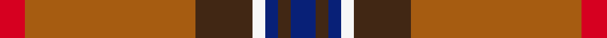

This is one **variant** — a specific cloth: this exact thread count and colourway, with its own
provenance below. It is one weaving of the [sett](/tartans/u/un/unidentified-35/) (the scale-free proportion — the
same cloth at any scale or shade), whose colour order is pattern [BBBWBRR](/stripes/bbbwbrr/).

Part of the [Unidentified 35](/tartans/u/un/unidentified-35/) tartan — the named design grouping this sett with its other cloths.

Sourced from weddslist.  It is a [7 stripe tartan](/stripes/stripes7/).

Original link [http://www.weddslist.com/cgi-bin/tartans/pg.pl?source=sts](http://www.weddslist.com/cgi-bin/tartans/pg.pl?source=sts)

Dataset <small>— provenance for this record, inherited from the source manifest</small>

<dl class="dataset-prov">
<dt>source</dt><dd><a href="/sources/weddslist/">Weddslist</a></dd>
<dt>data captured from</dt><dd><a href="https://github.com/thetartan/tartan-database/blob/master/data/weddslist/data.csv">https://github.com/thetartan/tartan-database/blob/master/data/weddslist/data.csv</a></dd>
<dt>data date</dt><dd>2016-11-17 <small>(dataset default)</small></dd>
<dt>licence</dt><dd><a href="https://creativecommons.org/licenses/by-nc-nd/4.0/">CC BY-NC-ND 4.0</a></dd>
</dl>

Capture chain <small>— the hands this data passed through, oldest first; each capture carries its own licence</small>

<ol class="capture-chain">
<li><a href="https://www.weddslist.com/tartans/">Weddslist</a> <small>the living privately compiled reference</small></li>
<li><a href="https://github.com/thetartan/tartan-database">thetartan/tartan-database</a> <small>2016-2017</small> · <a href="https://creativecommons.org/licenses/by-nc-nd/4.0/">CC BY-NC-ND 4.0</a> <small>Levko Kravets's frozen compilation — the capture we vendored, and where its CC licence text came from</small></li>
<li>this dictionary <small>captured 2026-06-10 · commit 5bf86c7566</small> <small>each re-capture is a git commit to data/sources</small></li>
</ol>

## Thread count
R/12 O81 DO27 W6 DB6 DO6 DB/12

One full sett is **276 threads**.

## Palette
<table><thead><tr><th>Colour</th><th>Shade</th><th>OKLCh</th></tr></thead><tbody><tr><td>DB</td><td><code style="background-color:#082077;">#082077</code> <small style="color:#888">#082077</small></td><td><small style="color:#888">oklch(30.0% 0.149 265.1)</small></td></tr><tr><td>DO</td><td><code style="background-color:#412714;">#412714</code> <small style="color:#888">#412714</small></td><td><small style="color:#888">oklch(30.1% 0.050 55.7)</small></td></tr><tr><td>W</td><td><code style="background-color:#F7F7F7;">#F7F7F7</code> <small style="color:#888">#F7F7F7</small></td><td><small style="color:#888">oklch(97.6% 0.000 89.9)</small></td></tr><tr><td>O</td><td><code style="background-color:#A65C11;">#A65C11</code> <small style="color:#888">#A65C11</small></td><td><small style="color:#888">oklch(55.0% 0.125 58.3)</small></td></tr><tr><td>R</td><td><code style="background-color:#D60020;">#D60020</code> <small style="color:#888">#D60020</small></td><td><small style="color:#888">oklch(55.2% 0.224 25.5)</small></td></tr></tbody></table>

# Sample pattern

## Nearest tartan variants

The nearest existing variants by ΔTartan distance, with this cloth at the top so the swatches line up against it.

ΔTartan

Threads

Variant

Sett

—

276

<a href="/variants/s7/db4do2db2w2do9o27r4~x3/">Unidentified 35</a>

<a href="/ttd/edit/#slug=g4y9g3db4g3w3r32g4y3~x2&amp;base=db4do2db2w2do9o27r4~x3" title="compare in the TTD">2.41</a>

246

<a href="/variants/s9/g4y9g3db4g3w3r32g4y3~x2/">Antrim County Crest (Fashion)</a>

<a href="/ttd/edit/#slug=r6t22r6g20y2r45t2w5~x2&amp;base=db4do2db2w2do9o27r4~x3" title="compare in the TTD">2.53</a>

410

<a href="/variants/s8/r6t22r6g20y2r45t2w5~x2/">Elbrick Dress (Personal)</a>

<a href="/ttd/edit/#slug=r3b1r12o3dg12w1dg2~x4&amp;base=db4do2db2w2do9o27r4~x3" title="compare in the TTD">2.67</a>

252

<a href="/variants/s7/r3b1r12o3dg12w1dg2~x4/">Leckie (Personal)</a>

<a href="/ttd/edit/#slug=n47w6r24w3db5y3~x2&amp;base=db4do2db2w2do9o27r4~x3" title="compare in the TTD">2.70</a>

252

<a href="/variants/s6/n47w6r24w3db5y3~x2/">Duminiak (Trevose, Pennsylvania)</a>

<a href="/ttd/edit/#slug=r26n4r1dp2g1n4g14lb2~x2&amp;base=db4do2db2w2do9o27r4~x3" title="compare in the TTD">2.74</a>

160

<a href="/variants/s8/r26n4r1dp2g1n4g14lb2~x2/">Redpath, Robert A (Personal)</a>

<a href="/ttd/edit/#slug=r2g16ri1r2ri12y1lb1~x2~r4315012-ri5221030&amp;base=db4do2db2w2do9o27r4~x3" title="compare in the TTD">2.75</a>

134

<a href="/variants/s7/r2g16ri1r2ri12y1lb1~x2~r4315012-ri5221030/">Spragg (Name)</a>

<a href="/ttd/edit/#slug=o24lb2lo7lb3k2n4k2lb1o4lb1~x2&amp;base=db4do2db2w2do9o27r4~x3" title="compare in the TTD">2.79</a>

150

<a href="/variants/s10/o24lb2lo7lb3k2n4k2lb1o4lb1~x2/">VeMMA</a>

<a href="/ttd/edit/#slug=r5g9y2g9r5db9r28g3lb2r4db2~x2&amp;base=db4do2db2w2do9o27r4~x3" title="compare in the TTD">2.82</a>

298

<a href="/variants/s11/r5g9y2g9r5db9r28g3lb2r4db2~x2/">Loch Creran</a>

<a href="/ttd/edit/#slug=n47w6r24w3db5ly3~x2&amp;base=db4do2db2w2do9o27r4~x3" title="compare in the TTD">2.85</a>

252

<a href="/variants/s6/n47w6r24w3db5ly3~x2/">Duminiak (Personal)</a>

<a href="/ttd/edit/#slug=r2ri6db5lg3g13ri20do2ri2~x2~r4715039-ri5221030&amp;base=db4do2db2w2do9o27r4~x3" title="compare in the TTD">2.93</a>

204

<a href="/variants/s8/r2ri6db5lg3g13ri20do2ri2~x2~r4715039-ri5221030/">Flowers of the Forest, The</a>

## Neighbour map

Every grey dot is one of 13662 variants placed by the first two principal components of the ΔTartan feature space (42% of its variance). Red is this tartan; blue dots are its nearest — click one to open its page. The map is a flat projection of a many-dimensional space — [how to read it](/posts/neighbourhood-maps/).

<svg viewBox="0 0 640 380" role="img" style="max-width:100%;height:auto;border:1px solid #e0e0e0;border-radius:4px;display:block" xmlns="http://www.w3.org/2000/svg"><image href="/nn/cloud.v1.png" width="640" height="380"/><a href="/variants/s9/g4y9g3db4g3w3r32g4y3~x2/"><circle cx="284.8" cy="156.4" r="4" fill="#3465a4"><title>Antrim County Crest (Fashion)</title></circle></a><a href="/variants/s8/r6t22r6g20y2r45t2w5~x2/"><circle cx="320.9" cy="145.9" r="4" fill="#3465a4"><title>Elbrick Dress (Personal)</title></circle></a><a href="/variants/s7/r3b1r12o3dg12w1dg2~x4/"><circle cx="261.6" cy="174.6" r="4" fill="#3465a4"><title>Leckie (Personal)</title></circle></a><a href="/variants/s6/n47w6r24w3db5y3~x2/"><circle cx="337.8" cy="174.2" r="4" fill="#3465a4"><title>Duminiak (Trevose, Pennsylvania)</title></circle></a><a href="/variants/s8/r26n4r1dp2g1n4g14lb2~x2/"><circle cx="343.0" cy="136.0" r="4" fill="#3465a4"><title>Redpath, Robert A (Personal)</title></circle></a><a href="/variants/s7/r2g16ri1r2ri12y1lb1~x2~r4315012-ri5221030/"><circle cx="311.8" cy="164.7" r="4" fill="#3465a4"><title>Spragg (Name)</title></circle></a><a href="/variants/s10/o24lb2lo7lb3k2n4k2lb1o4lb1~x2/"><circle cx="306.0" cy="101.3" r="4" fill="#3465a4"><title>VeMMA</title></circle></a><a href="/variants/s11/r5g9y2g9r5db9r28g3lb2r4db2~x2/"><circle cx="295.1" cy="146.7" r="4" fill="#3465a4"><title>Loch Creran</title></circle></a><a href="/variants/s6/n47w6r24w3db5ly3~x2/"><circle cx="331.0" cy="171.8" r="4" fill="#3465a4"><title>Duminiak (Personal)</title></circle></a><a href="/variants/s8/r2ri6db5lg3g13ri20do2ri2~x2~r4715039-ri5221030/"><circle cx="260.5" cy="165.0" r="4" fill="#3465a4"><title>Flowers of the Forest, The</title></circle></a><circle cx="324.1" cy="160.9" r="5" fill="#c00000"/><text x="320" y="376" text-anchor="middle" font-size="11" fill="#999">ground</text><text x="11" y="190" text-anchor="middle" font-size="11" fill="#999" transform="rotate(-90 11 190)">complexity</text></svg>

ID: /variants/s7/db4do2db2w2do9o27r4~x3/
