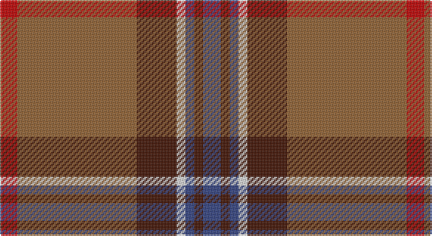

This page is one **sett** — a single exact thread-count. It belongs to the [tartan](/setts/db4dr2db2w2dr9o27r4/)
(the same proportion at any scale), whose colour order is pattern [BBBWBRR](/stripes/bbbwbrr/).

Sourced from weddslist.  It is a [7 stripe tartan](/stripes/stripes7/).

Original link http://www.weddslist.com/cgi-bin/tartans/pg.pl?source=sts

## Thread count
R/12 LT81 DR27 LN6 B6 DR6 B/12

One full sett is **276 threads**.

## Palette

Palette: <strong>Tartan Dictionary</strong> <small style="color:#888">(1 of 5 colours)</small>
<table><thead><tr><th>Colour</th><th>Threads</th><th>Shade</th><th>Base</th><th>OKLCh</th></tr></thead><tbody><tr><td>R/</td><td style="text-align:right;font-variant-numeric:tabular-nums">12</td><td><code style="background-color:#C00000;">#C00000</code> <small style="color:#888">#C00000</small></td><td>R <code style="background-color:#CC0000;">#CC0000</code></td><td><small style="color:#888">oklch(50.7% 0.208 29.2)</small></td></tr><tr><td>LT</td><td style="text-align:right;font-variant-numeric:tabular-nums">81</td><td><code style="background-color:#906030;">#906030</code> <small style="color:#888">#906030</small></td><td>R <code style="background-color:#CC0000;">#CC0000</code></td><td><small style="color:#888">oklch(53.1% 0.089 63.7)</small></td></tr><tr><td>DR</td><td style="text-align:right;font-variant-numeric:tabular-nums">27</td><td><code style="background-color:#401000;">#401000</code> <small style="color:#888">#401000</small></td><td>B <code style="background-color:#2A418A;">#2A418A</code></td><td><small style="color:#888">oklch(25.3% 0.079 39.9)</small></td></tr><tr><td>LN</td><td style="text-align:right;font-variant-numeric:tabular-nums">6</td><td><code style="background-color:#E0E0E0;">#E0E0E0</code> <small style="color:#888">#E0E0E0</small></td><td>W <code style="background-color:#F7F7F7;">#F7F7F7</code></td><td><small style="color:#888">oklch(90.7% 0.000 89.9)</small></td></tr><tr><td>B</td><td style="text-align:right;font-variant-numeric:tabular-nums">6</td><td><code style="background-color:#304080;">#304080</code> <small style="color:#888">#304080</small></td><td>B <code style="background-color:#2A418A;">#2A418A</code></td><td><small style="color:#888">oklch(39.4% 0.109 270.2)</small></td></tr><tr><td>DR</td><td style="text-align:right;font-variant-numeric:tabular-nums">6</td><td><code style="background-color:#401000;">#401000</code> <small style="color:#888">#401000</small></td><td>B <code style="background-color:#2A418A;">#2A418A</code></td><td><small style="color:#888">oklch(25.3% 0.079 39.9)</small></td></tr><tr><td>B/</td><td style="text-align:right;font-variant-numeric:tabular-nums">12</td><td><code style="background-color:#304080;">#304080</code> <small style="color:#888">#304080</small></td><td>B <code style="background-color:#2A418A;">#2A418A</code></td><td><small style="color:#888">oklch(39.4% 0.109 270.2)</small></td></tr></tbody></table>

# Sample pattern

## Nearest tartans

The nearest existing variants by ΔTartan distance, with this tartan at the top so the swatches line up against it.

ΔTartan

Tartan

Sett

—

<a href="/ttd/edit/#slug=db4dr2db2w2dr9o27r4~x3">Unidentified 35</a> <a class="nn-out" href="/variants/s7/db4dr2db2w2dr9o27r4~x3/" title="open its dictionary page">↗</a>

0.72

<a href="/ttd/edit/#slug=ri2dg16r1ri2r12ly1y1~x2&amp;base=db4dr2db2w2dr9o27r4~x3">Spragg, Andrew</a> <a class="nn-out" href="/variants/s7/ri2dg16r1ri2r12ly1y1~x2/" title="open its dictionary page">↗</a>

0.82

<a href="/ttd/edit/#slug=y47w6r24w3dp5lo3~x2&amp;base=db4dr2db2w2dr9o27r4~x3">Duminiak (Trevose, Pennsylvania)</a> <a class="nn-out" href="/variants/s6/y47w6r24w3dp5lo3~x2/" title="open its dictionary page">↗</a>

0.96

<a href="/ttd/edit/#slug=lb2g6r1g1r14k1lbi1~x4&amp;base=db4dr2db2w2dr9o27r4~x3">MacMaster (USA) #1</a> <a class="nn-out" href="/variants/s7/lb2g6r1g1r14k1lbi1~x4/" title="open its dictionary page">↗</a>

1.02

<a href="/ttd/edit/#slug=ri2g16r1ri2r12ly1t1~x2&amp;base=db4dr2db2w2dr9o27r4~x3">Spragg (Name)</a> <a class="nn-out" href="/variants/s7/ri2g16r1ri2r12ly1t1~x2/" title="open its dictionary page">↗</a>

1.17

<a href="/ttd/edit/#slug=lo3y40db12lo3k2lb4k2lo3~x2&amp;base=db4dr2db2w2dr9o27r4~x3">Tunes of Glory (Film)</a> <a class="nn-out" href="/variants/s8/lo3y40db12lo3k2lb4k2lo3~x2/" title="open its dictionary page">↗</a>

1.22

<a href="/ttd/edit/#slug=r3db1r12o3dg12lb1dg2~x4&amp;base=db4dr2db2w2dr9o27r4~x3">Leckie (Personal)</a> <a class="nn-out" href="/variants/s7/r3db1r12o3dg12lb1dg2~x4/" title="open its dictionary page">↗</a>

1.23

<a href="/ttd/edit/#slug=r24lb1k3lb1g14r8k3dp3lb2~x4&amp;base=db4dr2db2w2dr9o27r4~x3">Leach (1995)</a> <a class="nn-out" href="/variants/s9/r24lb1k3lb1g14r8k3dp3lb2~x4/" title="open its dictionary page">↗</a>

1.27

<a href="/ttd/edit/#slug=r26n4r1p2dg1n4dg14w2~x2&amp;base=db4dr2db2w2dr9o27r4~x3">Redpath, Robert A (Personal)</a> <a class="nn-out" href="/variants/s8/r26n4r1p2dg1n4dg14w2~x2/" title="open its dictionary page">↗</a>

1.32

<a href="/ttd/edit/#slug=r7w2r32db7g3db2g3db2g16r3~x2&amp;base=db4dr2db2w2dr9o27r4~x3">Chisholm, hunting</a> <a class="nn-out" href="/variants/s10/r7w2r32db7g3db2g3db2g16r3~x2/" title="open its dictionary page">↗</a>

1.34

<a href="/ttd/edit/#slug=r8w2m30g12m3g12m3~x2&amp;base=db4dr2db2w2dr9o27r4~x3">Wasko (Personal)</a> <a class="nn-out" href="/variants/s7/r8w2m30g12m3g12m3~x2/" title="open its dictionary page">↗</a>

## Neighbour map

Every grey dot is one of 14360 variants placed by the first two principal components of the ΔTartan feature space (44% of its variance). Red is this tartan; blue dots are its nearest — click one to open its page.

<svg viewBox="0 0 640 380" role="img" style="max-width:100%;height:auto;border:1px solid #e0e0e0;border-radius:4px;display:block" xmlns="http://www.w3.org/2000/svg"><image href="/nn/cloud.v1.png" width="640" height="380"/><a href="/variants/s7/ri2dg16r1ri2r12ly1y1~x2/"><circle cx="301.7" cy="154.5" r="4" fill="#3465a4"><title>Spragg, Andrew</title></circle></a><a href="/variants/s6/y47w6r24w3dp5lo3~x2/"><circle cx="334.6" cy="167.2" r="4" fill="#3465a4"><title>Duminiak (Trevose, Pennsylvania)</title></circle></a><a href="/variants/s7/lb2g6r1g1r14k1lbi1~x4/"><circle cx="342.7" cy="150.1" r="4" fill="#3465a4"><title>MacMaster (USA) #1</title></circle></a><a href="/variants/s7/ri2g16r1ri2r12ly1t1~x2/"><circle cx="298.4" cy="152.7" r="4" fill="#3465a4"><title>Spragg (Name)</title></circle></a><a href="/variants/s8/lo3y40db12lo3k2lb4k2lo3~x2/"><circle cx="356.0" cy="126.3" r="4" fill="#3465a4"><title>Tunes of Glory (Film)</title></circle></a><a href="/variants/s7/r3db1r12o3dg12lb1dg2~x4/"><circle cx="274.4" cy="181.5" r="4" fill="#3465a4"><title>Leckie (Personal)</title></circle></a><a href="/variants/s9/r24lb1k3lb1g14r8k3dp3lb2~x4/"><circle cx="329.8" cy="129.9" r="4" fill="#3465a4"><title>Leach (1995)</title></circle></a><a href="/variants/s8/r26n4r1p2dg1n4dg14w2~x2/"><circle cx="346.6" cy="140.2" r="4" fill="#3465a4"><title>Redpath, Robert A (Personal)</title></circle></a><a href="/variants/s10/r7w2r32db7g3db2g3db2g16r3~x2/"><circle cx="344.0" cy="151.4" r="4" fill="#3465a4"><title>Chisholm, hunting</title></circle></a><a href="/variants/s7/r8w2m30g12m3g12m3~x2/"><circle cx="330.6" cy="186.9" r="4" fill="#3465a4"><title>Wasko (Personal)</title></circle></a><circle cx="323.9" cy="161.1" r="5" fill="#c00000"/></svg>

ID: /variants/s7/db4dr2db2w2dr9o27r4~x3/
