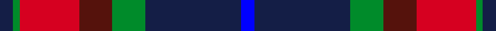

This page is one **sett** — a single exact thread-count. It belongs to the [tartan](/setts/db4g2r18dr10g10db29b4/)
(the same proportion at any scale), whose colour order is pattern [BBGBRGB](/stripes/bbgbrgb/).

Sourced from register-of-tartans.  It is a [7 stripe tartan](/stripes/stripes7/).

Original link https://www.tartanregister.gov.uk/tartanDetails.aspx?ref=912

## Register references

External register numbers recorded for this tartan.

- Scottish Register of Tartans: [912](https://www.tartanregister.gov.uk/tartanDetails.aspx?ref=912)
- Scottish Tartans Authority (ITI): 2814
- Scottish Tartans World Register: 2814

## Thread count
DB/8 G4 R36 DR20 G20 DB58 B/8

One full sett is **292 threads**.

## Palette
<table><thead><tr><th>Colour</th><th>Shade</th><th>OKLCh</th></tr></thead><tbody><tr><td>B</td><td><code style="background-color:#0000FF;">#0000FF</code> <small style="color:#888">#0000FF</small></td><td><small style="color:#888">oklch(45.2% 0.313 264.1)</small></td></tr><tr><td>DB</td><td><code style="background-color:#141E46;">#141E46</code> <small style="color:#888">#141E46</small></td><td><small style="color:#888">oklch(25.2% 0.076 269.7)</small></td></tr><tr><td>G</td><td><code style="background-color:#008B2A;">#008B2A</code> <small style="color:#888">#008B2A</small></td><td><small style="color:#888">oklch(55.4% 0.170 145.9)</small></td></tr><tr><td>DR</td><td><code style="background-color:#55120C;">#55120C</code> <small style="color:#888">#55120C</small></td><td><small style="color:#888">oklch(30.0% 0.099 29.3)</small></td></tr><tr><td>R</td><td><code style="background-color:#D60020;">#D60020</code> <small style="color:#888">#D60020</small></td><td><small style="color:#888">oklch(55.2% 0.224 25.5)</small></td></tr></tbody></table>

# Sample pattern

## Nearest variants

The nearest existing variants by ΔTartan distance, with this cloth at the top so the swatches line up against it.

ΔTartan

Threads

Variant

Sett

—

292

<a href="/variants/s7/db4g2r18dr10g10db29b4~x2~db1003265-b1813263/">Ross Dempster (Personal)</a>

<a href="/ttd/edit/#slug=db4dg2r17dr9dg10db30n2~x2&amp;base=db4g2r18dr10g10db29b4~x2~db1003265-b1813263" title="compare in the TTD">0.40</a>

284

<a href="/variants/s7/db4dg2r17dr9dg10db30n2~x2/">Dempster, Ross (Personal)</a>

<a href="/ttd/edit/#slug=r15dr98db72lb25db8w15&amp;base=db4g2r18dr10g10db29b4~x2~db1003265-b1813263" title="compare in the TTD">2.93</a>

436

<a href="/variants/s6/r15dr98db72lb25db8w15/">Afternoon Tea / Assam</a>

## Neighbour map

Every grey dot is one of 13620 variants placed by the first two principal components of the ΔTartan feature space (42% of its variance). Red is this tartan; blue dots are its nearest — click one to open its page.

<svg viewBox="0 0 640 380" role="img" style="max-width:100%;height:auto;border:1px solid #e0e0e0;border-radius:4px;display:block" xmlns="http://www.w3.org/2000/svg"><image href="/nn/cloud.v1.png" width="640" height="380"/><a href="/variants/s7/db4dg2r17dr9dg10db30n2~x2/"><circle cx="272.8" cy="184.4" r="4" fill="#3465a4"><title>Dempster, Ross (Personal)</title></circle></a><a href="/variants/s6/r15dr98db72lb25db8w15/"><circle cx="217.6" cy="186.0" r="4" fill="#3465a4"><title>Afternoon Tea / Assam</title></circle></a><circle cx="222.0" cy="184.0" r="5" fill="#c00000"/><text x="320" y="376" text-anchor="middle" font-size="11" fill="#999">ground</text><text x="11" y="190" text-anchor="middle" font-size="11" fill="#999" transform="rotate(-90 11 190)">complexity</text></svg>

ID: /variants/s7/db4g2r18dr10g10db29b4~x2~db1003265-b1813263/
