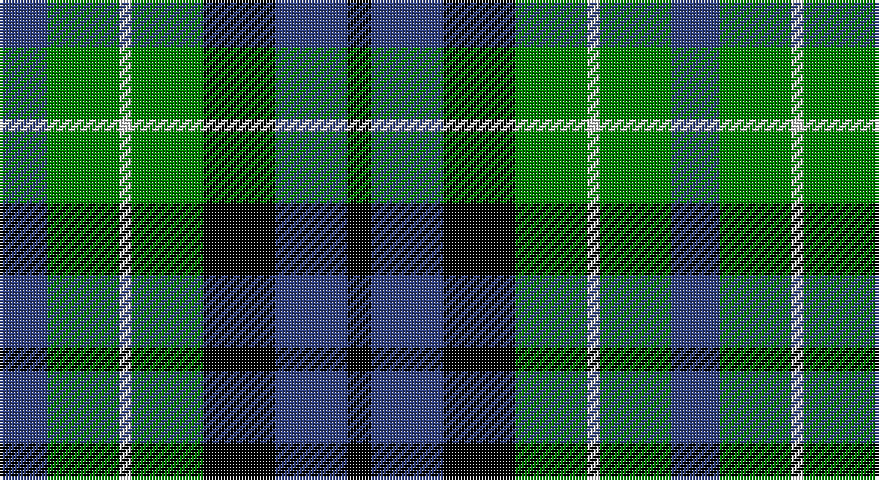

This page is one **sett** — a single exact thread-count. It belongs to the [tartan](/setts/db4g6w1g6k6db6k2/)
(the same proportion at any scale), whose colour order is pattern [BGWGKBK](/stripes/bgwgkbk/).

Sourced from weddslist.  It is a [7 stripe tartan](/stripes/stripes7/).

Original link http://www.weddslist.com/cgi-bin/tartans/pg.pl?source=sts

## Provenance

Earliest known date: 1906 This sett is the usual modern form that appeared in Johnston's publication of 1906. MacNeil tartans had been produced by Wilson's of Bannockburn since the earliest pattern book of 1819 and various changes were made to the sett. The present form of the tartan appears to be developed from Wilson's early samples. It is substantially different from the certified version in the Highland Society of London collection.

2 attestations — the source records this cloth was collapsed from (oldest owns this page)

<ul>
<li>undated — MacNeil of Colonsay (weddslist, <a href="http://www.weddslist.com/cgi-bin/tartans/pg.pl?source=sts">record</a>)</li>
<li>undated — MacNeil of Colonsay Clan Tartan (house-of-tartan, <a href="http://www.house-of-tartan.scotland.net/house/TartanViewjs.asp?colr=Def&tnam=196">record</a>)</li>
</ul>

## Thread count
B/16 G24 LN4 G24 K24 B24 K/8

One full sett is **224 threads**.

## Palette

Palette: <strong>Tartan Register</strong> <small style="color:#888">(2 of 4 colours)</small>
<table><thead><tr><th>Colour</th><th>Threads</th><th>Shade</th><th>Base</th><th>OKLCh</th></tr></thead><tbody><tr><td>B/</td><td style="text-align:right;font-variant-numeric:tabular-nums">16</td><td><code style="background-color:#304080;">#304080</code> <small style="color:#888">#304080</small></td><td>B <code style="background-color:#2A418A;">#2A418A</code></td><td><small style="color:#888">oklch(39.4% 0.109 270.2)</small></td></tr><tr><td>G</td><td style="text-align:right;font-variant-numeric:tabular-nums">24</td><td><code style="background-color:#008000;">#008000</code> <small style="color:#888">#008000</small></td><td>G <code style="background-color:#006100;">#006100</code></td><td><small style="color:#888">oklch(52.0% 0.177 142.5)</small></td></tr><tr><td>LN</td><td style="text-align:right;font-variant-numeric:tabular-nums">4</td><td><code style="background-color:#E0E0E0;">#E0E0E0</code> <small style="color:#888">#E0E0E0</small></td><td>W <code style="background-color:#F7F7F7;">#F7F7F7</code></td><td><small style="color:#888">oklch(90.7% 0.000 89.9)</small></td></tr><tr><td>G</td><td style="text-align:right;font-variant-numeric:tabular-nums">24</td><td><code style="background-color:#008000;">#008000</code> <small style="color:#888">#008000</small></td><td>G <code style="background-color:#006100;">#006100</code></td><td><small style="color:#888">oklch(52.0% 0.177 142.5)</small></td></tr><tr><td>K</td><td style="text-align:right;font-variant-numeric:tabular-nums">24</td><td><code style="background-color:#000000;">#000000</code> <small style="color:#888">#000000</small></td><td>K <code style="background-color:#000000;">#000000</code></td><td><small style="color:#888">oklch(0.0% 0.000 0.0)</small></td></tr><tr><td>B</td><td style="text-align:right;font-variant-numeric:tabular-nums">24</td><td><code style="background-color:#304080;">#304080</code> <small style="color:#888">#304080</small></td><td>B <code style="background-color:#2A418A;">#2A418A</code></td><td><small style="color:#888">oklch(39.4% 0.109 270.2)</small></td></tr><tr><td>K/</td><td style="text-align:right;font-variant-numeric:tabular-nums">8</td><td><code style="background-color:#000000;">#000000</code> <small style="color:#888">#000000</small></td><td>K <code style="background-color:#000000;">#000000</code></td><td><small style="color:#888">oklch(0.0% 0.000 0.0)</small></td></tr></tbody></table>

# Sample pattern

## Nearest tartans

The nearest existing variants by ΔTartan distance, with this tartan at the top so the swatches line up against it.

ΔTartan

Tartan

Sett

—

<a href="/ttd/edit/#slug=db4g6w1g6k6db6k2~x4">MacNeil of Colonsay</a> <a class="nn-out" href="/variants/s7/db4g6w1g6k6db6k2~x4/" title="open its dictionary page">↗</a>

0.57

<a href="/ttd/edit/#slug=db8g8db1g8k8db8ly2~x2&amp;base=db4g6w1g6k6db6k2~x4">MacKay</a> <a class="nn-out" href="/variants/s7/db8g8db1g8k8db8ly2~x2/" title="open its dictionary page">↗</a>

0.62

<a href="/ttd/edit/#slug=k12g12k2g12k12db12t3~x2&amp;base=db4g6w1g6k6db6k2~x4">MacIntyre</a> <a class="nn-out" href="/variants/s7/k12g12k2g12k12db12t3~x2/" title="open its dictionary page">↗</a>

0.73

<a href="/ttd/edit/#slug=k8g8k1g8k8b8w2~x2&amp;base=db4g6w1g6k6db6k2~x4">Unnamed, No 31</a> <a class="nn-out" href="/variants/s7/k8g8k1g8k8b8w2~x2/" title="open its dictionary page">↗</a>

0.76

<a href="/ttd/edit/#slug=k8dg8k1dg8k8b8w2~x2&amp;base=db4g6w1g6k6db6k2~x4">Unidentified No 31</a> <a class="nn-out" href="/variants/s7/k8dg8k1dg8k8b8w2~x2/" title="open its dictionary page">↗</a>

0.80

<a href="/ttd/edit/#slug=k6g6r1g6k6db6k1~x2&amp;base=db4g6w1g6k6db6k2~x4">MacCallum</a> <a class="nn-out" href="/variants/s7/k6g6r1g6k6db6k1~x2/" title="open its dictionary page">↗</a>

0.88

<a href="/ttd/edit/#slug=b10k3b10k14r2g14k4~x2&amp;base=db4g6w1g6k6db6k2~x4">Fletcher #2</a> <a class="nn-out" href="/variants/s7/b10k3b10k14r2g14k4~x2/" title="open its dictionary page">↗</a>

0.89

<a href="/ttd/edit/#slug=k7g6w1g6k7db7k1~x4&amp;base=db4g6w1g6k6db6k2~x4">MacLaggan</a> <a class="nn-out" href="/variants/s7/k7g6w1g6k7db7k1~x4/" title="open its dictionary page">↗</a>

0.90

<a href="/ttd/edit/#slug=t3g6k6t4r1t1~x2&amp;base=db4g6w1g6k6db6k2~x4">Wellington, or Waterloo</a> <a class="nn-out" href="/variants/s6/t3g6k6t4r1t1~x2/" title="open its dictionary page">↗</a>

0.90

<a href="/ttd/edit/#slug=k4g4w1g4k4db4k1~x4&amp;base=db4g6w1g6k6db6k2~x4">Graham of Montrose</a> <a class="nn-out" href="/variants/s7/k4g4w1g4k4db4k1~x4/" title="open its dictionary page">↗</a>

0.93

<a href="/ttd/edit/#slug=k11g12k2g12k12p12w3~x2&amp;base=db4g6w1g6k6db6k2~x4">Wilson's, No 97</a> <a class="nn-out" href="/variants/s7/k11g12k2g12k12p12w3~x2/" title="open its dictionary page">↗</a>

## Neighbour map

Every grey dot is one of 14360 variants placed by the first two principal components of the ΔTartan feature space (44% of its variance). Red is this tartan; blue dots are its nearest — click one to open its page.

<svg viewBox="0 0 640 380" role="img" style="max-width:100%;height:auto;border:1px solid #e0e0e0;border-radius:4px;display:block" xmlns="http://www.w3.org/2000/svg"><image href="/nn/cloud.v1.png" width="640" height="380"/><a href="/variants/s7/db8g8db1g8k8db8ly2~x2/"><circle cx="145.0" cy="249.4" r="4" fill="#3465a4"><title>MacKay</title></circle></a><a href="/variants/s7/k12g12k2g12k12db12t3~x2/"><circle cx="130.6" cy="263.7" r="4" fill="#3465a4"><title>MacIntyre</title></circle></a><a href="/variants/s7/k8g8k1g8k8b8w2~x2/"><circle cx="128.3" cy="241.2" r="4" fill="#3465a4"><title>Unnamed, No 31</title></circle></a><a href="/variants/s7/k8dg8k1dg8k8b8w2~x2/"><circle cx="152.2" cy="253.5" r="4" fill="#3465a4"><title>Unidentified No 31</title></circle></a><a href="/variants/s7/k6g6r1g6k6db6k1~x2/"><circle cx="141.2" cy="259.4" r="4" fill="#3465a4"><title>MacCallum</title></circle></a><a href="/variants/s7/b10k3b10k14r2g14k4~x2/"><circle cx="131.7" cy="239.8" r="4" fill="#3465a4"><title>Fletcher #2</title></circle></a><a href="/variants/s7/k7g6w1g6k7db7k1~x4/"><circle cx="152.4" cy="250.4" r="4" fill="#3465a4"><title>MacLaggan</title></circle></a><a href="/variants/s6/t3g6k6t4r1t1~x2/"><circle cx="128.4" cy="245.2" r="4" fill="#3465a4"><title>Wellington, or Waterloo</title></circle></a><a href="/variants/s7/k4g4w1g4k4db4k1~x4/"><circle cx="109.2" cy="278.4" r="4" fill="#3465a4"><title>Graham of Montrose</title></circle></a><a href="/variants/s7/k11g12k2g12k12p12w3~x2/"><circle cx="121.3" cy="253.9" r="4" fill="#3465a4"><title>Wilson's, No 97</title></circle></a><circle cx="119.8" cy="262.7" r="5" fill="#c00000"/></svg>

ID: /variants/s7/db4g6w1g6k6db6k2~x4/
