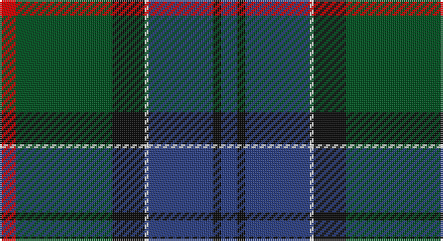

This page is one **sett** — a single exact thread-count. It belongs to the [tartan](/setts/db4k2db16w1k8dg24r4/)
(the same proportion at any scale), whose colour order is pattern [BKBWKGR](/stripes/bkbwkgr/).

Part of the [Colquhoun](/tartans/colquhoun/) tartan — the named design grouping this sett with its other cloths.

Sourced from register-of-tartans.  It is a [7 stripe tartan](/stripes/stripes7/).

Original link https://www.tartanregister.gov.uk/tartanDetails.aspx?ref=714

## Also known as

This cloth is also recorded under:

- Colquhoun #2
- Colquhoun #3

## Register references

External register numbers recorded for this tartan.

- Scottish Register of Tartans: [714](https://www.tartanregister.gov.uk/tartanDetails.aspx?ref=714)
- Scottish Tartans World Register: 270

## Thread count
R/8 G48 K16 LN2 B32 K4 B/8

One full sett is **220 threads**.

## Palette

Palette: <strong>Tartan Register</strong>
<table><thead><tr><th>Colour</th><th>Threads</th><th>Shade</th><th>Base</th><th>OKLCh</th></tr></thead><tbody><tr><td>R/</td><td style="text-align:right;font-variant-numeric:tabular-nums">8</td><td><code style="background-color:#DC0000;">#DC0000</code> <small style="color:#888">#DC0000</small></td><td>R <code style="background-color:#CC0000;">#CC0000</code></td><td><small style="color:#888">oklch(56.2% 0.230 29.2)</small></td></tr><tr><td>G</td><td style="text-align:right;font-variant-numeric:tabular-nums">48</td><td><code style="background-color:#005020;">#005020</code> <small style="color:#888">#005020</small></td><td>G <code style="background-color:#006100;">#006100</code></td><td><small style="color:#888">oklch(37.7% 0.105 149.6)</small></td></tr><tr><td>K</td><td style="text-align:right;font-variant-numeric:tabular-nums">16</td><td><code style="background-color:#101010;">#101010</code> <small style="color:#888">#101010</small></td><td>K <code style="background-color:#000000;">#000000</code></td><td><small style="color:#888">oklch(17.3% 0.000 89.9)</small></td></tr><tr><td>LN</td><td style="text-align:right;font-variant-numeric:tabular-nums">2</td><td><code style="background-color:#E0E0E0;">#E0E0E0</code> <small style="color:#888">#E0E0E0</small></td><td>W <code style="background-color:#F7F7F7;">#F7F7F7</code></td><td><small style="color:#888">oklch(90.7% 0.000 89.9)</small></td></tr><tr><td>B</td><td style="text-align:right;font-variant-numeric:tabular-nums">32</td><td><code style="background-color:#2C4084;">#2C4084</code> <small style="color:#888">#2C4084</small></td><td>B <code style="background-color:#2A418A;">#2A418A</code></td><td><small style="color:#888">oklch(39.4% 0.117 268.3)</small></td></tr><tr><td>K</td><td style="text-align:right;font-variant-numeric:tabular-nums">4</td><td><code style="background-color:#101010;">#101010</code> <small style="color:#888">#101010</small></td><td>K <code style="background-color:#000000;">#000000</code></td><td><small style="color:#888">oklch(17.3% 0.000 89.9)</small></td></tr><tr><td>B/</td><td style="text-align:right;font-variant-numeric:tabular-nums">8</td><td><code style="background-color:#2C4084;">#2C4084</code> <small style="color:#888">#2C4084</small></td><td>B <code style="background-color:#2A418A;">#2A418A</code></td><td><small style="color:#888">oklch(39.4% 0.117 268.3)</small></td></tr></tbody></table>

# Sample pattern

## Nearest tartans

The nearest existing variants by ΔTartan distance, with this tartan at the top so the swatches line up against it.

ΔTartan

Tartan

Sett

—

<a href="/ttd/edit/#slug=db4k2db16w1k8dg24r4~x2">Colquhoun</a> <a class="nn-out" href="/variants/s7/db4k2db16w1k8dg24r4~x2/" title="open its dictionary page">↗</a>

0.60

<a href="/ttd/edit/#slug=dp6r2dp1g25db16k2db4~x2&amp;base=db4k2db16w1k8dg24r4~x2">Laurie Clan Tartan</a> <a class="nn-out" href="/variants/s7/dp6r2dp1g25db16k2db4~x2/" title="open its dictionary page">↗</a>

0.64

<a href="/ttd/edit/#slug=dp6o2dp1g25db16k2db4~x2&amp;base=db4k2db16w1k8dg24r4~x2">Lawrie Clan Tartan</a> <a class="nn-out" href="/variants/s7/dp6o2dp1g25db16k2db4~x2/" title="open its dictionary page">↗</a>

0.71

<a href="/ttd/edit/#slug=dp6ly2dp1g25db16k2db4~x2&amp;base=db4k2db16w1k8dg24r4~x2">Lowry</a> <a class="nn-out" href="/variants/s7/dp6ly2dp1g25db16k2db4~x2/" title="open its dictionary page">↗</a>

0.86

<a href="/ttd/edit/#slug=ly2k4ly1dg16k14db23k4r1~x2&amp;base=db4k2db16w1k8dg24r4~x2">Thomas of Craigie (Personal)</a> <a class="nn-out" href="/variants/s8/ly2k4ly1dg16k14db23k4r1~x2/" title="open its dictionary page">↗</a>

0.88

<a href="/ttd/edit/#slug=r2dg13r2dg13k13dt30k1ly2~x2&amp;base=db4k2db16w1k8dg24r4~x2">Chan (Name?)</a> <a class="nn-out" href="/variants/s8/r2dg13r2dg13k13dt30k1ly2~x2/" title="open its dictionary page">↗</a>

0.92

<a href="/ttd/edit/#slug=dg3r1dg18k20r1db18t1dg2~x4&amp;base=db4k2db16w1k8dg24r4~x2">Lochaber #2</a> <a class="nn-out" href="/variants/s8/dg3r1dg18k20r1db18t1dg2~x4/" title="open its dictionary page">↗</a>

0.92

<a href="/ttd/edit/#slug=db28ly1db2k26g24k1g2r3~x2&amp;base=db4k2db16w1k8dg24r4~x2">Ogilvie of Inverarity - 1842 (V.S.)</a> <a class="nn-out" href="/variants/s8/db28ly1db2k26g24k1g2r3~x2/" title="open its dictionary page">↗</a>

0.92

<a href="/ttd/edit/#slug=k2r1dg15k15db15ly1k2~x2&amp;base=db4k2db16w1k8dg24r4~x2">MacCaskill (Personal)</a> <a class="nn-out" href="/variants/s7/k2r1dg15k15db15ly1k2~x2/" title="open its dictionary page">↗</a>

0.95

<a href="/ttd/edit/#slug=k6dbi3g28w1db28dbi2w3~x2&amp;base=db4k2db16w1k8dg24r4~x2">Weisfeld (Name)</a> <a class="nn-out" href="/variants/s7/k6dbi3g28w1db28dbi2w3~x2/" title="open its dictionary page">↗</a>

0.98

<a href="/ttd/edit/#slug=dp6y2dp1g25db16k2db4~x2&amp;base=db4k2db16w1k8dg24r4~x2">Lawrie</a> <a class="nn-out" href="/variants/s7/dp6y2dp1g25db16k2db4~x2/" title="open its dictionary page">↗</a>

## Neighbour map

Every grey dot is one of 14360 variants placed by the first two principal components of the ΔTartan feature space (44% of its variance). Red is this tartan; blue dots are its nearest — click one to open its page.

<svg viewBox="0 0 640 380" role="img" style="max-width:100%;height:auto;border:1px solid #e0e0e0;border-radius:4px;display:block" xmlns="http://www.w3.org/2000/svg"><image href="/nn/cloud.v1.png" width="640" height="380"/><a href="/variants/s7/dp6r2dp1g25db16k2db4~x2/"><circle cx="299.5" cy="166.8" r="4" fill="#3465a4"><title>Laurie Clan Tartan</title></circle></a><a href="/variants/s7/dp6o2dp1g25db16k2db4~x2/"><circle cx="304.5" cy="170.4" r="4" fill="#3465a4"><title>Lawrie Clan Tartan</title></circle></a><a href="/variants/s7/dp6ly2dp1g25db16k2db4~x2/"><circle cx="303.8" cy="170.1" r="4" fill="#3465a4"><title>Lowry</title></circle></a><a href="/variants/s8/ly2k4ly1dg16k14db23k4r1~x2/"><circle cx="235.1" cy="166.6" r="4" fill="#3465a4"><title>Thomas of Craigie (Personal)</title></circle></a><a href="/variants/s8/r2dg13r2dg13k13dt30k1ly2~x2/"><circle cx="284.4" cy="169.6" r="4" fill="#3465a4"><title>Chan (Name?)</title></circle></a><a href="/variants/s8/dg3r1dg18k20r1db18t1dg2~x4/"><circle cx="263.5" cy="180.8" r="4" fill="#3465a4"><title>Lochaber #2</title></circle></a><a href="/variants/s8/db28ly1db2k26g24k1g2r3~x2/"><circle cx="245.6" cy="149.9" r="4" fill="#3465a4"><title>Ogilvie of Inverarity - 1842 (V.S.)</title></circle></a><a href="/variants/s7/k2r1dg15k15db15ly1k2~x2/"><circle cx="234.0" cy="193.4" r="4" fill="#3465a4"><title>MacCaskill (Personal)</title></circle></a><a href="/variants/s7/k6dbi3g28w1db28dbi2w3~x2/"><circle cx="268.6" cy="152.5" r="4" fill="#3465a4"><title>Weisfeld (Name)</title></circle></a><a href="/variants/s7/dp6y2dp1g25db16k2db4~x2/"><circle cx="310.8" cy="172.0" r="4" fill="#3465a4"><title>Lawrie</title></circle></a><circle cx="265.3" cy="175.7" r="5" fill="#c00000"/></svg>

ID: /variants/s7/db4k2db16w1k8dg24r4~x2/
