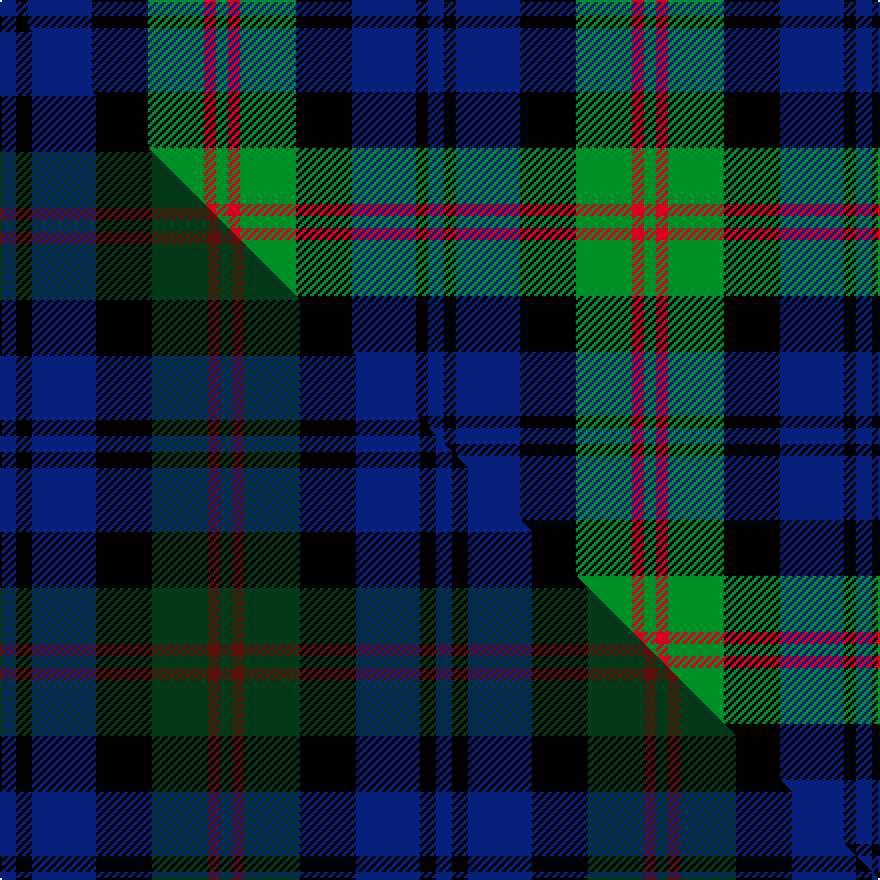

This is one **variant** — a specific cloth: this exact thread count and colourway, with its own
provenance below. It is one weaving of the [sett](/setts/db4k3db16k14g14r3g3/) (the scale-free proportion — the
same cloth at any scale or shade), whose colour order is pattern [BKBKGRG](/stripes/bkbkgrg/).

Part of the [Inneryne](/tartans/inneryne/) tartan — the named design grouping this sett with its other cloths.

Sourced from tartans-authority.  It is a [7 stripe tartan](/stripes/stripes7/).

Original link [https://www.tartanregister.gov.uk/tartanDetails.aspx?ref=7769](https://www.tartanregister.gov.uk/tartanDetails.aspx?ref=7769)

Dataset <small>— provenance for this record, inherited from the source manifest</small>

<dl class="dataset-prov">
<dt>source</dt><dd><a href="/sources/tartans-authority/">Scottish Tartans Authority</a></dd>
<dt>data captured from</dt><dd><a href="https://github.com/thetartan/tartan-database/blob/master/data/tartans-authority/data.csv">https://github.com/thetartan/tartan-database/blob/master/data/tartans-authority/data.csv</a></dd>
<dt>data date</dt><dd>pre 2008 <small>(this record)</small></dd>
<dt>licence</dt><dd><a href="https://creativecommons.org/licenses/by-nc-nd/4.0/">CC BY-NC-ND 4.0</a></dd>
</dl>

Capture chain <small>— the hands this data passed through, oldest first; each capture carries its own licence</small>

<ol class="capture-chain">
<li><a href="https://www.tartansauthority.com/">Scottish Tartans Authority</a> <small>the heritage body's archive — its tartan-ferret record browser is retired (links repaired to the SRT, above)</small></li>
<li><a href="https://github.com/thetartan/tartan-database">thetartan/tartan-database</a> <small>2016-2017</small> · <a href="https://creativecommons.org/licenses/by-nc-nd/4.0/">CC BY-NC-ND 4.0</a> <small>Levko Kravets's frozen compilation — the capture we vendored, and where its CC licence text came from</small></li>
<li>this dictionary <small>captured 2026-06-10 · commit 5bf86c7566</small> <small>each re-capture is a git commit to data/sources</small></li>
</ol>

## Register references

External register numbers recorded for this tartan.

- Scottish Tartans Authority (ITI): 7769

## Thread count
DB/8 K6 DB32 K28 G28 R6 G/6

One full sett is **214 threads**.

## Palette
<table><thead><tr><th>Colour</th><th>Shade</th><th>OKLCh</th></tr></thead><tbody><tr><td>DB</td><td><code style="background-color:#082077;">#082077</code> <small style="color:#888">#082077</small></td><td><small style="color:#888">oklch(30.0% 0.149 265.1)</small></td></tr><tr><td>G</td><td><code style="background-color:#008B2A;">#008B2A</code> <small style="color:#888">#008B2A</small></td><td><small style="color:#888">oklch(55.4% 0.170 145.9)</small></td></tr><tr><td>K</td><td><code style="background-color:#000000;">#000000</code> <small style="color:#888">#000000</small></td><td><small style="color:#888">oklch(0.0% 0.000 0.0)</small></td></tr><tr><td>R</td><td><code style="background-color:#D60020;">#D60020</code> <small style="color:#888">#D60020</small></td><td><small style="color:#888">oklch(55.2% 0.224 25.5)</small></td></tr></tbody></table>

# Sample pattern

## Compared to the master

This cloth is one sett of its design; the master sett (the exemplar the design is anchored on) is below for comparison.

Its **ΔTartan distance** from the master is **0.20** — the same measure the nearest-tartans table ranks by (0 is identical; a re-scale of the same cloth is near 0, a recolour or a different proportion further).

<figure class="master-compare" style="margin:0">

this sett
master sett ★

<figcaption style="color:#888;font-size:smaller">One weave of this sett against the <a href="/setts/db4k4db16k14dg14dr3dg3/">master sett ★</a>, split on the diagonal: a shared proportion runs seamlessly across it with only the shades shifting; a different proportion breaks on it.</figcaption>
</figure>

## Nearest tartan variants

The nearest existing variants by ΔTartan distance, with this cloth at the top so the swatches line up against it.

ΔTartan

Threads

Variant

Sett

—

214

<a href="/variants/s7/db4k3db16k14g14r3g3~x2/">Inneryne (Personal)</a>

<a href="/ttd/edit/#slug=dr3g1dr1g8k8db8k2db3~x2&amp;base=db4k3db16k14g14r3g3~x2" title="compare in the TTD">0.76</a>

124

<a href="/variants/s8/dr3g1dr1g8k8db8k2db3~x2/">Baird</a>

<a href="/ttd/edit/#slug=db3k2db8k8g8dp1g1dp3~x4&amp;base=db4k3db16k14g14r3g3~x2" title="compare in the TTD">1.07</a>

248

<a href="/variants/s8/db3k2db8k8g8dp1g1dp3~x4/">Baird (Modern)</a>

<a href="/ttd/edit/#slug=db3k2db8k8g8dp1g1dp3~x2&amp;base=db4k3db16k14g14r3g3~x2" title="compare in the TTD">1.07</a>

124

<a href="/variants/s8/db3k2db8k8g8dp1g1dp3~x2/">Baird Clan Tartan</a>

<a href="/ttd/edit/#slug=db2k2db12k8g11r2~x2&amp;base=db4k3db16k14g14r3g3~x2" title="compare in the TTD">1.24</a>

140

<a href="/variants/s6/db2k2db12k8g11r2~x2/">Murray (Variation) Clan Tartan</a>

<a href="/ttd/edit/#slug=g24db6lb3k6db12k15g4~x2&amp;base=db4k3db16k14g14r3g3~x2" title="compare in the TTD">1.26</a>

224

<a href="/variants/s7/g24db6lb3k6db12k15g4~x2/">Blaylock Annandale</a>

<a href="/ttd/edit/#slug=db5lb4db22k15g22r4g4~x2&amp;base=db4k3db16k14g14r3g3~x2" title="compare in the TTD">1.28</a>

286

<a href="/variants/s7/db5lb4db22k15g22r4g4~x2/">Cairngorm #2</a>

<a href="/ttd/edit/#slug=db6k1db6k8r1g8k2&amp;base=db4k3db16k14g14r3g3~x2" title="compare in the TTD">1.49</a>

56

<a href="/variants/s7/db6k1db6k8r1g8k2/">Fletcher</a>

<a href="/ttd/edit/#slug=db6k1db6k8r1g8k2~x2&amp;base=db4k3db16k14g14r3g3~x2" title="compare in the TTD">1.49</a>

112

<a href="/variants/s7/db6k1db6k8r1g8k2~x2/">Fletcher Clan Tartan</a>

<a href="/ttd/edit/#slug=t10k3t10k14r2g14k4~x2&amp;base=db4k3db16k14g14r3g3~x2" title="compare in the TTD">1.54</a>

200

<a href="/variants/s7/t10k3t10k14r2g14k4~x2/">Fletcher #2</a>

<a href="/ttd/edit/#slug=db2k2db12k11g12w2~x2&amp;base=db4k3db16k14g14r3g3~x2" title="compare in the TTD">1.56</a>

156

<a href="/variants/s6/db2k2db12k11g12w2~x2/">Campbell, The White Stripe</a>

## Neighbour map

Every grey dot is one of 13621 variants placed by the first two principal components of the ΔTartan feature space (42% of its variance). Red is this tartan; blue dots are its nearest — click one to open its page.

<svg viewBox="0 0 640 380" role="img" style="max-width:100%;height:auto;border:1px solid #e0e0e0;border-radius:4px;display:block" xmlns="http://www.w3.org/2000/svg"><image href="/nn/cloud.v1.png" width="640" height="380"/><a href="/variants/s8/dr3g1dr1g8k8db8k2db3~x2/"><circle cx="129.7" cy="211.8" r="4" fill="#3465a4"><title>Baird</title></circle></a><a href="/variants/s8/db3k2db8k8g8dp1g1dp3~x4/"><circle cx="130.3" cy="211.9" r="4" fill="#3465a4"><title>Baird (Modern)</title></circle></a><a href="/variants/s8/db3k2db8k8g8dp1g1dp3~x2/"><circle cx="130.3" cy="211.9" r="4" fill="#3465a4"><title>Baird Clan Tartan</title></circle></a><a href="/variants/s6/db2k2db12k8g11r2~x2/"><circle cx="145.6" cy="229.5" r="4" fill="#3465a4"><title>Murray (Variation) Clan Tartan</title></circle></a><a href="/variants/s7/g24db6lb3k6db12k15g4~x2/"><circle cx="150.3" cy="212.8" r="4" fill="#3465a4"><title>Blaylock Annandale</title></circle></a><a href="/variants/s7/db5lb4db22k15g22r4g4~x2/"><circle cx="106.6" cy="210.9" r="4" fill="#3465a4"><title>Cairngorm #2</title></circle></a><a href="/variants/s7/db6k1db6k8r1g8k2/"><circle cx="148.2" cy="217.6" r="4" fill="#3465a4"><title>Fletcher</title></circle></a><a href="/variants/s7/db6k1db6k8r1g8k2~x2/"><circle cx="148.2" cy="217.6" r="4" fill="#3465a4"><title>Fletcher Clan Tartan</title></circle></a><a href="/variants/s7/t10k3t10k14r2g14k4~x2/"><circle cx="120.8" cy="227.8" r="4" fill="#3465a4"><title>Fletcher #2</title></circle></a><a href="/variants/s6/db2k2db12k11g12w2~x2/"><circle cx="124.1" cy="228.6" r="4" fill="#3465a4"><title>Campbell, The White Stripe</title></circle></a><circle cx="127.0" cy="228.3" r="5" fill="#c00000"/><text x="320" y="376" text-anchor="middle" font-size="11" fill="#999">ground</text><text x="11" y="190" text-anchor="middle" font-size="11" fill="#999" transform="rotate(-90 11 190)">complexity</text></svg>

ID: /variants/s7/db4k3db16k14g14r3g3~x2/
