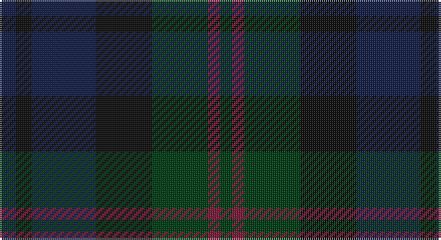

This page is one **sett** — a single exact thread-count. It belongs to the [tartan](/setts/db4k4db16k14dg14m3dg3/)
(the same proportion at any scale), whose colour order is pattern [BKBKGRG](/stripes/bkbkgrg/).

Part of the [Inneryne](/tartans/inneryne/) tartan — the named design grouping this sett with its other cloths.

Sourced from register-of-tartans.  It is a [7 stripe tartan](/stripes/stripes7/).

Original link https://www.tartanregister.gov.uk/tartanDetails.aspx?ref=5987

## Register references

External register numbers recorded for this tartan.

- Scottish Register of Tartans: [5987](https://www.tartanregister.gov.uk/tartanDetails.aspx?ref=5987)
- Scottish Tartans World Register: 3273

## Thread count
DB/8 K8 DB32 K28 DG28 DR6 DG/6

One full sett is **218 threads**.

## Palette

Palette: <strong>Tartan Register</strong>
<table><thead><tr><th>Colour</th><th>Threads</th><th>Shade</th><th>Base</th><th>OKLCh</th></tr></thead><tbody><tr><td>DB/</td><td style="text-align:right;font-variant-numeric:tabular-nums">8</td><td><code style="background-color:#141E46;">#141E46</code> <small style="color:#888">#141E46</small></td><td>B <code style="background-color:#2A418A;">#2A418A</code></td><td><small style="color:#888">oklch(25.2% 0.076 269.7)</small></td></tr><tr><td>K</td><td style="text-align:right;font-variant-numeric:tabular-nums">8</td><td><code style="background-color:#101010;">#101010</code> <small style="color:#888">#101010</small></td><td>K <code style="background-color:#000000;">#000000</code></td><td><small style="color:#888">oklch(17.3% 0.000 89.9)</small></td></tr><tr><td>DB</td><td style="text-align:right;font-variant-numeric:tabular-nums">32</td><td><code style="background-color:#141E46;">#141E46</code> <small style="color:#888">#141E46</small></td><td>B <code style="background-color:#2A418A;">#2A418A</code></td><td><small style="color:#888">oklch(25.2% 0.076 269.7)</small></td></tr><tr><td>K</td><td style="text-align:right;font-variant-numeric:tabular-nums">28</td><td><code style="background-color:#101010;">#101010</code> <small style="color:#888">#101010</small></td><td>K <code style="background-color:#000000;">#000000</code></td><td><small style="color:#888">oklch(17.3% 0.000 89.9)</small></td></tr><tr><td>DG</td><td style="text-align:right;font-variant-numeric:tabular-nums">28</td><td><code style="background-color:#003C14;">#003C14</code> <small style="color:#888">#003C14</small></td><td>G <code style="background-color:#006100;">#006100</code></td><td><small style="color:#888">oklch(31.1% 0.089 148.5)</small></td></tr><tr><td>DR</td><td style="text-align:right;font-variant-numeric:tabular-nums">6</td><td><code style="background-color:#781C38;">#781C38</code> <small style="color:#888">#781C38</small></td><td>R <code style="background-color:#CC0000;">#CC0000</code></td><td><small style="color:#888">oklch(38.7% 0.127 7.4)</small></td></tr><tr><td>DG/</td><td style="text-align:right;font-variant-numeric:tabular-nums">6</td><td><code style="background-color:#003C14;">#003C14</code> <small style="color:#888">#003C14</small></td><td>G <code style="background-color:#006100;">#006100</code></td><td><small style="color:#888">oklch(31.1% 0.089 148.5)</small></td></tr></tbody></table>

# Sample pattern

## Nearest tartans

The nearest existing variants by ΔTartan distance, with this tartan at the top so the swatches line up against it.

ΔTartan

Tartan

Sett

—

<a href="/ttd/edit/#slug=db4k4db16k14dg14m3dg3~x2">Inneryne (Personal)</a> <a class="nn-out" href="/variants/s7/db4k4db16k14dg14m3dg3~x2/" title="open its dictionary page">↗</a>

1.13

<a href="/ttd/edit/#slug=dg7db1dg1k4dp4k1~x4&amp;base=db4k4db16k14dg14m3dg3~x2">MacArthur of Milton Hunting</a> <a class="nn-out" href="/variants/s6/dg7db1dg1k4dp4k1~x4/" title="open its dictionary page">↗</a>

1.41

<a href="/ttd/edit/#slug=dg10k2dg2k2dg2k7db8dp2db8k7dg8k2dg2~x2&amp;base=db4k4db16k14dg14m3dg3~x2">Lochinvar Marine Harvest Corporate Tartan</a> <a class="nn-out" href="/variants/s13/dg10k2dg2k2dg2k7db8dp2db8k7dg8k2dg2~x2/" title="open its dictionary page">↗</a>

1.61

<a href="/variants/s8/dg18db2dg5r2dg5ki21k20ki5~x2/">MacRae, Special Hunting</a>

1.65

<a href="/ttd/edit/#slug=dy6dg6y1dg6dy5dt6dy1~x4&amp;base=db4k4db16k14dg14m3dg3~x2">Gleneagles (Corporate)</a> <a class="nn-out" href="/variants/s7/dy6dg6y1dg6dy5dt6dy1~x4/" title="open its dictionary page">↗</a>

1.85

<a href="/ttd/edit/#slug=k3dt15k9do3k2do14k2do3k9dt13k2dt3~x2&amp;base=db4k4db16k14dg14m3dg3~x2">McWilliams (2014)</a> <a class="nn-out" href="/variants/s12/k3dt15k9do3k2do14k2do3k9dt13k2dt3~x2/" title="open its dictionary page">↗</a>

1.86

<a href="/ttd/edit/#slug=db3dy14dg14dy2db14dy2db14dy2dg14dy14r3~x2&amp;base=db4k4db16k14dg14m3dg3~x2">Buchanan Hunting</a> <a class="nn-out" href="/variants/s11/db3dy14dg14dy2db14dy2db14dy2dg14dy14r3~x2/" title="open its dictionary page">↗</a>

1.88

<a href="/ttd/edit/#slug=dt8db10dt22dg7g10dg22dp3~x2&amp;base=db4k4db16k14dg14m3dg3~x2">Baron of Crawfordjohn (Personal)</a> <a class="nn-out" href="/variants/s7/dt8db10dt22dg7g10dg22dp3~x2/" title="open its dictionary page">↗</a>

1.91

<a href="/ttd/edit/#slug=r2do15dg12do2dt12do2dg12do15o2~x4&amp;base=db4k4db16k14dg14m3dg3~x2">Amazing Union (Personal)</a> <a class="nn-out" href="/variants/s9/r2do15dg12do2dt12do2dg12do15o2~x4/" title="open its dictionary page">↗</a>

1.96

<a href="/ttd/edit/#slug=dt10y3dt10r3k21dg20k15r3~x2&amp;base=db4k4db16k14dg14m3dg3~x2">Williamson/Smart</a> <a class="nn-out" href="/variants/s8/dt10y3dt10r3k21dg20k15r3~x2/" title="open its dictionary page">↗</a>

1.96

<a href="/ttd/edit/#slug=db10dt22dg7g10dg22dp3dg22g10dg7dt22db10dt8~x2&amp;base=db4k4db16k14dg14m3dg3~x2">Crawfordjohn Personal Tartan</a> <a class="nn-out" href="/variants/s12/db10dt22dg7g10dg22dp3dg22g10dg7dt22db10dt8~x2/" title="open its dictionary page">↗</a>

## Neighbour map

Every grey dot is one of 14360 variants placed by the first two principal components of the ΔTartan feature space (44% of its variance). Red is this tartan; blue dots are its nearest — click one to open its page.

<svg viewBox="0 0 640 380" role="img" style="max-width:100%;height:auto;border:1px solid #e0e0e0;border-radius:4px;display:block" xmlns="http://www.w3.org/2000/svg"><image href="/nn/cloud.v1.png" width="640" height="380"/><a href="/variants/s6/dg7db1dg1k4dp4k1~x4/"><circle cx="345.8" cy="314.7" r="4" fill="#3465a4"><title>MacArthur of Milton Hunting</title></circle></a><a href="/variants/s13/dg10k2dg2k2dg2k7db8dp2db8k7dg8k2dg2~x2/"><circle cx="284.3" cy="305.6" r="4" fill="#3465a4"><title>Lochinvar Marine Harvest Corporate Tartan</title></circle></a><a href="/variants/s8/dg18db2dg5r2dg5ki21k20ki5~x2/"><circle cx="305.2" cy="274.0" r="4" fill="#3465a4"><title>MacRae, Special Hunting</title></circle></a><a href="/variants/s7/dy6dg6y1dg6dy5dt6dy1~x4/"><circle cx="329.9" cy="356.0" r="4" fill="#3465a4"><title>Gleneagles (Corporate)</title></circle></a><a href="/variants/s12/k3dt15k9do3k2do14k2do3k9dt13k2dt3~x2/"><circle cx="333.9" cy="292.3" r="4" fill="#3465a4"><title>McWilliams (2014)</title></circle></a><a href="/variants/s11/db3dy14dg14dy2db14dy2db14dy2dg14dy14r3~x2/"><circle cx="267.3" cy="280.6" r="4" fill="#3465a4"><title>Buchanan Hunting</title></circle></a><a href="/variants/s7/dt8db10dt22dg7g10dg22dp3~x2/"><circle cx="242.7" cy="295.1" r="4" fill="#3465a4"><title>Baron of Crawfordjohn (Personal)</title></circle></a><a href="/variants/s9/r2do15dg12do2dt12do2dg12do15o2~x4/"><circle cx="322.1" cy="277.3" r="4" fill="#3465a4"><title>Amazing Union (Personal)</title></circle></a><a href="/variants/s8/dt10y3dt10r3k21dg20k15r3~x2/"><circle cx="265.9" cy="278.7" r="4" fill="#3465a4"><title>Williamson/Smart</title></circle></a><a href="/variants/s12/db10dt22dg7g10dg22dp3dg22g10dg7dt22db10dt8~x2/"><circle cx="252.5" cy="292.2" r="4" fill="#3465a4"><title>Crawfordjohn Personal Tartan</title></circle></a><circle cx="293.2" cy="331.8" r="5" fill="#c00000"/></svg>

ID: /variants/s7/db4k4db16k14dg14m3dg3~x2/
