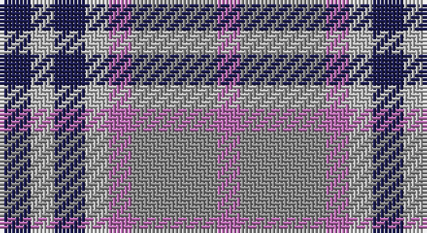

This page is one **sett** — a single exact thread-count. It belongs to the [tartan](/setts/db4lr3db4lr3m3o11m3/)
(the same proportion at any scale), whose colour order is pattern [BYBYRRR](/stripes/bybyrrr/).

Part of the [Stevens](/tartans/stevens/) tartan — the named design grouping this sett with its other cloths.

Sourced from register-of-tartans.  It is a [7 stripe tartan](/stripes/stripes7/).

Original link https://www.tartanregister.gov.uk/tartanDetails.aspx?ref=3921

## Also known as

This cloth is also recorded under:

- Stevens #2
- Stevens #3
- Stevens #4
- Stevens #5
- Stevens #6

## Register references

External register numbers recorded for this tartan.

- Scottish Register of Tartans: [3921](https://www.tartanregister.gov.uk/tartanDetails.aspx?ref=3921)
- Scottish Tartans Authority (ITI): 7063

## Thread count
DB/8 Na6 DB8 Na6 P6 N22 P/6

One full sett is **110 threads**.

## Palette

Palette: <strong>Tartan Register</strong> <small style="color:#888">(2 of 4 colours)</small>
<table><thead><tr><th>Colour</th><th>Threads</th><th>Shade</th><th>Base</th><th>OKLCh</th></tr></thead><tbody><tr><td>DB/</td><td style="text-align:right;font-variant-numeric:tabular-nums">8</td><td><code style="background-color:#1C1C50;">#1C1C50</code> <small style="color:#888">#1C1C50</small></td><td>B <code style="background-color:#2A418A;">#2A418A</code></td><td><small style="color:#888">oklch(26.2% 0.093 277.9)</small></td></tr><tr><td>Na</td><td style="text-align:right;font-variant-numeric:tabular-nums">6</td><td><code style="background-color:#B8B8B8;">#B8B8B8</code> <small style="color:#888">#B8B8B8</small></td><td>Y <code style="background-color:#F2BF00;">#F2BF00</code></td><td><small style="color:#888">oklch(78.3% 0.000 89.9)</small></td></tr><tr><td>DB</td><td style="text-align:right;font-variant-numeric:tabular-nums">8</td><td><code style="background-color:#1C1C50;">#1C1C50</code> <small style="color:#888">#1C1C50</small></td><td>B <code style="background-color:#2A418A;">#2A418A</code></td><td><small style="color:#888">oklch(26.2% 0.093 277.9)</small></td></tr><tr><td>Na</td><td style="text-align:right;font-variant-numeric:tabular-nums">6</td><td><code style="background-color:#B8B8B8;">#B8B8B8</code> <small style="color:#888">#B8B8B8</small></td><td>Y <code style="background-color:#F2BF00;">#F2BF00</code></td><td><small style="color:#888">oklch(78.3% 0.000 89.9)</small></td></tr><tr><td>P</td><td style="text-align:right;font-variant-numeric:tabular-nums">6</td><td><code style="background-color:#B468AC;">#B468AC</code> <small style="color:#888">#B468AC</small></td><td>R <code style="background-color:#CC0000;">#CC0000</code></td><td><small style="color:#888">oklch(62.5% 0.131 330.9)</small></td></tr><tr><td>N</td><td style="text-align:right;font-variant-numeric:tabular-nums">22</td><td><code style="background-color:#888888;">#888888</code> <small style="color:#888">#888888</small></td><td>R <code style="background-color:#CC0000;">#CC0000</code></td><td><small style="color:#888">oklch(62.7% 0.000 89.9)</small></td></tr><tr><td>P/</td><td style="text-align:right;font-variant-numeric:tabular-nums">6</td><td><code style="background-color:#B468AC;">#B468AC</code> <small style="color:#888">#B468AC</small></td><td>R <code style="background-color:#CC0000;">#CC0000</code></td><td><small style="color:#888">oklch(62.5% 0.131 330.9)</small></td></tr></tbody></table>

# Sample pattern

## Compared to the master

This cloth is one sett of its design; the master sett (the exemplar the design is anchored on) is below for comparison.

<figure style="margin:0"><figcaption style="color:#888;font-size:smaller">this sett</figcaption></figure>
<figure style="margin:0"><figcaption style="color:#888;font-size:smaller"><a href="/setts/r6ly3r3db24dbi24g24t3ly4t3g24dbi10w3dbi10db24r3ly3r6/">master sett →</a></figcaption></figure>

## Nearest tartans

The nearest existing variants by ΔTartan distance, with this tartan at the top so the swatches line up against it.

ΔTartan

Tartan

Sett

—

<a href="/ttd/edit/#slug=db4lr3db4lr3m3o11m3~x2">Stevens #2</a> <a class="nn-out" href="/variants/s7/db4lr3db4lr3m3o11m3~x2/" title="open its dictionary page">↗</a>

1.08

<a href="/ttd/edit/#slug=r4b3t11db8b2r4&amp;base=db4lr3db4lr3m3o11m3~x2">St. Edmunds (School)</a> <a class="nn-out" href="/variants/s6/r4b3t11db8b2r4/" title="open its dictionary page">↗</a>

1.21

<a href="/ttd/edit/#slug=t1g3r1p3t1~x4&amp;base=db4lr3db4lr3m3o11m3~x2">Wilson's, No 95</a> <a class="nn-out" href="/variants/s5/t1g3r1p3t1~x4/" title="open its dictionary page">↗</a>

1.40

<a href="/ttd/edit/#slug=t1dg3r1dp3t1~x4&amp;base=db4lr3db4lr3m3o11m3~x2">Wilson's No.95</a> <a class="nn-out" href="/variants/s5/t1dg3r1dp3t1~x4/" title="open its dictionary page">↗</a>

1.46

<a href="/ttd/edit/#slug=db10t5lo2t2lb2t5o4t2o4lb2~x4&amp;base=db4lr3db4lr3m3o11m3~x2">Unidentified #47</a> <a class="nn-out" href="/variants/s10/db10t5lo2t2lb2t5o4t2o4lb2~x4/" title="open its dictionary page">↗</a>

1.51

<a href="/variants/s8/g4r3t1k1t3~x4/">Wilson's No.214</a>

1.51

<a href="/ttd/edit/#slug=r9b6dt13b21o18w4~x2&amp;base=db4lr3db4lr3m3o11m3~x2">Fox-Eves Wedding (Personal)</a> <a class="nn-out" href="/variants/s6/r9b6dt13b21o18w4~x2/" title="open its dictionary page">↗</a>

1.52

<a href="/ttd/edit/#slug=dp13n8w5dg24w5n10w5n10~x2&amp;base=db4lr3db4lr3m3o11m3~x2">Chaudhri, Zafar Iqbal</a> <a class="nn-out" href="/variants/s8/dp13n8w5dg24w5n10w5n10~x2/" title="open its dictionary page">↗</a>

1.63

<a href="/ttd/edit/#slug=m3g1t6k1g6m4k1lo1~x4&amp;base=db4lr3db4lr3m3o11m3~x2">Orkney District Tartan</a> <a class="nn-out" href="/variants/s8/m3g1t6k1g6m4k1lo1~x4/" title="open its dictionary page">↗</a>

1.65

<a href="/ttd/edit/#slug=r2lb1db8lb8y8lb1y1~x2&amp;base=db4lr3db4lr3m3o11m3~x2">Over Mountain</a> <a class="nn-out" href="/variants/s7/r2lb1db8lb8y8lb1y1~x2/" title="open its dictionary page">↗</a>

1.66

<a href="/ttd/edit/#slug=lr10dt3lr3dt3lr3dt11dy11o3~x2&amp;base=db4lr3db4lr3m3o11m3~x2">Holden Monaro Corporate Tartan</a> <a class="nn-out" href="/variants/s8/lr10dt3lr3dt3lr3dt11dy11o3~x2/" title="open its dictionary page">↗</a>

## Neighbour map

Every grey dot is one of 14360 variants placed by the first two principal components of the ΔTartan feature space (44% of its variance). Red is this tartan; blue dots are its nearest — click one to open its page.

<svg viewBox="0 0 640 380" role="img" style="max-width:100%;height:auto;border:1px solid #e0e0e0;border-radius:4px;display:block" xmlns="http://www.w3.org/2000/svg"><image href="/nn/cloud.v1.png" width="640" height="380"/><a href="/variants/s6/r4b3t11db8b2r4/"><circle cx="157.5" cy="262.0" r="4" fill="#3465a4"><title>St. Edmunds (School)</title></circle></a><a href="/variants/s5/t1g3r1p3t1~x4/"><circle cx="123.8" cy="289.4" r="4" fill="#3465a4"><title>Wilson's, No 95</title></circle></a><a href="/variants/s5/t1dg3r1dp3t1~x4/"><circle cx="128.8" cy="296.7" r="4" fill="#3465a4"><title>Wilson's No.95</title></circle></a><a href="/variants/s10/db10t5lo2t2lb2t5o4t2o4lb2~x4/"><circle cx="96.3" cy="206.8" r="4" fill="#3465a4"><title>Unidentified #47</title></circle></a><a href="/variants/s8/g4r3t1k1t3~x4/"><circle cx="117.0" cy="251.3" r="4" fill="#3465a4"><title>Wilson's No.214</title></circle></a><a href="/variants/s6/r9b6dt13b21o18w4~x2/"><circle cx="131.5" cy="258.4" r="4" fill="#3465a4"><title>Fox-Eves Wedding (Personal)</title></circle></a><a href="/variants/s8/dp13n8w5dg24w5n10w5n10~x2/"><circle cx="108.2" cy="232.5" r="4" fill="#3465a4"><title>Chaudhri, Zafar Iqbal</title></circle></a><a href="/variants/s8/m3g1t6k1g6m4k1lo1~x4/"><circle cx="117.7" cy="213.0" r="4" fill="#3465a4"><title>Orkney District Tartan</title></circle></a><a href="/variants/s7/r2lb1db8lb8y8lb1y1~x2/"><circle cx="158.4" cy="199.3" r="4" fill="#3465a4"><title>Over Mountain</title></circle></a><a href="/variants/s8/lr10dt3lr3dt3lr3dt11dy11o3~x2/"><circle cx="141.2" cy="251.5" r="4" fill="#3465a4"><title>Holden Monaro Corporate Tartan</title></circle></a><circle cx="122.9" cy="253.8" r="5" fill="#c00000"/></svg>

ID: /variants/s7/db4lr3db4lr3m3o11m3~x2/
