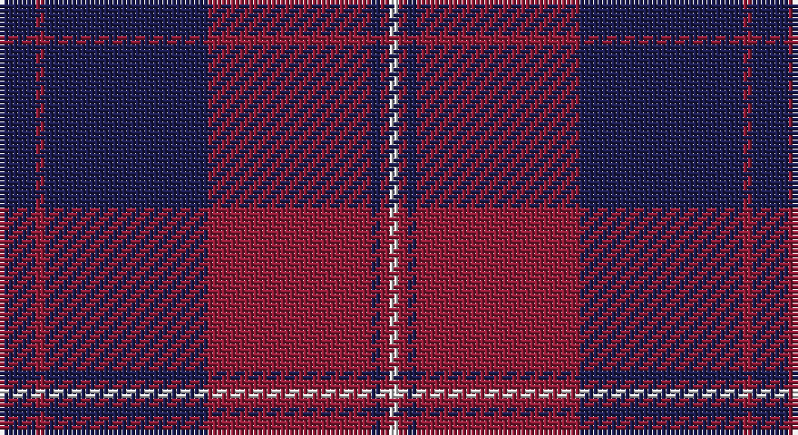

This page is one **sett** — a single exact thread-count. It belongs to the [tartan](/setts/db4r1db18r18db1r1w1/)
(the same proportion at any scale), whose colour order is pattern [BRBRBRW](/stripes/brbrbrw/).

Sourced from tartans-authority.  It is a [7 stripe tartan](/stripes/stripes7/).

Original link http://www.tartansauthority.com/tartan-ferret/display/8148/

## Register references

External register numbers recorded for this tartan.

- Scottish Register of Tartans: [8148](https://www.tartanregister.gov.uk/tartanDetails?ref=8148)
- Scottish Tartans Authority (ITI): 8148

## Thread count
DB/8 DR2 DB36 DR36 DB2 DR2 LN/2

One full sett is **166 threads**.

## Palette

Palette: <strong>Tartan Register</strong>
<table><thead><tr><th>Colour</th><th>Threads</th><th>Shade</th><th>Base</th><th>OKLCh</th></tr></thead><tbody><tr><td>DB/</td><td style="text-align:right;font-variant-numeric:tabular-nums">8</td><td><code style="background-color:#1C1C50;">#1C1C50</code> <small style="color:#888">#1C1C50</small></td><td>B <code style="background-color:#2A418A;">#2A418A</code></td><td><small style="color:#888">oklch(26.2% 0.093 277.9)</small></td></tr><tr><td>DR</td><td style="text-align:right;font-variant-numeric:tabular-nums">2</td><td><code style="background-color:#901C38;">#901C38</code> <small style="color:#888">#901C38</small></td><td>R <code style="background-color:#CC0000;">#CC0000</code></td><td><small style="color:#888">oklch(43.2% 0.150 13.1)</small></td></tr><tr><td>DB</td><td style="text-align:right;font-variant-numeric:tabular-nums">36</td><td><code style="background-color:#1C1C50;">#1C1C50</code> <small style="color:#888">#1C1C50</small></td><td>B <code style="background-color:#2A418A;">#2A418A</code></td><td><small style="color:#888">oklch(26.2% 0.093 277.9)</small></td></tr><tr><td>DR</td><td style="text-align:right;font-variant-numeric:tabular-nums">36</td><td><code style="background-color:#901C38;">#901C38</code> <small style="color:#888">#901C38</small></td><td>R <code style="background-color:#CC0000;">#CC0000</code></td><td><small style="color:#888">oklch(43.2% 0.150 13.1)</small></td></tr><tr><td>DB</td><td style="text-align:right;font-variant-numeric:tabular-nums">2</td><td><code style="background-color:#1C1C50;">#1C1C50</code> <small style="color:#888">#1C1C50</small></td><td>B <code style="background-color:#2A418A;">#2A418A</code></td><td><small style="color:#888">oklch(26.2% 0.093 277.9)</small></td></tr><tr><td>DR</td><td style="text-align:right;font-variant-numeric:tabular-nums">2</td><td><code style="background-color:#901C38;">#901C38</code> <small style="color:#888">#901C38</small></td><td>R <code style="background-color:#CC0000;">#CC0000</code></td><td><small style="color:#888">oklch(43.2% 0.150 13.1)</small></td></tr><tr><td>LN/</td><td style="text-align:right;font-variant-numeric:tabular-nums">2</td><td><code style="background-color:#E0E0E0;">#E0E0E0</code> <small style="color:#888">#E0E0E0</small></td><td>W <code style="background-color:#F7F7F7;">#F7F7F7</code></td><td><small style="color:#888">oklch(90.7% 0.000 89.9)</small></td></tr></tbody></table>

# Sample pattern

## Nearest tartans

The nearest existing variants by ΔTartan distance, with this tartan at the top so the swatches line up against it.

ΔTartan

Tartan

Sett

—

<a href="/ttd/edit/#slug=db4r1db18r18db1r1w1~x2">St. Mildreds Check (School)</a> <a class="nn-out" href="/variants/s7/db4r1db18r18db1r1w1~x2/" title="open its dictionary page">↗</a>

1.37

<a href="/ttd/edit/#slug=db3o1db14r14o1r1o1r1db2~x4&amp;base=db4r1db18r18db1r1w1~x2">Breckon</a> <a class="nn-out" href="/variants/s9/db3o1db14r14o1r1o1r1db2~x4/" title="open its dictionary page">↗</a>

1.45

<a href="/ttd/edit/#slug=r7dt1r26dt31w1dt1w2~x2&amp;base=db4r1db18r18db1r1w1~x2">Greater Victoria Police PB (Corp)</a> <a class="nn-out" href="/variants/s7/r7dt1r26dt31w1dt1w2~x2/" title="open its dictionary page">↗</a>

1.49

<a href="/ttd/edit/#slug=b27db8b14db8b14db26r84db6r12&amp;base=db4r1db18r18db1r1w1~x2">POF (Fashion)</a> <a class="nn-out" href="/variants/s9/b27db8b14db8b14db26r84db6r12/" title="open its dictionary page">↗</a>

1.54

<a href="/ttd/edit/#slug=k3o1k14r14o1r1o1r1k2~x4&amp;base=db4r1db18r18db1r1w1~x2">Breckon (Name)</a> <a class="nn-out" href="/variants/s9/k3o1k14r14o1r1o1r1k2~x4/" title="open its dictionary page">↗</a>

1.54

<a href="/ttd/edit/#slug=db18r9db2r3k1o1~x4&amp;base=db4r1db18r18db1r1w1~x2">MacGregor, Modern</a> <a class="nn-out" href="/variants/s6/db18r9db2r3k1o1~x4/" title="open its dictionary page">↗</a>

1.61

<a href="/ttd/edit/#slug=dp26r6g16dp8g3r2~x2&amp;base=db4r1db18r18db1r1w1~x2">Perthshire Tourist Board (Corporate)</a> <a class="nn-out" href="/variants/s6/dp26r6g16dp8g3r2~x2/" title="open its dictionary page">↗</a>

1.64

<a href="/ttd/edit/#slug=do3db3do3db27do40ly3&amp;base=db4r1db18r18db1r1w1~x2">Keeper of the Quaich Corporate Tartan</a> <a class="nn-out" href="/variants/s6/do3db3do3db27do40ly3/" title="open its dictionary page">↗</a>

1.64

<a href="/ttd/edit/#slug=lo3dy33db24dy2db2dy2~x2&amp;base=db4r1db18r18db1r1w1~x2">Keepers of the Quaich</a> <a class="nn-out" href="/variants/s6/lo3dy33db24dy2db2dy2~x2/" title="open its dictionary page">↗</a>

1.67

<a href="/ttd/edit/#slug=k1r7k1r7db16g1~x4&amp;base=db4r1db18r18db1r1w1~x2">Robinson Dress (Pendleton) #1</a> <a class="nn-out" href="/variants/s6/k1r7k1r7db16g1~x4/" title="open its dictionary page">↗</a>

1.67

<a href="/ttd/edit/#slug=db40r40db44r2db2r40db2r2db2r7~x2&amp;base=db4r1db18r18db1r1w1~x2">Prince Charles Edward</a> <a class="nn-out" href="/variants/s10/db40r40db44r2db2r40db2r2db2r7~x2/" title="open its dictionary page">↗</a>

## Neighbour map

Every grey dot is one of 14360 variants placed by the first two principal components of the ΔTartan feature space (44% of its variance). Red is this tartan; blue dots are its nearest — click one to open its page.

<svg viewBox="0 0 640 380" role="img" style="max-width:100%;height:auto;border:1px solid #e0e0e0;border-radius:4px;display:block" xmlns="http://www.w3.org/2000/svg"><image href="/nn/cloud.v1.png" width="640" height="380"/><a href="/variants/s9/db3o1db14r14o1r1o1r1db2~x4/"><circle cx="357.0" cy="180.3" r="4" fill="#3465a4"><title>Breckon</title></circle></a><a href="/variants/s7/r7dt1r26dt31w1dt1w2~x2/"><circle cx="410.1" cy="168.7" r="4" fill="#3465a4"><title>Greater Victoria Police PB (Corp)</title></circle></a><a href="/variants/s9/b27db8b14db8b14db26r84db6r12/"><circle cx="339.0" cy="198.2" r="4" fill="#3465a4"><title>POF (Fashion)</title></circle></a><a href="/variants/s9/k3o1k14r14o1r1o1r1k2~x4/"><circle cx="356.0" cy="179.7" r="4" fill="#3465a4"><title>Breckon (Name)</title></circle></a><a href="/variants/s6/db18r9db2r3k1o1~x4/"><circle cx="389.7" cy="176.1" r="4" fill="#3465a4"><title>MacGregor, Modern</title></circle></a><a href="/variants/s6/dp26r6g16dp8g3r2~x2/"><circle cx="378.4" cy="240.4" r="4" fill="#3465a4"><title>Perthshire Tourist Board (Corporate)</title></circle></a><a href="/variants/s6/do3db3do3db27do40ly3/"><circle cx="457.4" cy="239.2" r="4" fill="#3465a4"><title>Keeper of the Quaich Corporate Tartan</title></circle></a><a href="/variants/s6/lo3dy33db24dy2db2dy2~x2/"><circle cx="440.4" cy="221.2" r="4" fill="#3465a4"><title>Keepers of the Quaich</title></circle></a><a href="/variants/s6/k1r7k1r7db16g1~x4/"><circle cx="328.3" cy="182.9" r="4" fill="#3465a4"><title>Robinson Dress (Pendleton) #1</title></circle></a><a href="/variants/s10/db40r40db44r2db2r40db2r2db2r7~x2/"><circle cx="426.1" cy="187.3" r="4" fill="#3465a4"><title>Prince Charles Edward</title></circle></a><circle cx="422.2" cy="196.0" r="5" fill="#c00000"/></svg>

ID: /variants/s7/db4r1db18r18db1r1w1~x2/
