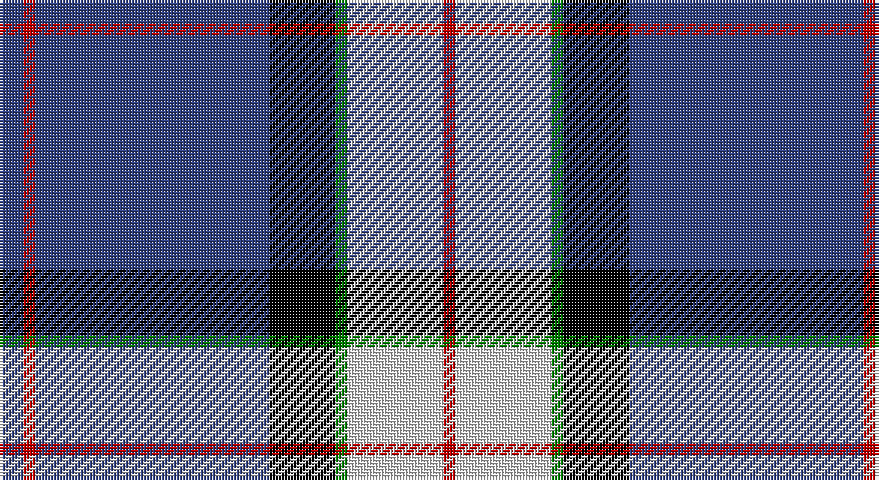

This page is one **sett** — a single exact thread-count. It belongs to the [tartan](/setts/db4r2db39k11g2w16r2/)
(the same proportion at any scale), whose colour order is pattern [BRBKGWR](/stripes/brbkgwr/).

Part of the [Sinclair Dress](/tartans/sinclair-dress/) tartan — the named design grouping this sett with its other cloths.

Sourced from weddslist.  It is a [7 stripe tartan](/stripes/stripes7/).

Original link http://www.weddslist.com/cgi-bin/tartans/pg.pl?source=sts

## Provenance

Earliest known date: 1977 Originally a private copyright tartan which has been given approval by the Earl of Caithness. Jack Sinclair wore this tartan on stage. The following was noted in 2003: More recently the tartan has become known as the Sinclair Dress and restrictions on its use are no longer applied. In 2010 the designer, M. Sinclair intimated that she wished the restrictions on use to be applied for the exclusive use of Jack Sinclair and his immediate family.

## Also known as

This cloth is also recorded under:

- Sinclair Dress Personal
- Sinclair dress
- Sinclair, The Jack

2 attestations — the source records this cloth was collapsed from (oldest owns this page)

<ul>
<li>undated — Sinclair, The Jack (weddslist, <a href="http://www.weddslist.com/cgi-bin/tartans/pg.pl?source=sts">record</a>)</li>
<li>undated — Sinclair Dress Personal Tartan (house-of-tartan, <a href="http://www.house-of-tartan.scotland.net/house/TartanViewjs.asp?colr=Def&tnam=2047">record</a>)</li>
</ul>

## Thread count
B/8 R4 B78 K22 G4 LN32 R/4

One full sett is **292 threads**.

## Palette

Palette: <strong>Tartan Register</strong> <small style="color:#888">(2 of 5 colours)</small>
<table><thead><tr><th>Colour</th><th>Threads</th><th>Shade</th><th>Base</th><th>OKLCh</th></tr></thead><tbody><tr><td>B/</td><td style="text-align:right;font-variant-numeric:tabular-nums">8</td><td><code style="background-color:#304080;">#304080</code> <small style="color:#888">#304080</small></td><td>B <code style="background-color:#2A418A;">#2A418A</code></td><td><small style="color:#888">oklch(39.4% 0.109 270.2)</small></td></tr><tr><td>R</td><td style="text-align:right;font-variant-numeric:tabular-nums">4</td><td><code style="background-color:#C00000;">#C00000</code> <small style="color:#888">#C00000</small></td><td>R <code style="background-color:#CC0000;">#CC0000</code></td><td><small style="color:#888">oklch(50.7% 0.208 29.2)</small></td></tr><tr><td>B</td><td style="text-align:right;font-variant-numeric:tabular-nums">78</td><td><code style="background-color:#304080;">#304080</code> <small style="color:#888">#304080</small></td><td>B <code style="background-color:#2A418A;">#2A418A</code></td><td><small style="color:#888">oklch(39.4% 0.109 270.2)</small></td></tr><tr><td>K</td><td style="text-align:right;font-variant-numeric:tabular-nums">22</td><td><code style="background-color:#000000;">#000000</code> <small style="color:#888">#000000</small></td><td>K <code style="background-color:#000000;">#000000</code></td><td><small style="color:#888">oklch(0.0% 0.000 0.0)</small></td></tr><tr><td>G</td><td style="text-align:right;font-variant-numeric:tabular-nums">4</td><td><code style="background-color:#008000;">#008000</code> <small style="color:#888">#008000</small></td><td>G <code style="background-color:#006100;">#006100</code></td><td><small style="color:#888">oklch(52.0% 0.177 142.5)</small></td></tr><tr><td>LN</td><td style="text-align:right;font-variant-numeric:tabular-nums">32</td><td><code style="background-color:#E0E0E0;">#E0E0E0</code> <small style="color:#888">#E0E0E0</small></td><td>W <code style="background-color:#F7F7F7;">#F7F7F7</code></td><td><small style="color:#888">oklch(90.7% 0.000 89.9)</small></td></tr><tr><td>R/</td><td style="text-align:right;font-variant-numeric:tabular-nums">4</td><td><code style="background-color:#C00000;">#C00000</code> <small style="color:#888">#C00000</small></td><td>R <code style="background-color:#CC0000;">#CC0000</code></td><td><small style="color:#888">oklch(50.7% 0.208 29.2)</small></td></tr></tbody></table>

# Sample pattern

## Compared to the master

This cloth is one sett of its design; the master sett (the exemplar the design is anchored on) is below for comparison.

<figure style="margin:0"><figcaption style="color:#888;font-size:smaller">this sett</figcaption></figure>
<figure style="margin:0"><figcaption style="color:#888;font-size:smaller"><a href="/setts/db4r2db31k10g4w21g2/">master sett →</a></figcaption></figure>

## Nearest tartans

The nearest existing variants by ΔTartan distance, with this tartan at the top so the swatches line up against it.

ΔTartan

Tartan

Sett

—

<a href="/ttd/edit/#slug=db4r2db39k11g2w16r2~x2">Sinclair, The Jack</a> <a class="nn-out" href="/variants/s7/db4r2db39k11g2w16r2~x2/" title="open its dictionary page">↗</a>

0.42

<a href="/ttd/edit/#slug=db4r2db40k11g2w16r2~x2&amp;base=db4r2db39k11g2w16r2~x2">Sinclair, Blue (Personal)</a> <a class="nn-out" href="/variants/s7/db4r2db40k11g2w16r2~x2/" title="open its dictionary page">↗</a>

0.82

<a href="/ttd/edit/#slug=lo3db4w10dg2w2dg5db34ly3~x2&amp;base=db4r2db39k11g2w16r2~x2">Royal Troon Golf Club, The</a> <a class="nn-out" href="/variants/s8/lo3db4w10dg2w2dg5db34ly3~x2/" title="open its dictionary page">↗</a>

0.93

<a href="/ttd/edit/#slug=r3g2k9b2k2b24ly2b2ly1~x2&amp;base=db4r2db39k11g2w16r2~x2">Bell of the Borders.</a> <a class="nn-out" href="/variants/s9/r3g2k9b2k2b24ly2b2ly1~x2/" title="open its dictionary page">↗</a>

1.06

<a href="/ttd/edit/#slug=db30lb2k9w3db6w4k3lb6~x2&amp;base=db4r2db39k11g2w16r2~x2">Detroit Lions</a> <a class="nn-out" href="/variants/s8/db30lb2k9w3db6w4k3lb6~x2/" title="open its dictionary page">↗</a>

1.12

<a href="/ttd/edit/#slug=lo2w1db6w1ly2k17ly1~x2&amp;base=db4r2db39k11g2w16r2~x2">East Tennessee State University</a> <a class="nn-out" href="/variants/s7/lo2w1db6w1ly2k17ly1~x2/" title="open its dictionary page">↗</a>

1.14

<a href="/ttd/edit/#slug=lo8w3db40k12w3lo3~x2&amp;base=db4r2db39k11g2w16r2~x2">Wolverines (Corporate)</a> <a class="nn-out" href="/variants/s6/lo8w3db40k12w3lo3~x2/" title="open its dictionary page">↗</a>

1.15

<a href="/ttd/edit/#slug=r3dt4w10dg2w2dg5dt34ly3~x2&amp;base=db4r2db39k11g2w16r2~x2">Royal Troon Golf Club, The</a> <a class="nn-out" href="/variants/s8/r3dt4w10dg2w2dg5dt34ly3~x2/" title="open its dictionary page">↗</a>

1.16

<a href="/ttd/edit/#slug=db42lbi2lb2lbi2db5dt12lb32db4~x2&amp;base=db4r2db39k11g2w16r2~x2">Longniddry Eildon Blue Dress Fancy Tartan</a> <a class="nn-out" href="/variants/s8/db42lbi2lb2lbi2db5dt12lb32db4~x2/" title="open its dictionary page">↗</a>

1.18

<a href="/ttd/edit/#slug=db2r1db16k5g2w11g1~x4&amp;base=db4r2db39k11g2w16r2~x2">Sinclair dress</a> <a class="nn-out" href="/variants/s7/db2r1db16k5g2w11g1~x4/" title="open its dictionary page">↗</a>

1.18

<a href="/ttd/edit/#slug=lo8k2dt20t4w1k2~x4&amp;base=db4r2db39k11g2w16r2~x2">Solberg-Bell (Personal)</a> <a class="nn-out" href="/variants/s6/lo8k2dt20t4w1k2~x4/" title="open its dictionary page">↗</a>

## Neighbour map

Every grey dot is one of 14360 variants placed by the first two principal components of the ΔTartan feature space (44% of its variance). Red is this tartan; blue dots are its nearest — click one to open its page.

<svg viewBox="0 0 640 380" role="img" style="max-width:100%;height:auto;border:1px solid #e0e0e0;border-radius:4px;display:block" xmlns="http://www.w3.org/2000/svg"><image href="/nn/cloud.v1.png" width="640" height="380"/><a href="/variants/s7/db4r2db40k11g2w16r2~x2/"><circle cx="290.2" cy="126.9" r="4" fill="#3465a4"><title>Sinclair, Blue (Personal)</title></circle></a><a href="/variants/s8/lo3db4w10dg2w2dg5db34ly3~x2/"><circle cx="303.1" cy="118.0" r="4" fill="#3465a4"><title>Royal Troon Golf Club, The</title></circle></a><a href="/variants/s9/r3g2k9b2k2b24ly2b2ly1~x2/"><circle cx="316.7" cy="96.5" r="4" fill="#3465a4"><title>Bell of the Borders.</title></circle></a><a href="/variants/s8/db30lb2k9w3db6w4k3lb6~x2/"><circle cx="290.8" cy="154.2" r="4" fill="#3465a4"><title>Detroit Lions</title></circle></a><a href="/variants/s7/lo2w1db6w1ly2k17ly1~x2/"><circle cx="282.6" cy="133.3" r="4" fill="#3465a4"><title>East Tennessee State University</title></circle></a><a href="/variants/s6/lo8w3db40k12w3lo3~x2/"><circle cx="306.2" cy="167.4" r="4" fill="#3465a4"><title>Wolverines (Corporate)</title></circle></a><a href="/variants/s8/r3dt4w10dg2w2dg5dt34ly3~x2/"><circle cx="302.0" cy="119.4" r="4" fill="#3465a4"><title>Royal Troon Golf Club, The</title></circle></a><a href="/variants/s8/db42lbi2lb2lbi2db5dt12lb32db4~x2/"><circle cx="288.7" cy="139.6" r="4" fill="#3465a4"><title>Longniddry Eildon Blue Dress Fancy Tartan</title></circle></a><a href="/variants/s7/db2r1db16k5g2w11g1~x4/"><circle cx="209.3" cy="140.1" r="4" fill="#3465a4"><title>Sinclair dress</title></circle></a><a href="/variants/s6/lo8k2dt20t4w1k2~x4/"><circle cx="280.4" cy="148.7" r="4" fill="#3465a4"><title>Solberg-Bell (Personal)</title></circle></a><circle cx="284.1" cy="128.7" r="5" fill="#c00000"/></svg>

ID: /variants/s7/db4r2db39k11g2w16r2~x2/
