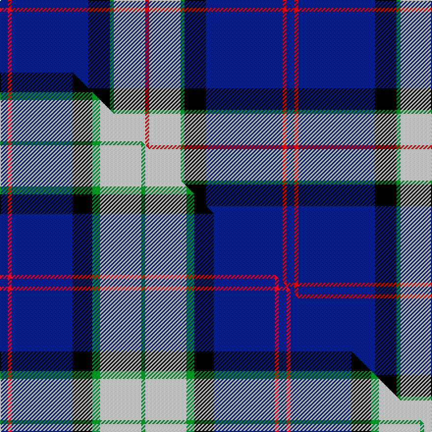

This page is one **sett** — a single exact thread-count. It belongs to the [tartan](/setts/db4r2db39k11g2w16r2/)
(the same proportion at any scale), whose colour order is pattern [BRBKGWR](/stripes/brbkgwr/).

Part of the [Sinclair Dress](/tartans/sinclair-dress/) tartan — the named design grouping this sett with its other cloths.

Sourced from house-of-tartan.  It is a [7 stripe tartan](/stripes/stripes7/).

Original link http://www.house-of-tartan.scotland.net/house/TartanViewjs.asp?colr=Def&tnam=2047

## Provenance

Earliest known date: 1977 Originally a private copyright tartan which has been given approval by the Earl of Caithness. Jack Sinclair wore this tartan on stage. The following was noted in 2003: More recently the tartan has become known as the Sinclair Dress and restrictions on its use are no longer applied. In 2010 the designer, M. Sinclair intimated that she wished the restrictions on use to be applied for the exclusive use of Jack Sinclair and his immediate family.

## Thread count
DB/8 R4 DB78 K22 G4 W32 R/4

One full sett is **292 threads**.

## Palette
<table><thead><tr><th>Colour</th><th>Shade</th><th>OKLCh</th></tr></thead><tbody><tr><td>DB</td><td><code style="background-color:#082077;">#082077</code> <small style="color:#888">#082077</small></td><td><small style="color:#888">oklch(30.0% 0.149 265.1)</small></td></tr><tr><td>R</td><td><code style="background-color:#A00024;">#A00024</code> <small style="color:#888">#A00024</small></td><td><small style="color:#888">oklch(44.6% 0.179 21.0)</small></td></tr><tr><td>G</td><td><code style="background-color:#008B2A;">#008B2A</code> <small style="color:#888">#008B2A</small></td><td><small style="color:#888">oklch(55.4% 0.170 145.9)</small></td></tr><tr><td>K</td><td><code style="background-color:#000000;">#000000</code> <small style="color:#888">#000000</small></td><td><small style="color:#888">oklch(0.0% 0.000 0.0)</small></td></tr><tr><td>W</td><td><code style="background-color:#F7F7F7;">#F7F7F7</code> <small style="color:#888">#F7F7F7</small></td><td><small style="color:#888">oklch(97.6% 0.000 89.9)</small></td></tr><tr><td>R</td><td><code style="background-color:#C80000;">#C80000</code> <small style="color:#888">#C80000</small></td><td><small style="color:#888">oklch(52.3% 0.215 29.2)</small></td></tr></tbody></table>

# Sample pattern

## Compared to the master

This cloth is one sett of its design; the master sett (the exemplar the design is anchored on) is below for comparison.

Its **ΔTartan distance** from the master is **1.23** — the same measure the nearest-tartans table ranks by (0 is identical; a re-scale of the same cloth is near 0, a recolour or a different proportion further).

<figure class="master-compare" style="margin:0">

this sett
master sett ★

<figcaption style="color:#888;font-size:smaller">One weave of this sett against the <a href="/setts/db4r2db31k10g4w21g2/">master sett ★</a>, split on the diagonal: a shared proportion runs seamlessly across it with only the shades shifting; a different proportion breaks on it.</figcaption>
</figure>

## Nearest tartan variants

The nearest existing variants by ΔTartan distance, with this cloth at the top so the swatches line up against it.

ΔTartan

Threads

Variant

Sett

—

292

<a href="/variants/s7/db4r2db39k11g2w16r2~x2~r2109032/">Sinclair Dress Personal Tartan</a>

<a href="/ttd/edit/#slug=db4r2db39k11g2w16r2~x2&amp;base=db4r2db39k11g2w16r2~x2~r2109032" title="compare in the TTD">0.00</a>

292

<a href="/variants/s7/db4r2db39k11g2w16r2~x2/">Sinclair, The Jack</a>

<a href="/ttd/edit/#slug=db4dr2db40k11g2w16dr2~x2&amp;base=db4r2db39k11g2w16r2~x2~r2109032" title="compare in the TTD">0.03</a>

296

<a href="/variants/s7/db4dr2db40k11g2w16dr2~x2/">Jack Sinclair (Personal)</a>

<a href="/ttd/edit/#slug=db2r1db16k5g2w11g1~x4&amp;base=db4r2db39k11g2w16r2~x2~r2109032" title="compare in the TTD">0.79</a>

292

<a href="/variants/s7/db2r1db16k5g2w11g1~x4/">Sinclair dress</a>

<a href="/ttd/edit/#slug=r4db24w2g13db2k3~x4&amp;base=db4r2db39k11g2w16r2~x2~r2109032" title="compare in the TTD">1.90</a>

356

<a href="/variants/s6/r4db24w2g13db2k3~x4/">Vance (Family Association)</a>

<a href="/ttd/edit/#slug=db20dy1db1dy1dg8k1w3~x2&amp;base=db4r2db39k11g2w16r2~x2~r2109032" title="compare in the TTD">2.20</a>

94

<a href="/variants/s7/db20dy1db1dy1dg8k1w3~x2/">Chestico</a>

<a href="/ttd/edit/#slug=w4n15db8k4db28k2db4w2&amp;base=db4r2db39k11g2w16r2~x2~r2109032" title="compare in the TTD">2.26</a>

128

<a href="/variants/s8/w4n15db8k4db28k2db4w2/">Kelvinside Academy (School)</a>

<a href="/ttd/edit/#slug=r3db2w2db26k22w3db3w3~x2&amp;base=db4r2db39k11g2w16r2~x2~r2109032" title="compare in the TTD">2.29</a>

244

<a href="/variants/s8/r3db2w2db26k22w3db3w3~x2/">DeCloud-McMasters (Personal)</a>

<a href="/ttd/edit/#slug=r16db2n6r3k4lb2db40lb6~x2&amp;base=db4r2db39k11g2w16r2~x2~r2109032" title="compare in the TTD">2.50</a>

272

<a href="/variants/s8/r16db2n6r3k4lb2db40lb6~x2/">St. Leonards (Corporate)</a>

<a href="/ttd/edit/#slug=lr8w3db40k12w3lr3~x2&amp;base=db4r2db39k11g2w16r2~x2~r2109032" title="compare in the TTD">2.51</a>

254

<a href="/variants/s6/lr8w3db40k12w3lr3~x2/">Wolverines (Corporate)</a>

<a href="/ttd/edit/#slug=w12db48k13n22k3y6&amp;base=db4r2db39k11g2w16r2~x2~r2109032" title="compare in the TTD">2.52</a>

190

<a href="/variants/s6/w12db48k13n22k3y6/">Clunie (Personal)</a>

## Neighbour map

Every grey dot is one of 13620 variants placed by the first two principal components of the ΔTartan feature space (42% of its variance). Red is this tartan; blue dots are its nearest — click one to open its page.

<svg viewBox="0 0 640 380" role="img" style="max-width:100%;height:auto;border:1px solid #e0e0e0;border-radius:4px;display:block" xmlns="http://www.w3.org/2000/svg"><image href="/nn/cloud.v1.png" width="640" height="380"/><a href="/variants/s7/db4r2db39k11g2w16r2~x2/"><circle cx="256.1" cy="118.6" r="4" fill="#3465a4"><title>Sinclair, The Jack</title></circle></a><a href="/variants/s7/db4dr2db40k11g2w16dr2~x2/"><circle cx="261.9" cy="117.7" r="4" fill="#3465a4"><title>Jack Sinclair (Personal)</title></circle></a><a href="/variants/s7/db2r1db16k5g2w11g1~x4/"><circle cx="189.7" cy="139.0" r="4" fill="#3465a4"><title>Sinclair dress</title></circle></a><a href="/variants/s6/r4db24w2g13db2k3~x4/"><circle cx="247.2" cy="160.4" r="4" fill="#3465a4"><title>Vance (Family Association)</title></circle></a><a href="/variants/s7/db20dy1db1dy1dg8k1w3~x2/"><circle cx="330.4" cy="124.1" r="4" fill="#3465a4"><title>Chestico</title></circle></a><a href="/variants/s8/w4n15db8k4db28k2db4w2/"><circle cx="302.8" cy="159.0" r="4" fill="#3465a4"><title>Kelvinside Academy (School)</title></circle></a><a href="/variants/s8/r3db2w2db26k22w3db3w3~x2/"><circle cx="235.0" cy="145.2" r="4" fill="#3465a4"><title>DeCloud-McMasters (Personal)</title></circle></a><a href="/variants/s8/r16db2n6r3k4lb2db40lb6~x2/"><circle cx="268.8" cy="112.2" r="4" fill="#3465a4"><title>St. Leonards (Corporate)</title></circle></a><a href="/variants/s6/lr8w3db40k12w3lr3~x2/"><circle cx="281.1" cy="154.7" r="4" fill="#3465a4"><title>Wolverines (Corporate)</title></circle></a><a href="/variants/s6/w12db48k13n22k3y6/"><circle cx="189.4" cy="160.6" r="4" fill="#3465a4"><title>Clunie (Personal)</title></circle></a><circle cx="256.2" cy="118.7" r="5" fill="#c00000"/><text x="320" y="376" text-anchor="middle" font-size="11" fill="#999">ground</text><text x="11" y="190" text-anchor="middle" font-size="11" fill="#999" transform="rotate(-90 11 190)">complexity</text></svg>

ID: /variants/s7/db4r2db39k11g2w16r2~x2~r2109032/
