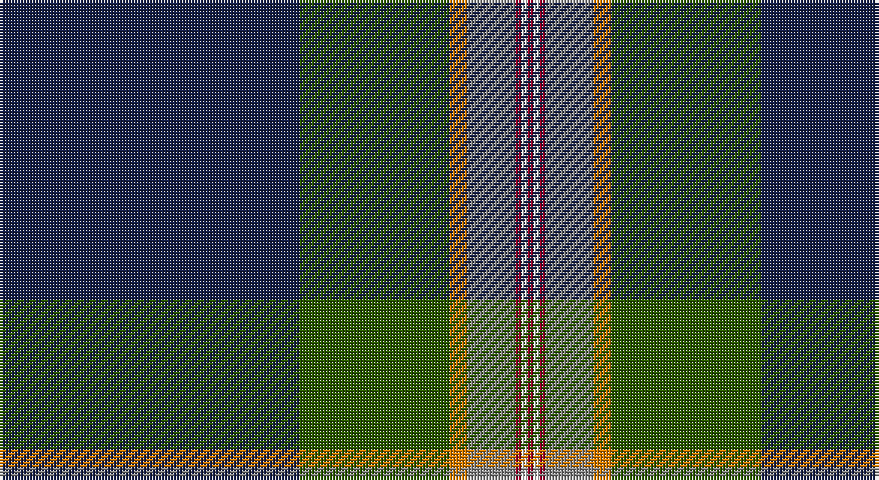

This page is one **sett** — a single exact thread-count. It belongs to the [tartan](/setts/db50dg25lo3o8r1w1r1/)
(the same proportion at any scale), whose colour order is pattern [BGYRRWR](/stripes/bgyrrwr/).

Part of the [Wells](/tartans/wells/) tartan — the named design grouping this sett with its other cloths.

Sourced from register-of-tartans.  It is a [7 stripe tartan](/stripes/stripes7/).

Original link https://www.tartanregister.gov.uk/tartanDetails.aspx?ref=11106

## Also known as

This cloth is also recorded under:

- Wells, Edward G.

## Register references

External register numbers recorded for this tartan.

- Scottish Register of Tartans: [11106](https://www.tartanregister.gov.uk/tartanDetails.aspx?ref=11106)

## Thread count
DB/100 G50 O6 N16 DR2 W2 DR/2

One full sett is **254 threads**.

## Palette

Palette: <strong>Tartan Register</strong>
<table><thead><tr><th>Colour</th><th>Threads</th><th>Shade</th><th>Base</th><th>OKLCh</th></tr></thead><tbody><tr><td>DB/</td><td style="text-align:right;font-variant-numeric:tabular-nums">100</td><td><code style="background-color:#141E46;">#141E46</code> <small style="color:#888">#141E46</small></td><td>B <code style="background-color:#2A418A;">#2A418A</code></td><td><small style="color:#888">oklch(25.2% 0.076 269.7)</small></td></tr><tr><td>G</td><td style="text-align:right;font-variant-numeric:tabular-nums">50</td><td><code style="background-color:#285800;">#285800</code> <small style="color:#888">#285800</small></td><td>G <code style="background-color:#006100;">#006100</code></td><td><small style="color:#888">oklch(41.0% 0.122 135.8)</small></td></tr><tr><td>O</td><td style="text-align:right;font-variant-numeric:tabular-nums">6</td><td><code style="background-color:#D87C00;">#D87C00</code> <small style="color:#888">#D87C00</small></td><td>Y <code style="background-color:#F2BF00;">#F2BF00</code></td><td><small style="color:#888">oklch(67.3% 0.155 61.8)</small></td></tr><tr><td>N</td><td style="text-align:right;font-variant-numeric:tabular-nums">16</td><td><code style="background-color:#888888;">#888888</code> <small style="color:#888">#888888</small></td><td>R <code style="background-color:#CC0000;">#CC0000</code></td><td><small style="color:#888">oklch(62.7% 0.000 89.9)</small></td></tr><tr><td>DR</td><td style="text-align:right;font-variant-numeric:tabular-nums">2</td><td><code style="background-color:#960028;">#960028</code> <small style="color:#888">#960028</small></td><td>R <code style="background-color:#CC0000;">#CC0000</code></td><td><small style="color:#888">oklch(42.7% 0.171 18.3)</small></td></tr><tr><td>W</td><td style="text-align:right;font-variant-numeric:tabular-nums">2</td><td><code style="background-color:#F8F8F8;">#F8F8F8</code> <small style="color:#888">#F8F8F8</small></td><td>W <code style="background-color:#F7F7F7;">#F7F7F7</code></td><td><small style="color:#888">oklch(97.9% 0.000 89.9)</small></td></tr><tr><td>DR/</td><td style="text-align:right;font-variant-numeric:tabular-nums">2</td><td><code style="background-color:#960028;">#960028</code> <small style="color:#888">#960028</small></td><td>R <code style="background-color:#CC0000;">#CC0000</code></td><td><small style="color:#888">oklch(42.7% 0.171 18.3)</small></td></tr></tbody></table>

# Sample pattern

## Compared to the master

This cloth is one sett of its design; the master sett (the exemplar the design is anchored on) is below for comparison.

<figure style="margin:0"><figcaption style="color:#888;font-size:smaller">this sett</figcaption></figure>
<figure style="margin:0"><figcaption style="color:#888;font-size:smaller"><a href="/setts/db8k4ly3k4db14k4dg4g6dg3g10k10g9k3r3k4/">master sett →</a></figcaption></figure>

## Nearest tartans

The nearest existing variants by ΔTartan distance, with this tartan at the top so the swatches line up against it.

ΔTartan

Tartan

Sett

—

<a href="/ttd/edit/#slug=db50dg25lo3o8r1w1r1~x2">Wells (2014)</a> <a class="nn-out" href="/variants/s7/db50dg25lo3o8r1w1r1~x2/" title="open its dictionary page">↗</a>

0.77

<a href="/ttd/edit/#slug=dt46w1lo3dg13w1r7g3w1~x2&amp;base=db50dg25lo3o8r1w1r1~x2">Victorian Highland Pipe Band Association (Australia)</a> <a class="nn-out" href="/variants/s8/dt46w1lo3dg13w1r7g3w1~x2/" title="open its dictionary page">↗</a>

1.01

<a href="/ttd/edit/#slug=db46lyi1ly3dg13lyi1r7g3lyi1~x2&amp;base=db50dg25lo3o8r1w1r1~x2">Victorian Highland Pipe Band Assoc</a> <a class="nn-out" href="/variants/s8/db46lyi1ly3dg13lyi1r7g3lyi1~x2/" title="open its dictionary page">↗</a>

1.04

<a href="/ttd/edit/#slug=k54o11g13lo1b13w1~x2&amp;base=db50dg25lo3o8r1w1r1~x2">Kilmaine Saints (Corporate)</a> <a class="nn-out" href="/variants/s6/k54o11g13lo1b13w1~x2/" title="open its dictionary page">↗</a>

1.07

<a href="/ttd/edit/#slug=n47lo1k27o4dg5lo1o8b1k1~x2&amp;base=db50dg25lo3o8r1w1r1~x2">Brighton Mac Dermott (Fashion)</a> <a class="nn-out" href="/variants/s9/n47lo1k27o4dg5lo1o8b1k1~x2/" title="open its dictionary page">↗</a>

1.17

<a href="/ttd/edit/#slug=dg90r1k10w6k4dg6r10db62ly8&amp;base=db50dg25lo3o8r1w1r1~x2">Stirling, University of</a> <a class="nn-out" href="/variants/s9/dg90r1k10w6k4dg6r10db62ly8/" title="open its dictionary page">↗</a>

1.18

<a href="/ttd/edit/#slug=k43ly3dg1w1db1ly3db25r2~x2&amp;base=db50dg25lo3o8r1w1r1~x2">Royal Yacht Britannia</a> <a class="nn-out" href="/variants/s8/k43ly3dg1w1db1ly3db25r2~x2/" title="open its dictionary page">↗</a>

1.20

<a href="/ttd/edit/#slug=t23w3k10r2dt45ly1~x2&amp;base=db50dg25lo3o8r1w1r1~x2">Kirkcaldy Name Tartan</a> <a class="nn-out" href="/variants/s6/t23w3k10r2dt45ly1~x2/" title="open its dictionary page">↗</a>

1.24

<a href="/ttd/edit/#slug=db33k1db5k8g8r2g15ly1w2~x2&amp;base=db50dg25lo3o8r1w1r1~x2">Mulcahy (Name)</a> <a class="nn-out" href="/variants/s9/db33k1db5k8g8r2g15ly1w2~x2/" title="open its dictionary page">↗</a>

1.25

<a href="/ttd/edit/#slug=k54n11g13ly1db13w1~x2&amp;base=db50dg25lo3o8r1w1r1~x2">Kilmaine Saints</a> <a class="nn-out" href="/variants/s6/k54n11g13ly1db13w1~x2/" title="open its dictionary page">↗</a>

1.26

<a href="/ttd/edit/#slug=r2w1r5g5lo1g10db40ly2~x2&amp;base=db50dg25lo3o8r1w1r1~x2">St. Andrew Quebec City (Corporate)</a> <a class="nn-out" href="/variants/s8/r2w1r5g5lo1g10db40ly2~x2/" title="open its dictionary page">↗</a>

## Neighbour map

Every grey dot is one of 14360 variants placed by the first two principal components of the ΔTartan feature space (44% of its variance). Red is this tartan; blue dots are its nearest — click one to open its page.

<svg viewBox="0 0 640 380" role="img" style="max-width:100%;height:auto;border:1px solid #e0e0e0;border-radius:4px;display:block" xmlns="http://www.w3.org/2000/svg"><image href="/nn/cloud.v1.png" width="640" height="380"/><a href="/variants/s8/dt46w1lo3dg13w1r7g3w1~x2/"><circle cx="402.1" cy="95.7" r="4" fill="#3465a4"><title>Victorian Highland Pipe Band Association (Australia)</title></circle></a><a href="/variants/s8/db46lyi1ly3dg13lyi1r7g3lyi1~x2/"><circle cx="390.7" cy="88.4" r="4" fill="#3465a4"><title>Victorian Highland Pipe Band Assoc</title></circle></a><a href="/variants/s6/k54o11g13lo1b13w1~x2/"><circle cx="342.1" cy="110.7" r="4" fill="#3465a4"><title>Kilmaine Saints (Corporate)</title></circle></a><a href="/variants/s9/n47lo1k27o4dg5lo1o8b1k1~x2/"><circle cx="315.4" cy="81.7" r="4" fill="#3465a4"><title>Brighton Mac Dermott (Fashion)</title></circle></a><a href="/variants/s9/dg90r1k10w6k4dg6r10db62ly8/"><circle cx="314.0" cy="87.9" r="4" fill="#3465a4"><title>Stirling, University of</title></circle></a><a href="/variants/s8/k43ly3dg1w1db1ly3db25r2~x2/"><circle cx="353.7" cy="90.9" r="4" fill="#3465a4"><title>Royal Yacht Britannia</title></circle></a><a href="/variants/s6/t23w3k10r2dt45ly1~x2/"><circle cx="331.8" cy="121.2" r="4" fill="#3465a4"><title>Kirkcaldy Name Tartan</title></circle></a><a href="/variants/s9/db33k1db5k8g8r2g15ly1w2~x2/"><circle cx="300.8" cy="113.7" r="4" fill="#3465a4"><title>Mulcahy (Name)</title></circle></a><a href="/variants/s6/k54n11g13ly1db13w1~x2/"><circle cx="335.8" cy="109.3" r="4" fill="#3465a4"><title>Kilmaine Saints</title></circle></a><a href="/variants/s8/r2w1r5g5lo1g10db40ly2~x2/"><circle cx="380.5" cy="89.1" r="4" fill="#3465a4"><title>St. Andrew Quebec City (Corporate)</title></circle></a><circle cx="371.3" cy="104.0" r="5" fill="#c00000"/></svg>

ID: /variants/s7/db50dg25lo3o8r1w1r1~x2/
