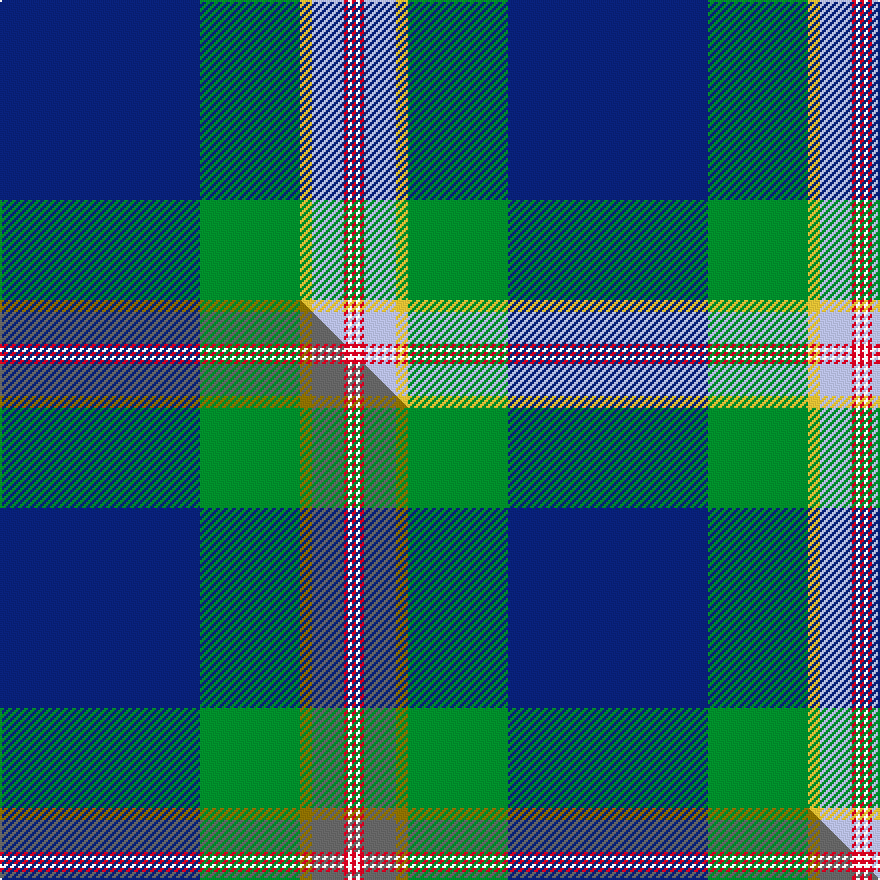

This page is one **sett** — a single exact thread-count. It belongs to the [tartan](/setts/db50g25ly3lb8r1w1r1/)
(the same proportion at any scale), whose colour order is pattern [BGYWRWR](/stripes/bgywrwr/).

Part of the [Wells](/tartans/wells/) tartan — the named design grouping this sett with its other cloths.

Sourced from tartans-authority.  It is a [7 stripe tartan](/stripes/stripes7/).

Original link http://www.tartansauthority.com/tartan-ferret/display/11106/

## Register references

External register numbers recorded for this tartan.

- Scottish Register of Tartans: [11106](https://www.tartanregister.gov.uk/tartanDetails?ref=11106)
- Scottish Tartans Authority (ITI): 11106

## Thread count
DB/100 G50 LY6 LB16 R2 W2 R/2

One full sett is **254 threads**.

## Palette
<table><thead><tr><th>Colour</th><th>Shade</th><th>OKLCh</th></tr></thead><tbody><tr><td>DB</td><td><code style="background-color:#082077;">#082077</code> <small style="color:#888">#082077</small></td><td><small style="color:#888">oklch(30.0% 0.149 265.1)</small></td></tr><tr><td>G</td><td><code style="background-color:#008B2A;">#008B2A</code> <small style="color:#888">#008B2A</small></td><td><small style="color:#888">oklch(55.4% 0.170 145.9)</small></td></tr><tr><td>LB</td><td><code style="background-color:#B5BBDE;">#B5BBDE</code> <small style="color:#888">#B5BBDE</small></td><td><small style="color:#888">oklch(79.9% 0.050 277.6)</small></td></tr><tr><td>R</td><td><code style="background-color:#D60020;">#D60020</code> <small style="color:#888">#D60020</small></td><td><small style="color:#888">oklch(55.2% 0.224 25.5)</small></td></tr><tr><td>W</td><td><code style="background-color:#F7F7F7;">#F7F7F7</code> <small style="color:#888">#F7F7F7</small></td><td><small style="color:#888">oklch(97.6% 0.000 89.9)</small></td></tr><tr><td>LY</td><td><code style="background-color:#DCBC32;">#DCBC32</code> <small style="color:#888">#DCBC32</small></td><td><small style="color:#888">oklch(80.0% 0.150 95.2)</small></td></tr></tbody></table>

# Sample pattern

## Compared to the master

This cloth is one sett of its design; the master sett (the exemplar the design is anchored on) is below for comparison.

Its **ΔTartan distance** from the master is **0.89** — the same measure the nearest-tartans table ranks by (0 is identical; a re-scale of the same cloth is near 0, a recolour or a different proportion further).

<figure class="master-compare" style="margin:0">

this sett
master sett ★

<figcaption style="color:#888;font-size:smaller">One weave of this sett against the <a href="/setts/db50g25y3n8r1w1r1/">master sett ★</a>, split on the diagonal: a shared proportion runs seamlessly across it with only the shades shifting; a different proportion breaks on it.</figcaption>
</figure>

## Nearest tartan variants

The nearest existing variants by ΔTartan distance, with this cloth at the top so the swatches line up against it.

ΔTartan

Threads

Variant

Sett

—

254

<a href="/variants/s7/db50g25ly3lb8r1w1r1~x2/">Wells (2014)</a>

<a href="/ttd/edit/#slug=db50g25y3n8r1w1r1~x2&amp;base=db50g25ly3lb8r1w1r1~x2" title="compare in the TTD">0.60</a>

254

<a href="/variants/s7/db50g25y3n8r1w1r1~x2/">Wells (2014)</a>

<a href="/ttd/edit/#slug=w2db45g9r1n9dr1~x2&amp;base=db50g25ly3lb8r1w1r1~x2" title="compare in the TTD">1.99</a>

262

<a href="/variants/s6/w2db45g9r1n9dr1~x2/">Wilton (Name)</a>

<a href="/ttd/edit/#slug=t23w3k10r2db45dy1~x2&amp;base=db50g25ly3lb8r1w1r1~x2" title="compare in the TTD">2.03</a>

288

<a href="/variants/s6/t23w3k10r2db45dy1~x2/">Kirkcaldy Name Tartan</a>

<a href="/ttd/edit/#slug=r2w1r5g5lo1g10db40y2~x2&amp;base=db50g25ly3lb8r1w1r1~x2" title="compare in the TTD">2.16</a>

256

<a href="/variants/s8/r2w1r5g5lo1g10db40y2~x2/">St. Andrew Quebec City (Corporate)</a>

2.35

—

<a href="/variants/s6/db52lo23y6dg5w1r1~x2~lo3006076-y2505139/">College of New Caledonia</a>

<a href="/ttd/edit/#slug=db47g14do5o2r3g7~x2&amp;base=db50g25ly3lb8r1w1r1~x2" title="compare in the TTD">2.50</a>

204

<a href="/variants/s6/db47g14do5o2r3g7~x2/">Round Table of Britain and Ireland, RtbI.</a>

<a href="/ttd/edit/#slug=dr4lb16k3db44dr1w3y2~x2&amp;base=db50g25ly3lb8r1w1r1~x2" title="compare in the TTD">2.56</a>

280

<a href="/variants/s7/dr4lb16k3db44dr1w3y2~x2/">Dress Blue</a>

<a href="/ttd/edit/#slug=r4lb16k3db44r1w3ly2~x2&amp;base=db50g25ly3lb8r1w1r1~x2" title="compare in the TTD">2.56</a>

280

<a href="/variants/s7/r4lb16k3db44r1w3ly2~x2/">Dress Blue (Fashion)</a>

<a href="/ttd/edit/#slug=db67w1ly6r5dg25db3k5~x2&amp;base=db50g25ly3lb8r1w1r1~x2" title="compare in the TTD">2.66</a>

304

<a href="/variants/s7/db67w1ly6r5dg25db3k5~x2/">Guide Dogs (Corporate)</a>

<a href="/ttd/edit/#slug=y21g26db62w2dg2w2&amp;base=db50g25ly3lb8r1w1r1~x2" title="compare in the TTD">2.73</a>

207

<a href="/variants/s6/y21g26db62w2dg2w2/">Nynashamn Whisky Society (Corporate)</a>

## Neighbour map

Every grey dot is one of 13620 variants placed by the first two principal components of the ΔTartan feature space (42% of its variance). Red is this tartan; blue dots are its nearest — click one to open its page.

<svg viewBox="0 0 640 380" role="img" style="max-width:100%;height:auto;border:1px solid #e0e0e0;border-radius:4px;display:block" xmlns="http://www.w3.org/2000/svg"><image href="/nn/cloud.v1.png" width="640" height="380"/><a href="/variants/s7/db50g25y3n8r1w1r1~x2/"><circle cx="363.0" cy="98.3" r="4" fill="#3465a4"><title>Wells (2014)</title></circle></a><a href="/variants/s6/w2db45g9r1n9dr1~x2/"><circle cx="430.1" cy="101.4" r="4" fill="#3465a4"><title>Wilton (Name)</title></circle></a><a href="/variants/s6/t23w3k10r2db45dy1~x2/"><circle cx="286.1" cy="94.3" r="4" fill="#3465a4"><title>Kirkcaldy Name Tartan</title></circle></a><a href="/variants/s8/r2w1r5g5lo1g10db40y2~x2/"><circle cx="360.8" cy="82.3" r="4" fill="#3465a4"><title>St. Andrew Quebec City (Corporate)</title></circle></a><a href="/variants/s6/db52lo23y6dg5w1r1~x2~lo3006076-y2505139/"><circle cx="342.2" cy="94.0" r="4" fill="#3465a4"><title>College of New Caledonia</title></circle></a><a href="/variants/s6/db47g14do5o2r3g7~x2/"><circle cx="375.1" cy="147.6" r="4" fill="#3465a4"><title>Round Table of Britain and Ireland, RtbI.</title></circle></a><a href="/variants/s7/dr4lb16k3db44dr1w3y2~x2/"><circle cx="318.9" cy="69.4" r="4" fill="#3465a4"><title>Dress Blue</title></circle></a><a href="/variants/s7/r4lb16k3db44r1w3ly2~x2/"><circle cx="313.6" cy="66.6" r="4" fill="#3465a4"><title>Dress Blue (Fashion)</title></circle></a><a href="/variants/s7/db67w1ly6r5dg25db3k5~x2/"><circle cx="380.8" cy="79.2" r="4" fill="#3465a4"><title>Guide Dogs (Corporate)</title></circle></a><a href="/variants/s6/y21g26db62w2dg2w2/"><circle cx="344.3" cy="155.9" r="4" fill="#3465a4"><title>Nynashamn Whisky Society (Corporate)</title></circle></a><circle cx="333.8" cy="88.9" r="5" fill="#c00000"/><text x="320" y="376" text-anchor="middle" font-size="11" fill="#999">ground</text><text x="11" y="190" text-anchor="middle" font-size="11" fill="#999" transform="rotate(-90 11 190)">complexity</text></svg>

ID: /variants/s7/db50g25ly3lb8r1w1r1~x2/
