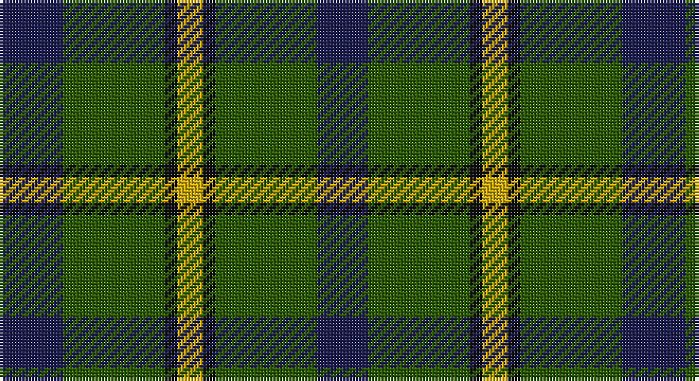

This page is one **sett** — a single exact thread-count. It belongs to the [tartan](/setts/db5dg8k1ly2k1dg8db4/)
(the same proportion at any scale), whose colour order is pattern [BGKYKGB](/stripes/bgkykgb/).

Part of the [Salvation Army Hunting](/tartans/salvation-army-hunting/) tartan — the named design grouping this sett with its other cloths.

Sourced from tartans-authority.  It is a [7 stripe tartan](/stripes/stripes7/).

Original link http://www.tartansauthority.com/tartan-ferret/display/150/

## Also known as

This cloth is also recorded under:

- Salvation Army Htg
- Salvation Army, Hunting

## Register references

External register numbers recorded for this tartan.

- Scottish Tartans Authority (ITI): 150

## Thread count
DB/20 G32 K4 Y8 K4 G32 DB/16

One full sett is **196 threads**.

## Palette

Palette: <strong>Tartan Register</strong> <small style="color:#888">(3 of 4 colours)</small>
<table><thead><tr><th>Colour</th><th>Threads</th><th>Shade</th><th>Base</th><th>OKLCh</th></tr></thead><tbody><tr><td>DB/</td><td style="text-align:right;font-variant-numeric:tabular-nums">20</td><td><code style="background-color:#1C1C50;">#1C1C50</code> <small style="color:#888">#1C1C50</small></td><td>B <code style="background-color:#2A418A;">#2A418A</code></td><td><small style="color:#888">oklch(26.2% 0.093 277.9)</small></td></tr><tr><td>G</td><td style="text-align:right;font-variant-numeric:tabular-nums">32</td><td><code style="background-color:#285800;">#285800</code> <small style="color:#888">#285800</small></td><td>G <code style="background-color:#006100;">#006100</code></td><td><small style="color:#888">oklch(41.0% 0.122 135.8)</small></td></tr><tr><td>K</td><td style="text-align:right;font-variant-numeric:tabular-nums">4</td><td><code style="background-color:#101010;">#101010</code> <small style="color:#888">#101010</small></td><td>K <code style="background-color:#000000;">#000000</code></td><td><small style="color:#888">oklch(17.3% 0.000 89.9)</small></td></tr><tr><td>Y</td><td style="text-align:right;font-variant-numeric:tabular-nums">8</td><td><code style="background-color:#CCA800;">#CCA800</code> <small style="color:#888">#CCA800</small></td><td>Y <code style="background-color:#F2BF00;">#F2BF00</code></td><td><small style="color:#888">oklch(74.2% 0.152 93.4)</small></td></tr><tr><td>K</td><td style="text-align:right;font-variant-numeric:tabular-nums">4</td><td><code style="background-color:#101010;">#101010</code> <small style="color:#888">#101010</small></td><td>K <code style="background-color:#000000;">#000000</code></td><td><small style="color:#888">oklch(17.3% 0.000 89.9)</small></td></tr><tr><td>G</td><td style="text-align:right;font-variant-numeric:tabular-nums">32</td><td><code style="background-color:#285800;">#285800</code> <small style="color:#888">#285800</small></td><td>G <code style="background-color:#006100;">#006100</code></td><td><small style="color:#888">oklch(41.0% 0.122 135.8)</small></td></tr><tr><td>DB/</td><td style="text-align:right;font-variant-numeric:tabular-nums">16</td><td><code style="background-color:#1C1C50;">#1C1C50</code> <small style="color:#888">#1C1C50</small></td><td>B <code style="background-color:#2A418A;">#2A418A</code></td><td><small style="color:#888">oklch(26.2% 0.093 277.9)</small></td></tr></tbody></table>

# Sample pattern

## Compared to the master

This cloth is one sett of its design; the master sett (the exemplar the design is anchored on) is below for comparison.

<figure style="margin:0"><figcaption style="color:#888;font-size:smaller">this sett</figcaption></figure>
<figure style="margin:0"><figcaption style="color:#888;font-size:smaller"><a href="/setts/dg8k1ly2k1dg8db4dg8k1ly2k1dg8db5/">master sett →</a></figcaption></figure>

## Nearest tartans

The nearest existing variants by ΔTartan distance, with this tartan at the top so the swatches line up against it.

ΔTartan

Tartan

Sett

—

<a href="/ttd/edit/#slug=db5dg8k1ly2k1dg8db4~x4">Salvation Army Htg (Corporate)</a> <a class="nn-out" href="/variants/s7/db5dg8k1ly2k1dg8db4~x4/" title="open its dictionary page">↗</a>

0.73

<a href="/ttd/edit/#slug=g3db8g3k4g15r2~x2&amp;base=db5dg8k1ly2k1dg8db4~x4">Lauder (Family)</a> <a class="nn-out" href="/variants/s6/g3db8g3k4g15r2~x2/" title="open its dictionary page">↗</a>

0.75

<a href="/ttd/edit/#slug=dg2n8dg2k3dg12r2~x2&amp;base=db5dg8k1ly2k1dg8db4~x4">Wcwm 1045</a> <a class="nn-out" href="/variants/s6/dg2n8dg2k3dg12r2~x2/" title="open its dictionary page">↗</a>

0.83

<a href="/ttd/edit/#slug=r3dg10r3dg14db16dg3ly2~x2&amp;base=db5dg8k1ly2k1dg8db4~x4">Cameron Hunting</a> <a class="nn-out" href="/variants/s7/r3dg10r3dg14db16dg3ly2~x2/" title="open its dictionary page">↗</a>

0.89

<a href="/ttd/edit/#slug=g14r2g2r3g7db12g2dr2~x2&amp;base=db5dg8k1ly2k1dg8db4~x4">Glen Nevis #3</a> <a class="nn-out" href="/variants/s8/g14r2g2r3g7db12g2dr2~x2/" title="open its dictionary page">↗</a>

0.94

<a href="/ttd/edit/#slug=r5g20r5g20db24g6ly4&amp;base=db5dg8k1ly2k1dg8db4~x4">Cameron of Lochiel (Hunting) Clan/Family Tartan</a> <a class="nn-out" href="/variants/s7/r5g20r5g20db24g6ly4/" title="open its dictionary page">↗</a>

0.95

<a href="/ttd/edit/#slug=dt6r15g41r15dt20g41db6&amp;base=db5dg8k1ly2k1dg8db4~x4">Bean of Freeport Htg (Corporate)</a> <a class="nn-out" href="/variants/s7/dt6r15g41r15dt20g41db6/" title="open its dictionary page">↗</a>

0.95

<a href="/ttd/edit/#slug=ly2dg12db6r3dg12r4db1~x2&amp;base=db5dg8k1ly2k1dg8db4~x4">MacKintosh Hunting</a> <a class="nn-out" href="/variants/s7/ly2dg12db6r3dg12r4db1~x2/" title="open its dictionary page">↗</a>

0.96

<a href="/ttd/edit/#slug=r3k9g20k16g7b3~x2&amp;base=db5dg8k1ly2k1dg8db4~x4">Holman (Personal)</a> <a class="nn-out" href="/variants/s6/r3k9g20k16g7b3~x2/" title="open its dictionary page">↗</a>

1.01

<a href="/ttd/edit/#slug=g5k15g5k15g19r2g13lb4~x2&amp;base=db5dg8k1ly2k1dg8db4~x4">Strath Hallidale (Fashion)</a> <a class="nn-out" href="/variants/s8/g5k15g5k15g19r2g13lb4~x2/" title="open its dictionary page">↗</a>

1.10

<a href="/ttd/edit/#slug=g3db1g8db7k3ly1~x2&amp;base=db5dg8k1ly2k1dg8db4~x4">Trafalgar (Fashion)</a> <a class="nn-out" href="/variants/s6/g3db1g8db7k3ly1~x2/" title="open its dictionary page">↗</a>

## Neighbour map

Every grey dot is one of 14360 variants placed by the first two principal components of the ΔTartan feature space (44% of its variance). Red is this tartan; blue dots are its nearest — click one to open its page.

<svg viewBox="0 0 640 380" role="img" style="max-width:100%;height:auto;border:1px solid #e0e0e0;border-radius:4px;display:block" xmlns="http://www.w3.org/2000/svg"><image href="/nn/cloud.v1.png" width="640" height="380"/><a href="/variants/s6/g3db8g3k4g15r2~x2/"><circle cx="328.7" cy="254.2" r="4" fill="#3465a4"><title>Lauder (Family)</title></circle></a><a href="/variants/s6/dg2n8dg2k3dg12r2~x2/"><circle cx="294.2" cy="260.3" r="4" fill="#3465a4"><title>Wcwm 1045</title></circle></a><a href="/variants/s7/r3dg10r3dg14db16dg3ly2~x2/"><circle cx="285.2" cy="242.4" r="4" fill="#3465a4"><title>Cameron Hunting</title></circle></a><a href="/variants/s8/g14r2g2r3g7db12g2dr2~x2/"><circle cx="322.2" cy="242.1" r="4" fill="#3465a4"><title>Glen Nevis #3</title></circle></a><a href="/variants/s7/r5g20r5g20db24g6ly4/"><circle cx="263.7" cy="248.8" r="4" fill="#3465a4"><title>Cameron of Lochiel (Hunting) Clan/Family Tartan</title></circle></a><a href="/variants/s7/dt6r15g41r15dt20g41db6/"><circle cx="304.7" cy="259.1" r="4" fill="#3465a4"><title>Bean of Freeport Htg (Corporate)</title></circle></a><a href="/variants/s7/ly2dg12db6r3dg12r4db1~x2/"><circle cx="334.0" cy="227.1" r="4" fill="#3465a4"><title>MacKintosh Hunting</title></circle></a><a href="/variants/s6/r3k9g20k16g7b3~x2/"><circle cx="252.1" cy="264.1" r="4" fill="#3465a4"><title>Holman (Personal)</title></circle></a><a href="/variants/s8/g5k15g5k15g19r2g13lb4~x2/"><circle cx="279.2" cy="239.1" r="4" fill="#3465a4"><title>Strath Hallidale (Fashion)</title></circle></a><a href="/variants/s6/g3db1g8db7k3ly1~x2/"><circle cx="248.7" cy="248.4" r="4" fill="#3465a4"><title>Trafalgar (Fashion)</title></circle></a><circle cx="295.3" cy="252.9" r="5" fill="#c00000"/></svg>

ID: /variants/s7/db5dg8k1ly2k1dg8db4~x4/
