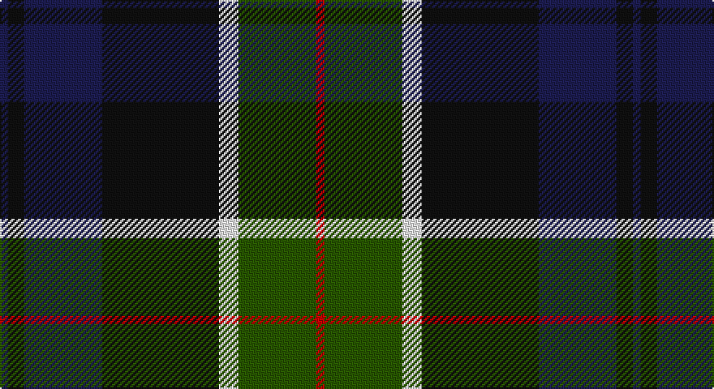

This page is one **sett** — a single exact thread-count. It belongs to the [tartan](/setts/db5k10db48k72w12dg48r5/)
(the same proportion at any scale), whose colour order is pattern [BKBKWGR](/stripes/bkbkwgr/).

Part of the [Colquhoun](/tartans/colquhoun/) tartan — the named design grouping this sett with its other cloths.

Sourced from tartans-authority.  It is a [7 stripe tartan](/stripes/stripes7/).

Original link http://www.tartansauthority.com/tartan-ferret/display/274/

## Also known as

This cloth is also recorded under:

- Colquhoun #2
- Colquhoun #3

## Register references

External register numbers recorded for this tartan.

- Scottish Tartans Authority (ITI): 274

## Thread count
DB/5 K10 DB48 K72 W12 G48 R/5

One full sett is **390 threads**.

## Palette

Palette: <strong>Tartan Register</strong>
<table><thead><tr><th>Colour</th><th>Threads</th><th>Shade</th><th>Base</th><th>OKLCh</th></tr></thead><tbody><tr><td>DB/</td><td style="text-align:right;font-variant-numeric:tabular-nums">5</td><td><code style="background-color:#1C1C50;">#1C1C50</code> <small style="color:#888">#1C1C50</small></td><td>B <code style="background-color:#2A418A;">#2A418A</code></td><td><small style="color:#888">oklch(26.2% 0.093 277.9)</small></td></tr><tr><td>K</td><td style="text-align:right;font-variant-numeric:tabular-nums">10</td><td><code style="background-color:#101010;">#101010</code> <small style="color:#888">#101010</small></td><td>K <code style="background-color:#000000;">#000000</code></td><td><small style="color:#888">oklch(17.3% 0.000 89.9)</small></td></tr><tr><td>DB</td><td style="text-align:right;font-variant-numeric:tabular-nums">48</td><td><code style="background-color:#1C1C50;">#1C1C50</code> <small style="color:#888">#1C1C50</small></td><td>B <code style="background-color:#2A418A;">#2A418A</code></td><td><small style="color:#888">oklch(26.2% 0.093 277.9)</small></td></tr><tr><td>K</td><td style="text-align:right;font-variant-numeric:tabular-nums">72</td><td><code style="background-color:#101010;">#101010</code> <small style="color:#888">#101010</small></td><td>K <code style="background-color:#000000;">#000000</code></td><td><small style="color:#888">oklch(17.3% 0.000 89.9)</small></td></tr><tr><td>W</td><td style="text-align:right;font-variant-numeric:tabular-nums">12</td><td><code style="background-color:#FCFCFC;">#FCFCFC</code> <small style="color:#888">#FCFCFC</small></td><td>W <code style="background-color:#F7F7F7;">#F7F7F7</code></td><td><small style="color:#888">oklch(99.1% 0.000 89.9)</small></td></tr><tr><td>G</td><td style="text-align:right;font-variant-numeric:tabular-nums">48</td><td><code style="background-color:#285800;">#285800</code> <small style="color:#888">#285800</small></td><td>G <code style="background-color:#006100;">#006100</code></td><td><small style="color:#888">oklch(41.0% 0.122 135.8)</small></td></tr><tr><td>R/</td><td style="text-align:right;font-variant-numeric:tabular-nums">5</td><td><code style="background-color:#C80000;">#C80000</code> <small style="color:#888">#C80000</small></td><td>R <code style="background-color:#CC0000;">#CC0000</code></td><td><small style="color:#888">oklch(52.3% 0.215 29.2)</small></td></tr></tbody></table>

# Sample pattern

## Compared to the master

This cloth is one sett of its design; the master sett (the exemplar the design is anchored on) is below for comparison.

<figure style="margin:0"><figcaption style="color:#888;font-size:smaller">this sett</figcaption></figure>
<figure style="margin:0"><figcaption style="color:#888;font-size:smaller"><a href="/setts/db4k2db16w1k8dg24r4/">master sett →</a></figcaption></figure>

## Nearest tartans

The nearest existing variants by ΔTartan distance, with this tartan at the top so the swatches line up against it.

ΔTartan

Tartan

Sett

—

<a href="/ttd/edit/#slug=db5k10db48k72w12dg48r5">Colquhoun (Clan)</a> <a class="nn-out" href="/variants/s7/db5k10db48k72w12dg48r5/" title="open its dictionary page">↗</a>

0.69

<a href="/ttd/edit/#slug=db18k10g6r4g6k1w2~x2&amp;base=db5k10db48k72w12dg48r5">Ferguson - 1830 of Atholl (Clan)</a> <a class="nn-out" href="/variants/s7/db18k10g6r4g6k1w2~x2/" title="open its dictionary page">↗</a>

0.72

<a href="/ttd/edit/#slug=r2k9g12db8r1db1w1~x4&amp;base=db5k10db48k72w12dg48r5">Genet, Citizen (Commem)</a> <a class="nn-out" href="/variants/s7/r2k9g12db8r1db1w1~x4/" title="open its dictionary page">↗</a>

0.73

<a href="/ttd/edit/#slug=r12db68w7k39g75r6g6&amp;base=db5k10db48k72w12dg48r5">Rhun (Fashion)</a> <a class="nn-out" href="/variants/s7/r12db68w7k39g75r6g6/" title="open its dictionary page">↗</a>

0.80

<a href="/ttd/edit/#slug=ly3k12db1g5db12r1k2r1~x4&amp;base=db5k10db48k72w12dg48r5">Sandberg of Greenock (Personal)</a> <a class="nn-out" href="/variants/s8/ly3k12db1g5db12r1k2r1~x4/" title="open its dictionary page">↗</a>

0.81

<a href="/ttd/edit/#slug=g3db12w1k12g13r2g2~x2&amp;base=db5k10db48k72w12dg48r5">Paterson (Personal)</a> <a class="nn-out" href="/variants/s7/g3db12w1k12g13r2g2~x2/" title="open its dictionary page">↗</a>

0.88

<a href="/ttd/edit/#slug=g14k2g4r2g4k14dp15k1w3~x2&amp;base=db5k10db48k72w12dg48r5">MacRae Hunting #2</a> <a class="nn-out" href="/variants/s9/g14k2g4r2g4k14dp15k1w3~x2/" title="open its dictionary page">↗</a>

0.91

<a href="/ttd/edit/#slug=r5k2db19g4k19g28k2ly5~x2&amp;base=db5k10db48k72w12dg48r5">Tait #1</a> <a class="nn-out" href="/variants/s8/r5k2db19g4k19g28k2ly5~x2/" title="open its dictionary page">↗</a>

0.92

<a href="/ttd/edit/#slug=r1k1g7k5db10k1ly1~x2&amp;base=db5k10db48k72w12dg48r5">MacLeod Small Clan Tartan</a> <a class="nn-out" href="/variants/s7/r1k1g7k5db10k1ly1~x2/" title="open its dictionary page">↗</a>

0.94

<a href="/ttd/edit/#slug=g12k1g2r1g2k10db10lo1~x4&amp;base=db5k10db48k72w12dg48r5">Guelph, City Of</a> <a class="nn-out" href="/variants/s8/g12k1g2r1g2k10db10lo1~x4/" title="open its dictionary page">↗</a>

0.94

<a href="/ttd/edit/#slug=r2db16r1k10g12o2~x2&amp;base=db5k10db48k72w12dg48r5">MacWilliam</a> <a class="nn-out" href="/variants/s6/r2db16r1k10g12o2~x2/" title="open its dictionary page">↗</a>

## Neighbour map

Every grey dot is one of 14360 variants placed by the first two principal components of the ΔTartan feature space (44% of its variance). Red is this tartan; blue dots are its nearest — click one to open its page.

<svg viewBox="0 0 640 380" role="img" style="max-width:100%;height:auto;border:1px solid #e0e0e0;border-radius:4px;display:block" xmlns="http://www.w3.org/2000/svg"><image href="/nn/cloud.v1.png" width="640" height="380"/><a href="/variants/s7/db18k10g6r4g6k1w2~x2/"><circle cx="189.4" cy="176.6" r="4" fill="#3465a4"><title>Ferguson - 1830 of Atholl (Clan)</title></circle></a><a href="/variants/s7/r2k9g12db8r1db1w1~x4/"><circle cx="170.8" cy="184.1" r="4" fill="#3465a4"><title>Genet, Citizen (Commem)</title></circle></a><a href="/variants/s7/r12db68w7k39g75r6g6/"><circle cx="196.7" cy="184.1" r="4" fill="#3465a4"><title>Rhun (Fashion)</title></circle></a><a href="/variants/s8/ly3k12db1g5db12r1k2r1~x4/"><circle cx="188.0" cy="170.7" r="4" fill="#3465a4"><title>Sandberg of Greenock (Personal)</title></circle></a><a href="/variants/s7/g3db12w1k12g13r2g2~x2/"><circle cx="200.7" cy="195.4" r="4" fill="#3465a4"><title>Paterson (Personal)</title></circle></a><a href="/variants/s9/g14k2g4r2g4k14dp15k1w3~x2/"><circle cx="183.5" cy="166.4" r="4" fill="#3465a4"><title>MacRae Hunting #2</title></circle></a><a href="/variants/s8/r5k2db19g4k19g28k2ly5~x2/"><circle cx="184.2" cy="172.9" r="4" fill="#3465a4"><title>Tait #1</title></circle></a><a href="/variants/s7/r1k1g7k5db10k1ly1~x2/"><circle cx="196.2" cy="195.4" r="4" fill="#3465a4"><title>MacLeod Small Clan Tartan</title></circle></a><a href="/variants/s8/g12k1g2r1g2k10db10lo1~x4/"><circle cx="220.0" cy="188.6" r="4" fill="#3465a4"><title>Guelph, City Of</title></circle></a><a href="/variants/s6/r2db16r1k10g12o2~x2/"><circle cx="170.2" cy="180.4" r="4" fill="#3465a4"><title>MacWilliam</title></circle></a><circle cx="207.4" cy="182.7" r="5" fill="#c00000"/></svg>

ID: /variants/s7/db5k10db48k72w12dg48r5/
