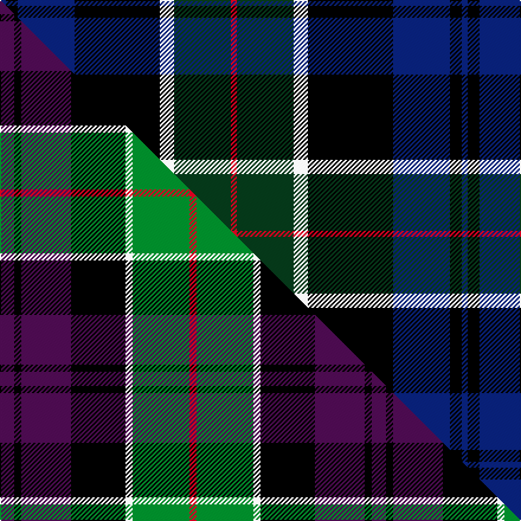

This is one **variant** — a specific cloth: this exact thread count and colourway, with its own
provenance below. It is one weaving of the [sett](/setts/db5k10db48k72w12dg48r5/) (the scale-free proportion — the
same cloth at any scale or shade), whose colour order is pattern [BKBKWGR](/stripes/bkbkwgr/).

Part of the [Colquhoun](/tartans/colquhoun/) tartan — the named design grouping this sett with its other cloths.

Sourced from tartans-authority.  It is a [7 stripe tartan](/stripes/stripes7/).

Original link [https://www.tartanregister.gov.uk/tartanDetails.aspx?ref=274](https://www.tartanregister.gov.uk/tartanDetails.aspx?ref=274)

Dataset <small>— provenance for this record, inherited from the source manifest</small>

<dl class="dataset-prov">
<dt>source</dt><dd><a href="/sources/tartans-authority/">Scottish Tartans Authority</a></dd>
<dt>data captured from</dt><dd><a href="https://github.com/thetartan/tartan-database/blob/master/data/tartans-authority/data.csv">https://github.com/thetartan/tartan-database/blob/master/data/tartans-authority/data.csv</a></dd>
<dt>data date</dt><dd>1810 <small>(this record)</small></dd>
<dt>licence</dt><dd><a href="https://creativecommons.org/licenses/by-nc-nd/4.0/">CC BY-NC-ND 4.0</a></dd>
</dl>

Capture chain <small>— the hands this data passed through, oldest first; each capture carries its own licence</small>

<ol class="capture-chain">
<li><a href="https://www.tartansauthority.com/">Scottish Tartans Authority</a> <small>the heritage body's archive — its tartan-ferret record browser is retired (links repaired to the SRT, above)</small></li>
<li><a href="https://github.com/thetartan/tartan-database">thetartan/tartan-database</a> <small>2016-2017</small> · <a href="https://creativecommons.org/licenses/by-nc-nd/4.0/">CC BY-NC-ND 4.0</a> <small>Levko Kravets's frozen compilation — the capture we vendored, and where its CC licence text came from</small></li>
<li>this dictionary <small>captured 2026-06-10 · commit 5bf86c7566</small> <small>each re-capture is a git commit to data/sources</small></li>
</ol>

## Register references

External register numbers recorded for this tartan.

- Scottish Tartans Authority (ITI): 274

## Thread count
DB/5 K10 DB48 K72 W12 DG48 R/5

One full sett is **390 threads**.

## Palette
<table><thead><tr><th>Colour</th><th>Shade</th><th>OKLCh</th></tr></thead><tbody><tr><td>DB</td><td><code style="background-color:#082077;">#082077</code> <small style="color:#888">#082077</small></td><td><small style="color:#888">oklch(30.0% 0.149 265.1)</small></td></tr><tr><td>DG</td><td><code style="background-color:#053819;">#053819</code> <small style="color:#888">#053819</small></td><td><small style="color:#888">oklch(30.0% 0.075 151.3)</small></td></tr><tr><td>K</td><td><code style="background-color:#000000;">#000000</code> <small style="color:#888">#000000</small></td><td><small style="color:#888">oklch(0.0% 0.000 0.0)</small></td></tr><tr><td>R</td><td><code style="background-color:#D60020;">#D60020</code> <small style="color:#888">#D60020</small></td><td><small style="color:#888">oklch(55.2% 0.224 25.5)</small></td></tr><tr><td>W</td><td><code style="background-color:#F7F7F7;">#F7F7F7</code> <small style="color:#888">#F7F7F7</small></td><td><small style="color:#888">oklch(97.6% 0.000 89.9)</small></td></tr></tbody></table>

# Sample pattern

## Compared to the master

This cloth is one sett of its design; the master sett (the exemplar the design is anchored on) is below for comparison.

Its **ΔTartan distance** from the master is **3.00** — the same measure the nearest-tartans table ranks by (0 is identical; a re-scale of the same cloth is near 0, a recolour or a different proportion further).

<figure class="master-compare" style="margin:0">

this sett
master sett ★

<figcaption style="color:#888;font-size:smaller">One weave of this sett against the <a href="/setts/dp6k3dp21k23w3g24r3/">master sett ★</a>, split on the diagonal: a shared proportion runs seamlessly across it with only the shades shifting; a different proportion breaks on it.</figcaption>
</figure>

## Nearest tartan variants

The nearest existing variants by ΔTartan distance, with this cloth at the top so the swatches line up against it.

ΔTartan

Threads

Variant

Sett

—

390

<a href="/variants/s7/db5k10db48k72w12dg48r5/">Colquhoun (Clan)</a>

<a href="/ttd/edit/#slug=r5dg19w3k19db19k3db2~x2&amp;base=db5k10db48k72w12dg48r5" title="compare in the TTD">0.45</a>

266

<a href="/variants/s7/r5dg19w3k19db19k3db2~x2/">Fruin Colquhoun (Commemorative?)</a>

<a href="/ttd/edit/#slug=db20k6dy4db3k16g20w2~x2&amp;base=db5k10db48k72w12dg48r5" title="compare in the TTD">1.68</a>

240

<a href="/variants/s7/db20k6dy4db3k16g20w2~x2/">Deloughery, Paul</a>

<a href="/ttd/edit/#slug=y8k4n39k37db36k6db7&amp;base=db5k10db48k72w12dg48r5" title="compare in the TTD">1.90</a>

259

<a href="/variants/s7/y8k4n39k37db36k6db7/">Oceanic (Corporate?)</a>

<a href="/ttd/edit/#slug=y3k12db1g5db12r1k2r1~x4&amp;base=db5k10db48k72w12dg48r5" title="compare in the TTD">1.94</a>

280

<a href="/variants/s8/y3k12db1g5db12r1k2r1~x4/">Sandberg of Greenock (Personal)</a>

<a href="/ttd/edit/#slug=k2r1g15k15db15y1k2~x2&amp;base=db5k10db48k72w12dg48r5" title="compare in the TTD">2.02</a>

196

<a href="/variants/s7/k2r1g15k15db15y1k2~x2/">MacCaskill Family Tartan</a>

<a href="/ttd/edit/#slug=b8k11w3k11dg22dr2~x2&amp;base=db5k10db48k72w12dg48r5" title="compare in the TTD">2.06</a>

208

<a href="/variants/s6/b8k11w3k11dg22dr2~x2/">Loch Katrine</a>

<a href="/ttd/edit/#slug=dr4k2db24k20g20lo3~x2&amp;base=db5k10db48k72w12dg48r5" title="compare in the TTD">2.14</a>

278

<a href="/variants/s6/dr4k2db24k20g20lo3~x2/">Loudoun's Highlanders</a>

<a href="/ttd/edit/#slug=dr4k2db24k20dg20lo3~x2&amp;base=db5k10db48k72w12dg48r5" title="compare in the TTD">2.14</a>

278

<a href="/variants/s6/dr4k2db24k20dg20lo3~x2/">Loudoun's Highlanders - 1747 #1 (Mil</a>

<a href="/ttd/edit/#slug=ly4k28r2db22t8dy3~x2&amp;base=db5k10db48k72w12dg48r5" title="compare in the TTD">2.18</a>

254

<a href="/variants/s6/ly4k28r2db22t8dy3~x2/">Loch Long One Design (Corporate)</a>

<a href="/ttd/edit/#slug=dg14k2dg4r2dg4k14dp15k1w3~x2&amp;base=db5k10db48k72w12dg48r5" title="compare in the TTD">2.20</a>

202

<a href="/variants/s9/dg14k2dg4r2dg4k14dp15k1w3~x2/">MacRae Hunting #2</a>

## Neighbour map

Every grey dot is one of 13621 variants placed by the first two principal components of the ΔTartan feature space (42% of its variance). Red is this tartan; blue dots are its nearest — click one to open its page.

<svg viewBox="0 0 640 380" role="img" style="max-width:100%;height:auto;border:1px solid #e0e0e0;border-radius:4px;display:block" xmlns="http://www.w3.org/2000/svg"><image href="/nn/cloud.v1.png" width="640" height="380"/><a href="/variants/s7/r5dg19w3k19db19k3db2~x2/"><circle cx="126.6" cy="188.7" r="4" fill="#3465a4"><title>Fruin Colquhoun (Commemorative?)</title></circle></a><a href="/variants/s7/db20k6dy4db3k16g20w2~x2/"><circle cx="116.1" cy="188.2" r="4" fill="#3465a4"><title>Deloughery, Paul</title></circle></a><a href="/variants/s7/y8k4n39k37db36k6db7/"><circle cx="171.0" cy="201.4" r="4" fill="#3465a4"><title>Oceanic (Corporate?)</title></circle></a><a href="/variants/s8/y3k12db1g5db12r1k2r1~x4/"><circle cx="157.2" cy="152.8" r="4" fill="#3465a4"><title>Sandberg of Greenock (Personal)</title></circle></a><a href="/variants/s7/k2r1g15k15db15y1k2~x2/"><circle cx="158.4" cy="151.9" r="4" fill="#3465a4"><title>MacCaskill Family Tartan</title></circle></a><a href="/variants/s6/b8k11w3k11dg22dr2~x2/"><circle cx="153.8" cy="192.9" r="4" fill="#3465a4"><title>Loch Katrine</title></circle></a><a href="/variants/s6/dr4k2db24k20g20lo3~x2/"><circle cx="129.2" cy="186.0" r="4" fill="#3465a4"><title>Loudoun's Highlanders</title></circle></a><a href="/variants/s6/dr4k2db24k20dg20lo3~x2/"><circle cx="171.3" cy="197.4" r="4" fill="#3465a4"><title>Loudoun's Highlanders - 1747 #1 (Mil</title></circle></a><a href="/variants/s6/ly4k28r2db22t8dy3~x2/"><circle cx="160.6" cy="147.0" r="4" fill="#3465a4"><title>Loch Long One Design (Corporate)</title></circle></a><a href="/variants/s9/dg14k2dg4r2dg4k14dp15k1w3~x2/"><circle cx="166.9" cy="152.9" r="4" fill="#3465a4"><title>MacRae Hunting #2</title></circle></a><circle cx="177.6" cy="161.3" r="5" fill="#c00000"/><text x="320" y="376" text-anchor="middle" font-size="11" fill="#999">ground</text><text x="11" y="190" text-anchor="middle" font-size="11" fill="#999" transform="rotate(-90 11 190)">complexity</text></svg>

ID: /variants/s7/db5k10db48k72w12dg48r5/
