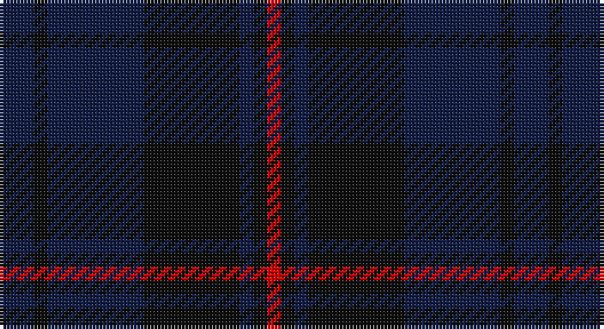

This page is one **sett** — a single exact thread-count. It belongs to the [tartan](/setts/db5k2db14k14db2k2r2/)
(the same proportion at any scale), whose colour order is pattern [BKBKBKR](/stripes/bkbkbkr/).

Part of the [Royal Scotsman Train](/tartans/royal-scotsman-train/) tartan — the named design grouping this sett with its other cloths.

Sourced from register-of-tartans.  It is a [7 stripe tartan](/stripes/stripes7/).

Original link https://www.tartanregister.gov.uk/tartanDetails.aspx?ref=5993

## Register references

External register numbers recorded for this tartan.

- Scottish Register of Tartans: [5993](https://www.tartanregister.gov.uk/tartanDetails.aspx?ref=5993)
- Scottish Tartans World Register: 3284

## Thread count
DB/10 K4 DB28 K28 DB4 K4 R/4

One full sett is **150 threads**.

## Palette

Palette: <strong>Tartan Register</strong> <small style="color:#888">(4 of 5 colours)</small>
<table><thead><tr><th>Colour</th><th>Threads</th><th>Shade</th><th>Base</th><th>OKLCh</th></tr></thead><tbody><tr><td>DB/</td><td style="text-align:right;font-variant-numeric:tabular-nums">10</td><td><code style="background-color:#141E46;">#141E46</code> <small style="color:#888">#141E46</small></td><td>B <code style="background-color:#2A418A;">#2A418A</code></td><td><small style="color:#888">oklch(25.2% 0.076 269.7)</small></td></tr><tr><td>K</td><td style="text-align:right;font-variant-numeric:tabular-nums">4</td><td><code style="background-color:#101010;">#101010</code> <small style="color:#888">#101010</small></td><td>K <code style="background-color:#000000;">#000000</code></td><td><small style="color:#888">oklch(17.3% 0.000 89.9)</small></td></tr><tr><td>DB</td><td style="text-align:right;font-variant-numeric:tabular-nums">28</td><td><code style="background-color:#141E46;">#141E46</code> <small style="color:#888">#141E46</small></td><td>B <code style="background-color:#2A418A;">#2A418A</code></td><td><small style="color:#888">oklch(25.2% 0.076 269.7)</small></td></tr><tr><td>K</td><td style="text-align:right;font-variant-numeric:tabular-nums">28</td><td><code style="background-color:#101010;">#101010</code> <small style="color:#888">#101010</small></td><td>K <code style="background-color:#000000;">#000000</code></td><td><small style="color:#888">oklch(17.3% 0.000 89.9)</small></td></tr><tr><td>DB</td><td style="text-align:right;font-variant-numeric:tabular-nums">4</td><td><code style="background-color:#141E46;">#141E46</code> <small style="color:#888">#141E46</small></td><td>B <code style="background-color:#2A418A;">#2A418A</code></td><td><small style="color:#888">oklch(25.2% 0.076 269.7)</small></td></tr><tr><td>K</td><td style="text-align:right;font-variant-numeric:tabular-nums">4</td><td><code style="background-color:#101010;">#101010</code> <small style="color:#888">#101010</small></td><td>K <code style="background-color:#000000;">#000000</code></td><td><small style="color:#888">oklch(17.3% 0.000 89.9)</small></td></tr><tr><td>R/</td><td style="text-align:right;font-variant-numeric:tabular-nums">4</td><td><code style="background-color:#DC0000;">#DC0000</code> <small style="color:#888">#DC0000</small></td><td>R <code style="background-color:#CC0000;">#CC0000</code></td><td><small style="color:#888">oklch(56.2% 0.230 29.2)</small></td></tr></tbody></table>

# Sample pattern

## Nearest tartans

The nearest existing variants by ΔTartan distance, with this tartan at the top so the swatches line up against it.

ΔTartan

Tartan

Sett

—

<a href="/ttd/edit/#slug=db5k2db14k14db2k2r2~x2">Royal Scotsman Train</a> <a class="nn-out" href="/variants/s7/db5k2db14k14db2k2r2~x2/" title="open its dictionary page">↗</a>

1.82

<a href="/ttd/edit/#slug=dt5db4dr1db14dt14dr1dt5lo3~x2&amp;base=db5k2db14k14db2k2r2~x2">Edinburgh Monarchs</a> <a class="nn-out" href="/variants/s8/dt5db4dr1db14dt14dr1dt5lo3~x2/" title="open its dictionary page">↗</a>

1.87

<a href="/ttd/edit/#slug=dg7db1dg1k4dp4k1~x4&amp;base=db5k2db14k14db2k2r2~x2">MacArthur of Milton Hunting</a> <a class="nn-out" href="/variants/s6/dg7db1dg1k4dp4k1~x4/" title="open its dictionary page">↗</a>

1.95

<a href="/ttd/edit/#slug=db3r1db14dg14r1dg1r1dg1r2~x4&amp;base=db5k2db14k14db2k2r2~x2">Breckon Hunting (Name)</a> <a class="nn-out" href="/variants/s9/db3r1db14dg14r1dg1r1dg1r2~x4/" title="open its dictionary page">↗</a>

1.95

<a href="/ttd/edit/#slug=dg4db3dg20db9r2db2r2db18dp4~x2&amp;base=db5k2db14k14db2k2r2~x2">New Club Centenary</a> <a class="nn-out" href="/variants/s9/dg4db3dg20db9r2db2r2db18dp4~x2/" title="open its dictionary page">↗</a>

1.98

<a href="/ttd/edit/#slug=k3dt15k9do3k2do14k2do3k9dt13k2dt3~x2&amp;base=db5k2db14k14db2k2r2~x2">McWilliams (2014)</a> <a class="nn-out" href="/variants/s12/k3dt15k9do3k2do14k2do3k9dt13k2dt3~x2/" title="open its dictionary page">↗</a>

1.99

<a href="/ttd/edit/#slug=db5k2db2k2db2dt5k2dt1o1dt1k10db3~x4&amp;base=db5k2db14k14db2k2r2~x2">Hopkins Welsh Name Tartan</a> <a class="nn-out" href="/variants/s12/db5k2db2k2db2dt5k2dt1o1dt1k10db3~x4/" title="open its dictionary page">↗</a>

2.06

<a href="/ttd/edit/#slug=dt5k2dt2k2dt2db5k2db1o1db1k10dt3~x4&amp;base=db5k2db14k14db2k2r2~x2">Hopkins (Wales)</a> <a class="nn-out" href="/variants/s12/dt5k2dt2k2dt2db5k2db1o1db1k10dt3~x4/" title="open its dictionary page">↗</a>

2.09

<a href="/ttd/edit/#slug=dy5dbi12db4lo4db22dbi3db4dy5&amp;base=db5k2db14k14db2k2r2~x2">Daks Muted blue Trade Tartan</a> <a class="nn-out" href="/variants/s8/dy5dbi12db4lo4db22dbi3db4dy5/" title="open its dictionary page">↗</a>

2.17

<a href="/ttd/edit/#slug=k7r2k33db33k2db7~x2&amp;base=db5k2db14k14db2k2r2~x2">Casterton (Corporate)</a> <a class="nn-out" href="/variants/s6/k7r2k33db33k2db7~x2/" title="open its dictionary page">↗</a>

2.19

<a href="/ttd/edit/#slug=dt4dg2dr16dr10dg10dt32n3~x2&amp;base=db5k2db14k14db2k2r2~x2">Dempster Family Tartan</a> <a class="nn-out" href="/variants/s7/dt4dg2dr16dr10dg10dt32n3~x2/" title="open its dictionary page">↗</a>

## Neighbour map

Every grey dot is one of 14360 variants placed by the first two principal components of the ΔTartan feature space (44% of its variance). Red is this tartan; blue dots are its nearest — click one to open its page.

<svg viewBox="0 0 640 380" role="img" style="max-width:100%;height:auto;border:1px solid #e0e0e0;border-radius:4px;display:block" xmlns="http://www.w3.org/2000/svg"><image href="/nn/cloud.v1.png" width="640" height="380"/><a href="/variants/s8/dt5db4dr1db14dt14dr1dt5lo3~x2/"><circle cx="387.1" cy="254.5" r="4" fill="#3465a4"><title>Edinburgh Monarchs</title></circle></a><a href="/variants/s6/dg7db1dg1k4dp4k1~x4/"><circle cx="345.8" cy="314.7" r="4" fill="#3465a4"><title>MacArthur of Milton Hunting</title></circle></a><a href="/variants/s9/db3r1db14dg14r1dg1r1dg1r2~x4/"><circle cx="419.9" cy="240.9" r="4" fill="#3465a4"><title>Breckon Hunting (Name)</title></circle></a><a href="/variants/s9/dg4db3dg20db9r2db2r2db18dp4~x2/"><circle cx="377.1" cy="250.3" r="4" fill="#3465a4"><title>New Club Centenary</title></circle></a><a href="/variants/s12/k3dt15k9do3k2do14k2do3k9dt13k2dt3~x2/"><circle cx="333.9" cy="292.3" r="4" fill="#3465a4"><title>McWilliams (2014)</title></circle></a><a href="/variants/s12/db5k2db2k2db2dt5k2dt1o1dt1k10db3~x4/"><circle cx="339.0" cy="258.1" r="4" fill="#3465a4"><title>Hopkins Welsh Name Tartan</title></circle></a><a href="/variants/s12/dt5k2dt2k2dt2db5k2db1o1db1k10dt3~x4/"><circle cx="332.0" cy="254.8" r="4" fill="#3465a4"><title>Hopkins (Wales)</title></circle></a><a href="/variants/s8/dy5dbi12db4lo4db22dbi3db4dy5/"><circle cx="335.6" cy="267.3" r="4" fill="#3465a4"><title>Daks Muted blue Trade Tartan</title></circle></a><a href="/variants/s6/k7r2k33db33k2db7~x2/"><circle cx="452.2" cy="267.2" r="4" fill="#3465a4"><title>Casterton (Corporate)</title></circle></a><a href="/variants/s7/dt4dg2dr16dr10dg10dt32n3~x2/"><circle cx="384.1" cy="251.5" r="4" fill="#3465a4"><title>Dempster Family Tartan</title></circle></a><circle cx="431.6" cy="310.4" r="5" fill="#c00000"/></svg>

ID: /variants/s7/db5k2db14k14db2k2r2~x2/
