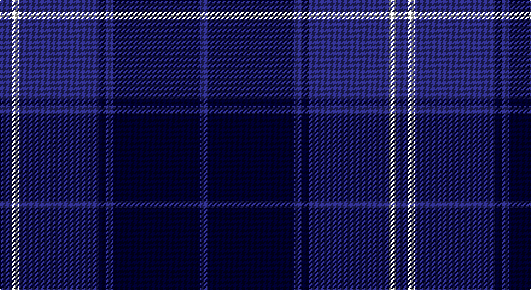

This page is one **sett** — a single exact thread-count. It belongs to the [tartan](/setts/db5w3db33k3db3k36db3/)
(the same proportion at any scale), whose colour order is pattern [BKBKBWB](/stripes/bkbkbwb/).

Sourced from register-of-tartans.  It is a [7 stripe tartan](/stripes/stripes7/).

Original link https://www.tartanregister.gov.uk/tartanDetails.aspx?ref=108

## Also known as

This cloth is also recorded under:

- St. Andrew Soc. of River Plate (Corp

3 attestations — the source records this cloth was collapsed from (oldest owns this page)

<ul>
<li>27/06/1995 — Argentina (register-of-tartans, <a href="https://www.tartanregister.gov.uk/tartanDetails.aspx?ref=108">record</a>)</li>
<li>1998 — St. Andrew Soc. of River Plate (Corp (tartans-authority, <a href="http://www.tartansauthority.com/tartan-ferret/display/2487/">record</a>)</li>
<li>undated — Argentina (weddslist, <a href="http://www.weddslist.com/cgi-bin/tartans/pg.pl?source=sts">record</a>)</li>
</ul>

## Register references

External register numbers recorded for this tartan.

- Scottish Register of Tartans: [108](https://www.tartanregister.gov.uk/tartanDetails.aspx?ref=108)
- Scottish Tartans Authority (ITI): 2487
- Scottish Tartans World Register: 2487

## Thread count
DB/10 LN6 DB66 DBa6 DB6 DBa72 DB/6

One full sett is **328 threads**.

## Palette

Palette: <strong>Tartan Register</strong> <small style="color:#888">(3 of 4 colours)</small>
<table><thead><tr><th>Colour</th><th>Threads</th><th>Shade</th><th>Base</th><th>OKLCh</th></tr></thead><tbody><tr><td>DB/</td><td style="text-align:right;font-variant-numeric:tabular-nums">10</td><td><code style="background-color:#2C2C80;">#2C2C80</code> <small style="color:#888">#2C2C80</small></td><td>B <code style="background-color:#2A418A;">#2A418A</code></td><td><small style="color:#888">oklch(35.0% 0.138 276.6)</small></td></tr><tr><td>LN</td><td style="text-align:right;font-variant-numeric:tabular-nums">6</td><td><code style="background-color:#E0E0E0;">#E0E0E0</code> <small style="color:#888">#E0E0E0</small></td><td>W <code style="background-color:#F7F7F7;">#F7F7F7</code></td><td><small style="color:#888">oklch(90.7% 0.000 89.9)</small></td></tr><tr><td>DB</td><td style="text-align:right;font-variant-numeric:tabular-nums">66</td><td><code style="background-color:#2C2C80;">#2C2C80</code> <small style="color:#888">#2C2C80</small></td><td>B <code style="background-color:#2A418A;">#2A418A</code></td><td><small style="color:#888">oklch(35.0% 0.138 276.6)</small></td></tr><tr><td>DBa</td><td style="text-align:right;font-variant-numeric:tabular-nums">6</td><td><code style="background-color:#00002C;">#00002C</code> <small style="color:#888">#00002C</small></td><td>K <code style="background-color:#000000;">#000000</code></td><td><small style="color:#888">oklch(13.2% 0.092 264.1)</small></td></tr><tr><td>DB</td><td style="text-align:right;font-variant-numeric:tabular-nums">6</td><td><code style="background-color:#2C2C80;">#2C2C80</code> <small style="color:#888">#2C2C80</small></td><td>B <code style="background-color:#2A418A;">#2A418A</code></td><td><small style="color:#888">oklch(35.0% 0.138 276.6)</small></td></tr><tr><td>DBa</td><td style="text-align:right;font-variant-numeric:tabular-nums">72</td><td><code style="background-color:#00002C;">#00002C</code> <small style="color:#888">#00002C</small></td><td>K <code style="background-color:#000000;">#000000</code></td><td><small style="color:#888">oklch(13.2% 0.092 264.1)</small></td></tr><tr><td>DB/</td><td style="text-align:right;font-variant-numeric:tabular-nums">6</td><td><code style="background-color:#2C2C80;">#2C2C80</code> <small style="color:#888">#2C2C80</small></td><td>B <code style="background-color:#2A418A;">#2A418A</code></td><td><small style="color:#888">oklch(35.0% 0.138 276.6)</small></td></tr></tbody></table>

# Sample pattern

## Nearest tartans

The nearest existing variants by ΔTartan distance, with this tartan at the top so the swatches line up against it.

ΔTartan

Tartan

Sett

—

<a href="/ttd/edit/#slug=db5w3db33k3db3k36db3~x2">Argentina</a> <a class="nn-out" href="/variants/s7/db5w3db33k3db3k36db3~x2/" title="open its dictionary page">↗</a>

0.99

<a href="/ttd/edit/#slug=k20db2k6db2k4db27w2db8~x2&amp;base=db5w3db33k3db3k36db3~x2">Pride of Kinross</a> <a class="nn-out" href="/variants/s8/k20db2k6db2k4db27w2db8~x2/" title="open its dictionary page">↗</a>

1.44

<a href="/ttd/edit/#slug=dg3k3db2k16db2k2db24lb2~x2&amp;base=db5w3db33k3db3k36db3~x2">Auckland (Fashion)</a> <a class="nn-out" href="/variants/s8/dg3k3db2k16db2k2db24lb2~x2/" title="open its dictionary page">↗</a>

1.51

<a href="/ttd/edit/#slug=k33db8k4db35p3~x2&amp;base=db5w3db33k3db3k36db3~x2">Fenston/Morris (Personal)</a> <a class="nn-out" href="/variants/s5/k33db8k4db35p3~x2/" title="open its dictionary page">↗</a>

1.53

<a href="/ttd/edit/#slug=k4ly1k18db18lb1db4~x4&amp;base=db5w3db33k3db3k36db3~x2">Lyndon Prep (School)</a> <a class="nn-out" href="/variants/s6/k4ly1k18db18lb1db4~x4/" title="open its dictionary page">↗</a>

1.54

<a href="/ttd/edit/#slug=db5k2db14k14db2lr2~x2&amp;base=db5w3db33k3db3k36db3~x2">Royal Scotsman Train (Corporate)</a> <a class="nn-out" href="/variants/s6/db5k2db14k14db2lr2~x2/" title="open its dictionary page">↗</a>

1.57

<a href="/ttd/edit/#slug=r4k21w2k20db21k2db2~x2&amp;base=db5w3db33k3db3k36db3~x2">St. Georges, Edgbaston</a> <a class="nn-out" href="/variants/s7/r4k21w2k20db21k2db2~x2/" title="open its dictionary page">↗</a>

1.60

<a href="/ttd/edit/#slug=k2db9k2db9k13w1k2~x4&amp;base=db5w3db33k3db3k36db3~x2">Swan 2015, Brian E (Personal)</a> <a class="nn-out" href="/variants/s7/k2db9k2db9k13w1k2~x4/" title="open its dictionary page">↗</a>

1.61

<a href="/ttd/edit/#slug=db2k6db2k6db16r1~x2&amp;base=db5w3db33k3db3k36db3~x2">MacKay V</a> <a class="nn-out" href="/variants/s6/db2k6db2k6db16r1~x2/" title="open its dictionary page">↗</a>

1.61

<a href="/ttd/edit/#slug=k4db36k4db4k34b3k3w4~x2&amp;base=db5w3db33k3db3k36db3~x2">Slanj Dress (Corporate)</a> <a class="nn-out" href="/variants/s8/k4db36k4db4k34b3k3w4~x2/" title="open its dictionary page">↗</a>

1.62

<a href="/ttd/edit/#slug=k1lo2k3db12k18w1~x2&amp;base=db5w3db33k3db3k36db3~x2">Jon's Theme (Fashion)</a> <a class="nn-out" href="/variants/s6/k1lo2k3db12k18w1~x2/" title="open its dictionary page">↗</a>

## Neighbour map

Every grey dot is one of 14360 variants placed by the first two principal components of the ΔTartan feature space (44% of its variance). Red is this tartan; blue dots are its nearest — click one to open its page.

<svg viewBox="0 0 640 380" role="img" style="max-width:100%;height:auto;border:1px solid #e0e0e0;border-radius:4px;display:block" xmlns="http://www.w3.org/2000/svg"><image href="/nn/cloud.v1.png" width="640" height="380"/><a href="/variants/s8/k20db2k6db2k4db27w2db8~x2/"><circle cx="389.7" cy="222.8" r="4" fill="#3465a4"><title>Pride of Kinross</title></circle></a><a href="/variants/s8/dg3k3db2k16db2k2db24lb2~x2/"><circle cx="362.0" cy="205.8" r="4" fill="#3465a4"><title>Auckland (Fashion)</title></circle></a><a href="/variants/s5/k33db8k4db35p3~x2/"><circle cx="346.7" cy="251.0" r="4" fill="#3465a4"><title>Fenston/Morris (Personal)</title></circle></a><a href="/variants/s6/k4ly1k18db18lb1db4~x4/"><circle cx="368.2" cy="220.1" r="4" fill="#3465a4"><title>Lyndon Prep (School)</title></circle></a><a href="/variants/s6/db5k2db14k14db2lr2~x2/"><circle cx="353.0" cy="271.7" r="4" fill="#3465a4"><title>Royal Scotsman Train (Corporate)</title></circle></a><a href="/variants/s7/r4k21w2k20db21k2db2~x2/"><circle cx="347.6" cy="223.2" r="4" fill="#3465a4"><title>St. Georges, Edgbaston</title></circle></a><a href="/variants/s7/k2db9k2db9k13w1k2~x4/"><circle cx="322.4" cy="230.3" r="4" fill="#3465a4"><title>Swan 2015, Brian E (Personal)</title></circle></a><a href="/variants/s6/db2k6db2k6db16r1~x2/"><circle cx="427.6" cy="245.5" r="4" fill="#3465a4"><title>MacKay V</title></circle></a><a href="/variants/s8/k4db36k4db4k34b3k3w4~x2/"><circle cx="348.3" cy="203.3" r="4" fill="#3465a4"><title>Slanj Dress (Corporate)</title></circle></a><a href="/variants/s6/k1lo2k3db12k18w1~x2/"><circle cx="373.9" cy="194.9" r="4" fill="#3465a4"><title>Jon's Theme (Fashion)</title></circle></a><circle cx="379.3" cy="225.0" r="5" fill="#c00000"/></svg>

ID: /variants/s7/db5w3db33k3db3k36db3~x2/
