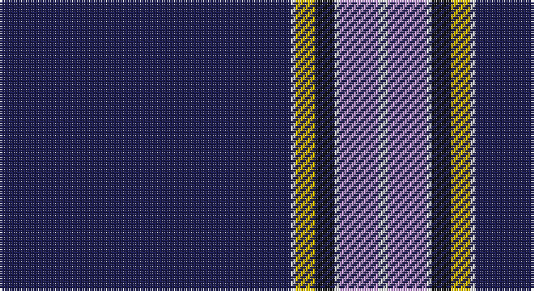

This page is one **sett** — a single exact thread-count. It belongs to the [tartan](/setts/db60w1ly4k4w1lp8w2/)
(the same proportion at any scale), whose colour order is pattern [BWYKWWW](/stripes/bwykwww/).

Sourced from tartans-authority.  It is a [7 stripe tartan](/stripes/stripes7/).

Original link http://www.tartansauthority.com/tartan-ferret/display/7705/

2 attestations — the source records this cloth was collapsed from (oldest owns this page)

<ul>
<li>Aug 2008 — Nunavut Territory (District) (tartans-authority, <a href="http://www.tartansauthority.com/tartan-ferret/display/7705/">record</a>)</li>
<li>undated — Nunavut Territory (register-of-tartans, <a href="https://www.tartanregister.gov.uk/tartanDetails.aspx?ref=5697">record</a>)</li>
</ul>

## Register references

External register numbers recorded for this tartan.

- Scottish Register of Tartans: [5697](https://www.tartanregister.gov.uk/tartanDetails.aspx?ref=5697)
- Scottish Tartans Authority (ITI): 7705

## Thread count
DB/120 LN2 Y8 K8 LN2 LP16 LN/4

One full sett is **196 threads**.

## Palette

Palette: <strong>Tartan Register</strong>
<table><thead><tr><th>Colour</th><th>Threads</th><th>Shade</th><th>Base</th><th>OKLCh</th></tr></thead><tbody><tr><td>DB/</td><td style="text-align:right;font-variant-numeric:tabular-nums">120</td><td><code style="background-color:#1C1C50;">#1C1C50</code> <small style="color:#888">#1C1C50</small></td><td>B <code style="background-color:#2A418A;">#2A418A</code></td><td><small style="color:#888">oklch(26.2% 0.093 277.9)</small></td></tr><tr><td>LN</td><td style="text-align:right;font-variant-numeric:tabular-nums">2</td><td><code style="background-color:#E0E0E0;">#E0E0E0</code> <small style="color:#888">#E0E0E0</small></td><td>W <code style="background-color:#F7F7F7;">#F7F7F7</code></td><td><small style="color:#888">oklch(90.7% 0.000 89.9)</small></td></tr><tr><td>Y</td><td style="text-align:right;font-variant-numeric:tabular-nums">8</td><td><code style="background-color:#E8C000;">#E8C000</code> <small style="color:#888">#E8C000</small></td><td>Y <code style="background-color:#F2BF00;">#F2BF00</code></td><td><small style="color:#888">oklch(81.9% 0.168 93.7)</small></td></tr><tr><td>K</td><td style="text-align:right;font-variant-numeric:tabular-nums">8</td><td><code style="background-color:#101010;">#101010</code> <small style="color:#888">#101010</small></td><td>K <code style="background-color:#000000;">#000000</code></td><td><small style="color:#888">oklch(17.3% 0.000 89.9)</small></td></tr><tr><td>LN</td><td style="text-align:right;font-variant-numeric:tabular-nums">2</td><td><code style="background-color:#E0E0E0;">#E0E0E0</code> <small style="color:#888">#E0E0E0</small></td><td>W <code style="background-color:#F7F7F7;">#F7F7F7</code></td><td><small style="color:#888">oklch(90.7% 0.000 89.9)</small></td></tr><tr><td>LP</td><td style="text-align:right;font-variant-numeric:tabular-nums">16</td><td><code style="background-color:#C49CD8;">#C49CD8</code> <small style="color:#888">#C49CD8</small></td><td>W <code style="background-color:#F7F7F7;">#F7F7F7</code></td><td><small style="color:#888">oklch(75.0% 0.095 314.2)</small></td></tr><tr><td>LN/</td><td style="text-align:right;font-variant-numeric:tabular-nums">4</td><td><code style="background-color:#E0E0E0;">#E0E0E0</code> <small style="color:#888">#E0E0E0</small></td><td>W <code style="background-color:#F7F7F7;">#F7F7F7</code></td><td><small style="color:#888">oklch(90.7% 0.000 89.9)</small></td></tr></tbody></table>

# Sample pattern

## Nearest tartans

The nearest existing variants by ΔTartan distance, with this tartan at the top so the swatches line up against it.

ΔTartan

Tartan

Sett

—

<a href="/ttd/edit/#slug=db60w1ly4k4w1lp8w2~x2">Nunavut Territory (District)</a> <a class="nn-out" href="/variants/s7/db60w1ly4k4w1lp8w2~x2/" title="open its dictionary page">↗</a>

1.08

<a href="/ttd/edit/#slug=w3dt9ly1lb3dp9lb1dt40dp2~x2&amp;base=db60w1ly4k4w1lp8w2~x2">Parkin</a> <a class="nn-out" href="/variants/s8/w3dt9ly1lb3dp9lb1dt40dp2~x2/" title="open its dictionary page">↗</a>

1.29

<a href="/ttd/edit/#slug=db62w2db4w5db6lo2r8lo3w4~x2&amp;base=db60w1ly4k4w1lp8w2~x2">George, Stuart (Personal)</a> <a class="nn-out" href="/variants/s9/db62w2db4w5db6lo2r8lo3w4~x2/" title="open its dictionary page">↗</a>

1.30

<a href="/ttd/edit/#slug=b7db5w6db5r7db2b2db70w2&amp;base=db60w1ly4k4w1lp8w2~x2">United States (Corporate)</a> <a class="nn-out" href="/variants/s9/b7db5w6db5r7db2b2db70w2/" title="open its dictionary page">↗</a>

1.31

<a href="/ttd/edit/#slug=db5ly1g7r1db45r5ly3db4ly3~x2&amp;base=db60w1ly4k4w1lp8w2~x2">Brooks Brothers Signature</a> <a class="nn-out" href="/variants/s9/db5ly1g7r1db45r5ly3db4ly3~x2/" title="open its dictionary page">↗</a>

1.32

<a href="/ttd/edit/#slug=db62w2db4w5db6ly2r8ly3w4~x2&amp;base=db60w1ly4k4w1lp8w2~x2">George, Stuart (Personal)</a> <a class="nn-out" href="/variants/s9/db62w2db4w5db6ly2r8ly3w4~x2/" title="open its dictionary page">↗</a>

1.37

<a href="/ttd/edit/#slug=db62r1db2r1db4k14g4w2g6k4~x2&amp;base=db60w1ly4k4w1lp8w2~x2">Parr</a> <a class="nn-out" href="/variants/s10/db62r1db2r1db4k14g4w2g6k4~x2/" title="open its dictionary page">↗</a>

1.46

<a href="/ttd/edit/#slug=db62w4k2w7dp2dg3ly2db16~x2&amp;base=db60w1ly4k4w1lp8w2~x2">Boat of Garten</a> <a class="nn-out" href="/variants/s8/db62w4k2w7dp2dg3ly2db16~x2/" title="open its dictionary page">↗</a>

1.47

<a href="/variants/s10/db62r1db2r1db4k14g4ki2g6k4~x2/">Park</a>

1.48

<a href="/ttd/edit/#slug=w6db32o3db3o1db3o2dbi4db1ly2~x2&amp;base=db60w1ly4k4w1lp8w2~x2">X Marks the Scot</a> <a class="nn-out" href="/variants/s10/w6db32o3db3o1db3o2dbi4db1ly2~x2/" title="open its dictionary page">↗</a>

1.49

<a href="/ttd/edit/#slug=ly2db66r16w2r1w1~x2&amp;base=db60w1ly4k4w1lp8w2~x2">Coogan (Personal)</a> <a class="nn-out" href="/variants/s6/ly2db66r16w2r1w1~x2/" title="open its dictionary page">↗</a>

## Neighbour map

Every grey dot is one of 14360 variants placed by the first two principal components of the ΔTartan feature space (44% of its variance). Red is this tartan; blue dots are its nearest — click one to open its page.

<svg viewBox="0 0 640 380" role="img" style="max-width:100%;height:auto;border:1px solid #e0e0e0;border-radius:4px;display:block" xmlns="http://www.w3.org/2000/svg"><image href="/nn/cloud.v1.png" width="640" height="380"/><a href="/variants/s8/w3dt9ly1lb3dp9lb1dt40dp2~x2/"><circle cx="473.4" cy="109.7" r="4" fill="#3465a4"><title>Parkin</title></circle></a><a href="/variants/s9/db62w2db4w5db6lo2r8lo3w4~x2/"><circle cx="483.1" cy="102.7" r="4" fill="#3465a4"><title>George, Stuart (Personal)</title></circle></a><a href="/variants/s9/b7db5w6db5r7db2b2db70w2/"><circle cx="524.5" cy="107.9" r="4" fill="#3465a4"><title>United States (Corporate)</title></circle></a><a href="/variants/s9/db5ly1g7r1db45r5ly3db4ly3~x2/"><circle cx="481.0" cy="103.7" r="4" fill="#3465a4"><title>Brooks Brothers Signature</title></circle></a><a href="/variants/s9/db62w2db4w5db6ly2r8ly3w4~x2/"><circle cx="481.5" cy="101.2" r="4" fill="#3465a4"><title>George, Stuart (Personal)</title></circle></a><a href="/variants/s10/db62r1db2r1db4k14g4w2g6k4~x2/"><circle cx="450.6" cy="78.1" r="4" fill="#3465a4"><title>Parr</title></circle></a><a href="/variants/s8/db62w4k2w7dp2dg3ly2db16~x2/"><circle cx="485.1" cy="90.8" r="4" fill="#3465a4"><title>Boat of Garten</title></circle></a><a href="/variants/s10/db62r1db2r1db4k14g4ki2g6k4~x2/"><circle cx="457.3" cy="82.2" r="4" fill="#3465a4"><title>Park</title></circle></a><a href="/variants/s10/w6db32o3db3o1db3o2dbi4db1ly2~x2/"><circle cx="413.8" cy="91.9" r="4" fill="#3465a4"><title>X Marks the Scot</title></circle></a><a href="/variants/s6/ly2db66r16w2r1w1~x2/"><circle cx="541.5" cy="123.2" r="4" fill="#3465a4"><title>Coogan (Personal)</title></circle></a><circle cx="496.5" cy="86.1" r="5" fill="#c00000"/></svg>

ID: /variants/s7/db60w1ly4k4w1lp8w2~x2/
