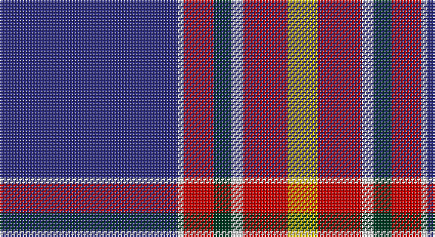

This page is one **sett** — a single exact thread-count. It belongs to the [tartan](/setts/db60w2r10dg6w4r15ly10/)
(the same proportion at any scale), whose colour order is pattern [BWRGWRY](/stripes/bwrgwry/).

Part of the [Iberia Dress,](/tartans/iberia-dress/) tartan — the named design grouping this sett with its other cloths.

Sourced from tartans-authority.  It is a [7 stripe tartan](/stripes/stripes7/).

Original link http://www.tartansauthority.com/tartan-ferret/display/6973/

## Also known as

This cloth is also recorded under:

- Iberia Dress, Black
- Iberia Dress, Blue

## Register references

External register numbers recorded for this tartan.

- Scottish Tartans Authority (ITI): 6973

## Thread count
DB/120 LN4 R20 DG12 LN8 R30 Y/20

One full sett is **288 threads**.

## Palette

Palette: <strong>Tartan Register</strong>
<table><thead><tr><th>Colour</th><th>Threads</th><th>Shade</th><th>Base</th><th>OKLCh</th></tr></thead><tbody><tr><td>DB/</td><td style="text-align:right;font-variant-numeric:tabular-nums">120</td><td><code style="background-color:#2C2C80;">#2C2C80</code> <small style="color:#888">#2C2C80</small></td><td>B <code style="background-color:#2A418A;">#2A418A</code></td><td><small style="color:#888">oklch(35.0% 0.138 276.6)</small></td></tr><tr><td>LN</td><td style="text-align:right;font-variant-numeric:tabular-nums">4</td><td><code style="background-color:#E0E0E0;">#E0E0E0</code> <small style="color:#888">#E0E0E0</small></td><td>W <code style="background-color:#F7F7F7;">#F7F7F7</code></td><td><small style="color:#888">oklch(90.7% 0.000 89.9)</small></td></tr><tr><td>R</td><td style="text-align:right;font-variant-numeric:tabular-nums">20</td><td><code style="background-color:#C80000;">#C80000</code> <small style="color:#888">#C80000</small></td><td>R <code style="background-color:#CC0000;">#CC0000</code></td><td><small style="color:#888">oklch(52.3% 0.215 29.2)</small></td></tr><tr><td>DG</td><td style="text-align:right;font-variant-numeric:tabular-nums">12</td><td><code style="background-color:#003820;">#003820</code> <small style="color:#888">#003820</small></td><td>G <code style="background-color:#006100;">#006100</code></td><td><small style="color:#888">oklch(30.0% 0.070 158.3)</small></td></tr><tr><td>LN</td><td style="text-align:right;font-variant-numeric:tabular-nums">8</td><td><code style="background-color:#E0E0E0;">#E0E0E0</code> <small style="color:#888">#E0E0E0</small></td><td>W <code style="background-color:#F7F7F7;">#F7F7F7</code></td><td><small style="color:#888">oklch(90.7% 0.000 89.9)</small></td></tr><tr><td>R</td><td style="text-align:right;font-variant-numeric:tabular-nums">30</td><td><code style="background-color:#C80000;">#C80000</code> <small style="color:#888">#C80000</small></td><td>R <code style="background-color:#CC0000;">#CC0000</code></td><td><small style="color:#888">oklch(52.3% 0.215 29.2)</small></td></tr><tr><td>Y/</td><td style="text-align:right;font-variant-numeric:tabular-nums">20</td><td><code style="background-color:#E8C000;">#E8C000</code> <small style="color:#888">#E8C000</small></td><td>Y <code style="background-color:#F2BF00;">#F2BF00</code></td><td><small style="color:#888">oklch(81.9% 0.168 93.7)</small></td></tr></tbody></table>

# Sample pattern

## Nearest tartans

The nearest existing variants by ΔTartan distance, with this tartan at the top so the swatches line up against it.

ΔTartan

Tartan

Sett

—

<a href="/ttd/edit/#slug=db60w2r10dg6w4r15ly10~x2">Iberia Dress, Blue (Fashion)</a> <a class="nn-out" href="/variants/s7/db60w2r10dg6w4r15ly10~x2/" title="open its dictionary page">↗</a>

1.02

<a href="/ttd/edit/#slug=lb12g12k12g24dp75ly4&amp;base=db60w2r10dg6w4r15ly10~x2">Widows Sons Scotland Dress</a> <a class="nn-out" href="/variants/s6/lb12g12k12g24dp75ly4/" title="open its dictionary page">↗</a>

1.20

<a href="/ttd/edit/#slug=w3r2dp31g30ly2dp2ly1~x2&amp;base=db60w2r10dg6w4r15ly10~x2">Caig (Corporate)</a> <a class="nn-out" href="/variants/s7/w3r2dp31g30ly2dp2ly1~x2/" title="open its dictionary page">↗</a>

1.23

<a href="/ttd/edit/#slug=r3g2k9b2k2b24ly2b2ly1~x2&amp;base=db60w2r10dg6w4r15ly10~x2">Bell of the Borders.</a> <a class="nn-out" href="/variants/s9/r3g2k9b2k2b24ly2b2ly1~x2/" title="open its dictionary page">↗</a>

1.28

<a href="/variants/s8/t72r16k5ly2dt16~x2/">Thomas Jean Marc Personal Tartan</a>

1.30

<a href="/ttd/edit/#slug=w2db2w1db40r3ly1r10g10r1~x2&amp;base=db60w2r10dg6w4r15ly10~x2">Russian Scottish (District)</a> <a class="nn-out" href="/variants/s9/w2db2w1db40r3ly1r10g10r1~x2/" title="open its dictionary page">↗</a>

1.32

<a href="/ttd/edit/#slug=dt50r26k9r4w2lo2r10~x2&amp;base=db60w2r10dg6w4r15ly10~x2">Java Saint Andrew Society Dress</a> <a class="nn-out" href="/variants/s7/dt50r26k9r4w2lo2r10~x2/" title="open its dictionary page">↗</a>

1.33

<a href="/ttd/edit/#slug=w3b2w2b40r3ly1r10g10r1~x2&amp;base=db60w2r10dg6w4r15ly10~x2">Russian Scottish</a> <a class="nn-out" href="/variants/s9/w3b2w2b40r3ly1r10g10r1~x2/" title="open its dictionary page">↗</a>

1.33

<a href="/ttd/edit/#slug=db4r2db39k11g2w16r2~x2&amp;base=db60w2r10dg6w4r15ly10~x2">Sinclair, The Jack</a> <a class="nn-out" href="/variants/s7/db4r2db39k11g2w16r2~x2/" title="open its dictionary page">↗</a>

1.35

<a href="/ttd/edit/#slug=k6r2k6r12w2db36ly1g3~x2&amp;base=db60w2r10dg6w4r15ly10~x2">Fremont Presbyterian Church (P)</a> <a class="nn-out" href="/variants/s8/k6r2k6r12w2db36ly1g3~x2/" title="open its dictionary page">↗</a>

1.37

<a href="/ttd/edit/#slug=db4r2db40k11g2w16r2~x2&amp;base=db60w2r10dg6w4r15ly10~x2">Sinclair, Blue (Personal)</a> <a class="nn-out" href="/variants/s7/db4r2db40k11g2w16r2~x2/" title="open its dictionary page">↗</a>

## Neighbour map

Every grey dot is one of 14360 variants placed by the first two principal components of the ΔTartan feature space (44% of its variance). Red is this tartan; blue dots are its nearest — click one to open its page.

<svg viewBox="0 0 640 380" role="img" style="max-width:100%;height:auto;border:1px solid #e0e0e0;border-radius:4px;display:block" xmlns="http://www.w3.org/2000/svg"><image href="/nn/cloud.v1.png" width="640" height="380"/><a href="/variants/s6/lb12g12k12g24dp75ly4/"><circle cx="297.8" cy="150.4" r="4" fill="#3465a4"><title>Widows Sons Scotland Dress</title></circle></a><a href="/variants/s7/w3r2dp31g30ly2dp2ly1~x2/"><circle cx="313.0" cy="115.1" r="4" fill="#3465a4"><title>Caig (Corporate)</title></circle></a><a href="/variants/s9/r3g2k9b2k2b24ly2b2ly1~x2/"><circle cx="316.7" cy="96.5" r="4" fill="#3465a4"><title>Bell of the Borders.</title></circle></a><a href="/variants/s8/t72r16k5ly2dt16~x2/"><circle cx="326.3" cy="104.3" r="4" fill="#3465a4"><title>Thomas Jean Marc Personal Tartan</title></circle></a><a href="/variants/s9/w2db2w1db40r3ly1r10g10r1~x2/"><circle cx="385.9" cy="89.3" r="4" fill="#3465a4"><title>Russian Scottish (District)</title></circle></a><a href="/variants/s7/dt50r26k9r4w2lo2r10~x2/"><circle cx="312.9" cy="135.0" r="4" fill="#3465a4"><title>Java Saint Andrew Society Dress</title></circle></a><a href="/variants/s9/w3b2w2b40r3ly1r10g10r1~x2/"><circle cx="363.2" cy="86.0" r="4" fill="#3465a4"><title>Russian Scottish</title></circle></a><a href="/variants/s7/db4r2db39k11g2w16r2~x2/"><circle cx="284.1" cy="128.7" r="4" fill="#3465a4"><title>Sinclair, The Jack</title></circle></a><a href="/variants/s8/k6r2k6r12w2db36ly1g3~x2/"><circle cx="311.4" cy="94.2" r="4" fill="#3465a4"><title>Fremont Presbyterian Church (P)</title></circle></a><a href="/variants/s7/db4r2db40k11g2w16r2~x2/"><circle cx="290.2" cy="126.9" r="4" fill="#3465a4"><title>Sinclair, Blue (Personal)</title></circle></a><circle cx="323.4" cy="111.4" r="5" fill="#c00000"/></svg>

ID: /variants/s7/db60w2r10dg6w4r15ly10~x2/
