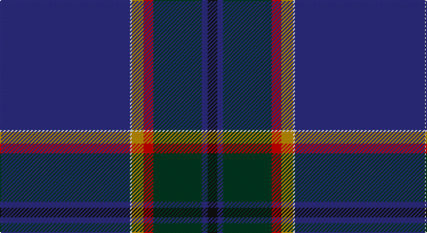

This page is one **sett** — a single exact thread-count. It belongs to the [tartan](/setts/db67w1lo6r5dg25db3k5/)
(the same proportion at any scale), whose colour order is pattern [BWYRGBK](/stripes/bwyrgbk/).

Sourced from tartans-authority.  It is a [7 stripe tartan](/stripes/stripes7/).

Original link http://www.tartansauthority.com/tartan-ferret/display/7537/

2 attestations — the source records this cloth was collapsed from (oldest owns this page)

<ul>
<li>2006 — Guide Dogs (Corporate) (tartans-authority, <a href="http://www.tartansauthority.com/tartan-ferret/display/7537/">record</a>)</li>
<li>undated — Guide Dogs (register-of-tartans, <a href="https://www.tartanregister.gov.uk/tartanDetails.aspx?ref=5572">record</a>)</li>
</ul>

## Register references

External register numbers recorded for this tartan.

- Scottish Register of Tartans: [5572](https://www.tartanregister.gov.uk/tartanDetails.aspx?ref=5572)
- Scottish Tartans Authority (ITI): 7537

## Thread count
DB/134 LN2 DY12 R10 DG50 DB6 K/10

One full sett is **304 threads**.

## Palette

Palette: <strong>Tartan Register</strong>
<table><thead><tr><th>Colour</th><th>Threads</th><th>Shade</th><th>Base</th><th>OKLCh</th></tr></thead><tbody><tr><td>DB/</td><td style="text-align:right;font-variant-numeric:tabular-nums">134</td><td><code style="background-color:#2C2C80;">#2C2C80</code> <small style="color:#888">#2C2C80</small></td><td>B <code style="background-color:#2A418A;">#2A418A</code></td><td><small style="color:#888">oklch(35.0% 0.138 276.6)</small></td></tr><tr><td>LN</td><td style="text-align:right;font-variant-numeric:tabular-nums">2</td><td><code style="background-color:#E0E0E0;">#E0E0E0</code> <small style="color:#888">#E0E0E0</small></td><td>W <code style="background-color:#F7F7F7;">#F7F7F7</code></td><td><small style="color:#888">oklch(90.7% 0.000 89.9)</small></td></tr><tr><td>DY</td><td style="text-align:right;font-variant-numeric:tabular-nums">12</td><td><code style="background-color:#BC8C00;">#BC8C00</code> <small style="color:#888">#BC8C00</small></td><td>Y <code style="background-color:#F2BF00;">#F2BF00</code></td><td><small style="color:#888">oklch(66.8% 0.137 84.1)</small></td></tr><tr><td>R</td><td style="text-align:right;font-variant-numeric:tabular-nums">10</td><td><code style="background-color:#C80000;">#C80000</code> <small style="color:#888">#C80000</small></td><td>R <code style="background-color:#CC0000;">#CC0000</code></td><td><small style="color:#888">oklch(52.3% 0.215 29.2)</small></td></tr><tr><td>DG</td><td style="text-align:right;font-variant-numeric:tabular-nums">50</td><td><code style="background-color:#003820;">#003820</code> <small style="color:#888">#003820</small></td><td>G <code style="background-color:#006100;">#006100</code></td><td><small style="color:#888">oklch(30.0% 0.070 158.3)</small></td></tr><tr><td>DB</td><td style="text-align:right;font-variant-numeric:tabular-nums">6</td><td><code style="background-color:#2C2C80;">#2C2C80</code> <small style="color:#888">#2C2C80</small></td><td>B <code style="background-color:#2A418A;">#2A418A</code></td><td><small style="color:#888">oklch(35.0% 0.138 276.6)</small></td></tr><tr><td>K/</td><td style="text-align:right;font-variant-numeric:tabular-nums">10</td><td><code style="background-color:#101010;">#101010</code> <small style="color:#888">#101010</small></td><td>K <code style="background-color:#000000;">#000000</code></td><td><small style="color:#888">oklch(17.3% 0.000 89.9)</small></td></tr></tbody></table>

# Sample pattern

## Nearest tartans

The nearest existing variants by ΔTartan distance, with this tartan at the top so the swatches line up against it.

ΔTartan

Tartan

Sett

—

<a href="/ttd/edit/#slug=db67w1lo6r5dg25db3k5~x2">Guide Dogs (Corporate)</a> <a class="nn-out" href="/variants/s7/db67w1lo6r5dg25db3k5~x2/" title="open its dictionary page">↗</a>

0.72

<a href="/ttd/edit/#slug=w2db45g9r1n9ri1~x2&amp;base=db67w1lo6r5dg25db3k5~x2">Wilton (Name)</a> <a class="nn-out" href="/variants/s6/w2db45g9r1n9ri1~x2/" title="open its dictionary page">↗</a>

0.90

<a href="/ttd/edit/#slug=o4k2dg2ly1dg8k20db50r2db2~x2&amp;base=db67w1lo6r5dg25db3k5~x2">Buckie</a> <a class="nn-out" href="/variants/s9/o4k2dg2ly1dg8k20db50r2db2~x2/" title="open its dictionary page">↗</a>

1.20

<a href="/ttd/edit/#slug=t48r1db10r1t10lr2db27w1m3~x2&amp;base=db67w1lo6r5dg25db3k5~x2">Glasgow Clyde College</a> <a class="nn-out" href="/variants/s9/t48r1db10r1t10lr2db27w1m3~x2/" title="open its dictionary page">↗</a>

1.23

<a href="/ttd/edit/#slug=g20r10ly2db100w1y10&amp;base=db67w1lo6r5dg25db3k5~x2">Ravetta (Name)</a> <a class="nn-out" href="/variants/s6/g20r10ly2db100w1y10/" title="open its dictionary page">↗</a>

1.23

<a href="/ttd/edit/#slug=db46lyi1ly3dg13lyi1r7g3lyi1~x2&amp;base=db67w1lo6r5dg25db3k5~x2">Victorian Highland Pipe Band Assoc</a> <a class="nn-out" href="/variants/s8/db46lyi1ly3dg13lyi1r7g3lyi1~x2/" title="open its dictionary page">↗</a>

1.23

<a href="/ttd/edit/#slug=db36k10dg3r3dg6k1ly2~x2&amp;base=db67w1lo6r5dg25db3k5~x2">MacLaurin of Brioch</a> <a class="nn-out" href="/variants/s7/db36k10dg3r3dg6k1ly2~x2/" title="open its dictionary page">↗</a>

1.25

<a href="/ttd/edit/#slug=db5w1db44dp1g12k12dp5k2m2k3~x2&amp;base=db67w1lo6r5dg25db3k5~x2">Heart of Scotland (Fashion)</a> <a class="nn-out" href="/variants/s10/db5w1db44dp1g12k12dp5k2m2k3~x2/" title="open its dictionary page">↗</a>

1.36

<a href="/ttd/edit/#slug=r2db61k13w2o20lo2~x2&amp;base=db67w1lo6r5dg25db3k5~x2">Lloyd of Astargus</a> <a class="nn-out" href="/variants/s6/r2db61k13w2o20lo2~x2/" title="open its dictionary page">↗</a>

1.36

<a href="/ttd/edit/#slug=n15k55w1dp5r2ly1~x2&amp;base=db67w1lo6r5dg25db3k5~x2">Venters (Edinburgh)</a> <a class="nn-out" href="/variants/s6/n15k55w1dp5r2ly1~x2/" title="open its dictionary page">↗</a>

1.37

<a href="/ttd/edit/#slug=r2w1r5g5lo1g10db40ly2~x2&amp;base=db67w1lo6r5dg25db3k5~x2">St. Andrew Quebec City (Corporate)</a> <a class="nn-out" href="/variants/s8/r2w1r5g5lo1g10db40ly2~x2/" title="open its dictionary page">↗</a>

## Neighbour map

Every grey dot is one of 14360 variants placed by the first two principal components of the ΔTartan feature space (44% of its variance). Red is this tartan; blue dots are its nearest — click one to open its page.

<svg viewBox="0 0 640 380" role="img" style="max-width:100%;height:auto;border:1px solid #e0e0e0;border-radius:4px;display:block" xmlns="http://www.w3.org/2000/svg"><image href="/nn/cloud.v1.png" width="640" height="380"/><a href="/variants/s6/w2db45g9r1n9ri1~x2/"><circle cx="453.9" cy="121.7" r="4" fill="#3465a4"><title>Wilton (Name)</title></circle></a><a href="/variants/s9/o4k2dg2ly1dg8k20db50r2db2~x2/"><circle cx="400.0" cy="99.8" r="4" fill="#3465a4"><title>Buckie</title></circle></a><a href="/variants/s9/t48r1db10r1t10lr2db27w1m3~x2/"><circle cx="391.1" cy="96.1" r="4" fill="#3465a4"><title>Glasgow Clyde College</title></circle></a><a href="/variants/s6/g20r10ly2db100w1y10/"><circle cx="469.7" cy="109.2" r="4" fill="#3465a4"><title>Ravetta (Name)</title></circle></a><a href="/variants/s8/db46lyi1ly3dg13lyi1r7g3lyi1~x2/"><circle cx="390.7" cy="88.4" r="4" fill="#3465a4"><title>Victorian Highland Pipe Band Assoc</title></circle></a><a href="/variants/s7/db36k10dg3r3dg6k1ly2~x2/"><circle cx="393.4" cy="136.4" r="4" fill="#3465a4"><title>MacLaurin of Brioch</title></circle></a><a href="/variants/s10/db5w1db44dp1g12k12dp5k2m2k3~x2/"><circle cx="383.3" cy="105.6" r="4" fill="#3465a4"><title>Heart of Scotland (Fashion)</title></circle></a><a href="/variants/s6/r2db61k13w2o20lo2~x2/"><circle cx="370.8" cy="125.8" r="4" fill="#3465a4"><title>Lloyd of Astargus</title></circle></a><a href="/variants/s6/n15k55w1dp5r2ly1~x2/"><circle cx="502.9" cy="129.5" r="4" fill="#3465a4"><title>Venters (Edinburgh)</title></circle></a><a href="/variants/s8/r2w1r5g5lo1g10db40ly2~x2/"><circle cx="380.5" cy="89.1" r="4" fill="#3465a4"><title>St. Andrew Quebec City (Corporate)</title></circle></a><circle cx="430.4" cy="113.5" r="5" fill="#c00000"/></svg>

ID: /variants/s7/db67w1lo6r5dg25db3k5~x2/
