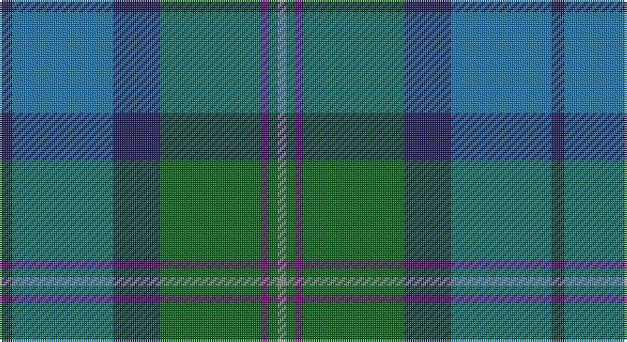

This page is one **sett** — a single exact thread-count. It belongs to the [tartan](/setts/db6b47db22g47dp4g4o4/)
(the same proportion at any scale), whose colour order is pattern [BBBGBGR](/stripes/bbbgbgr/).

Part of the [Boroughmuir](/tartans/boroughmuir/) tartan — the named design grouping this sett with its other cloths.

Sourced from tartans-authority.  It is a [7 stripe tartan](/stripes/stripes7/).

Original link http://www.tartansauthority.com/tartan-ferret/display/11162/

## Also known as

This cloth is also recorded under:

- Wimbledon

## Register references

External register numbers recorded for this tartan.

- Scottish Register of Tartans: [11162](https://www.tartanregister.gov.uk/tartanDetails?ref=11162)
- Scottish Tartans Authority (ITI): 11162

## Thread count
DB/6 B47 DB22 G47 P4 G4 N/4

One full sett is **258 threads**.

## Palette

Palette: <strong>Tartan Register</strong>
<table><thead><tr><th>Colour</th><th>Threads</th><th>Shade</th><th>Base</th><th>OKLCh</th></tr></thead><tbody><tr><td>DB/</td><td style="text-align:right;font-variant-numeric:tabular-nums">6</td><td><code style="background-color:#202060;">#202060</code> <small style="color:#888">#202060</small></td><td>B <code style="background-color:#2A418A;">#2A418A</code></td><td><small style="color:#888">oklch(28.9% 0.111 276.9)</small></td></tr><tr><td>B</td><td style="text-align:right;font-variant-numeric:tabular-nums">47</td><td><code style="background-color:#1474B4;">#1474B4</code> <small style="color:#888">#1474B4</small></td><td>B <code style="background-color:#2A418A;">#2A418A</code></td><td><small style="color:#888">oklch(54.0% 0.129 245.1)</small></td></tr><tr><td>DB</td><td style="text-align:right;font-variant-numeric:tabular-nums">22</td><td><code style="background-color:#202060;">#202060</code> <small style="color:#888">#202060</small></td><td>B <code style="background-color:#2A418A;">#2A418A</code></td><td><small style="color:#888">oklch(28.9% 0.111 276.9)</small></td></tr><tr><td>G</td><td style="text-align:right;font-variant-numeric:tabular-nums">47</td><td><code style="background-color:#006818;">#006818</code> <small style="color:#888">#006818</small></td><td>G <code style="background-color:#006100;">#006100</code></td><td><small style="color:#888">oklch(45.0% 0.142 145.0)</small></td></tr><tr><td>P</td><td style="text-align:right;font-variant-numeric:tabular-nums">4</td><td><code style="background-color:#780078;">#780078</code> <small style="color:#888">#780078</small></td><td>B <code style="background-color:#2A418A;">#2A418A</code></td><td><small style="color:#888">oklch(40.2% 0.185 328.4)</small></td></tr><tr><td>G</td><td style="text-align:right;font-variant-numeric:tabular-nums">4</td><td><code style="background-color:#006818;">#006818</code> <small style="color:#888">#006818</small></td><td>G <code style="background-color:#006100;">#006100</code></td><td><small style="color:#888">oklch(45.0% 0.142 145.0)</small></td></tr><tr><td>N/</td><td style="text-align:right;font-variant-numeric:tabular-nums">4</td><td><code style="background-color:#888888;">#888888</code> <small style="color:#888">#888888</small></td><td>R <code style="background-color:#CC0000;">#CC0000</code></td><td><small style="color:#888">oklch(62.7% 0.000 89.9)</small></td></tr></tbody></table>

# Sample pattern

## Compared to the master

This cloth is one sett of its design; the master sett (the exemplar the design is anchored on) is below for comparison.

<figure style="margin:0"><figcaption style="color:#888;font-size:smaller">this sett</figcaption></figure>
<figure style="margin:0"><figcaption style="color:#888;font-size:smaller"><a href="/setts/dg30w8dt32ly1dt8/">master sett →</a></figcaption></figure>

## Nearest tartans

The nearest existing variants by ΔTartan distance, with this tartan at the top so the swatches line up against it.

ΔTartan

Tartan

Sett

—

<a href="/ttd/edit/#slug=db6b47db22g47dp4g4o4">Boroughmuir</a> <a class="nn-out" href="/variants/s7/db6b47db22g47dp4g4o4/" title="open its dictionary page">↗</a>

0.35

<a href="/ttd/edit/#slug=db6b47db22g47dp4g4lb4&amp;base=db6b47db22g47dp4g4o4">Boroughmuir</a> <a class="nn-out" href="/variants/s7/db6b47db22g47dp4g4lb4/" title="open its dictionary page">↗</a>

0.83

<a href="/ttd/edit/#slug=g5mi3g32k16b32m3b5~x2&amp;base=db6b47db22g47dp4g4o4">MacThomas</a> <a class="nn-out" href="/variants/s7/g5mi3g32k16b32m3b5~x2/" title="open its dictionary page">↗</a>

1.03

<a href="/ttd/edit/#slug=dt4b28dt11w2dt2g14ly2~x2&amp;base=db6b47db22g47dp4g4o4">Rhode Island, State of</a> <a class="nn-out" href="/variants/s7/dt4b28dt11w2dt2g14ly2~x2/" title="open its dictionary page">↗</a>

1.05

<a href="/ttd/edit/#slug=db3g13lr1o3lr1db10lo1~x2&amp;base=db6b47db22g47dp4g4o4">Graeme Heckenberg Hunting</a> <a class="nn-out" href="/variants/s7/db3g13lr1o3lr1db10lo1~x2/" title="open its dictionary page">↗</a>

1.12

<a href="/ttd/edit/#slug=dg5lp3dg32k16b32m3b5~x2&amp;base=db6b47db22g47dp4g4o4">MacThomas (Clan)</a> <a class="nn-out" href="/variants/s7/dg5lp3dg32k16b32m3b5~x2/" title="open its dictionary page">↗</a>

1.14

<a href="/ttd/edit/#slug=dg5g32dp5k10dg8r3dg8dp3~x2&amp;base=db6b47db22g47dp4g4o4">Scottish Power (Corporate)</a> <a class="nn-out" href="/variants/s8/dg5g32dp5k10dg8r3dg8dp3~x2/" title="open its dictionary page">↗</a>

1.18

<a href="/ttd/edit/#slug=b11k4g4m1g4k1r1~x4&amp;base=db6b47db22g47dp4g4o4">Ednie (Personal)</a> <a class="nn-out" href="/variants/s7/b11k4g4m1g4k1r1~x4/" title="open its dictionary page">↗</a>

1.18

<a href="/ttd/edit/#slug=db3m2db22k11g24lp2g3~x2&amp;base=db6b47db22g47dp4g4o4">MacThomas Clan Tartan</a> <a class="nn-out" href="/variants/s7/db3m2db22k11g24lp2g3~x2/" title="open its dictionary page">↗</a>

1.21

<a href="/ttd/edit/#slug=dg5r3g30db30w3~x2&amp;base=db6b47db22g47dp4g4o4">Gamba Tuscany Fife</a> <a class="nn-out" href="/variants/s5/dg5r3g30db30w3~x2/" title="open its dictionary page">↗</a>

1.27

<a href="/ttd/edit/#slug=dg2g8dt1g1dt1g1dt8db10w1~x4&amp;base=db6b47db22g47dp4g4o4">Cowal Gathering</a> <a class="nn-out" href="/variants/s9/dg2g8dt1g1dt1g1dt8db10w1~x4/" title="open its dictionary page">↗</a>

## Neighbour map

Every grey dot is one of 14360 variants placed by the first two principal components of the ΔTartan feature space (44% of its variance). Red is this tartan; blue dots are its nearest — click one to open its page.

<svg viewBox="0 0 640 380" role="img" style="max-width:100%;height:auto;border:1px solid #e0e0e0;border-radius:4px;display:block" xmlns="http://www.w3.org/2000/svg"><image href="/nn/cloud.v1.png" width="640" height="380"/><a href="/variants/s7/db6b47db22g47dp4g4lb4/"><circle cx="243.2" cy="207.6" r="4" fill="#3465a4"><title>Boroughmuir</title></circle></a><a href="/variants/s7/g5mi3g32k16b32m3b5~x2/"><circle cx="212.0" cy="199.5" r="4" fill="#3465a4"><title>MacThomas</title></circle></a><a href="/variants/s7/dt4b28dt11w2dt2g14ly2~x2/"><circle cx="246.4" cy="182.1" r="4" fill="#3465a4"><title>Rhode Island, State of</title></circle></a><a href="/variants/s7/db3g13lr1o3lr1db10lo1~x2/"><circle cx="261.5" cy="191.5" r="4" fill="#3465a4"><title>Graeme Heckenberg Hunting</title></circle></a><a href="/variants/s7/dg5lp3dg32k16b32m3b5~x2/"><circle cx="213.8" cy="201.7" r="4" fill="#3465a4"><title>MacThomas (Clan)</title></circle></a><a href="/variants/s8/dg5g32dp5k10dg8r3dg8dp3~x2/"><circle cx="243.3" cy="197.6" r="4" fill="#3465a4"><title>Scottish Power (Corporate)</title></circle></a><a href="/variants/s7/b11k4g4m1g4k1r1~x4/"><circle cx="212.9" cy="195.3" r="4" fill="#3465a4"><title>Ednie (Personal)</title></circle></a><a href="/variants/s7/db3m2db22k11g24lp2g3~x2/"><circle cx="233.7" cy="195.6" r="4" fill="#3465a4"><title>MacThomas Clan Tartan</title></circle></a><a href="/variants/s5/dg5r3g30db30w3~x2/"><circle cx="278.8" cy="236.5" r="4" fill="#3465a4"><title>Gamba Tuscany Fife</title></circle></a><a href="/variants/s9/dg2g8dt1g1dt1g1dt8db10w1~x4/"><circle cx="196.1" cy="199.2" r="4" fill="#3465a4"><title>Cowal Gathering</title></circle></a><circle cx="236.0" cy="203.0" r="5" fill="#c00000"/></svg>

ID: /variants/s7/db6b47db22g47dp4g4o4/
