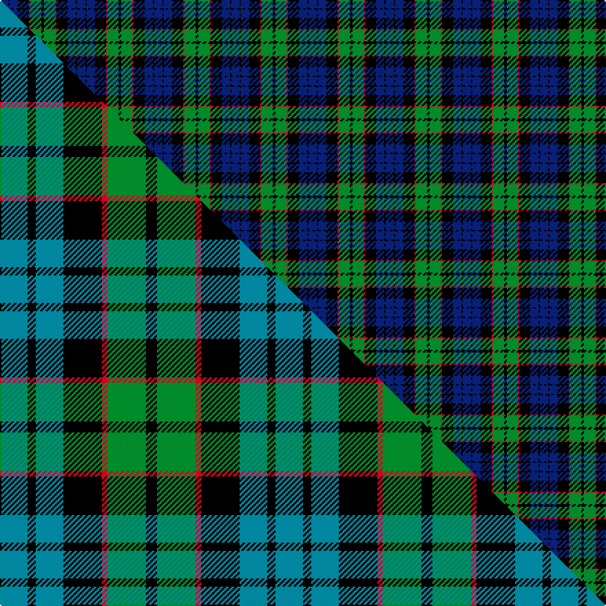

This is one **variant** — a specific cloth: this exact thread count and colourway, with its own
provenance below. It is one weaving of the [sett](/setts/db6k1db6k8r1g8k2/) (the scale-free proportion — the
same cloth at any scale or shade), whose colour order is pattern [BKBKRGK](/stripes/bkbkrgk/).

Part of the [Fletcher](/tartans/fletcher/) tartan — the named design grouping this sett with its other cloths.

Sourced from weddslist.  It is a [7 stripe tartan](/stripes/stripes7/).

Original link [http://www.weddslist.com/cgi-bin/tartans/pg.pl?source=rb](http://www.weddslist.com/cgi-bin/tartans/pg.pl?source=rb)

2 attestations — the source records this cloth was collapsed from (oldest owns this page)

<ul>
<li>undated — Fletcher (weddslist, <a href="http://www.weddslist.com/cgi-bin/tartans/pg.pl?source=rb">record</a>) </li>
<li>undated — Fletcher (weddslist, <a href="http://www.weddslist.com/cgi-bin/tartans/pg.pl?source=x">record</a>) </li>
</ul>

Dataset <small>— provenance for this record, inherited from the source manifest</small>

<dl class="dataset-prov">
<dt>source</dt><dd><a href="/sources/weddslist/">Weddslist</a></dd>
<dt>data captured from</dt><dd><a href="https://github.com/thetartan/tartan-database/blob/master/data/weddslist/data.csv">https://github.com/thetartan/tartan-database/blob/master/data/weddslist/data.csv</a></dd>
<dt>data date</dt><dd>2016-11-17 <small>(dataset default)</small></dd>
<dt>licence</dt><dd><a href="https://creativecommons.org/licenses/by-nc-nd/4.0/">CC BY-NC-ND 4.0</a></dd>
</dl>

Capture chain <small>— the hands this data passed through, oldest first; each capture carries its own licence</small>

<ol class="capture-chain">
<li><a href="https://www.weddslist.com/tartans/">Weddslist</a> <small>the living privately compiled reference</small></li>
<li><a href="https://github.com/thetartan/tartan-database">thetartan/tartan-database</a> <small>2016-2017</small> · <a href="https://creativecommons.org/licenses/by-nc-nd/4.0/">CC BY-NC-ND 4.0</a> <small>Levko Kravets's frozen compilation — the capture we vendored, and where its CC licence text came from</small></li>
<li>this dictionary <small>captured 2026-06-10 · commit 5bf86c7566</small> <small>each re-capture is a git commit to data/sources</small></li>
</ol>

## Thread count
DB/6 K1 DB6 K8 R1 G8 K/2

One full sett is **56 threads**.

## Palette
<table><thead><tr><th>Colour</th><th>Shade</th><th>OKLCh</th></tr></thead><tbody><tr><td>DB</td><td><code style="background-color:#082077;">#082077</code> <small style="color:#888">#082077</small></td><td><small style="color:#888">oklch(30.0% 0.149 265.1)</small></td></tr><tr><td>G</td><td><code style="background-color:#008B2A;">#008B2A</code> <small style="color:#888">#008B2A</small></td><td><small style="color:#888">oklch(55.4% 0.170 145.9)</small></td></tr><tr><td>K</td><td><code style="background-color:#000000;">#000000</code> <small style="color:#888">#000000</small></td><td><small style="color:#888">oklch(0.0% 0.000 0.0)</small></td></tr><tr><td>R</td><td><code style="background-color:#D60020;">#D60020</code> <small style="color:#888">#D60020</small></td><td><small style="color:#888">oklch(55.2% 0.224 25.5)</small></td></tr></tbody></table>

# Sample pattern

## Compared to the master

This cloth is one sett of its design; the master sett (the exemplar the design is anchored on) is below for comparison.

Its **ΔTartan distance** from the master is **0.38** — the same measure the nearest-tartans table ranks by (0 is identical; a re-scale of the same cloth is near 0, a recolour or a different proportion further).

<figure class="master-compare" style="margin:0">

this sett
master sett ★

<figcaption style="color:#888;font-size:smaller">One weave of this sett against the <a href="/setts/t10k3t10k14r2g14k4/">master sett ★</a>, split on the diagonal: a shared proportion runs seamlessly across it with only the shades shifting; a different proportion breaks on it.</figcaption>
</figure>

## Nearest tartan variants

The nearest existing variants by ΔTartan distance, with this cloth at the top so the swatches line up against it.

ΔTartan

Threads

Variant

Sett

—

56

<a href="/variants/s7/db6k1db6k8r1g8k2/">Fletcher</a>

<a href="/ttd/edit/#slug=db6k1db6k8r1g8k2~x2&amp;base=db6k1db6k8r1g8k2" title="compare in the TTD">0.00</a>

112

<a href="/variants/s7/db6k1db6k8r1g8k2~x2/">Fletcher Clan Tartan</a>

<a href="/ttd/edit/#slug=t10k3t10k14r2g14k4~x2&amp;base=db6k1db6k8r1g8k2" title="compare in the TTD">0.38</a>

200

<a href="/variants/s7/t10k3t10k14r2g14k4~x2/">Fletcher #2</a>

<a href="/ttd/edit/#slug=db4k2db16k10g18k3~x2&amp;base=db6k1db6k8r1g8k2" title="compare in the TTD">0.79</a>

198

<a href="/variants/s6/db4k2db16k10g18k3~x2/">Wartley Htg (Fashion)</a>

<a href="/ttd/edit/#slug=db6k2db18k18g18k3r2~x2&amp;base=db6k1db6k8r1g8k2" title="compare in the TTD">0.92</a>

252

<a href="/variants/s7/db6k2db18k18g18k3r2~x2/">Renfrew</a>

<a href="/ttd/edit/#slug=db4k2db10k10g10k2dr3~x2&amp;base=db6k1db6k8r1g8k2" title="compare in the TTD">1.07</a>

150

<a href="/variants/s7/db4k2db10k10g10k2dr3~x2/">MacKinlay (Clan)</a>

<a href="/ttd/edit/#slug=db1k1db6k6g6k1w1~x2&amp;base=db6k1db6k8r1g8k2" title="compare in the TTD">1.08</a>

84

<a href="/variants/s7/db1k1db6k6g6k1w1~x2/">Forbes #4</a>

<a href="/ttd/edit/#slug=db6k1db6k8r1g8r2&amp;base=db6k1db6k8r1g8k2" title="compare in the TTD">1.10</a>

56

<a href="/variants/s7/db6k1db6k8r1g8r2/">Fletcher C</a>

<a href="/ttd/edit/#slug=db6k1db6k8r1g8r2~x2&amp;base=db6k1db6k8r1g8k2" title="compare in the TTD">1.10</a>

112

<a href="/variants/s7/db6k1db6k8r1g8r2~x2/">Fletcher of Dunans Clan Tartan</a>

<a href="/ttd/edit/#slug=k2g10k9db9r1k1db2~x2&amp;base=db6k1db6k8r1g8k2" title="compare in the TTD">1.20</a>

128

<a href="/variants/s7/k2g10k9db9r1k1db2~x2/">Reid and Taylor</a>

<a href="/ttd/edit/#slug=db1k6db6k6g6k1w1~x6&amp;base=db6k1db6k8r1g8k2" title="compare in the TTD">1.43</a>

312

<a href="/variants/s7/db1k6db6k6g6k1w1~x6/">Forbes - 1947 (Lyon Court)</a>

## Neighbour map

Every grey dot is one of 13621 variants placed by the first two principal components of the ΔTartan feature space (42% of its variance). Red is this tartan; blue dots are its nearest — click one to open its page.

<svg viewBox="0 0 640 380" role="img" style="max-width:100%;height:auto;border:1px solid #e0e0e0;border-radius:4px;display:block" xmlns="http://www.w3.org/2000/svg"><image href="/nn/cloud.v1.png" width="640" height="380"/><a href="/variants/s7/db6k1db6k8r1g8k2~x2/"><circle cx="148.2" cy="217.6" r="4" fill="#3465a4"><title>Fletcher Clan Tartan</title></circle></a><a href="/variants/s7/t10k3t10k14r2g14k4~x2/"><circle cx="120.8" cy="227.8" r="4" fill="#3465a4"><title>Fletcher #2</title></circle></a><a href="/variants/s6/db4k2db16k10g18k3~x2/"><circle cx="185.6" cy="228.5" r="4" fill="#3465a4"><title>Wartley Htg (Fashion)</title></circle></a><a href="/variants/s7/db6k2db18k18g18k3r2~x2/"><circle cx="155.5" cy="200.5" r="4" fill="#3465a4"><title>Renfrew</title></circle></a><a href="/variants/s7/db4k2db10k10g10k2dr3~x2/"><circle cx="122.0" cy="240.8" r="4" fill="#3465a4"><title>MacKinlay (Clan)</title></circle></a><a href="/variants/s7/db1k1db6k6g6k1w1~x2/"><circle cx="131.6" cy="212.1" r="4" fill="#3465a4"><title>Forbes #4</title></circle></a><a href="/variants/s7/db6k1db6k8r1g8r2/"><circle cx="135.8" cy="215.9" r="4" fill="#3465a4"><title>Fletcher C</title></circle></a><a href="/variants/s7/db6k1db6k8r1g8r2~x2/"><circle cx="135.8" cy="215.9" r="4" fill="#3465a4"><title>Fletcher of Dunans Clan Tartan</title></circle></a><a href="/variants/s7/k2g10k9db9r1k1db2~x2/"><circle cx="155.9" cy="193.5" r="4" fill="#3465a4"><title>Reid and Taylor</title></circle></a><a href="/variants/s7/db1k6db6k6g6k1w1~x6/"><circle cx="170.4" cy="222.6" r="4" fill="#3465a4"><title>Forbes - 1947 (Lyon Court)</title></circle></a><circle cx="148.2" cy="217.6" r="5" fill="#c00000"/><text x="320" y="376" text-anchor="middle" font-size="11" fill="#999">ground</text><text x="11" y="190" text-anchor="middle" font-size="11" fill="#999" transform="rotate(-90 11 190)">complexity</text></svg>

ID: /variants/s7/db6k1db6k8r1g8k2/
