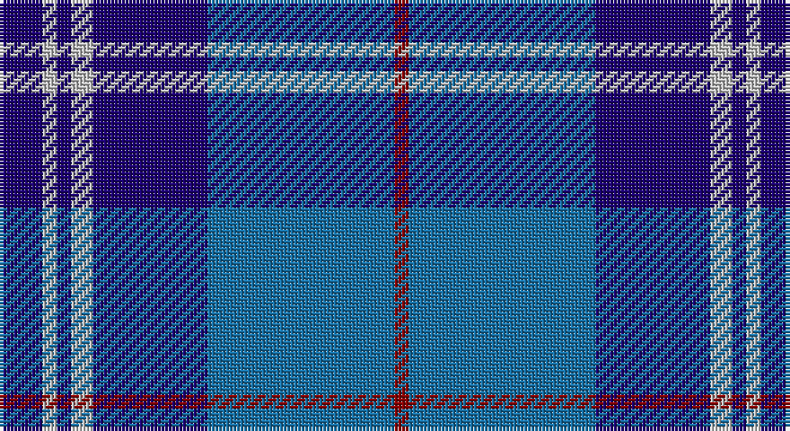

This page is one **sett** — a single exact thread-count. It belongs to the [tartan](/setts/db6lb2db2lb3db16b26r2/)
(the same proportion at any scale), whose colour order is pattern [BWBWBBR](/stripes/bwbwbbr/).

Sourced from register-of-tartans.  It is a [7 stripe tartan](/stripes/stripes7/).

Original link https://www.tartanregister.gov.uk/tartanDetails.aspx?ref=1155

## Also known as

This cloth is also recorded under:

- Federal Bureau of Investigation

2 attestations — the source records this cloth was collapsed from (oldest owns this page)

<ul>
<li>01/01/2002 — Federal Bureau of Investigation (register-of-tartans, <a href="https://www.tartanregister.gov.uk/tartanDetails.aspx?ref=1155">record</a>)</li>
<li>pre 2002 — FBI (Corporate) (tartans-authority, <a href="http://www.tartansauthority.com/tartan-ferret/display/83/">record</a>)</li>
</ul>

## Register references

External register numbers recorded for this tartan.

- Scottish Register of Tartans: [1155](https://www.tartanregister.gov.uk/tartanDetails.aspx?ref=1155)
- Scottish Tartans Authority (ITI): 83
- Scottish Tartans World Register: 83

## Thread count
DB/12 N4 DB4 N6 DB32 B52 DR/4

One full sett is **212 threads**.

## Palette

Palette: <strong>Tartan Register</strong>
<table><thead><tr><th>Colour</th><th>Threads</th><th>Shade</th><th>Base</th><th>OKLCh</th></tr></thead><tbody><tr><td>DB/</td><td style="text-align:right;font-variant-numeric:tabular-nums">12</td><td><code style="background-color:#1C0070;">#1C0070</code> <small style="color:#888">#1C0070</small></td><td>B <code style="background-color:#2A418A;">#2A418A</code></td><td><small style="color:#888">oklch(26.3% 0.162 277.1)</small></td></tr><tr><td>N</td><td style="text-align:right;font-variant-numeric:tabular-nums">4</td><td><code style="background-color:#C0C0C0;">#C0C0C0</code> <small style="color:#888">#C0C0C0</small></td><td>W <code style="background-color:#F7F7F7;">#F7F7F7</code></td><td><small style="color:#888">oklch(80.8% 0.000 89.9)</small></td></tr><tr><td>DB</td><td style="text-align:right;font-variant-numeric:tabular-nums">4</td><td><code style="background-color:#1C0070;">#1C0070</code> <small style="color:#888">#1C0070</small></td><td>B <code style="background-color:#2A418A;">#2A418A</code></td><td><small style="color:#888">oklch(26.3% 0.162 277.1)</small></td></tr><tr><td>N</td><td style="text-align:right;font-variant-numeric:tabular-nums">6</td><td><code style="background-color:#C0C0C0;">#C0C0C0</code> <small style="color:#888">#C0C0C0</small></td><td>W <code style="background-color:#F7F7F7;">#F7F7F7</code></td><td><small style="color:#888">oklch(80.8% 0.000 89.9)</small></td></tr><tr><td>DB</td><td style="text-align:right;font-variant-numeric:tabular-nums">32</td><td><code style="background-color:#1C0070;">#1C0070</code> <small style="color:#888">#1C0070</small></td><td>B <code style="background-color:#2A418A;">#2A418A</code></td><td><small style="color:#888">oklch(26.3% 0.162 277.1)</small></td></tr><tr><td>B</td><td style="text-align:right;font-variant-numeric:tabular-nums">52</td><td><code style="background-color:#1870A4;">#1870A4</code> <small style="color:#888">#1870A4</small></td><td>B <code style="background-color:#2A418A;">#2A418A</code></td><td><small style="color:#888">oklch(52.2% 0.113 241.2)</small></td></tr><tr><td>DR/</td><td style="text-align:right;font-variant-numeric:tabular-nums">4</td><td><code style="background-color:#880000;">#880000</code> <small style="color:#888">#880000</small></td><td>R <code style="background-color:#CC0000;">#CC0000</code></td><td><small style="color:#888">oklch(39.4% 0.162 29.2)</small></td></tr></tbody></table>

# Sample pattern

## Nearest tartans

The nearest existing variants by ΔTartan distance, with this tartan at the top so the swatches line up against it.

ΔTartan

Tartan

Sett

—

<a href="/ttd/edit/#slug=db6lb2db2lb3db16b26r2~x2">Federal Bureau of Investigation</a> <a class="nn-out" href="/variants/s7/db6lb2db2lb3db16b26r2~x2/" title="open its dictionary page">↗</a>

1.00

<a href="/ttd/edit/#slug=db7r3db26t2db2t26ly4~x2&amp;base=db6lb2db2lb3db16b26r2~x2">Int. Police Association (Official)</a> <a class="nn-out" href="/variants/s7/db7r3db26t2db2t26ly4~x2/" title="open its dictionary page">↗</a>

1.03

<a href="/ttd/edit/#slug=r4b12db36w4db4b16w3db6b3~x2&amp;base=db6lb2db2lb3db16b26r2~x2">Callaway (Name)</a> <a class="nn-out" href="/variants/s9/r4b12db36w4db4b16w3db6b3~x2/" title="open its dictionary page">↗</a>

1.05

<a href="/ttd/edit/#slug=db4p2dp3db24b24w3~x2&amp;base=db6lb2db2lb3db16b26r2~x2">Aberdeen Academy of Performing Arts</a> <a class="nn-out" href="/variants/s6/db4p2dp3db24b24w3~x2/" title="open its dictionary page">↗</a>

1.08

<a href="/ttd/edit/#slug=db4r1db18b18w1b4~x4&amp;base=db6lb2db2lb3db16b26r2~x2">Ewell Castle School</a> <a class="nn-out" href="/variants/s6/db4r1db18b18w1b4~x4/" title="open its dictionary page">↗</a>

1.09

<a href="/ttd/edit/#slug=db3dbi2t31db34w2~x2&amp;base=db6lb2db2lb3db16b26r2~x2">Gilt Edge (Corporate)</a> <a class="nn-out" href="/variants/s5/db3dbi2t31db34w2~x2/" title="open its dictionary page">↗</a>

1.15

<a href="/ttd/edit/#slug=db4dpi2dp3db24t24w3~x2&amp;base=db6lb2db2lb3db16b26r2~x2">Aberdeen Academy of Performing Art</a> <a class="nn-out" href="/variants/s6/db4dpi2dp3db24t24w3~x2/" title="open its dictionary page">↗</a>

1.17

<a href="/ttd/edit/#slug=b30k12dt12k2w3~x2&amp;base=db6lb2db2lb3db16b26r2~x2">MacNeil - 1994 (Personal)</a> <a class="nn-out" href="/variants/s5/b30k12dt12k2w3~x2/" title="open its dictionary page">↗</a>

1.23

<a href="/ttd/edit/#slug=db25k3db7k15b25k2b2w4~x2&amp;base=db6lb2db2lb3db16b26r2~x2">Sabema</a> <a class="nn-out" href="/variants/s8/db25k3db7k15b25k2b2w4~x2/" title="open its dictionary page">↗</a>

1.26

<a href="/ttd/edit/#slug=y12db2y2db30dbi3db2dbi13w4~x2&amp;base=db6lb2db2lb3db16b26r2~x2">Highlands School, (North Carolina)</a> <a class="nn-out" href="/variants/s8/y12db2y2db30dbi3db2dbi13w4~x2/" title="open its dictionary page">↗</a>

1.27

<a href="/ttd/edit/#slug=g2dg2g1dg14b2dg10b10dg2b14m1b2m2~x4&amp;base=db6lb2db2lb3db16b26r2~x2">Pacific</a> <a class="nn-out" href="/variants/s12/g2dg2g1dg14b2dg10b10dg2b14m1b2m2~x4/" title="open its dictionary page">↗</a>

## Neighbour map

Every grey dot is one of 14360 variants placed by the first two principal components of the ΔTartan feature space (44% of its variance). Red is this tartan; blue dots are its nearest — click one to open its page.

<svg viewBox="0 0 640 380" role="img" style="max-width:100%;height:auto;border:1px solid #e0e0e0;border-radius:4px;display:block" xmlns="http://www.w3.org/2000/svg"><image href="/nn/cloud.v1.png" width="640" height="380"/><a href="/variants/s7/db7r3db26t2db2t26ly4~x2/"><circle cx="288.1" cy="180.6" r="4" fill="#3465a4"><title>Int. Police Association (Official)</title></circle></a><a href="/variants/s9/r4b12db36w4db4b16w3db6b3~x2/"><circle cx="303.5" cy="181.4" r="4" fill="#3465a4"><title>Callaway (Name)</title></circle></a><a href="/variants/s6/db4p2dp3db24b24w3~x2/"><circle cx="264.3" cy="188.9" r="4" fill="#3465a4"><title>Aberdeen Academy of Performing Arts</title></circle></a><a href="/variants/s6/db4r1db18b18w1b4~x4/"><circle cx="345.4" cy="205.1" r="4" fill="#3465a4"><title>Ewell Castle School</title></circle></a><a href="/variants/s5/db3dbi2t31db34w2~x2/"><circle cx="345.4" cy="202.6" r="4" fill="#3465a4"><title>Gilt Edge (Corporate)</title></circle></a><a href="/variants/s6/db4dpi2dp3db24t24w3~x2/"><circle cx="265.6" cy="184.4" r="4" fill="#3465a4"><title>Aberdeen Academy of Performing Art</title></circle></a><a href="/variants/s5/b30k12dt12k2w3~x2/"><circle cx="280.1" cy="212.0" r="4" fill="#3465a4"><title>MacNeil - 1994 (Personal)</title></circle></a><a href="/variants/s8/db25k3db7k15b25k2b2w4~x2/"><circle cx="215.5" cy="195.5" r="4" fill="#3465a4"><title>Sabema</title></circle></a><a href="/variants/s8/y12db2y2db30dbi3db2dbi13w4~x2/"><circle cx="279.9" cy="171.4" r="4" fill="#3465a4"><title>Highlands School, (North Carolina)</title></circle></a><a href="/variants/s12/g2dg2g1dg14b2dg10b10dg2b14m1b2m2~x4/"><circle cx="286.3" cy="175.0" r="4" fill="#3465a4"><title>Pacific</title></circle></a><circle cx="288.2" cy="191.5" r="5" fill="#c00000"/></svg>

ID: /variants/s7/db6lb2db2lb3db16b26r2~x2/
