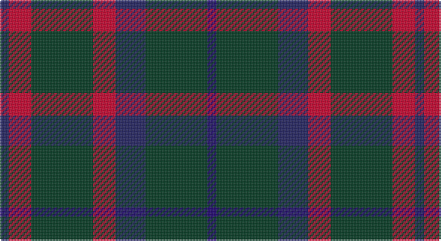

This page is one **sett** — a single exact thread-count. It belongs to the [tartan](/setts/db6r15dg41r15db20dg41dbi6/)
(the same proportion at any scale), whose colour order is pattern [BGBRGRB](/stripes/bgbrgrb/).

Sourced from house-of-tartan.  It is a [7 stripe tartan](/stripes/stripes7/).

Original link http://www.house-of-tartan.scotland.net/house/TartanViewjs.asp?colr=Def&tnam=106

## Provenance

Earliest known date: 1987 The weaving and wearing of this tartan is 'Restricted'. This is not a legal definition and is applied by the Scottish Tartans Society irrespective of Design Patent or Copyright, in the spirit of a gentlemans agreement. Interested parties should contact the person listed under 'Source:' in this document.

## Also known as

This cloth is also recorded under:

- Bean of Freeport
- Bean of Freeport Htg

## Thread count
DB/6 R15 DG41 R15 DB20 DG41 DBa/6

One full sett is **276 threads**.

## Palette

Palette: <strong>Tartan Register</strong>
<table><thead><tr><th>Colour</th><th>Threads</th><th>Shade</th><th>Base</th><th>OKLCh</th></tr></thead><tbody><tr><td>DB/</td><td style="text-align:right;font-variant-numeric:tabular-nums">6</td><td><code style="background-color:#202060;">#202060</code> <small style="color:#888">#202060</small></td><td>B <code style="background-color:#2A418A;">#2A418A</code></td><td><small style="color:#888">oklch(28.9% 0.111 276.9)</small></td></tr><tr><td>R</td><td style="text-align:right;font-variant-numeric:tabular-nums">15</td><td><code style="background-color:#C8002C;">#C8002C</code> <small style="color:#888">#C8002C</small></td><td>R <code style="background-color:#CC0000;">#CC0000</code></td><td><small style="color:#888">oklch(52.6% 0.212 22.0)</small></td></tr><tr><td>DG</td><td style="text-align:right;font-variant-numeric:tabular-nums">41</td><td><code style="background-color:#003820;">#003820</code> <small style="color:#888">#003820</small></td><td>G <code style="background-color:#006100;">#006100</code></td><td><small style="color:#888">oklch(30.0% 0.070 158.3)</small></td></tr><tr><td>R</td><td style="text-align:right;font-variant-numeric:tabular-nums">15</td><td><code style="background-color:#C8002C;">#C8002C</code> <small style="color:#888">#C8002C</small></td><td>R <code style="background-color:#CC0000;">#CC0000</code></td><td><small style="color:#888">oklch(52.6% 0.212 22.0)</small></td></tr><tr><td>DB</td><td style="text-align:right;font-variant-numeric:tabular-nums">20</td><td><code style="background-color:#202060;">#202060</code> <small style="color:#888">#202060</small></td><td>B <code style="background-color:#2A418A;">#2A418A</code></td><td><small style="color:#888">oklch(28.9% 0.111 276.9)</small></td></tr><tr><td>DG</td><td style="text-align:right;font-variant-numeric:tabular-nums">41</td><td><code style="background-color:#003820;">#003820</code> <small style="color:#888">#003820</small></td><td>G <code style="background-color:#006100;">#006100</code></td><td><small style="color:#888">oklch(30.0% 0.070 158.3)</small></td></tr><tr><td>DBa/</td><td style="text-align:right;font-variant-numeric:tabular-nums">6</td><td><code style="background-color:#1C0070;">#1C0070</code> <small style="color:#888">#1C0070</small></td><td>B <code style="background-color:#2A418A;">#2A418A</code></td><td><small style="color:#888">oklch(26.3% 0.162 277.1)</small></td></tr></tbody></table>

# Sample pattern

## Nearest tartans

The nearest existing variants by ΔTartan distance, with this tartan at the top so the swatches line up against it.

ΔTartan

Tartan

Sett

—

<a href="/ttd/edit/#slug=db6r15dg41r15db20dg41dbi6">Bean Hunting Clan Tartan</a> <a class="nn-out" href="/variants/s7/db6r15dg41r15db20dg41dbi6/" title="open its dictionary page">↗</a>

0.35

<a href="/ttd/edit/#slug=dt6r15dg41r15dt20dg41db6&amp;base=db6r15dg41r15db20dg41dbi6">Bean of Freeport (Personal)</a> <a class="nn-out" href="/variants/s7/dt6r15dg41r15dt20dg41db6/" title="open its dictionary page">↗</a>

0.83

<a href="/ttd/edit/#slug=n16k13n7dy3r2dy3n7k13n16~x2&amp;base=db6r15dg41r15db20dg41dbi6">Klappert (Name)</a> <a class="nn-out" href="/variants/s9/n16k13n7dy3r2dy3n7k13n16~x2/" title="open its dictionary page">↗</a>

0.93

<a href="/ttd/edit/#slug=r4k11n8dg2n8k13dg2k13r5k2~x2&amp;base=db6r15dg41r15db20dg41dbi6">Process Safety Solutions Ltd</a> <a class="nn-out" href="/variants/s10/r4k11n8dg2n8k13dg2k13r5k2~x2/" title="open its dictionary page">↗</a>

1.01

<a href="/ttd/edit/#slug=dg8r2dg2r3dg8db12dg2ly2~x2&amp;base=db6r15dg41r15db20dg41dbi6">Glen Nevis #1 (Fashion)</a> <a class="nn-out" href="/variants/s8/dg8r2dg2r3dg8db12dg2ly2~x2/" title="open its dictionary page">↗</a>

1.05

<a href="/ttd/edit/#slug=dt6r15g41r15dt20g41db6&amp;base=db6r15dg41r15db20dg41dbi6">Bean of Freeport Htg (Corporate)</a> <a class="nn-out" href="/variants/s7/dt6r15g41r15dt20g41db6/" title="open its dictionary page">↗</a>

1.09

<a href="/ttd/edit/#slug=t3k16dg16k16db3t3~x2&amp;base=db6r15dg41r15db20dg41dbi6">Murray</a> <a class="nn-out" href="/variants/s6/t3k16dg16k16db3t3~x2/" title="open its dictionary page">↗</a>

1.09

<a href="/ttd/edit/#slug=dg8r2dg2r3dg8db12dg2lo2~x2&amp;base=db6r15dg41r15db20dg41dbi6">Glen Nevis #1</a> <a class="nn-out" href="/variants/s8/dg8r2dg2r3dg8db12dg2lo2~x2/" title="open its dictionary page">↗</a>

1.11

<a href="/ttd/edit/#slug=r3dg10r3dg14db16dg3ly2~x2&amp;base=db6r15dg41r15db20dg41dbi6">Cameron Hunting</a> <a class="nn-out" href="/variants/s7/r3dg10r3dg14db16dg3ly2~x2/" title="open its dictionary page">↗</a>

1.19

<a href="/ttd/edit/#slug=dt16k13dt7dy3r2dy3dt7k13dt16~x2&amp;base=db6r15dg41r15db20dg41dbi6">Klappert, Denmark (Personal)</a> <a class="nn-out" href="/variants/s9/dt16k13dt7dy3r2dy3dt7k13dt16~x2/" title="open its dictionary page">↗</a>

1.22

<a href="/ttd/edit/#slug=dy15r5dy30db32dy4ly3~x2&amp;base=db6r15dg41r15db20dg41dbi6">Cameron Hunting Brown Clan Tartan</a> <a class="nn-out" href="/variants/s6/dy15r5dy30db32dy4ly3~x2/" title="open its dictionary page">↗</a>

## Neighbour map

Every grey dot is one of 14360 variants placed by the first two principal components of the ΔTartan feature space (44% of its variance). Red is this tartan; blue dots are its nearest — click one to open its page.

<svg viewBox="0 0 640 380" role="img" style="max-width:100%;height:auto;border:1px solid #e0e0e0;border-radius:4px;display:block" xmlns="http://www.w3.org/2000/svg"><image href="/nn/cloud.v1.png" width="640" height="380"/><a href="/variants/s7/dt6r15dg41r15dt20dg41db6/"><circle cx="311.0" cy="263.3" r="4" fill="#3465a4"><title>Bean of Freeport (Personal)</title></circle></a><a href="/variants/s9/n16k13n7dy3r2dy3n7k13n16~x2/"><circle cx="323.7" cy="253.3" r="4" fill="#3465a4"><title>Klappert (Name)</title></circle></a><a href="/variants/s10/r4k11n8dg2n8k13dg2k13r5k2~x2/"><circle cx="293.9" cy="250.4" r="4" fill="#3465a4"><title>Process Safety Solutions Ltd</title></circle></a><a href="/variants/s8/dg8r2dg2r3dg8db12dg2ly2~x2/"><circle cx="263.8" cy="247.2" r="4" fill="#3465a4"><title>Glen Nevis #1 (Fashion)</title></circle></a><a href="/variants/s7/dt6r15g41r15dt20g41db6/"><circle cx="304.7" cy="259.1" r="4" fill="#3465a4"><title>Bean of Freeport Htg (Corporate)</title></circle></a><a href="/variants/s6/t3k16dg16k16db3t3~x2/"><circle cx="300.9" cy="282.5" r="4" fill="#3465a4"><title>Murray</title></circle></a><a href="/variants/s8/dg8r2dg2r3dg8db12dg2lo2~x2/"><circle cx="276.0" cy="256.3" r="4" fill="#3465a4"><title>Glen Nevis #1</title></circle></a><a href="/variants/s7/r3dg10r3dg14db16dg3ly2~x2/"><circle cx="285.2" cy="242.4" r="4" fill="#3465a4"><title>Cameron Hunting</title></circle></a><a href="/variants/s9/dt16k13dt7dy3r2dy3dt7k13dt16~x2/"><circle cx="342.3" cy="268.4" r="4" fill="#3465a4"><title>Klappert, Denmark (Personal)</title></circle></a><a href="/variants/s6/dy15r5dy30db32dy4ly3~x2/"><circle cx="355.4" cy="235.9" r="4" fill="#3465a4"><title>Cameron Hunting Brown Clan Tartan</title></circle></a><circle cx="306.2" cy="259.4" r="5" fill="#c00000"/></svg>

ID: /variants/s7/db6r15dg41r15db20dg41dbi6/
