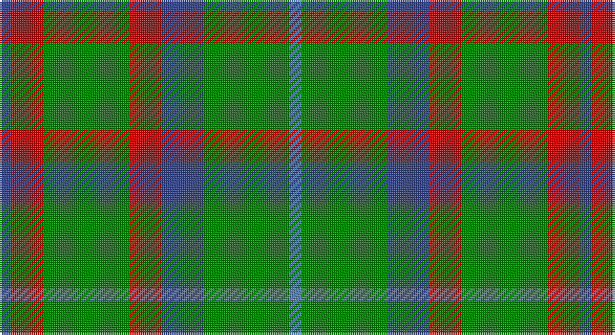

This page is one **sett** — a single exact thread-count. It belongs to the [tartan](/setts/db6r15g41r15db20g41t6/)
(the same proportion at any scale), whose colour order is pattern [BGBRGRB](/stripes/bgbrgrb/).

Sourced from weddslist.  It is a [7 stripe tartan](/stripes/stripes7/).

Original link http://www.weddslist.com/cgi-bin/tartans/pg.pl?source=sts

## Thread count
B/6 R15 G41 R15 B20 G41 Ba/6

One full sett is **276 threads**.

## Palette

Palette: <strong>custom</strong>
<table><thead><tr><th>Colour</th><th>Threads</th><th>Shade</th><th>Base</th><th>OKLCh</th></tr></thead><tbody><tr><td>B/</td><td style="text-align:right;font-variant-numeric:tabular-nums">6</td><td><code style="background-color:#304080;">#304080</code> <small style="color:#888">#304080</small></td><td>B <code style="background-color:#2A418A;">#2A418A</code></td><td><small style="color:#888">oklch(39.4% 0.109 270.2)</small></td></tr><tr><td>R</td><td style="text-align:right;font-variant-numeric:tabular-nums">15</td><td><code style="background-color:#C00000;">#C00000</code> <small style="color:#888">#C00000</small></td><td>R <code style="background-color:#CC0000;">#CC0000</code></td><td><small style="color:#888">oklch(50.7% 0.208 29.2)</small></td></tr><tr><td>G</td><td style="text-align:right;font-variant-numeric:tabular-nums">41</td><td><code style="background-color:#008000;">#008000</code> <small style="color:#888">#008000</small></td><td>G <code style="background-color:#006100;">#006100</code></td><td><small style="color:#888">oklch(52.0% 0.177 142.5)</small></td></tr><tr><td>R</td><td style="text-align:right;font-variant-numeric:tabular-nums">15</td><td><code style="background-color:#C00000;">#C00000</code> <small style="color:#888">#C00000</small></td><td>R <code style="background-color:#CC0000;">#CC0000</code></td><td><small style="color:#888">oklch(50.7% 0.208 29.2)</small></td></tr><tr><td>B</td><td style="text-align:right;font-variant-numeric:tabular-nums">20</td><td><code style="background-color:#304080;">#304080</code> <small style="color:#888">#304080</small></td><td>B <code style="background-color:#2A418A;">#2A418A</code></td><td><small style="color:#888">oklch(39.4% 0.109 270.2)</small></td></tr><tr><td>G</td><td style="text-align:right;font-variant-numeric:tabular-nums">41</td><td><code style="background-color:#008000;">#008000</code> <small style="color:#888">#008000</small></td><td>G <code style="background-color:#006100;">#006100</code></td><td><small style="color:#888">oklch(52.0% 0.177 142.5)</small></td></tr><tr><td>Ba/</td><td style="text-align:right;font-variant-numeric:tabular-nums">6</td><td><code style="background-color:#5480B0;">#5480B0</code> <small style="color:#888">#5480B0</small></td><td>B <code style="background-color:#2A418A;">#2A418A</code></td><td><small style="color:#888">oklch(58.8% 0.089 251.5)</small></td></tr></tbody></table>

# Sample pattern

## Nearest tartans

The nearest existing variants by ΔTartan distance, with this tartan at the top so the swatches line up against it.

ΔTartan

Tartan

Sett

—

<a href="/ttd/edit/#slug=db6r15g41r15db20g41t6">Bean Hunting</a> <a class="nn-out" href="/variants/s7/db6r15g41r15db20g41t6/" title="open its dictionary page">↗</a>

0.93

<a href="/ttd/edit/#slug=r5g20r5g20db24g6ly4&amp;base=db6r15g41r15db20g41t6">Cameron of Lochiel (Hunting) Clan/Family Tartan</a> <a class="nn-out" href="/variants/s7/r5g20r5g20db24g6ly4/" title="open its dictionary page">↗</a>

1.08

<a href="/ttd/edit/#slug=ly2g12db6r3g12r4db1~x2&amp;base=db6r15g41r15db20g41t6">MacKintosh Hunting</a> <a class="nn-out" href="/variants/s7/ly2g12db6r3g12r4db1~x2/" title="open its dictionary page">↗</a>

1.20

<a href="/ttd/edit/#slug=g10db2r8lo2g5~x4&amp;base=db6r15g41r15db20g41t6">Cub Scouts of America</a> <a class="nn-out" href="/variants/s5/g10db2r8lo2g5~x4/" title="open its dictionary page">↗</a>

1.20

<a href="/ttd/edit/#slug=g4r2db4r2g8r2db4r2g8r2ly1~x3&amp;base=db6r15g41r15db20g41t6">Hall</a> <a class="nn-out" href="/variants/s11/g4r2db4r2g8r2db4r2g8r2ly1~x3/" title="open its dictionary page">↗</a>

1.23

<a href="/ttd/edit/#slug=dt6r15g41r15dt20g41db6&amp;base=db6r15g41r15db20g41t6">Bean of Freeport Htg (Corporate)</a> <a class="nn-out" href="/variants/s7/dt6r15g41r15dt20g41db6/" title="open its dictionary page">↗</a>

1.28

<a href="/ttd/edit/#slug=db5dg8k1ly2k1dg8db4~x4&amp;base=db6r15g41r15db20g41t6">Salvation Army Htg (Corporate)</a> <a class="nn-out" href="/variants/s7/db5dg8k1ly2k1dg8db4~x4/" title="open its dictionary page">↗</a>

1.33

<a href="/ttd/edit/#slug=dg2y14dg8y3dg12lo2~x2&amp;base=db6r15g41r15db20g41t6">Confederate Cavalry (Military)</a> <a class="nn-out" href="/variants/s6/dg2y14dg8y3dg12lo2~x2/" title="open its dictionary page">↗</a>

1.34

<a href="/ttd/edit/#slug=g6ly1r1t2r2~x4&amp;base=db6r15g41r15db20g41t6">Wilson's, No 179</a> <a class="nn-out" href="/variants/s5/g6ly1r1t2r2~x4/" title="open its dictionary page">↗</a>

1.34

<a href="/ttd/edit/#slug=g3db8g3k4g15r2~x2&amp;base=db6r15g41r15db20g41t6">Lauder (Family)</a> <a class="nn-out" href="/variants/s6/g3db8g3k4g15r2~x2/" title="open its dictionary page">↗</a>

1.39

<a href="/ttd/edit/#slug=g25r4db24r21g25r3db4~x2&amp;base=db6r15g41r15db20g41t6">Glasgow</a> <a class="nn-out" href="/variants/s7/g25r4db24r21g25r3db4~x2/" title="open its dictionary page">↗</a>

## Neighbour map

Every grey dot is one of 14360 variants placed by the first two principal components of the ΔTartan feature space (44% of its variance). Red is this tartan; blue dots are its nearest — click one to open its page.

<svg viewBox="0 0 640 380" role="img" style="max-width:100%;height:auto;border:1px solid #e0e0e0;border-radius:4px;display:block" xmlns="http://www.w3.org/2000/svg"><image href="/nn/cloud.v1.png" width="640" height="380"/><a href="/variants/s7/r5g20r5g20db24g6ly4/"><circle cx="263.7" cy="248.8" r="4" fill="#3465a4"><title>Cameron of Lochiel (Hunting) Clan/Family Tartan</title></circle></a><a href="/variants/s7/ly2g12db6r3g12r4db1~x2/"><circle cx="322.1" cy="217.6" r="4" fill="#3465a4"><title>MacKintosh Hunting</title></circle></a><a href="/variants/s5/g10db2r8lo2g5~x4/"><circle cx="279.2" cy="283.4" r="4" fill="#3465a4"><title>Cub Scouts of America</title></circle></a><a href="/variants/s11/g4r2db4r2g8r2db4r2g8r2ly1~x3/"><circle cx="241.7" cy="216.1" r="4" fill="#3465a4"><title>Hall</title></circle></a><a href="/variants/s7/dt6r15g41r15dt20g41db6/"><circle cx="304.7" cy="259.1" r="4" fill="#3465a4"><title>Bean of Freeport Htg (Corporate)</title></circle></a><a href="/variants/s7/db5dg8k1ly2k1dg8db4~x4/"><circle cx="295.3" cy="252.9" r="4" fill="#3465a4"><title>Salvation Army Htg (Corporate)</title></circle></a><a href="/variants/s6/dg2y14dg8y3dg12lo2~x2/"><circle cx="336.6" cy="274.7" r="4" fill="#3465a4"><title>Confederate Cavalry (Military)</title></circle></a><a href="/variants/s5/g6ly1r1t2r2~x4/"><circle cx="244.6" cy="244.0" r="4" fill="#3465a4"><title>Wilson's, No 179</title></circle></a><a href="/variants/s6/g3db8g3k4g15r2~x2/"><circle cx="328.7" cy="254.2" r="4" fill="#3465a4"><title>Lauder (Family)</title></circle></a><a href="/variants/s7/g25r4db24r21g25r3db4~x2/"><circle cx="256.5" cy="248.8" r="4" fill="#3465a4"><title>Glasgow</title></circle></a><circle cx="283.8" cy="247.3" r="5" fill="#c00000"/></svg>

ID: /variants/s7/db6r15g41r15db20g41t6/
