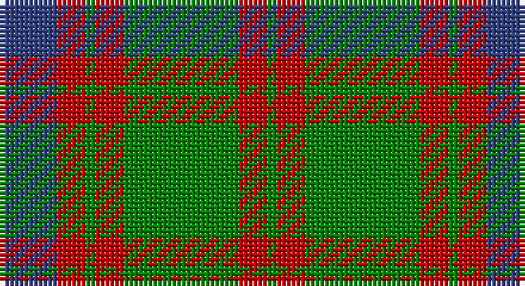

This page is one **sett** — a single exact thread-count. It belongs to the [tartan](/setts/db6r3g1r3g12r3g1/)
(the same proportion at any scale), whose colour order is pattern [BRGRGRG](/stripes/brgrgrg/).

Part of the [Skene](/tartans/skene/) tartan — the named design grouping this sett with its other cloths.

Sourced from weddslist.  It is a [7 stripe tartan](/stripes/stripes7/).

Original link http://www.weddslist.com/cgi-bin/tartans/pg.pl?source=sts

## Also known as

This cloth is also recorded under:

- Logan, or Skene
- Skene #2

## Thread count
B/12 R6 G2 R6 G24 R6 G/2

One full sett is **102 threads**.

## Palette

Palette: <strong>custom</strong>
<table><thead><tr><th>Colour</th><th>Threads</th><th>Shade</th><th>Base</th><th>OKLCh</th></tr></thead><tbody><tr><td>B/</td><td style="text-align:right;font-variant-numeric:tabular-nums">12</td><td><code style="background-color:#304080;">#304080</code> <small style="color:#888">#304080</small></td><td>B <code style="background-color:#2A418A;">#2A418A</code></td><td><small style="color:#888">oklch(39.4% 0.109 270.2)</small></td></tr><tr><td>R</td><td style="text-align:right;font-variant-numeric:tabular-nums">6</td><td><code style="background-color:#C00000;">#C00000</code> <small style="color:#888">#C00000</small></td><td>R <code style="background-color:#CC0000;">#CC0000</code></td><td><small style="color:#888">oklch(50.7% 0.208 29.2)</small></td></tr><tr><td>G</td><td style="text-align:right;font-variant-numeric:tabular-nums">2</td><td><code style="background-color:#008000;">#008000</code> <small style="color:#888">#008000</small></td><td>G <code style="background-color:#006100;">#006100</code></td><td><small style="color:#888">oklch(52.0% 0.177 142.5)</small></td></tr><tr><td>R</td><td style="text-align:right;font-variant-numeric:tabular-nums">6</td><td><code style="background-color:#C00000;">#C00000</code> <small style="color:#888">#C00000</small></td><td>R <code style="background-color:#CC0000;">#CC0000</code></td><td><small style="color:#888">oklch(50.7% 0.208 29.2)</small></td></tr><tr><td>G</td><td style="text-align:right;font-variant-numeric:tabular-nums">24</td><td><code style="background-color:#008000;">#008000</code> <small style="color:#888">#008000</small></td><td>G <code style="background-color:#006100;">#006100</code></td><td><small style="color:#888">oklch(52.0% 0.177 142.5)</small></td></tr><tr><td>R</td><td style="text-align:right;font-variant-numeric:tabular-nums">6</td><td><code style="background-color:#C00000;">#C00000</code> <small style="color:#888">#C00000</small></td><td>R <code style="background-color:#CC0000;">#CC0000</code></td><td><small style="color:#888">oklch(50.7% 0.208 29.2)</small></td></tr><tr><td>G/</td><td style="text-align:right;font-variant-numeric:tabular-nums">2</td><td><code style="background-color:#008000;">#008000</code> <small style="color:#888">#008000</small></td><td>G <code style="background-color:#006100;">#006100</code></td><td><small style="color:#888">oklch(52.0% 0.177 142.5)</small></td></tr></tbody></table>

# Sample pattern

## Nearest tartans

The nearest existing variants by ΔTartan distance, with this tartan at the top so the swatches line up against it.

ΔTartan

Tartan

Sett

—

<a href="/ttd/edit/#slug=db6r3g1r3g12r3g1~x2">Skene</a> <a class="nn-out" href="/variants/s7/db6r3g1r3g12r3g1~x2/" title="open its dictionary page">↗</a>

0.62

<a href="/ttd/edit/#slug=db6r3g1r3g12r3g1~x4&amp;base=db6r3g1r3g12r3g1~x2">Skene - 1831 (Clan)</a> <a class="nn-out" href="/variants/s7/db6r3g1r3g12r3g1~x4/" title="open its dictionary page">↗</a>

0.75

<a href="/ttd/edit/#slug=db8r3db1r3g14r3db1~x4&amp;base=db6r3g1r3g12r3g1~x2">Logan</a> <a class="nn-out" href="/variants/s7/db8r3db1r3g14r3db1~x4/" title="open its dictionary page">↗</a>

0.89

<a href="/ttd/edit/#slug=db10r2g2r6g16r1g2r1g3r6~x2&amp;base=db6r3g1r3g12r3g1~x2">Nithsdale</a> <a class="nn-out" href="/variants/s10/db10r2g2r6g16r1g2r1g3r6~x2/" title="open its dictionary page">↗</a>

1.00

<a href="/ttd/edit/#slug=lo6n2lo2n2lo18n13dt13n2~x2&amp;base=db6r3g1r3g12r3g1~x2">Heil, Rudiger (Personal)</a> <a class="nn-out" href="/variants/s8/lo6n2lo2n2lo18n13dt13n2~x2/" title="open its dictionary page">↗</a>

1.00

<a href="/ttd/edit/#slug=g25r4db24r21g25r3db4~x2&amp;base=db6r3g1r3g12r3g1~x2">Glasgow</a> <a class="nn-out" href="/variants/s7/g25r4db24r21g25r3db4~x2/" title="open its dictionary page">↗</a>

1.08

<a href="/ttd/edit/#slug=r6db2r2db21g20r4g4~x2&amp;base=db6r3g1r3g12r3g1~x2">Robertson of Struan</a> <a class="nn-out" href="/variants/s7/r6db2r2db21g20r4g4~x2/" title="open its dictionary page">↗</a>

1.11

<a href="/ttd/edit/#slug=db10r2g2r6g16r1g2r1g3r6~x4&amp;base=db6r3g1r3g12r3g1~x2">Nithsdale (3 colours) (District)</a> <a class="nn-out" href="/variants/s10/db10r2g2r6g16r1g2r1g3r6~x4/" title="open its dictionary page">↗</a>

1.19

<a href="/ttd/edit/#slug=r4t3r32db30r4g32r3g32r3g3~x2&amp;base=db6r3g1r3g12r3g1~x2">Unidentified Plaid 6</a> <a class="nn-out" href="/variants/s10/r4t3r32db30r4g32r3g32r3g3~x2/" title="open its dictionary page">↗</a>

1.20

<a href="/ttd/edit/#slug=g28r4dp25r22g27r4dp2~x2&amp;base=db6r3g1r3g12r3g1~x2">Glasgow, City of</a> <a class="nn-out" href="/variants/s7/g28r4dp25r22g27r4dp2~x2/" title="open its dictionary page">↗</a>

1.22

<a href="/ttd/edit/#slug=g25m4db24m21g25m4db2~x2&amp;base=db6r3g1r3g12r3g1~x2">Glasgow, Rock and Wheel</a> <a class="nn-out" href="/variants/s7/g25m4db24m21g25m4db2~x2/" title="open its dictionary page">↗</a>

## Neighbour map

Every grey dot is one of 14360 variants placed by the first two principal components of the ΔTartan feature space (44% of its variance). Red is this tartan; blue dots are its nearest — click one to open its page.

<svg viewBox="0 0 640 380" role="img" style="max-width:100%;height:auto;border:1px solid #e0e0e0;border-radius:4px;display:block" xmlns="http://www.w3.org/2000/svg"><image href="/nn/cloud.v1.png" width="640" height="380"/><a href="/variants/s7/db6r3g1r3g12r3g1~x4/"><circle cx="298.3" cy="217.5" r="4" fill="#3465a4"><title>Skene - 1831 (Clan)</title></circle></a><a href="/variants/s7/db8r3db1r3g14r3db1~x4/"><circle cx="279.5" cy="207.1" r="4" fill="#3465a4"><title>Logan</title></circle></a><a href="/variants/s10/db10r2g2r6g16r1g2r1g3r6~x2/"><circle cx="301.1" cy="185.3" r="4" fill="#3465a4"><title>Nithsdale</title></circle></a><a href="/variants/s8/lo6n2lo2n2lo18n13dt13n2~x2/"><circle cx="279.0" cy="228.3" r="4" fill="#3465a4"><title>Heil, Rudiger (Personal)</title></circle></a><a href="/variants/s7/g25r4db24r21g25r3db4~x2/"><circle cx="256.5" cy="248.8" r="4" fill="#3465a4"><title>Glasgow</title></circle></a><a href="/variants/s7/r6db2r2db21g20r4g4~x2/"><circle cx="268.9" cy="222.2" r="4" fill="#3465a4"><title>Robertson of Struan</title></circle></a><a href="/variants/s10/db10r2g2r6g16r1g2r1g3r6~x4/"><circle cx="301.9" cy="185.3" r="4" fill="#3465a4"><title>Nithsdale (3 colours) (District)</title></circle></a><a href="/variants/s10/r4t3r32db30r4g32r3g32r3g3~x2/"><circle cx="260.7" cy="183.6" r="4" fill="#3465a4"><title>Unidentified Plaid 6</title></circle></a><a href="/variants/s7/g28r4dp25r22g27r4dp2~x2/"><circle cx="298.2" cy="224.7" r="4" fill="#3465a4"><title>Glasgow, City of</title></circle></a><a href="/variants/s7/g25m4db24m21g25m4db2~x2/"><circle cx="291.1" cy="245.9" r="4" fill="#3465a4"><title>Glasgow, Rock and Wheel</title></circle></a><circle cx="297.2" cy="217.3" r="5" fill="#c00000"/></svg>

ID: /variants/s7/db6r3g1r3g12r3g1~x2/
