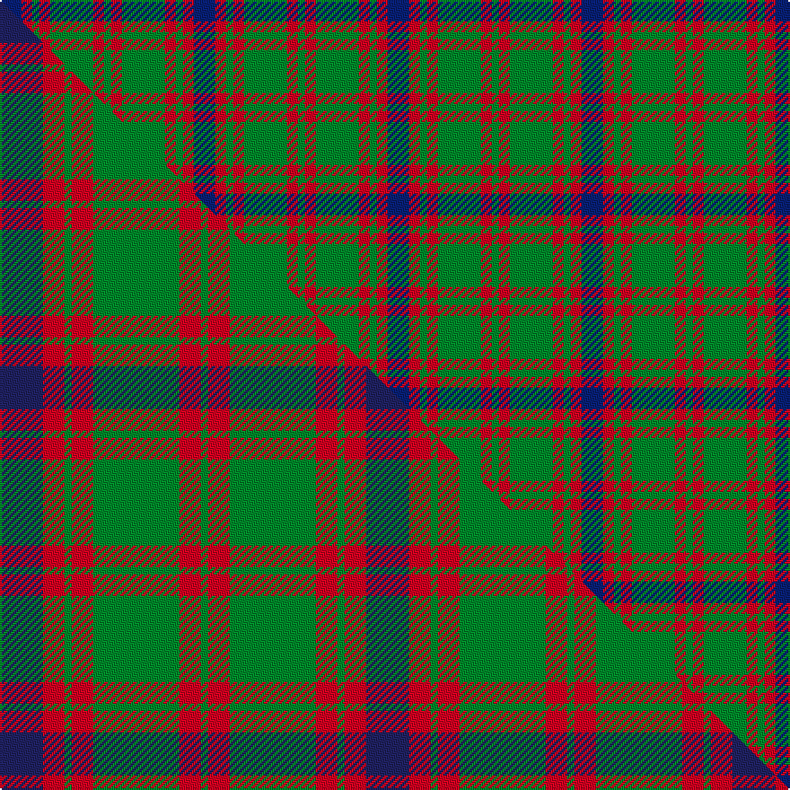

This page is one **sett** — a single exact thread-count. It belongs to the [tartan](/setts/db6r3g2r3g12r3g2/)
(the same proportion at any scale), whose colour order is pattern [BRGRGRG](/stripes/brgrgrg/).

Part of the [Skene](/tartans/skene/) tartan — the named design grouping this sett with its other cloths.

Sourced from house-of-tartan.  It is a [7 stripe tartan](/stripes/stripes7/).

Original link http://www.house-of-tartan.scotland.net/house/TartanViewjs.asp?colr=Def&tnam=516

## Provenance

Earliest known date: 1886 Smith No 53 has ROSE in place of RED. Grant's version is similar to the sample named Skene in the 1830 pattern book of Wilson's of Bannockburn.

## Thread count
DB/12 R6 G4 R6 G24 R6 G/4

One full sett is **108 threads**.

## Palette
<table><thead><tr><th>Colour</th><th>Shade</th><th>OKLCh</th></tr></thead><tbody><tr><td>DB</td><td><code style="background-color:#082077;">#082077</code> <small style="color:#888">#082077</small></td><td><small style="color:#888">oklch(30.0% 0.149 265.1)</small></td></tr><tr><td>G</td><td><code style="background-color:#008B2A;">#008B2A</code> <small style="color:#888">#008B2A</small></td><td><small style="color:#888">oklch(55.4% 0.170 145.9)</small></td></tr><tr><td>R</td><td><code style="background-color:#D60020;">#D60020</code> <small style="color:#888">#D60020</small></td><td><small style="color:#888">oklch(55.2% 0.224 25.5)</small></td></tr></tbody></table>

# Sample pattern

## Compared to the master

This cloth is one sett of its design; the master sett (the exemplar the design is anchored on) is below for comparison.

Its **ΔTartan distance** from the master is **1.19** — the same measure the nearest-tartans table ranks by (0 is identical; a re-scale of the same cloth is near 0, a recolour or a different proportion further).

<figure class="master-compare" style="margin:0">

this sett
master sett ★

<figcaption style="color:#888;font-size:smaller">One weave of this sett against the <a href="/setts/db6r3g1r3g12r3g1/">master sett ★</a>, split on the diagonal: a shared proportion runs seamlessly across it with only the shades shifting; a different proportion breaks on it.</figcaption>
</figure>

## Nearest tartan variants

The nearest existing variants by ΔTartan distance, with this cloth at the top so the swatches line up against it.

ΔTartan

Threads

Variant

Sett

—

108

<a href="/variants/s7/db6r3g2r3g12r3g2~x2/">Skene Clan Tartan</a>

<a href="/ttd/edit/#slug=db6r3g1r3g12r3g1~x4&amp;base=db6r3g2r3g12r3g2~x2" title="compare in the TTD">0.53</a>

204

<a href="/variants/s7/db6r3g1r3g12r3g1~x4/">Skene - 1831 (Clan)</a>

<a href="/ttd/edit/#slug=db6r3g1r3g12r3g1~x2&amp;base=db6r3g2r3g12r3g2~x2" title="compare in the TTD">0.53</a>

102

<a href="/variants/s7/db6r3g1r3g12r3g1~x2/">Skene</a>

<a href="/ttd/edit/#slug=db9r6g2r6g18r6g2&amp;base=db6r3g2r3g12r3g2~x2" title="compare in the TTD">0.59</a>

87

<a href="/variants/s7/db9r6g2r6g18r6g2/">Skene D</a>

<a href="/ttd/edit/#slug=db9r6g2r6g18r6g2~x2&amp;base=db6r3g2r3g12r3g2~x2" title="compare in the TTD">0.59</a>

174

<a href="/variants/s7/db9r6g2r6g18r6g2~x2/">Skene D</a>

<a href="/ttd/edit/#slug=g25r4db24r21g25r3db4~x2&amp;base=db6r3g2r3g12r3g2~x2" title="compare in the TTD">1.56</a>

366

<a href="/variants/s7/g25r4db24r21g25r3db4~x2/">Glasgow #2</a>

<a href="/ttd/edit/#slug=r6db2r2db21g20r4g4~x2&amp;base=db6r3g2r3g12r3g2~x2" title="compare in the TTD">1.61</a>

216

<a href="/variants/s7/r6db2r2db21g20r4g4~x2/">Robertson of Struan</a>

<a href="/ttd/edit/#slug=r30g3db5g21r3g21db2~x2&amp;base=db6r3g2r3g12r3g2~x2" title="compare in the TTD">1.67</a>

276

<a href="/variants/s7/r30g3db5g21r3g21db2~x2/">Scottish Piping Soc. of London (Corp</a>

<a href="/ttd/edit/#slug=db30r5g30r22db30r5g4&amp;base=db6r3g2r3g12r3g2~x2" title="compare in the TTD">1.77</a>

218

<a href="/variants/s7/db30r5g30r22db30r5g4/">GS Gaelic School (School)</a>

<a href="/ttd/edit/#slug=r5g20r5g20db24g6y4&amp;base=db6r3g2r3g12r3g2~x2" title="compare in the TTD">2.08</a>

159

<a href="/variants/s7/r5g20r5g20db24g6y4/">Cameron of Lochiel (Hunting) Clan/Family Tartan</a>

<a href="/ttd/edit/#slug=r3g10r3g14db16g3y2~x2&amp;base=db6r3g2r3g12r3g2~x2" title="compare in the TTD">2.11</a>

194

<a href="/variants/s7/r3g10r3g14db16g3y2~x2/">Cameron of Lochiel (Hunting)</a>

## Neighbour map

Every grey dot is one of 13620 variants placed by the first two principal components of the ΔTartan feature space (42% of its variance). Red is this tartan; blue dots are its nearest — click one to open its page.

<svg viewBox="0 0 640 380" role="img" style="max-width:100%;height:auto;border:1px solid #e0e0e0;border-radius:4px;display:block" xmlns="http://www.w3.org/2000/svg"><image href="/nn/cloud.v1.png" width="640" height="380"/><a href="/variants/s7/db6r3g1r3g12r3g1~x4/"><circle cx="291.4" cy="214.6" r="4" fill="#3465a4"><title>Skene - 1831 (Clan)</title></circle></a><a href="/variants/s7/db6r3g1r3g12r3g1~x2/"><circle cx="291.4" cy="214.6" r="4" fill="#3465a4"><title>Skene</title></circle></a><a href="/variants/s7/db9r6g2r6g18r6g2/"><circle cx="263.8" cy="237.3" r="4" fill="#3465a4"><title>Skene D</title></circle></a><a href="/variants/s7/db9r6g2r6g18r6g2~x2/"><circle cx="263.8" cy="237.3" r="4" fill="#3465a4"><title>Skene D</title></circle></a><a href="/variants/s7/g25r4db24r21g25r3db4~x2/"><circle cx="255.9" cy="246.9" r="4" fill="#3465a4"><title>Glasgow #2</title></circle></a><a href="/variants/s7/r6db2r2db21g20r4g4~x2/"><circle cx="258.9" cy="216.3" r="4" fill="#3465a4"><title>Robertson of Struan</title></circle></a><a href="/variants/s7/r30g3db5g21r3g21db2~x2/"><circle cx="349.6" cy="207.4" r="4" fill="#3465a4"><title>Scottish Piping Soc. of London (Corp</title></circle></a><a href="/variants/s7/db30r5g30r22db30r5g4/"><circle cx="252.7" cy="247.3" r="4" fill="#3465a4"><title>GS Gaelic School (School)</title></circle></a><a href="/variants/s7/r5g20r5g20db24g6y4/"><circle cx="273.7" cy="248.9" r="4" fill="#3465a4"><title>Cameron of Lochiel (Hunting) Clan/Family Tartan</title></circle></a><a href="/variants/s7/r3g10r3g14db16g3y2~x2/"><circle cx="279.0" cy="230.7" r="4" fill="#3465a4"><title>Cameron of Lochiel (Hunting)</title></circle></a><circle cx="279.1" cy="250.1" r="5" fill="#c00000"/><text x="320" y="376" text-anchor="middle" font-size="11" fill="#999">ground</text><text x="11" y="190" text-anchor="middle" font-size="11" fill="#999" transform="rotate(-90 11 190)">complexity</text></svg>

ID: /variants/s7/db6r3g2r3g12r3g2~x2/
