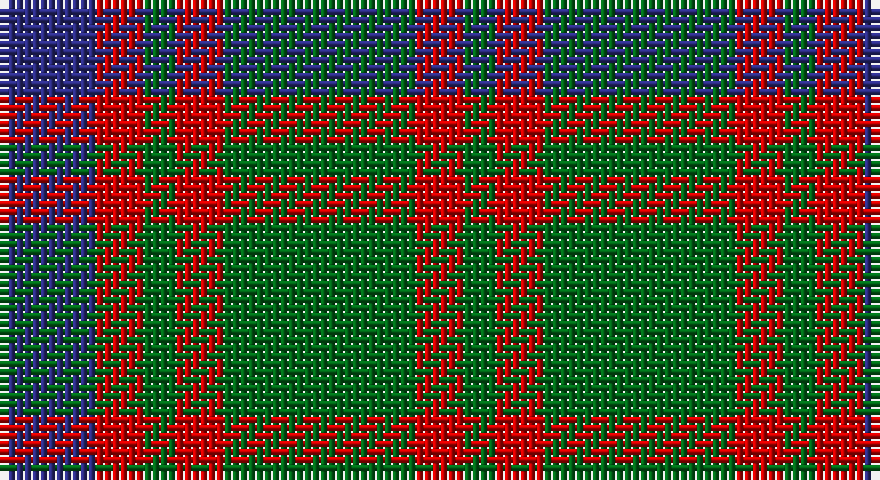

This page is one **sett** — a single exact thread-count. It belongs to the [tartan](/setts/db6r3g2r3g12r3g2/)
(the same proportion at any scale), whose colour order is pattern [BRGRGRG](/stripes/brgrgrg/).

Part of the [Skene](/tartans/skene/) tartan — the named design grouping this sett with its other cloths.

Sourced from house-of-tartan.  It is a [7 stripe tartan](/stripes/stripes7/).

Original link http://www.house-of-tartan.scotland.net/house/TartanViewjs.asp?colr=Def&tnam=516

## Provenance

Earliest known date: 1886 Smith No 53 has ROSE in place of RED. Grant's version is similar to the sample named Skene in the 1830 pattern book of Wilson's of Bannockburn.

## Also known as

This cloth is also recorded under:

- Logan, or Skene
- Skene #2

## Thread count
DB/12 R6 G4 R6 G24 R6 G/4

One full sett is **108 threads**.

## Palette

Palette: <strong>Tartan Register</strong>
<table><thead><tr><th>Colour</th><th>Threads</th><th>Shade</th><th>Base</th><th>OKLCh</th></tr></thead><tbody><tr><td>DB/</td><td style="text-align:right;font-variant-numeric:tabular-nums">12</td><td><code style="background-color:#2C2C80;">#2C2C80</code> <small style="color:#888">#2C2C80</small></td><td>B <code style="background-color:#2A418A;">#2A418A</code></td><td><small style="color:#888">oklch(35.0% 0.138 276.6)</small></td></tr><tr><td>R</td><td style="text-align:right;font-variant-numeric:tabular-nums">6</td><td><code style="background-color:#C80000;">#C80000</code> <small style="color:#888">#C80000</small></td><td>R <code style="background-color:#CC0000;">#CC0000</code></td><td><small style="color:#888">oklch(52.3% 0.215 29.2)</small></td></tr><tr><td>G</td><td style="text-align:right;font-variant-numeric:tabular-nums">4</td><td><code style="background-color:#006818;">#006818</code> <small style="color:#888">#006818</small></td><td>G <code style="background-color:#006100;">#006100</code></td><td><small style="color:#888">oklch(45.0% 0.142 145.0)</small></td></tr><tr><td>R</td><td style="text-align:right;font-variant-numeric:tabular-nums">6</td><td><code style="background-color:#C80000;">#C80000</code> <small style="color:#888">#C80000</small></td><td>R <code style="background-color:#CC0000;">#CC0000</code></td><td><small style="color:#888">oklch(52.3% 0.215 29.2)</small></td></tr><tr><td>G</td><td style="text-align:right;font-variant-numeric:tabular-nums">24</td><td><code style="background-color:#006818;">#006818</code> <small style="color:#888">#006818</small></td><td>G <code style="background-color:#006100;">#006100</code></td><td><small style="color:#888">oklch(45.0% 0.142 145.0)</small></td></tr><tr><td>R</td><td style="text-align:right;font-variant-numeric:tabular-nums">6</td><td><code style="background-color:#C80000;">#C80000</code> <small style="color:#888">#C80000</small></td><td>R <code style="background-color:#CC0000;">#CC0000</code></td><td><small style="color:#888">oklch(52.3% 0.215 29.2)</small></td></tr><tr><td>G/</td><td style="text-align:right;font-variant-numeric:tabular-nums">4</td><td><code style="background-color:#006818;">#006818</code> <small style="color:#888">#006818</small></td><td>G <code style="background-color:#006100;">#006100</code></td><td><small style="color:#888">oklch(45.0% 0.142 145.0)</small></td></tr></tbody></table>

# Sample pattern

## Compared to the master

This cloth is one sett of its design; the master sett (the exemplar the design is anchored on) is below for comparison.

<figure style="margin:0"><figcaption style="color:#888;font-size:smaller">this sett</figcaption></figure>
<figure style="margin:0"><figcaption style="color:#888;font-size:smaller"><a href="/setts/db6r3g1r3g12r3g1/">master sett →</a></figcaption></figure>

## Nearest tartans

The nearest existing variants by ΔTartan distance, with this tartan at the top so the swatches line up against it.

ΔTartan

Tartan

Sett

—

<a href="/ttd/edit/#slug=db6r3g2r3g12r3g2~x2">Skene Clan Tartan</a> <a class="nn-out" href="/variants/s7/db6r3g2r3g12r3g2~x2/" title="open its dictionary page">↗</a>

0.92

<a href="/ttd/edit/#slug=g25r4db24r21g25r3db4~x2&amp;base=db6r3g2r3g12r3g2~x2">Glasgow</a> <a class="nn-out" href="/variants/s7/g25r4db24r21g25r3db4~x2/" title="open its dictionary page">↗</a>

1.00

<a href="/ttd/edit/#slug=dg2o14dg8o3dg12r2~x2&amp;base=db6r3g2r3g12r3g2~x2">Confederate Artillery</a> <a class="nn-out" href="/variants/s6/dg2o14dg8o3dg12r2~x2/" title="open its dictionary page">↗</a>

1.07

<a href="/ttd/edit/#slug=dt30r5g30r22dt30r5g4&amp;base=db6r3g2r3g12r3g2~x2">GS Gaelic School (School)</a> <a class="nn-out" href="/variants/s7/dt30r5g30r22dt30r5g4/" title="open its dictionary page">↗</a>

1.09

<a href="/ttd/edit/#slug=dg2o14dg8o3dg12db2~x2&amp;base=db6r3g2r3g12r3g2~x2">Confederate Infantry</a> <a class="nn-out" href="/variants/s6/dg2o14dg8o3dg12db2~x2/" title="open its dictionary page">↗</a>

1.18

<a href="/ttd/edit/#slug=db6r3g1r3g12r3g1~x4&amp;base=db6r3g2r3g12r3g2~x2">Skene - 1831 (Clan)</a> <a class="nn-out" href="/variants/s7/db6r3g1r3g12r3g1~x4/" title="open its dictionary page">↗</a>

1.18

<a href="/ttd/edit/#slug=dg25r4db24r21dg25r3db4~x2&amp;base=db6r3g2r3g12r3g2~x2">Glasgow #2</a> <a class="nn-out" href="/variants/s7/dg25r4db24r21dg25r3db4~x2/" title="open its dictionary page">↗</a>

1.18

<a href="/ttd/edit/#slug=dg2y14dg8y3dg12lo2~x2&amp;base=db6r3g2r3g12r3g2~x2">Confederate Cavalry (Military)</a> <a class="nn-out" href="/variants/s6/dg2y14dg8y3dg12lo2~x2/" title="open its dictionary page">↗</a>

1.24

<a href="/ttd/edit/#slug=m3dg6lo2db2lo11dg2lo2m3~x2&amp;base=db6r3g2r3g12r3g2~x2">Invertere (Daks #1) (Fashion)</a> <a class="nn-out" href="/variants/s8/m3dg6lo2db2lo11dg2lo2m3~x2/" title="open its dictionary page">↗</a>

1.25

<a href="/ttd/edit/#slug=db6r3g1r3g12r3g1~x2&amp;base=db6r3g2r3g12r3g2~x2">Skene</a> <a class="nn-out" href="/variants/s7/db6r3g1r3g12r3g1~x2/" title="open its dictionary page">↗</a>

1.27

<a href="/ttd/edit/#slug=db9r6dg2r6dg18r6dg2~x2&amp;base=db6r3g2r3g12r3g2~x2">Skene D</a> <a class="nn-out" href="/variants/s7/db9r6dg2r6dg18r6dg2~x2/" title="open its dictionary page">↗</a>

## Neighbour map

Every grey dot is one of 14360 variants placed by the first two principal components of the ΔTartan feature space (44% of its variance). Red is this tartan; blue dots are its nearest — click one to open its page.

<svg viewBox="0 0 640 380" role="img" style="max-width:100%;height:auto;border:1px solid #e0e0e0;border-radius:4px;display:block" xmlns="http://www.w3.org/2000/svg"><image href="/nn/cloud.v1.png" width="640" height="380"/><a href="/variants/s7/g25r4db24r21g25r3db4~x2/"><circle cx="256.5" cy="248.8" r="4" fill="#3465a4"><title>Glasgow</title></circle></a><a href="/variants/s6/dg2o14dg8o3dg12r2~x2/"><circle cx="319.8" cy="263.9" r="4" fill="#3465a4"><title>Confederate Artillery</title></circle></a><a href="/variants/s7/dt30r5g30r22dt30r5g4/"><circle cx="270.0" cy="262.9" r="4" fill="#3465a4"><title>GS Gaelic School (School)</title></circle></a><a href="/variants/s6/dg2o14dg8o3dg12db2~x2/"><circle cx="313.3" cy="263.0" r="4" fill="#3465a4"><title>Confederate Infantry</title></circle></a><a href="/variants/s7/db6r3g1r3g12r3g1~x4/"><circle cx="298.3" cy="217.5" r="4" fill="#3465a4"><title>Skene - 1831 (Clan)</title></circle></a><a href="/variants/s7/dg25r4db24r21dg25r3db4~x2/"><circle cx="281.5" cy="262.5" r="4" fill="#3465a4"><title>Glasgow #2</title></circle></a><a href="/variants/s6/dg2y14dg8y3dg12lo2~x2/"><circle cx="336.6" cy="274.7" r="4" fill="#3465a4"><title>Confederate Cavalry (Military)</title></circle></a><a href="/variants/s8/m3dg6lo2db2lo11dg2lo2m3~x2/"><circle cx="230.8" cy="225.8" r="4" fill="#3465a4"><title>Invertere (Daks #1) (Fashion)</title></circle></a><a href="/variants/s7/db6r3g1r3g12r3g1~x2/"><circle cx="297.2" cy="217.3" r="4" fill="#3465a4"><title>Skene</title></circle></a><a href="/variants/s7/db9r6dg2r6dg18r6dg2~x2/"><circle cx="276.9" cy="247.2" r="4" fill="#3465a4"><title>Skene D</title></circle></a><circle cx="283.5" cy="254.3" r="5" fill="#c00000"/></svg>

ID: /variants/s7/db6r3g2r3g12r3g2~x2/
