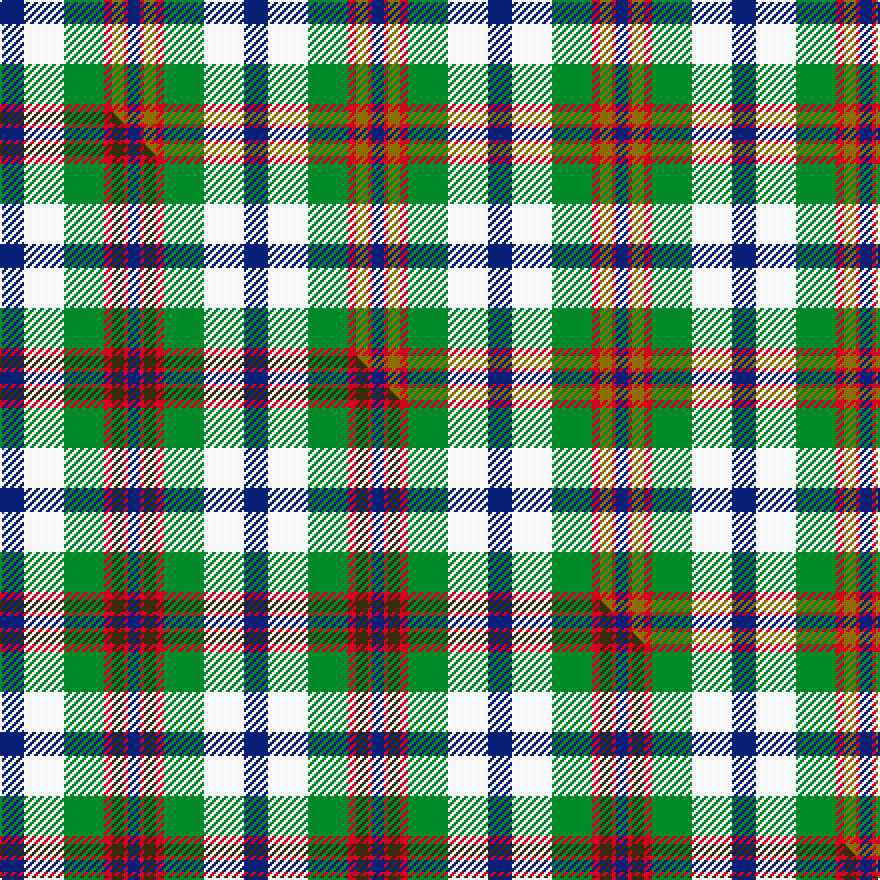

This is one **variant** — a specific cloth: this exact thread count and colourway, with its own
provenance below. It is one weaving of the [sett](/setts/db6w10g10r2y3r1db3/) (the scale-free proportion — the
same cloth at any scale or shade), whose colour order is pattern [BRGRGWB](/stripes/brgrgwb/).

Part of the [Ainslie, Lake](/tartans/a/ai/ainslie-lake/) tartan — the named design grouping this sett with its other cloths.

Sourced from house-of-tartan.  It is a [7 stripe tartan](/stripes/stripes7/).

Original link [http://www.house-of-tartan.scotland.net/house/TartanViewjs.asp?colr=Def&tnam=586](http://www.house-of-tartan.scotland.net/house/TartanViewjs.asp?colr=Def&tnam=586)

## Provenance

Earliest known date: 1985 On the occasion of the Cape Breton Bicentennial.

2 attestations — the source records this cloth was collapsed from (oldest owns this page)

<ul>
<li>1985 — Ainslie Lake.. District Tartan (house-of-tartan, <a href="http://www.house-of-tartan.scotland.net/house/TartanViewjs.asp?colr=Def&tnam=586">record</a>) </li>
<li>undated — Ainslie, Lake (weddslist, <a href="http://www.weddslist.com/cgi-bin/tartans/pg.pl?source=sts">record</a>) </li>
</ul>

Dataset <small>— provenance for this record, inherited from the source manifest</small>

<dl class="dataset-prov">
<dt>source</dt><dd><a href="/sources/house-of-tartan/">House of Tartan</a></dd>
<dt>data captured from</dt><dd><a href="https://github.com/thetartan/tartan-database/blob/master/data/house-of-tartan/data.csv">https://github.com/thetartan/tartan-database/blob/master/data/house-of-tartan/data.csv</a></dd>
<dt>data date</dt><dd>1985 <small>(this record)</small></dd>
<dt>licence</dt><dd><a href="https://creativecommons.org/licenses/by-nc-nd/4.0/">CC BY-NC-ND 4.0</a></dd>
</dl>

Capture chain <small>— the hands this data passed through, oldest first; each capture carries its own licence</small>

<ol class="capture-chain">
<li><a href="http://www.house-of-tartan.scotland.net/">House of Tartan</a> <small>the weaver/retailer's database — the site is now offline; the URL is kept as the ultimate source's identity</small></li>
<li><a href="https://github.com/thetartan/tartan-database">thetartan/tartan-database</a> <small>2016-2017</small> · <a href="https://creativecommons.org/licenses/by-nc-nd/4.0/">CC BY-NC-ND 4.0</a> <small>Levko Kravets's frozen compilation — the capture we vendored, and where its CC licence text came from</small></li>
<li>this dictionary <small>captured 2026-06-10 · commit 5bf86c7566</small> <small>each re-capture is a git commit to data/sources</small></li>
</ol>

## Thread count
DB/12 W20 G20 R4 Y6 R2 DB/6

One full sett is **122 threads**.

## Palette
<table><thead><tr><th>Colour</th><th>Shade</th><th>OKLCh</th></tr></thead><tbody><tr><td>DB</td><td><code style="background-color:#082077;">#082077</code> <small style="color:#888">#082077</small></td><td><small style="color:#888">oklch(30.0% 0.149 265.1)</small></td></tr><tr><td>G</td><td><code style="background-color:#008B2A;">#008B2A</code> <small style="color:#888">#008B2A</small></td><td><small style="color:#888">oklch(55.4% 0.170 145.9)</small></td></tr><tr><td>W</td><td><code style="background-color:#F7F7F7;">#F7F7F7</code> <small style="color:#888">#F7F7F7</small></td><td><small style="color:#888">oklch(97.6% 0.000 89.9)</small></td></tr><tr><td>R</td><td><code style="background-color:#D60020;">#D60020</code> <small style="color:#888">#D60020</small></td><td><small style="color:#888">oklch(55.2% 0.224 25.5)</small></td></tr><tr><td>Y</td><td><code style="background-color:#8B6E00;">#8B6E00</code> <small style="color:#888">#8B6E00</small></td><td><small style="color:#888">oklch(55.1% 0.113 90.4)</small></td></tr></tbody></table>

# Sample pattern

## Compared to the master

This cloth is one sett of its design; the master sett (the exemplar the design is anchored on) is below for comparison.

Its **ΔTartan distance** from the master is **0.05** — the same measure the nearest-tartans table ranks by (0 is identical; a re-scale of the same cloth is near 0, a recolour or a different proportion further).

<figure class="master-compare" style="margin:0">

this sett
master sett ★

<figcaption style="color:#888;font-size:smaller">One weave of this sett against the <a href="/setts/db6w10g10r2dy3r1db3/">master sett ★</a>, split on the diagonal: a shared proportion runs seamlessly across it with only the shades shifting; a different proportion breaks on it.</figcaption>
</figure>

## Nearest tartan variants

The nearest existing variants by ΔTartan distance, with this cloth at the top so the swatches line up against it.

ΔTartan

Threads

Variant

Sett

—

122

<a href="/variants/s7/db6w10g10r2y3r1db3~x2/">Ainslie Lake.. District Tartan</a>

<a href="/ttd/edit/#slug=db6w10g10r2dy3r1db3~x2&amp;base=db6w10g10r2y3r1db3~x2" title="compare in the TTD">0.05</a>

122

<a href="/variants/s7/db6w10g10r2dy3r1db3~x2/">Ainslie, Lake</a>

<a href="/ttd/edit/#slug=w8g14r6g24db30y10w40y10db7y4&amp;base=db6w10g10r2y3r1db3~x2" title="compare in the TTD">1.70</a>

294

<a href="/variants/s10/w8g14r6g24db30y10w40y10db7y4/">John Hamilton Gray Commemorative Tartan</a>

<a href="/ttd/edit/#slug=ly8r3t2db1w6g12db2~x2&amp;base=db6w10g10r2y3r1db3~x2" title="compare in the TTD">2.19</a>

116

<a href="/variants/s7/ly8r3t2db1w6g12db2~x2/">Carmen Lau (Hong Kong) (Personal)</a>

<a href="/ttd/edit/#slug=ri4db18r4g19w25ri10w4~x2~ri2008029-r1506028&amp;base=db6w10g10r2y3r1db3~x2" title="compare in the TTD">2.25</a>

320

<a href="/variants/s7/ri4db18r4g19w25ri10w4~x2~ri2008029-r1506028/">Fraser, Red dress</a>

<a href="/ttd/edit/#slug=r4db18dr4g19w25r10w4~x2&amp;base=db6w10g10r2y3r1db3~x2" title="compare in the TTD">2.33</a>

320

<a href="/variants/s7/r4db18dr4g19w25r10w4~x2/">Fraser Red Dress</a>

<a href="/ttd/edit/#slug=db24r4g24r4w20r10g3w4~x2&amp;base=db6w10g10r2y3r1db3~x2" title="compare in the TTD">2.46</a>

316

<a href="/variants/s8/db24r4g24r4w20r10g3w4~x2/">Robertson Dress (Dalgleish) #2</a>

<a href="/ttd/edit/#slug=w4n8w1db1g6db3r6db1w4~x2~n1604274-db0805267&amp;base=db6w10g10r2y3r1db3~x2" title="compare in the TTD">2.47</a>

120

<a href="/variants/s9/w4dbi8w1db1g6db3r6db1w4~x2~dbi1604274-db0805267/">Womble</a>

<a href="/ttd/edit/#slug=db12r2db2r2db2g10w12o3~x2&amp;base=db6w10g10r2y3r1db3~x2" title="compare in the TTD">2.47</a>

150

<a href="/variants/s8/db12r2db2r2db2g10w12o3~x2/">Idaho, Centennial</a>

<a href="/ttd/edit/#slug=w4dbi8w1db1g6db3r6db1w4~x2~dbi1605267-db0804274&amp;base=db6w10g10r2y3r1db3~x2" title="compare in the TTD">2.48</a>

120

<a href="/variants/s9/w4dbi8w1db1g6db3r6db1w4~x2~dbi1605267-db0804274/">Wombles #2</a>

<a href="/ttd/edit/#slug=dg2do8dg8r3do1w12dg2g1~x2&amp;base=db6w10g10r2y3r1db3~x2" title="compare in the TTD">2.49</a>

142

<a href="/variants/s8/dg2do8dg8r3do1w12dg2g1~x2/">National Trust Corporate Tartan</a>

## Neighbour map

Every grey dot is one of 13656 variants placed by the first two principal components of the ΔTartan feature space (42% of its variance). Red is this tartan; blue dots are its nearest — click one to open its page. The map is a flat projection of a many-dimensional space — [how to read it](/posts/neighbourhood-maps/).

<svg viewBox="0 0 640 380" role="img" style="max-width:100%;height:auto;border:1px solid #e0e0e0;border-radius:4px;display:block" xmlns="http://www.w3.org/2000/svg"><image href="/nn/cloud.v1.png" width="640" height="380"/><a href="/variants/s7/db6w10g10r2dy3r1db3~x2/"><circle cx="96.5" cy="204.3" r="4" fill="#3465a4"><title>Ainslie, Lake</title></circle></a><a href="/variants/s10/w8g14r6g24db30y10w40y10db7y4/"><circle cx="105.3" cy="187.8" r="4" fill="#3465a4"><title>John Hamilton Gray Commemorative Tartan</title></circle></a><a href="/variants/s7/ly8r3t2db1w6g12db2~x2/"><circle cx="135.1" cy="189.1" r="4" fill="#3465a4"><title>Carmen Lau (Hong Kong) (Personal)</title></circle></a><a href="/variants/s7/ri4db18r4g19w25ri10w4~x2~ri2008029-r1506028/"><circle cx="102.0" cy="221.3" r="4" fill="#3465a4"><title>Fraser, Red dress</title></circle></a><a href="/variants/s7/r4db18dr4g19w25r10w4~x2/"><circle cx="103.9" cy="222.6" r="4" fill="#3465a4"><title>Fraser Red Dress</title></circle></a><a href="/variants/s8/db24r4g24r4w20r10g3w4~x2/"><circle cx="117.4" cy="212.7" r="4" fill="#3465a4"><title>Robertson Dress (Dalgleish) #2</title></circle></a><a href="/variants/s9/w4dbi8w1db1g6db3r6db1w4~x2~dbi1604274-db0805267/"><circle cx="67.8" cy="209.0" r="4" fill="#3465a4"><title>Womble</title></circle></a><a href="/variants/s8/db12r2db2r2db2g10w12o3~x2/"><circle cx="115.8" cy="207.5" r="4" fill="#3465a4"><title>Idaho, Centennial</title></circle></a><a href="/variants/s9/w4dbi8w1db1g6db3r6db1w4~x2~dbi1605267-db0804274/"><circle cx="68.4" cy="209.1" r="4" fill="#3465a4"><title>Wombles #2</title></circle></a><a href="/variants/s8/dg2do8dg8r3do1w12dg2g1~x2/"><circle cx="132.2" cy="175.1" r="4" fill="#3465a4"><title>National Trust Corporate Tartan</title></circle></a><circle cx="99.8" cy="205.7" r="5" fill="#c00000"/><text x="320" y="376" text-anchor="middle" font-size="11" fill="#999">ground</text><text x="11" y="190" text-anchor="middle" font-size="11" fill="#999" transform="rotate(-90 11 190)">complexity</text></svg>

ID: /variants/s7/db6w10g10r2y3r1db3~x2/
