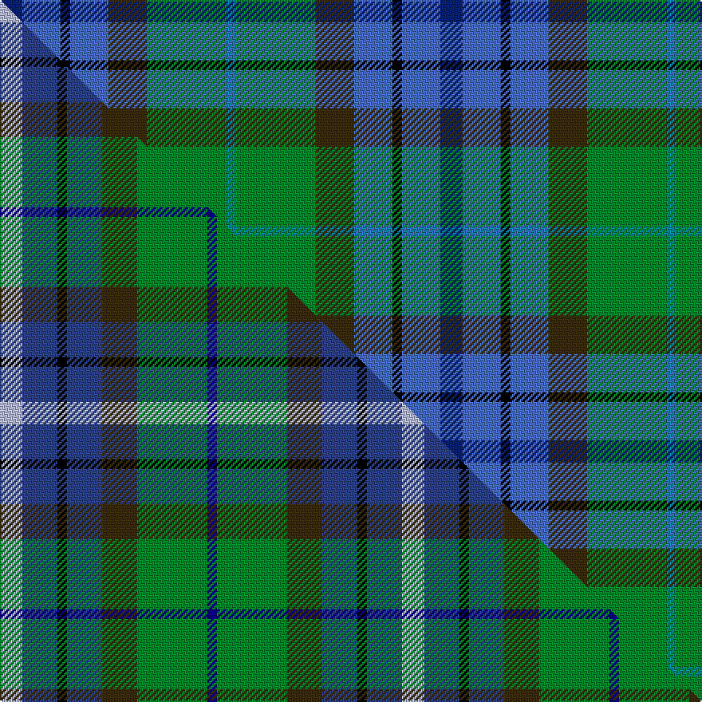

This is one **variant** — a specific cloth: this exact thread count and colourway, with its own
provenance below. It is one weaving of the [sett](/tartans/s/sc/scottish-odyssey/) (the scale-free proportion — the
same cloth at any scale or shade), whose colour order is pattern [BBKBGGB](/stripes/bbkbggb/).

Part of the [Scottish Odyssey](/tartans/s/sc/scottish-odyssey/) tartan — the named design grouping this sett with its other cloths.

Sourced from tartans-authority.  It is a [7 stripe tartan](/stripes/stripes7/).

Original link <code>http://www.tartansauthority.com/tartan-ferret/display/4071/</code> — retired · [Internet Archive copy](https://web.archive.org/web/*/http://www.tartansauthority.com/tartan-ferret/display/4071/*)

Dataset <small>— provenance for this record, inherited from the source manifest</small>

<dl class="dataset-prov">
<dt>source</dt><dd><a href="/sources/tartans-authority/">Scottish Tartans Authority</a></dd>
<dt>data captured from</dt><dd><a href="https://github.com/thetartan/tartan-database/blob/master/data/tartans-authority/data.csv">https://github.com/thetartan/tartan-database/blob/master/data/tartans-authority/data.csv</a></dd>
<dt>data date</dt><dd>2002 <small>(this record)</small></dd>
<dt>licence</dt><dd><a href="https://creativecommons.org/licenses/by-nc-nd/4.0/">CC BY-NC-ND 4.0</a></dd>
</dl>

Capture chain <small>— the hands this data passed through, oldest first; each capture carries its own licence</small>

<ol class="capture-chain">
<li><a href="https://www.tartansauthority.com/">Scottish Tartans Authority</a> <small>the heritage body’s archive — its tartan-ferret record browser is retired; dead record links are shown unlinked, with an Internet Archive copy (ITI numbers are not SRT references)</small></li>
<li><a href="https://github.com/thetartan/tartan-database">thetartan/tartan-database</a> <small>2016-2017</small> · <a href="https://creativecommons.org/licenses/by-nc-nd/4.0/">CC BY-NC-ND 4.0</a> <small>Levko Kravets's frozen compilation — the capture we vendored, and where its CC licence text came from</small></li>
<li>this dictionary <small>captured 2026-06-10 · commit 5bf86c7566</small> <small>each re-capture is a git commit to data/sources</small></li>
</ol>

## Register references

External register numbers recorded for this tartan.

- Scottish Tartans Authority (ITI): 4071

## Thread count
DB/14 B24 K6 B24 DY24 G50 T/6

One full sett is **276 threads**.

## Palette
<table><thead><tr><th>Colour</th><th>Shade</th><th>OKLCh</th></tr></thead><tbody><tr><td>B</td><td><code style="background-color:#466CC8;">#466CC8</code> <small style="color:#888">#466CC8</small></td><td><small style="color:#888">oklch(55.1% 0.149 265.0)</small></td></tr><tr><td>DB</td><td><code style="background-color:#082077;">#082077</code> <small style="color:#888">#082077</small></td><td><small style="color:#888">oklch(30.0% 0.149 265.1)</small></td></tr><tr><td>T</td><td><code style="background-color:#00879F;">#00879F</code> <small style="color:#888">#00879F</small></td><td><small style="color:#888">oklch(57.4% 0.102 216.1)</small></td></tr><tr><td>G</td><td><code style="background-color:#008B2A;">#008B2A</code> <small style="color:#888">#008B2A</small></td><td><small style="color:#888">oklch(55.4% 0.170 145.9)</small></td></tr><tr><td>K</td><td><code style="background-color:#000000;">#000000</code> <small style="color:#888">#000000</small></td><td><small style="color:#888">oklch(0.0% 0.000 0.0)</small></td></tr><tr><td>DY</td><td><code style="background-color:#3A2B0D;">#3A2B0D</code> <small style="color:#888">#3A2B0D</small></td><td><small style="color:#888">oklch(30.0% 0.049 82.0)</small></td></tr></tbody></table>

# Sample pattern

## Compared to the master

This cloth is one sett of its design; the master sett (the exemplar the design is anchored on) is below for comparison.

Its **ΔTartan distance** from the master is **0.78** — the same measure the nearest-tartans table ranks by (0 is identical; a re-scale of the same cloth is near 0, a recolour or a different proportion further).

<figure class="master-compare" style="margin:0">

this sett
master sett ★

<figcaption style="color:#888;font-size:smaller">One weave of this sett against the <a href="/setts/lb7dbi11k3dbi11dy11g22db3/">master sett ★</a>, split on the diagonal: a shared proportion runs seamlessly across it with only the shades shifting; a different proportion breaks on it.</figcaption>
</figure>

## Nearest tartan variants

The nearest existing variants by ΔTartan distance, with this cloth at the top so the swatches line up against it.

ΔTartan

Threads

Variant

Sett

—

276

<a href="/variants/s7/db7b12k3b12dy12g25t3~x2/">Scottish Odyssey (Fashion)</a>

<a href="/ttd/edit/#slug=lb7dbi11k3dbi11dy11g22db3~x2~dbi1605267-db1108266&amp;base=db7b12k3b12dy12g25t3~x2" title="compare in the TTD">0.78</a>

252

<a href="/variants/s7/lb7dbi11k3dbi11dy11g22db3~x2~dbi1605267-db1108266/">Scottish Odyssey</a>

<a href="/ttd/edit/#slug=w3n17o16db2dg17y2~x2~n1604274-db0805267&amp;base=db7b12k3b12dy12g25t3~x2" title="compare in the TTD">2.48</a>

218

<a href="/variants/s6/w3dbi17o16db2dg17y2~x2~dbi1604274-db0805267/">Atlantic, Ancient</a>

<a href="/ttd/edit/#slug=dt11g15k2n5db3n11~x2~dt1204274-db1106275&amp;base=db7b12k3b12dy12g25t3~x2" title="compare in the TTD">2.57</a>

144

<a href="/variants/s6/dbi11g15k2n5db3n11~x2~dbi1204274-db1106275/">Saorsa (Corporate)</a>

<a href="/ttd/edit/#slug=t26k10db19dr6dy2dbi9~x2~db1404245-dbi1704245&amp;base=db7b12k3b12dy12g25t3~x2" title="compare in the TTD">2.58</a>

218

<a href="/variants/s6/t26k10db19dr6dy2dbi9~x2~db1404245-dbi1704245/">Meeson Dress Personal Tartan</a>

<a href="/ttd/edit/#slug=r3db24k7dbi11g11y2~x2~db1404245-dbi1406275&amp;base=db7b12k3b12dy12g25t3~x2" title="compare in the TTD">2.65</a>

222

<a href="/variants/s6/r3db24k7dbi11g11y2~x2~db1404245-dbi1406275/">Cowie</a>

<a href="/ttd/edit/#slug=r3g20k2n11k2db20lr2~x2&amp;base=db7b12k3b12dy12g25t3~x2" title="compare in the TTD">2.65</a>

230

<a href="/variants/s7/r3g20k2n11k2db20lr2~x2/">Grandfather Mountain Games American Corporate Tartan</a>

<a href="/ttd/edit/#slug=g20lb6dg15db5dg2db15n4db10r2~x2&amp;base=db7b12k3b12dy12g25t3~x2" title="compare in the TTD">2.85</a>

272

<a href="/variants/s9/g20lb6dg15db5dg2db15n4db10r2~x2/">Copar a'Beannichte (Personal)</a>

<a href="/ttd/edit/#slug=dr4db2lb7db20k7g10y4~x2&amp;base=db7b12k3b12dy12g25t3~x2" title="compare in the TTD">2.91</a>

200

<a href="/variants/s7/dr4db2lb7db20k7g10y4~x2/">Renfrewshire District Tartan</a>

<a href="/ttd/edit/#slug=k7db11k3db11dy11g22db3~x2~db1605267&amp;base=db7b12k3b12dy12g25t3~x2" title="compare in the TTD">2.92</a>

252

<a href="/variants/s7/k7db11k3db11dy11g22db3~x2~db1605267/">Scottish Odyssey Commemorative Tartan</a>

<a href="/ttd/edit/#slug=dp4db2lb8db25k8g13y4~x2&amp;base=db7b12k3b12dy12g25t3~x2" title="compare in the TTD">3.03</a>

240

<a href="/variants/s7/dp4db2lb8db25k8g13y4~x2/">Renfrewshire Tartan</a>

## Neighbour map

Every grey dot is one of 13657 variants placed by the first two principal components of the ΔTartan feature space (42% of its variance). Red is this tartan; blue dots are its nearest — click one to open its page. The map is a flat projection of a many-dimensional space — [how to read it](/posts/neighbourhood-maps/).

<svg viewBox="0 0 640 380" role="img" style="max-width:100%;height:auto;border:1px solid #e0e0e0;border-radius:4px;display:block" xmlns="http://www.w3.org/2000/svg"><image href="/nn/cloud.v1.png" width="640" height="380"/><a href="/variants/s7/lb7dbi11k3dbi11dy11g22db3~x2~dbi1605267-db1108266/"><circle cx="103.0" cy="213.7" r="4" fill="#3465a4"><title>Scottish Odyssey</title></circle></a><a href="/variants/s6/w3dbi17o16db2dg17y2~x2~dbi1604274-db0805267/"><circle cx="159.8" cy="216.2" r="4" fill="#3465a4"><title>Atlantic, Ancient</title></circle></a><a href="/variants/s6/dbi11g15k2n5db3n11~x2~dbi1204274-db1106275/"><circle cx="164.7" cy="240.8" r="4" fill="#3465a4"><title>Saorsa (Corporate)</title></circle></a><a href="/variants/s6/t26k10db19dr6dy2dbi9~x2~db1404245-dbi1704245/"><circle cx="155.2" cy="197.2" r="4" fill="#3465a4"><title>Meeson Dress Personal Tartan</title></circle></a><a href="/variants/s6/r3db24k7dbi11g11y2~x2~db1404245-dbi1406275/"><circle cx="178.1" cy="188.0" r="4" fill="#3465a4"><title>Cowie</title></circle></a><a href="/variants/s7/r3g20k2n11k2db20lr2~x2/"><circle cx="133.5" cy="169.4" r="4" fill="#3465a4"><title>Grandfather Mountain Games American Corporate Tartan</title></circle></a><a href="/variants/s9/g20lb6dg15db5dg2db15n4db10r2~x2/"><circle cx="161.7" cy="198.0" r="4" fill="#3465a4"><title>Copar a'Beannichte (Personal)</title></circle></a><a href="/variants/s7/dr4db2lb7db20k7g10y4~x2/"><circle cx="114.5" cy="175.1" r="4" fill="#3465a4"><title>Renfrewshire District Tartan</title></circle></a><a href="/variants/s7/k7db11k3db11dy11g22db3~x2~db1605267/"><circle cx="140.6" cy="224.1" r="4" fill="#3465a4"><title>Scottish Odyssey Commemorative Tartan</title></circle></a><a href="/variants/s7/dp4db2lb8db25k8g13y4~x2/"><circle cx="136.8" cy="160.3" r="4" fill="#3465a4"><title>Renfrewshire Tartan</title></circle></a><circle cx="131.1" cy="210.4" r="5" fill="#c00000"/><text x="320" y="376" text-anchor="middle" font-size="11" fill="#999">ground</text><text x="11" y="190" text-anchor="middle" font-size="11" fill="#999" transform="rotate(-90 11 190)">complexity</text></svg>

ID: /variants/s7/db7b12k3b12dy12g25t3~x2/
