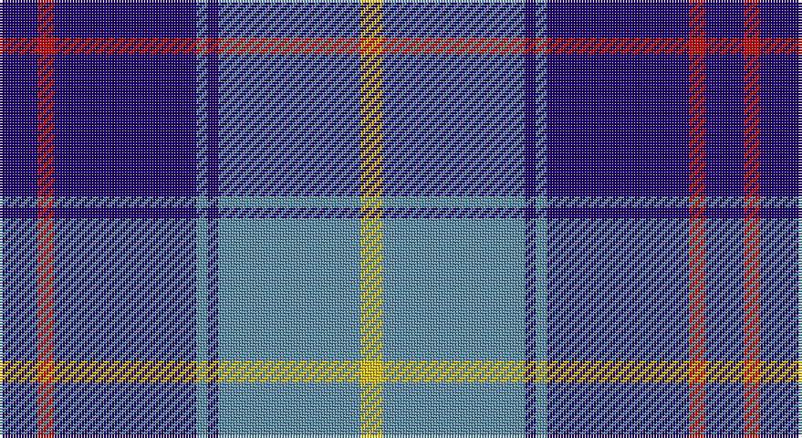

This page is one **sett** — a single exact thread-count. It belongs to the [tartan](/setts/db7r3db26t2db2t26ly4/)
(the same proportion at any scale), whose colour order is pattern [BRBBBBY](/stripes/brbbbby/).

Sourced from tartans-authority.  It is a [7 stripe tartan](/stripes/stripes7/).

Original link http://www.tartansauthority.com/tartan-ferret/display/10174/

## Register references

External register numbers recorded for this tartan.

- Scottish Register of Tartans: [10174](https://www.tartanregister.gov.uk/tartanDetails?ref=10174)
- Scottish Tartans Authority (ITI): 10174

## Thread count
DB/14 R6 DB52 B4 DB4 B52 Y/8

One full sett is **258 threads**.

## Palette

Palette: <strong>Tartan Register</strong>
<table><thead><tr><th>Colour</th><th>Threads</th><th>Shade</th><th>Base</th><th>OKLCh</th></tr></thead><tbody><tr><td>DB/</td><td style="text-align:right;font-variant-numeric:tabular-nums">14</td><td><code style="background-color:#1C0070;">#1C0070</code> <small style="color:#888">#1C0070</small></td><td>B <code style="background-color:#2A418A;">#2A418A</code></td><td><small style="color:#888">oklch(26.3% 0.162 277.1)</small></td></tr><tr><td>R</td><td style="text-align:right;font-variant-numeric:tabular-nums">6</td><td><code style="background-color:#C80000;">#C80000</code> <small style="color:#888">#C80000</small></td><td>R <code style="background-color:#CC0000;">#CC0000</code></td><td><small style="color:#888">oklch(52.3% 0.215 29.2)</small></td></tr><tr><td>DB</td><td style="text-align:right;font-variant-numeric:tabular-nums">52</td><td><code style="background-color:#1C0070;">#1C0070</code> <small style="color:#888">#1C0070</small></td><td>B <code style="background-color:#2A418A;">#2A418A</code></td><td><small style="color:#888">oklch(26.3% 0.162 277.1)</small></td></tr><tr><td>B</td><td style="text-align:right;font-variant-numeric:tabular-nums">4</td><td><code style="background-color:#5C8CA8;">#5C8CA8</code> <small style="color:#888">#5C8CA8</small></td><td>B <code style="background-color:#2A418A;">#2A418A</code></td><td><small style="color:#888">oklch(61.7% 0.067 235.0)</small></td></tr><tr><td>DB</td><td style="text-align:right;font-variant-numeric:tabular-nums">4</td><td><code style="background-color:#1C0070;">#1C0070</code> <small style="color:#888">#1C0070</small></td><td>B <code style="background-color:#2A418A;">#2A418A</code></td><td><small style="color:#888">oklch(26.3% 0.162 277.1)</small></td></tr><tr><td>B</td><td style="text-align:right;font-variant-numeric:tabular-nums">52</td><td><code style="background-color:#5C8CA8;">#5C8CA8</code> <small style="color:#888">#5C8CA8</small></td><td>B <code style="background-color:#2A418A;">#2A418A</code></td><td><small style="color:#888">oklch(61.7% 0.067 235.0)</small></td></tr><tr><td>Y/</td><td style="text-align:right;font-variant-numeric:tabular-nums">8</td><td><code style="background-color:#E8C000;">#E8C000</code> <small style="color:#888">#E8C000</small></td><td>Y <code style="background-color:#F2BF00;">#F2BF00</code></td><td><small style="color:#888">oklch(81.9% 0.168 93.7)</small></td></tr></tbody></table>

# Sample pattern

## Nearest tartans

The nearest existing variants by ΔTartan distance, with this tartan at the top so the swatches line up against it.

ΔTartan

Tartan

Sett

—

<a href="/ttd/edit/#slug=db7r3db26t2db2t26ly4~x2">Int. Police Association (Official)</a> <a class="nn-out" href="/variants/s7/db7r3db26t2db2t26ly4~x2/" title="open its dictionary page">↗</a>

1.00

<a href="/ttd/edit/#slug=db6lb2db2lb3db16b26r2~x2&amp;base=db7r3db26t2db2t26ly4~x2">Federal Bureau of Investigation</a> <a class="nn-out" href="/variants/s7/db6lb2db2lb3db16b26r2~x2/" title="open its dictionary page">↗</a>

1.04

<a href="/ttd/edit/#slug=y12db2y2db30dbi3db2dbi13w4~x2&amp;base=db7r3db26t2db2t26ly4~x2">Highlands School, (North Carolina)</a> <a class="nn-out" href="/variants/s8/y12db2y2db30dbi3db2dbi13w4~x2/" title="open its dictionary page">↗</a>

1.04

<a href="/ttd/edit/#slug=ly12dbi2ly2dbi30db3dbi2db13w4~x2&amp;base=db7r3db26t2db2t26ly4~x2">Highlands School (N. Carolina) Corporate Tartan</a> <a class="nn-out" href="/variants/s8/ly12dbi2ly2dbi30db3dbi2db13w4~x2/" title="open its dictionary page">↗</a>

1.05

<a href="/ttd/edit/#slug=db30lb2k9w3db6w4k3lb6~x2&amp;base=db7r3db26t2db2t26ly4~x2">Detroit Lions</a> <a class="nn-out" href="/variants/s8/db30lb2k9w3db6w4k3lb6~x2/" title="open its dictionary page">↗</a>

1.08

<a href="/ttd/edit/#slug=lo12db2lo2db30dt2db2dt13lb4~x2&amp;base=db7r3db26t2db2t26ly4~x2">Highlands School (North Carolina)</a> <a class="nn-out" href="/variants/s8/lo12db2lo2db30dt2db2dt13lb4~x2/" title="open its dictionary page">↗</a>

1.12

<a href="/ttd/edit/#slug=db42lbi2lb2lbi2db5dt12lb32db4~x2&amp;base=db7r3db26t2db2t26ly4~x2">Longniddry Eildon Blue Dress Fancy Tartan</a> <a class="nn-out" href="/variants/s8/db42lbi2lb2lbi2db5dt12lb32db4~x2/" title="open its dictionary page">↗</a>

1.12

<a href="/ttd/edit/#slug=k8r1k1r1k4b11ly1b2~x6&amp;base=db7r3db26t2db2t26ly4~x2">Rutherford</a> <a class="nn-out" href="/variants/s8/k8r1k1r1k4b11ly1b2~x6/" title="open its dictionary page">↗</a>

1.14

<a href="/variants/s6/ly8k3b40ki12k3ly3~x2/">Wolverine Corporate Tartan</a>

1.15

<a href="/ttd/edit/#slug=lo8w3db40k12w3lo3~x2&amp;base=db7r3db26t2db2t26ly4~x2">Wolverines (Corporate)</a> <a class="nn-out" href="/variants/s6/lo8w3db40k12w3lo3~x2/" title="open its dictionary page">↗</a>

1.16

<a href="/ttd/edit/#slug=ly8w3b40k12w3ly3~x2&amp;base=db7r3db26t2db2t26ly4~x2">Wolverine (Corporate)</a> <a class="nn-out" href="/variants/s6/ly8w3b40k12w3ly3~x2/" title="open its dictionary page">↗</a>

## Neighbour map

Every grey dot is one of 14360 variants placed by the first two principal components of the ΔTartan feature space (44% of its variance). Red is this tartan; blue dots are its nearest — click one to open its page.

<svg viewBox="0 0 640 380" role="img" style="max-width:100%;height:auto;border:1px solid #e0e0e0;border-radius:4px;display:block" xmlns="http://www.w3.org/2000/svg"><image href="/nn/cloud.v1.png" width="640" height="380"/><a href="/variants/s7/db6lb2db2lb3db16b26r2~x2/"><circle cx="288.2" cy="191.5" r="4" fill="#3465a4"><title>Federal Bureau of Investigation</title></circle></a><a href="/variants/s8/y12db2y2db30dbi3db2dbi13w4~x2/"><circle cx="279.9" cy="171.4" r="4" fill="#3465a4"><title>Highlands School, (North Carolina)</title></circle></a><a href="/variants/s8/ly12dbi2ly2dbi30db3dbi2db13w4~x2/"><circle cx="259.8" cy="156.5" r="4" fill="#3465a4"><title>Highlands School (N. Carolina) Corporate Tartan</title></circle></a><a href="/variants/s8/db30lb2k9w3db6w4k3lb6~x2/"><circle cx="290.8" cy="154.2" r="4" fill="#3465a4"><title>Detroit Lions</title></circle></a><a href="/variants/s8/lo12db2lo2db30dt2db2dt13lb4~x2/"><circle cx="272.7" cy="161.3" r="4" fill="#3465a4"><title>Highlands School (North Carolina)</title></circle></a><a href="/variants/s8/db42lbi2lb2lbi2db5dt12lb32db4~x2/"><circle cx="288.7" cy="139.6" r="4" fill="#3465a4"><title>Longniddry Eildon Blue Dress Fancy Tartan</title></circle></a><a href="/variants/s8/k8r1k1r1k4b11ly1b2~x6/"><circle cx="261.3" cy="181.2" r="4" fill="#3465a4"><title>Rutherford</title></circle></a><a href="/variants/s6/ly8k3b40ki12k3ly3~x2/"><circle cx="314.0" cy="181.3" r="4" fill="#3465a4"><title>Wolverine Corporate Tartan</title></circle></a><a href="/variants/s6/lo8w3db40k12w3lo3~x2/"><circle cx="306.2" cy="167.4" r="4" fill="#3465a4"><title>Wolverines (Corporate)</title></circle></a><a href="/variants/s6/ly8w3b40k12w3ly3~x2/"><circle cx="302.0" cy="171.7" r="4" fill="#3465a4"><title>Wolverine (Corporate)</title></circle></a><circle cx="288.1" cy="180.6" r="5" fill="#c00000"/></svg>

ID: /variants/s7/db7r3db26t2db2t26ly4~x2/
