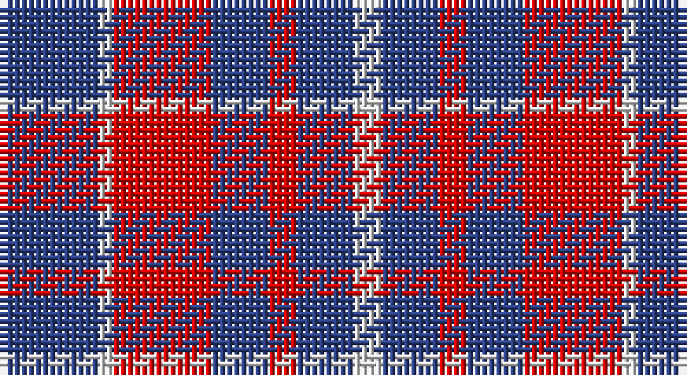

This page is one **sett** — a single exact thread-count. It belongs to the [tartan](/setts/db7w1r7db4r2db4w2/)
(the same proportion at any scale), whose colour order is pattern [BWRBRBW](/stripes/bwrbrbw/).

Part of the [Coronation](/tartans/coronation/) tartan — the named design grouping this sett with its other cloths.

Sourced from register-of-tartans.  It is a [7 stripe tartan](/stripes/stripes7/).

Original link https://www.tartanregister.gov.uk/tartanDetails.aspx?ref=770

## Provenance

Earliest known date: 1936 Designed to commemorate the coronation of King George VI and Queen Elizabeth in 1936. There is another count estimated from a drawing by Coulson Bonner which is now in the possession of the Scottish Tartan Society. B22 W2 R24 B12 R2 B12 W2

## Also known as

This cloth is also recorded under:

- Coronation #2
- Coronation Commemorative

3 attestations — the source records this cloth was collapsed from (oldest owns this page)

<ul>
<li>undated — Coronation (register-of-tartans, <a href="https://www.tartanregister.gov.uk/tartanDetails.aspx?ref=770">record</a>)</li>
<li>undated — Coronation (weddslist, <a href="http://www.weddslist.com/cgi-bin/tartans/pg.pl?source=sts">record</a>)</li>
<li>undated — Coronation Commemorative Tartan (house-of-tartan, <a href="http://www.house-of-tartan.scotland.net/house/TartanViewjs.asp?colr=Def&tnam=661">record</a>)</li>
</ul>

## Register references

External register numbers recorded for this tartan.

- Scottish Register of Tartans: [770](https://www.tartanregister.gov.uk/tartanDetails.aspx?ref=770)
- Scottish Tartans World Register: 661

## Thread count
B/14 LN2 R14 B8 R4 B8 LN/4

One full sett is **90 threads**.

## Palette

Palette: <strong>Tartan Register</strong>
<table><thead><tr><th>Colour</th><th>Threads</th><th>Shade</th><th>Base</th><th>OKLCh</th></tr></thead><tbody><tr><td>B/</td><td style="text-align:right;font-variant-numeric:tabular-nums">14</td><td><code style="background-color:#2C4084;">#2C4084</code> <small style="color:#888">#2C4084</small></td><td>B <code style="background-color:#2A418A;">#2A418A</code></td><td><small style="color:#888">oklch(39.4% 0.117 268.3)</small></td></tr><tr><td>LN</td><td style="text-align:right;font-variant-numeric:tabular-nums">2</td><td><code style="background-color:#E0E0E0;">#E0E0E0</code> <small style="color:#888">#E0E0E0</small></td><td>W <code style="background-color:#F7F7F7;">#F7F7F7</code></td><td><small style="color:#888">oklch(90.7% 0.000 89.9)</small></td></tr><tr><td>R</td><td style="text-align:right;font-variant-numeric:tabular-nums">14</td><td><code style="background-color:#DC0000;">#DC0000</code> <small style="color:#888">#DC0000</small></td><td>R <code style="background-color:#CC0000;">#CC0000</code></td><td><small style="color:#888">oklch(56.2% 0.230 29.2)</small></td></tr><tr><td>B</td><td style="text-align:right;font-variant-numeric:tabular-nums">8</td><td><code style="background-color:#2C4084;">#2C4084</code> <small style="color:#888">#2C4084</small></td><td>B <code style="background-color:#2A418A;">#2A418A</code></td><td><small style="color:#888">oklch(39.4% 0.117 268.3)</small></td></tr><tr><td>R</td><td style="text-align:right;font-variant-numeric:tabular-nums">4</td><td><code style="background-color:#DC0000;">#DC0000</code> <small style="color:#888">#DC0000</small></td><td>R <code style="background-color:#CC0000;">#CC0000</code></td><td><small style="color:#888">oklch(56.2% 0.230 29.2)</small></td></tr><tr><td>B</td><td style="text-align:right;font-variant-numeric:tabular-nums">8</td><td><code style="background-color:#2C4084;">#2C4084</code> <small style="color:#888">#2C4084</small></td><td>B <code style="background-color:#2A418A;">#2A418A</code></td><td><small style="color:#888">oklch(39.4% 0.117 268.3)</small></td></tr><tr><td>LN/</td><td style="text-align:right;font-variant-numeric:tabular-nums">4</td><td><code style="background-color:#E0E0E0;">#E0E0E0</code> <small style="color:#888">#E0E0E0</small></td><td>W <code style="background-color:#F7F7F7;">#F7F7F7</code></td><td><small style="color:#888">oklch(90.7% 0.000 89.9)</small></td></tr></tbody></table>

# Sample pattern

## Compared to the master

This cloth is one sett of its design; the master sett (the exemplar the design is anchored on) is below for comparison.

<figure style="margin:0"><figcaption style="color:#888;font-size:smaller">this sett</figcaption></figure>
<figure style="margin:0"><figcaption style="color:#888;font-size:smaller"><a href="/setts/db11w1r12db6r1db6w1/">master sett →</a></figcaption></figure>

## Nearest tartans

The nearest existing variants by ΔTartan distance, with this tartan at the top so the swatches line up against it.

ΔTartan

Tartan

Sett

—

<a href="/ttd/edit/#slug=db7w1r7db4r2db4w2~x2">Coronation</a> <a class="nn-out" href="/variants/s7/db7w1r7db4r2db4w2~x2/" title="open its dictionary page">↗</a>

0.90

<a href="/ttd/edit/#slug=r5db6r1db6r1db6r5w5~x4&amp;base=db7w1r7db4r2db4w2~x2">U.S. Coast Guard</a> <a class="nn-out" href="/variants/s8/r5db6r1db6r1db6r5w5~x4/" title="open its dictionary page">↗</a>

1.23

<a href="/ttd/edit/#slug=g22dp22g3dp11w3dp4w3~x2&amp;base=db7w1r7db4r2db4w2~x2">O'Long (Personal)</a> <a class="nn-out" href="/variants/s7/g22dp22g3dp11w3dp4w3~x2/" title="open its dictionary page">↗</a>

1.26

<a href="/ttd/edit/#slug=db3lo9db3lo9db20r3~x2&amp;base=db7w1r7db4r2db4w2~x2">Latin</a> <a class="nn-out" href="/variants/s6/db3lo9db3lo9db20r3~x2/" title="open its dictionary page">↗</a>

1.27

<a href="/ttd/edit/#slug=db6r1db6r9w1~x4&amp;base=db7w1r7db4r2db4w2~x2">Hamilton Red Clan Tartan</a> <a class="nn-out" href="/variants/s5/db6r1db6r9w1~x4/" title="open its dictionary page">↗</a>

1.35

<a href="/ttd/edit/#slug=db8r2db8r15w2~x4&amp;base=db7w1r7db4r2db4w2~x2">Hamilton (Clan)</a> <a class="nn-out" href="/variants/s5/db8r2db8r15w2~x4/" title="open its dictionary page">↗</a>

1.39

<a href="/ttd/edit/#slug=db6r1db6r9w1~x2&amp;base=db7w1r7db4r2db4w2~x2">Hamilton, (Red)</a> <a class="nn-out" href="/variants/s5/db6r1db6r9w1~x2/" title="open its dictionary page">↗</a>

1.41

<a href="/ttd/edit/#slug=db6r1db6r5w5~x4&amp;base=db7w1r7db4r2db4w2~x2">U.S. Coast Guard (Corporate)</a> <a class="nn-out" href="/variants/s5/db6r1db6r5w5~x4/" title="open its dictionary page">↗</a>

1.50

<a href="/ttd/edit/#slug=db11r4ly9db4ly2db11~x2&amp;base=db7w1r7db4r2db4w2~x2">Unidentified Sample</a> <a class="nn-out" href="/variants/s6/db11r4ly9db4ly2db11~x2/" title="open its dictionary page">↗</a>

1.50

<a href="/ttd/edit/#slug=db6r1db1r2w1r2db1r3~x4&amp;base=db7w1r7db4r2db4w2~x2">Edinburgh Marketing</a> <a class="nn-out" href="/variants/s8/db6r1db1r2w1r2db1r3~x4/" title="open its dictionary page">↗</a>

1.53

<a href="/ttd/edit/#slug=r15db8r2db8r2db8r15w2~x4&amp;base=db7w1r7db4r2db4w2~x2">Hamilton</a> <a class="nn-out" href="/variants/s8/r15db8r2db8r2db8r15w2~x4/" title="open its dictionary page">↗</a>

## Neighbour map

Every grey dot is one of 14360 variants placed by the first two principal components of the ΔTartan feature space (44% of its variance). Red is this tartan; blue dots are its nearest — click one to open its page.

<svg viewBox="0 0 640 380" role="img" style="max-width:100%;height:auto;border:1px solid #e0e0e0;border-radius:4px;display:block" xmlns="http://www.w3.org/2000/svg"><image href="/nn/cloud.v1.png" width="640" height="380"/><a href="/variants/s8/r5db6r1db6r1db6r5w5~x4/"><circle cx="222.8" cy="255.0" r="4" fill="#3465a4"><title>U.S. Coast Guard</title></circle></a><a href="/variants/s7/g22dp22g3dp11w3dp4w3~x2/"><circle cx="304.6" cy="223.9" r="4" fill="#3465a4"><title>O'Long (Personal)</title></circle></a><a href="/variants/s6/db3lo9db3lo9db20r3~x2/"><circle cx="305.0" cy="240.8" r="4" fill="#3465a4"><title>Latin</title></circle></a><a href="/variants/s5/db6r1db6r9w1~x4/"><circle cx="320.0" cy="245.1" r="4" fill="#3465a4"><title>Hamilton Red Clan Tartan</title></circle></a><a href="/variants/s5/db8r2db8r15w2~x4/"><circle cx="294.6" cy="246.3" r="4" fill="#3465a4"><title>Hamilton (Clan)</title></circle></a><a href="/variants/s5/db6r1db6r9w1~x2/"><circle cx="331.8" cy="251.8" r="4" fill="#3465a4"><title>Hamilton, (Red)</title></circle></a><a href="/variants/s5/db6r1db6r5w5~x4/"><circle cx="211.3" cy="278.4" r="4" fill="#3465a4"><title>U.S. Coast Guard (Corporate)</title></circle></a><a href="/variants/s6/db11r4ly9db4ly2db11~x2/"><circle cx="292.7" cy="266.5" r="4" fill="#3465a4"><title>Unidentified Sample</title></circle></a><a href="/variants/s8/db6r1db1r2w1r2db1r3~x4/"><circle cx="260.1" cy="221.4" r="4" fill="#3465a4"><title>Edinburgh Marketing</title></circle></a><a href="/variants/s8/r15db8r2db8r2db8r15w2~x4/"><circle cx="331.9" cy="230.5" r="4" fill="#3465a4"><title>Hamilton</title></circle></a><circle cx="275.9" cy="244.0" r="5" fill="#c00000"/></svg>

ID: /variants/s7/db7w1r7db4r2db4w2~x2/
