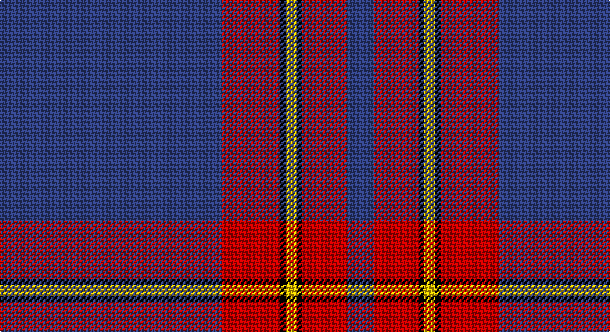

This page is one **sett** — a single exact thread-count. It belongs to the [tartan](/setts/db80r21k2ly4k2r16db10/)
(the same proportion at any scale), whose colour order is pattern [BRKYKRB](/stripes/brkykrb/).

Part of the [Salvation Army Dress](/tartans/salvation-army-dress/) tartan — the named design grouping this sett with its other cloths.

Sourced from weddslist.  It is a [7 stripe tartan](/stripes/stripes7/).

Original link http://www.weddslist.com/cgi-bin/tartans/pg.pl?source=sts

## Provenance

Earliest known date: 1983 The colours chosen are the same as those for the flag. Red for the Blood of Christ, blue for the Heavenly Father, yellow for Fire of the Holy Spirit when tongues of fire symbolized his presence at Penticost.

## Also known as

This cloth is also recorded under:

- Salvation Army, dress

2 attestations — the source records this cloth was collapsed from (oldest owns this page)

<ul>
<li>undated — Salvation Army, dress (weddslist, <a href="http://www.weddslist.com/cgi-bin/tartans/pg.pl?source=sts">record</a>)</li>
<li>undated — Salvation Army Dress Corporate Tartan (house-of-tartan, <a href="http://www.house-of-tartan.scotland.net/house/TartanViewjs.asp?colr=Def&tnam=546">record</a>)</li>
</ul>

## Thread count
B/160 R42 K4 Y8 K4 R32 B/20

One full sett is **360 threads**.

## Palette

Palette: <strong>Ingles Buchan</strong> <small style="color:#888">(1 of 4 colours)</small>
<table><thead><tr><th>Colour</th><th>Threads</th><th>Shade</th><th>Base</th><th>OKLCh</th></tr></thead><tbody><tr><td>B/</td><td style="text-align:right;font-variant-numeric:tabular-nums">160</td><td><code style="background-color:#304080;">#304080</code> <small style="color:#888">#304080</small></td><td>B <code style="background-color:#2A418A;">#2A418A</code></td><td><small style="color:#888">oklch(39.4% 0.109 270.2)</small></td></tr><tr><td>R</td><td style="text-align:right;font-variant-numeric:tabular-nums">42</td><td><code style="background-color:#C00000;">#C00000</code> <small style="color:#888">#C00000</small></td><td>R <code style="background-color:#CC0000;">#CC0000</code></td><td><small style="color:#888">oklch(50.7% 0.208 29.2)</small></td></tr><tr><td>K</td><td style="text-align:right;font-variant-numeric:tabular-nums">4</td><td><code style="background-color:#000000;">#000000</code> <small style="color:#888">#000000</small></td><td>K <code style="background-color:#000000;">#000000</code></td><td><small style="color:#888">oklch(0.0% 0.000 0.0)</small></td></tr><tr><td>Y</td><td style="text-align:right;font-variant-numeric:tabular-nums">8</td><td><code style="background-color:#F0C000;">#F0C000</code> <small style="color:#888">#F0C000</small></td><td>Y <code style="background-color:#F2BF00;">#F2BF00</code></td><td><small style="color:#888">oklch(82.7% 0.169 90.5)</small></td></tr><tr><td>K</td><td style="text-align:right;font-variant-numeric:tabular-nums">4</td><td><code style="background-color:#000000;">#000000</code> <small style="color:#888">#000000</small></td><td>K <code style="background-color:#000000;">#000000</code></td><td><small style="color:#888">oklch(0.0% 0.000 0.0)</small></td></tr><tr><td>R</td><td style="text-align:right;font-variant-numeric:tabular-nums">32</td><td><code style="background-color:#C00000;">#C00000</code> <small style="color:#888">#C00000</small></td><td>R <code style="background-color:#CC0000;">#CC0000</code></td><td><small style="color:#888">oklch(50.7% 0.208 29.2)</small></td></tr><tr><td>B/</td><td style="text-align:right;font-variant-numeric:tabular-nums">20</td><td><code style="background-color:#304080;">#304080</code> <small style="color:#888">#304080</small></td><td>B <code style="background-color:#2A418A;">#2A418A</code></td><td><small style="color:#888">oklch(39.4% 0.109 270.2)</small></td></tr></tbody></table>

# Sample pattern

## Compared to the master

This cloth is one sett of its design; the master sett (the exemplar the design is anchored on) is below for comparison.

<figure style="margin:0"><figcaption style="color:#888;font-size:smaller">this sett</figcaption></figure>
<figure style="margin:0"><figcaption style="color:#888;font-size:smaller"><a href="/setts/r16k2ly4k2r15k2db74k2r15k2ly4k2r16db10/">master sett →</a></figcaption></figure>

## Nearest tartans

The nearest existing variants by ΔTartan distance, with this tartan at the top so the swatches line up against it.

ΔTartan

Tartan

Sett

—

<a href="/ttd/edit/#slug=db80r21k2ly4k2r16db10~x2">Salvation Army, dress</a> <a class="nn-out" href="/variants/s7/db80r21k2ly4k2r16db10~x2/" title="open its dictionary page">↗</a>

0.66

<a href="/ttd/edit/#slug=db74k2r15k2ly4k2r16db10~x2&amp;base=db80r21k2ly4k2r16db10~x2">Salvation Army Dress (Corporate)</a> <a class="nn-out" href="/variants/s8/db74k2r15k2ly4k2r16db10~x2/" title="open its dictionary page">↗</a>

1.09

<a href="/ttd/edit/#slug=db57k1r12db1g12r14db1r2~x2&amp;base=db80r21k2ly4k2r16db10~x2">McBrayer Blue (Personal)</a> <a class="nn-out" href="/variants/s8/db57k1r12db1g12r14db1r2~x2/" title="open its dictionary page">↗</a>

1.16

<a href="/ttd/edit/#slug=db25r8db3r4k1w3~x2&amp;base=db80r21k2ly4k2r16db10~x2">Clan Gregor Tartan</a> <a class="nn-out" href="/variants/s6/db25r8db3r4k1w3~x2/" title="open its dictionary page">↗</a>

1.22

<a href="/ttd/edit/#slug=db5r16db4k3db4k3db43r15w1~x2&amp;base=db80r21k2ly4k2r16db10~x2">Falkirk Football Club (Corporate)</a> <a class="nn-out" href="/variants/s9/db5r16db4k3db4k3db43r15w1~x2/" title="open its dictionary page">↗</a>

1.28

<a href="/ttd/edit/#slug=dp50k8g4k1g4k1g14&amp;base=db80r21k2ly4k2r16db10~x2">Ahmlaigh (Corporate)</a> <a class="nn-out" href="/variants/s7/dp50k8g4k1g4k1g14/" title="open its dictionary page">↗</a>

1.30

<a href="/ttd/edit/#slug=dp62g5gi20lb5k1~x2&amp;base=db80r21k2ly4k2r16db10~x2">Michie, Andrew (Personal)</a> <a class="nn-out" href="/variants/s5/dp62g5gi20lb5k1~x2/" title="open its dictionary page">↗</a>

1.41

<a href="/ttd/edit/#slug=db80r8w1r8ly20db15~x2&amp;base=db80r21k2ly4k2r16db10~x2">Auchtermuchty Tartan Army</a> <a class="nn-out" href="/variants/s6/db80r8w1r8ly20db15~x2/" title="open its dictionary page">↗</a>

1.46

<a href="/ttd/edit/#slug=db28o3w1o3db4w2p1w5~x4&amp;base=db80r21k2ly4k2r16db10~x2">Baker</a> <a class="nn-out" href="/variants/s8/db28o3w1o3db4w2p1w5~x4/" title="open its dictionary page">↗</a>

1.47

<a href="/ttd/edit/#slug=db80r7w1r7ly20db15~x2&amp;base=db80r21k2ly4k2r16db10~x2">Auchtermuchty Tartan Army (Corp)</a> <a class="nn-out" href="/variants/s6/db80r7w1r7ly20db15~x2/" title="open its dictionary page">↗</a>

1.48

<a href="/ttd/edit/#slug=y5k1y33dp1y9k9dp5k1r2k4~x2&amp;base=db80r21k2ly4k2r16db10~x2">Lochnagar Dress (Fashion)</a> <a class="nn-out" href="/variants/s10/y5k1y33dp1y9k9dp5k1r2k4~x2/" title="open its dictionary page">↗</a>

## Neighbour map

Every grey dot is one of 14360 variants placed by the first two principal components of the ΔTartan feature space (44% of its variance). Red is this tartan; blue dots are its nearest — click one to open its page.

<svg viewBox="0 0 640 380" role="img" style="max-width:100%;height:auto;border:1px solid #e0e0e0;border-radius:4px;display:block" xmlns="http://www.w3.org/2000/svg"><image href="/nn/cloud.v1.png" width="640" height="380"/><a href="/variants/s8/db74k2r15k2ly4k2r16db10~x2/"><circle cx="471.3" cy="122.6" r="4" fill="#3465a4"><title>Salvation Army Dress (Corporate)</title></circle></a><a href="/variants/s8/db57k1r12db1g12r14db1r2~x2/"><circle cx="432.4" cy="115.4" r="4" fill="#3465a4"><title>McBrayer Blue (Personal)</title></circle></a><a href="/variants/s6/db25r8db3r4k1w3~x2/"><circle cx="415.5" cy="158.3" r="4" fill="#3465a4"><title>Clan Gregor Tartan</title></circle></a><a href="/variants/s9/db5r16db4k3db4k3db43r15w1~x2/"><circle cx="418.8" cy="121.5" r="4" fill="#3465a4"><title>Falkirk Football Club (Corporate)</title></circle></a><a href="/variants/s7/dp50k8g4k1g4k1g14/"><circle cx="469.9" cy="138.9" r="4" fill="#3465a4"><title>Ahmlaigh (Corporate)</title></circle></a><a href="/variants/s5/dp62g5gi20lb5k1~x2/"><circle cx="451.7" cy="121.8" r="4" fill="#3465a4"><title>Michie, Andrew (Personal)</title></circle></a><a href="/variants/s6/db80r8w1r8ly20db15~x2/"><circle cx="475.3" cy="125.7" r="4" fill="#3465a4"><title>Auchtermuchty Tartan Army</title></circle></a><a href="/variants/s8/db28o3w1o3db4w2p1w5~x4/"><circle cx="434.7" cy="125.4" r="4" fill="#3465a4"><title>Baker</title></circle></a><a href="/variants/s6/db80r7w1r7ly20db15~x2/"><circle cx="485.8" cy="125.4" r="4" fill="#3465a4"><title>Auchtermuchty Tartan Army (Corp)</title></circle></a><a href="/variants/s10/y5k1y33dp1y9k9dp5k1r2k4~x2/"><circle cx="467.3" cy="137.4" r="4" fill="#3465a4"><title>Lochnagar Dress (Fashion)</title></circle></a><circle cx="474.7" cy="132.6" r="5" fill="#c00000"/></svg>

ID: /variants/s7/db80r21k2ly4k2r16db10~x2/
