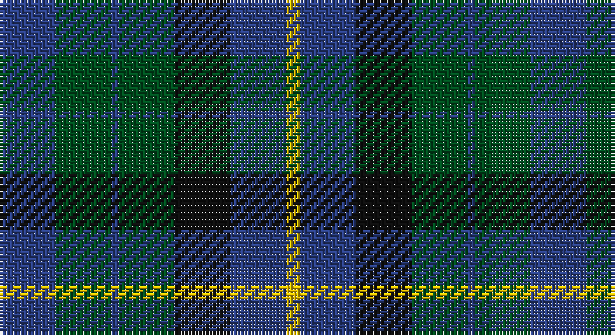

This page is one **sett** — a single exact thread-count. It belongs to the [tartan](/setts/db8dg8db1dg8k8db8ly2/)
(the same proportion at any scale), whose colour order is pattern [BGBGKBY](/stripes/bgbgkby/).

Part of the [MacKay](/tartans/mackay/) tartan — the named design grouping this sett with its other cloths.

Sourced from register-of-tartans.  It is a [7 stripe tartan](/stripes/stripes7/).

Original link https://www.tartanregister.gov.uk/tartanDetails.aspx?ref=2496

## Also known as

This cloth is also recorded under:

- MacKay #2
- MacKay Plaid
- MacKay V
- MacKay VS
- MacKay, Blue
- MacKay, Plaid

## Register references

External register numbers recorded for this tartan.

- Scottish Register of Tartans: [2496](https://www.tartanregister.gov.uk/tartanDetails.aspx?ref=2496)
- Scottish Tartans World Register: 142

## Thread count
B/16 G16 B2 G16 K16 B16 Y/4

One full sett is **152 threads**.

## Palette

Palette: <strong>Tartan Register</strong>
<table><thead><tr><th>Colour</th><th>Threads</th><th>Shade</th><th>Base</th><th>OKLCh</th></tr></thead><tbody><tr><td>B/</td><td style="text-align:right;font-variant-numeric:tabular-nums">16</td><td><code style="background-color:#2C4084;">#2C4084</code> <small style="color:#888">#2C4084</small></td><td>B <code style="background-color:#2A418A;">#2A418A</code></td><td><small style="color:#888">oklch(39.4% 0.117 268.3)</small></td></tr><tr><td>G</td><td style="text-align:right;font-variant-numeric:tabular-nums">16</td><td><code style="background-color:#005020;">#005020</code> <small style="color:#888">#005020</small></td><td>G <code style="background-color:#006100;">#006100</code></td><td><small style="color:#888">oklch(37.7% 0.105 149.6)</small></td></tr><tr><td>B</td><td style="text-align:right;font-variant-numeric:tabular-nums">2</td><td><code style="background-color:#2C4084;">#2C4084</code> <small style="color:#888">#2C4084</small></td><td>B <code style="background-color:#2A418A;">#2A418A</code></td><td><small style="color:#888">oklch(39.4% 0.117 268.3)</small></td></tr><tr><td>G</td><td style="text-align:right;font-variant-numeric:tabular-nums">16</td><td><code style="background-color:#005020;">#005020</code> <small style="color:#888">#005020</small></td><td>G <code style="background-color:#006100;">#006100</code></td><td><small style="color:#888">oklch(37.7% 0.105 149.6)</small></td></tr><tr><td>K</td><td style="text-align:right;font-variant-numeric:tabular-nums">16</td><td><code style="background-color:#101010;">#101010</code> <small style="color:#888">#101010</small></td><td>K <code style="background-color:#000000;">#000000</code></td><td><small style="color:#888">oklch(17.3% 0.000 89.9)</small></td></tr><tr><td>B</td><td style="text-align:right;font-variant-numeric:tabular-nums">16</td><td><code style="background-color:#2C4084;">#2C4084</code> <small style="color:#888">#2C4084</small></td><td>B <code style="background-color:#2A418A;">#2A418A</code></td><td><small style="color:#888">oklch(39.4% 0.117 268.3)</small></td></tr><tr><td>Y/</td><td style="text-align:right;font-variant-numeric:tabular-nums">4</td><td><code style="background-color:#E8C000;">#E8C000</code> <small style="color:#888">#E8C000</small></td><td>Y <code style="background-color:#F2BF00;">#F2BF00</code></td><td><small style="color:#888">oklch(81.9% 0.168 93.7)</small></td></tr></tbody></table>

# Sample pattern

## Nearest tartans

The nearest existing variants by ΔTartan distance, with this tartan at the top so the swatches line up against it.

ΔTartan

Tartan

Sett

—

<a href="/ttd/edit/#slug=db8dg8db1dg8k8db8ly2~x2">MacKay</a> <a class="nn-out" href="/variants/s7/db8dg8db1dg8k8db8ly2~x2/" title="open its dictionary page">↗</a>

0.65

<a href="/ttd/edit/#slug=g21k14g9db21k3db12dp3~x2&amp;base=db8dg8db1dg8k8db8ly2~x2">Scotsman</a> <a class="nn-out" href="/variants/s7/g21k14g9db21k3db12dp3~x2/" title="open its dictionary page">↗</a>

0.76

<a href="/ttd/edit/#slug=db16g14w2g14k13db12k4~x2&amp;base=db8dg8db1dg8k8db8ly2~x2">MacNeil of Colonsay (Clan)</a> <a class="nn-out" href="/variants/s7/db16g14w2g14k13db12k4~x2/" title="open its dictionary page">↗</a>

0.85

<a href="/ttd/edit/#slug=r1dy7g7db7g7db7r1~x8&amp;base=db8dg8db1dg8k8db8ly2~x2">Tennant (Yules)</a> <a class="nn-out" href="/variants/s7/r1dy7g7db7g7db7r1~x8/" title="open its dictionary page">↗</a>

0.89

<a href="/ttd/edit/#slug=db4dg6w1dg6k6db6k2~x2&amp;base=db8dg8db1dg8k8db8ly2~x2">MacNeil of Colonsay</a> <a class="nn-out" href="/variants/s7/db4dg6w1dg6k6db6k2~x2/" title="open its dictionary page">↗</a>

0.95

<a href="/ttd/edit/#slug=g21k6t3g11k17db17k3~x2&amp;base=db8dg8db1dg8k8db8ly2~x2">MacCallum</a> <a class="nn-out" href="/variants/s7/g21k6t3g11k17db17k3~x2/" title="open its dictionary page">↗</a>

0.99

<a href="/ttd/edit/#slug=k12dg12k2dg12k12db12t3~x2&amp;base=db8dg8db1dg8k8db8ly2~x2">MacIntyre</a> <a class="nn-out" href="/variants/s7/k12dg12k2dg12k12db12t3~x2/" title="open its dictionary page">↗</a>

1.01

<a href="/ttd/edit/#slug=r1dr7g7db7g7db7r1~x4&amp;base=db8dg8db1dg8k8db8ly2~x2">Tennant</a> <a class="nn-out" href="/variants/s7/r1dr7g7db7g7db7r1~x4/" title="open its dictionary page">↗</a>

1.02

<a href="/ttd/edit/#slug=k6dg6ly1dg6k6dp6k1~x4&amp;base=db8dg8db1dg8k8db8ly2~x2">Abercrombie (Wilsons No 2/64)</a> <a class="nn-out" href="/variants/s7/k6dg6ly1dg6k6dp6k1~x4/" title="open its dictionary page">↗</a>

1.02

<a href="/ttd/edit/#slug=k6dg6r1dg6k6db6k1~x2&amp;base=db8dg8db1dg8k8db8ly2~x2">MacCallum #2</a> <a class="nn-out" href="/variants/s7/k6dg6r1dg6k6db6k1~x2/" title="open its dictionary page">↗</a>

1.09

<a href="/ttd/edit/#slug=db12k17dg19w2k5~x2&amp;base=db8dg8db1dg8k8db8ly2~x2">Wilson's Folio 131</a> <a class="nn-out" href="/variants/s5/db12k17dg19w2k5~x2/" title="open its dictionary page">↗</a>

## Neighbour map

Every grey dot is one of 14360 variants placed by the first two principal components of the ΔTartan feature space (44% of its variance). Red is this tartan; blue dots are its nearest — click one to open its page.

<svg viewBox="0 0 640 380" role="img" style="max-width:100%;height:auto;border:1px solid #e0e0e0;border-radius:4px;display:block" xmlns="http://www.w3.org/2000/svg"><image href="/nn/cloud.v1.png" width="640" height="380"/><a href="/variants/s7/g21k14g9db21k3db12dp3~x2/"><circle cx="210.8" cy="270.0" r="4" fill="#3465a4"><title>Scotsman</title></circle></a><a href="/variants/s7/db16g14w2g14k13db12k4~x2/"><circle cx="173.9" cy="270.7" r="4" fill="#3465a4"><title>MacNeil of Colonsay (Clan)</title></circle></a><a href="/variants/s7/r1dy7g7db7g7db7r1~x8/"><circle cx="208.4" cy="281.6" r="4" fill="#3465a4"><title>Tennant (Yules)</title></circle></a><a href="/variants/s7/db4dg6w1dg6k6db6k2~x2/"><circle cx="161.7" cy="281.1" r="4" fill="#3465a4"><title>MacNeil of Colonsay</title></circle></a><a href="/variants/s7/g21k6t3g11k17db17k3~x2/"><circle cx="205.9" cy="263.3" r="4" fill="#3465a4"><title>MacCallum</title></circle></a><a href="/variants/s7/k12dg12k2dg12k12db12t3~x2/"><circle cx="212.8" cy="303.8" r="4" fill="#3465a4"><title>MacIntyre</title></circle></a><a href="/variants/s7/r1dr7g7db7g7db7r1~x4/"><circle cx="180.0" cy="266.2" r="4" fill="#3465a4"><title>Tennant</title></circle></a><a href="/variants/s7/k6dg6ly1dg6k6dp6k1~x4/"><circle cx="192.8" cy="280.0" r="4" fill="#3465a4"><title>Abercrombie (Wilsons No 2/64)</title></circle></a><a href="/variants/s7/k6dg6r1dg6k6db6k1~x2/"><circle cx="221.0" cy="297.6" r="4" fill="#3465a4"><title>MacCallum #2</title></circle></a><a href="/variants/s5/db12k17dg19w2k5~x2/"><circle cx="222.7" cy="269.4" r="4" fill="#3465a4"><title>Wilson's Folio 131</title></circle></a><circle cx="200.6" cy="277.9" r="5" fill="#c00000"/></svg>

ID: /variants/s7/db8dg8db1dg8k8db8ly2~x2/
