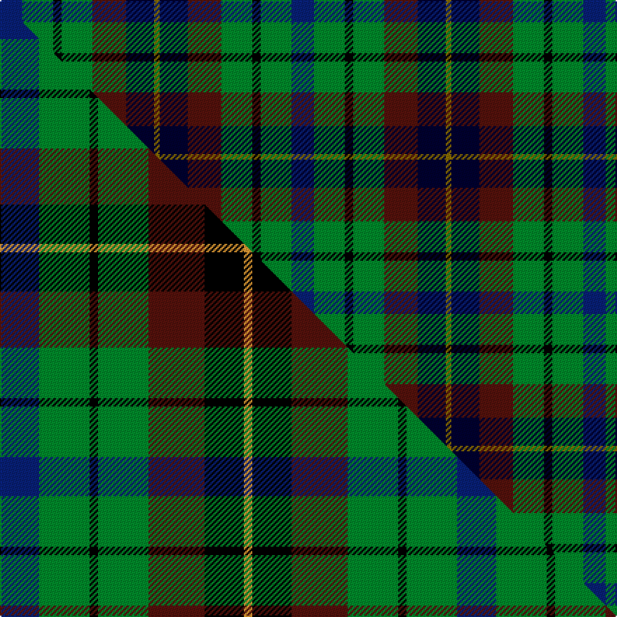

This is one **variant** — a specific cloth: this exact thread count and colourway, with its own
provenance below. It is one weaving of the [sett](/tartans/s/sc/scottish-parliament/) (the scale-free proportion — the
same cloth at any scale or shade), whose colour order is pattern [BGKGBKG](/stripes/bgkgbkg/).

Part of the [Scottish Parliament](/tartans/s/sc/scottish-parliament/) tartan — the named design grouping this sett with its other cloths.

Sourced from weddslist.  It is a [7 stripe tartan](/stripes/stripes7/).

Original link [http://www.weddslist.com/cgi-bin/tartans/pg.pl?source=sts](http://www.weddslist.com/cgi-bin/tartans/pg.pl?source=sts)

Dataset <small>— provenance for this record, inherited from the source manifest</small>

<dl class="dataset-prov">
<dt>source</dt><dd><a href="/sources/weddslist/">Weddslist</a></dd>
<dt>data captured from</dt><dd><a href="https://github.com/thetartan/tartan-database/blob/master/data/weddslist/data.csv">https://github.com/thetartan/tartan-database/blob/master/data/weddslist/data.csv</a></dd>
<dt>data date</dt><dd>2016-11-17 <small>(dataset default)</small></dd>
<dt>licence</dt><dd><a href="https://creativecommons.org/licenses/by-nc-nd/4.0/">CC BY-NC-ND 4.0</a></dd>
</dl>

Capture chain <small>— the hands this data passed through, oldest first; each capture carries its own licence</small>

<ol class="capture-chain">
<li><a href="https://www.weddslist.com/tartans/">Weddslist</a> <small>the living privately compiled reference</small></li>
<li><a href="https://github.com/thetartan/tartan-database">thetartan/tartan-database</a> <small>2016-2017</small> · <a href="https://creativecommons.org/licenses/by-nc-nd/4.0/">CC BY-NC-ND 4.0</a> <small>Levko Kravets's frozen compilation — the capture we vendored, and where its CC licence text came from</small></li>
<li>this dictionary <small>captured 2026-06-10 · commit 5bf86c7566</small> <small>each re-capture is a git commit to data/sources</small></li>
</ol>

## Thread count
DB/16 G22 K6 G22 DR24 Ki20 Y/4

One full sett is **208 threads**.

## Palette
<table><thead><tr><th>Colour</th><th>Shade</th><th>OKLCh</th></tr></thead><tbody><tr><td>DB</td><td><code style="background-color:#082077;">#082077</code> <small style="color:#888">#082077</small></td><td><small style="color:#888">oklch(30.0% 0.149 265.1)</small></td></tr><tr><td>K</td><td><code style="background-color:#000030;">#000030</code> <small style="color:#888">#000030</small></td><td><small style="color:#888">oklch(14.0% 0.097 264.1)</small></td></tr><tr><td>DR</td><td><code style="background-color:#55120C;">#55120C</code> <small style="color:#888">#55120C</small></td><td><small style="color:#888">oklch(30.0% 0.099 29.3)</small></td></tr><tr><td>G</td><td><code style="background-color:#008B2A;">#008B2A</code> <small style="color:#888">#008B2A</small></td><td><small style="color:#888">oklch(55.4% 0.170 145.9)</small></td></tr><tr><td>K</td><td><code style="background-color:#000000;">#000000</code> <small style="color:#888">#000000</small></td><td><small style="color:#888">oklch(0.0% 0.000 0.0)</small></td></tr><tr><td>Y</td><td><code style="background-color:#8B6E00;">#8B6E00</code> <small style="color:#888">#8B6E00</small></td><td><small style="color:#888">oklch(55.1% 0.113 90.4)</small></td></tr></tbody></table>

# Sample pattern

## Compared to the master

This cloth is one sett of its design; the master sett (the exemplar the design is anchored on) is below for comparison.

Its **ΔTartan distance** from the master is **2.05** — the same measure the nearest-tartans table ranks by (0 is identical; a re-scale of the same cloth is near 0, a recolour or a different proportion further).

<figure class="master-compare" style="margin:0">

this sett
master sett ★

<figcaption style="color:#888;font-size:smaller">One weave of this sett against the <a href="/setts/db14g18k3g18dr20k14lo3/">master sett ★</a>, split on the diagonal: a shared proportion runs seamlessly across it with only the shades shifting; a different proportion breaks on it.</figcaption>
</figure>

## Nearest tartan variants

The nearest existing variants by ΔTartan distance, with this cloth at the top so the swatches line up against it.

ΔTartan

Threads

Variant

Sett

—

208

<a href="/variants/s7/db8g11k3g11dr12ki10y2~x2~ki0604259/">Scottish Parliament</a>

<a href="/ttd/edit/#slug=dbi8g11k3g11dr12db10y2~x2~dbi1406275-db1404245&amp;base=db8g11k3g11dr12ki10y2~x2~ki0604259" title="compare in the TTD">0.09</a>

208

<a href="/variants/s7/dbi8g11k3g11dr12db10y2~x2~dbi1406275-db1404245/">Parliament Trade Tartan</a>

<a href="/ttd/edit/#slug=r4g11k11g2db11dy3~x4&amp;base=db8g11k3g11dr12ki10y2~x2~ki0604259" title="compare in the TTD">1.73</a>

308

<a href="/variants/s6/r4g11k11g2db11dy3~x4/">Casely (Name)</a>

<a href="/ttd/edit/#slug=r4dg11k11dg2db11g3~x4~dg1803171-g1904130&amp;base=db8g11k3g11dr12ki10y2~x2~ki0604259" title="compare in the TTD">1.73</a>

308

<a href="/variants/s6/r4dg11k11dg2db11g3~x4~dg1803171-g1904130/">Casely</a>

<a href="/ttd/edit/#slug=r2db8g8k8y1g8r2&amp;base=db8g11k3g11dr12ki10y2~x2~ki0604259" title="compare in the TTD">1.92</a>

70

<a href="/variants/s7/r2db8g8k8y1g8r2/">Brodie Hunting</a>

<a href="/ttd/edit/#slug=g4lb2g9k4g2r6db12w2~x2&amp;base=db8g11k3g11dr12ki10y2~x2~ki0604259" title="compare in the TTD">1.98</a>

152

<a href="/variants/s8/g4lb2g9k4g2r6db12w2~x2/">Cherokee</a>

<a href="/ttd/edit/#slug=db14g18k3g18dr20k14lo3~x2&amp;base=db8g11k3g11dr12ki10y2~x2~ki0604259" title="compare in the TTD">2.05</a>

326

<a href="/variants/s7/db14g18k3g18dr20k14lo3~x2/">Scottish Parliament (unofficial)</a>

<a href="/ttd/edit/#slug=r3g6k2g2k1y1g2db3w1~x4&amp;base=db8g11k3g11dr12ki10y2~x2~ki0604259" title="compare in the TTD">2.19</a>

152

<a href="/variants/s9/r3g6k2g2k1y1g2db3w1~x4/">Bisset Clan Tartan</a>

<a href="/ttd/edit/#slug=r1do7g7k7t7do7r1~x4&amp;base=db8g11k3g11dr12ki10y2~x2~ki0604259" title="compare in the TTD">2.24</a>

288

<a href="/variants/s7/r1do7g7k7t7do7r1~x4/">Tennant (Clan)</a>

<a href="/ttd/edit/#slug=r1dy7g7k7t7dy7r1~x4&amp;base=db8g11k3g11dr12ki10y2~x2~ki0604259" title="compare in the TTD">2.25</a>

288

<a href="/variants/s7/r1dy7g7k7t7dy7r1~x4/">Tennant #2</a>

<a href="/ttd/edit/#slug=r3db12k12dg12t2dg12w3~x2&amp;base=db8g11k3g11dr12ki10y2~x2~ki0604259" title="compare in the TTD">2.45</a>

212

<a href="/variants/s7/r3db12k12dg12t2dg12w3~x2/">Game Fair</a>

## Neighbour map

Every grey dot is one of 13656 variants placed by the first two principal components of the ΔTartan feature space (42% of its variance). Red is this tartan; blue dots are its nearest — click one to open its page. The map is a flat projection of a many-dimensional space — [how to read it](/posts/neighbourhood-maps/).

<svg viewBox="0 0 640 380" role="img" style="max-width:100%;height:auto;border:1px solid #e0e0e0;border-radius:4px;display:block" xmlns="http://www.w3.org/2000/svg"><image href="/nn/cloud.v1.png" width="640" height="380"/><a href="/variants/s7/dbi8g11k3g11dr12db10y2~x2~dbi1406275-db1404245/"><circle cx="114.0" cy="241.9" r="4" fill="#3465a4"><title>Parliament Trade Tartan</title></circle></a><a href="/variants/s6/r4g11k11g2db11dy3~x4/"><circle cx="73.3" cy="232.5" r="4" fill="#3465a4"><title>Casely (Name)</title></circle></a><a href="/variants/s6/r4dg11k11dg2db11g3~x4~dg1803171-g1904130/"><circle cx="94.1" cy="237.5" r="4" fill="#3465a4"><title>Casely</title></circle></a><a href="/variants/s7/r2db8g8k8y1g8r2/"><circle cx="130.9" cy="208.6" r="4" fill="#3465a4"><title>Brodie Hunting</title></circle></a><a href="/variants/s8/g4lb2g9k4g2r6db12w2~x2/"><circle cx="74.8" cy="192.4" r="4" fill="#3465a4"><title>Cherokee</title></circle></a><a href="/variants/s7/db14g18k3g18dr20k14lo3~x2/"><circle cx="108.2" cy="228.6" r="4" fill="#3465a4"><title>Scottish Parliament (unofficial)</title></circle></a><a href="/variants/s9/r3g6k2g2k1y1g2db3w1~x4/"><circle cx="113.3" cy="189.4" r="4" fill="#3465a4"><title>Bisset Clan Tartan</title></circle></a><a href="/variants/s7/r1do7g7k7t7do7r1~x4/"><circle cx="110.6" cy="229.5" r="4" fill="#3465a4"><title>Tennant (Clan)</title></circle></a><a href="/variants/s7/r1dy7g7k7t7dy7r1~x4/"><circle cx="110.1" cy="230.1" r="4" fill="#3465a4"><title>Tennant #2</title></circle></a><a href="/variants/s7/r3db12k12dg12t2dg12w3~x2/"><circle cx="115.6" cy="211.0" r="4" fill="#3465a4"><title>Game Fair</title></circle></a><circle cx="89.0" cy="232.4" r="5" fill="#c00000"/><text x="320" y="376" text-anchor="middle" font-size="11" fill="#999">ground</text><text x="11" y="190" text-anchor="middle" font-size="11" fill="#999" transform="rotate(-90 11 190)">complexity</text></svg>

ID: /variants/s7/db8g11k3g11dr12ki10y2~x2~ki0604259/
