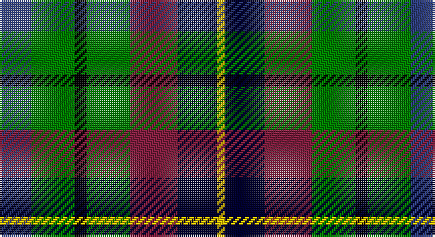

This page is one **sett** — a single exact thread-count. It belongs to the [tartan](/setts/db8g11k3g11m12ki10ly2/)
(the same proportion at any scale), whose colour order is pattern [BGKGRKY](/stripes/bgkgrky/).

Part of the [Scottish Parliament](/tartans/scottish-parliament/) tartan — the named design grouping this sett with its other cloths.

Sourced from weddslist.  It is a [7 stripe tartan](/stripes/stripes7/).

Original link http://www.weddslist.com/cgi-bin/tartans/pg.pl?source=sts

## Thread count
B/16 G22 K6 G22 DR24 DB20 Y/4

One full sett is **208 threads**.

## Palette

Palette: <strong>Ingles Buchan</strong> <small style="color:#888">(1 of 6 colours)</small>
<table><thead><tr><th>Colour</th><th>Threads</th><th>Shade</th><th>Base</th><th>OKLCh</th></tr></thead><tbody><tr><td>B/</td><td style="text-align:right;font-variant-numeric:tabular-nums">16</td><td><code style="background-color:#304080;">#304080</code> <small style="color:#888">#304080</small></td><td>B <code style="background-color:#2A418A;">#2A418A</code></td><td><small style="color:#888">oklch(39.4% 0.109 270.2)</small></td></tr><tr><td>G</td><td style="text-align:right;font-variant-numeric:tabular-nums">22</td><td><code style="background-color:#008000;">#008000</code> <small style="color:#888">#008000</small></td><td>G <code style="background-color:#006100;">#006100</code></td><td><small style="color:#888">oklch(52.0% 0.177 142.5)</small></td></tr><tr><td>K</td><td style="text-align:right;font-variant-numeric:tabular-nums">6</td><td><code style="background-color:#000000;">#000000</code> <small style="color:#888">#000000</small></td><td>K <code style="background-color:#000000;">#000000</code></td><td><small style="color:#888">oklch(0.0% 0.000 0.0)</small></td></tr><tr><td>G</td><td style="text-align:right;font-variant-numeric:tabular-nums">22</td><td><code style="background-color:#008000;">#008000</code> <small style="color:#888">#008000</small></td><td>G <code style="background-color:#006100;">#006100</code></td><td><small style="color:#888">oklch(52.0% 0.177 142.5)</small></td></tr><tr><td>DR</td><td style="text-align:right;font-variant-numeric:tabular-nums">24</td><td><code style="background-color:#802040;">#802040</code> <small style="color:#888">#802040</small></td><td>R <code style="background-color:#CC0000;">#CC0000</code></td><td><small style="color:#888">oklch(40.8% 0.132 5.2)</small></td></tr><tr><td>DB</td><td style="text-align:right;font-variant-numeric:tabular-nums">20</td><td><code style="background-color:#000030;">#000030</code> <small style="color:#888">#000030</small></td><td>K <code style="background-color:#000000;">#000000</code></td><td><small style="color:#888">oklch(14.0% 0.097 264.1)</small></td></tr><tr><td>Y/</td><td style="text-align:right;font-variant-numeric:tabular-nums">4</td><td><code style="background-color:#F0C000;">#F0C000</code> <small style="color:#888">#F0C000</small></td><td>Y <code style="background-color:#F2BF00;">#F2BF00</code></td><td><small style="color:#888">oklch(82.7% 0.169 90.5)</small></td></tr></tbody></table>

# Sample pattern

## Compared to the master

This cloth is one sett of its design; the master sett (the exemplar the design is anchored on) is below for comparison.

<figure style="margin:0"><figcaption style="color:#888;font-size:smaller">this sett</figcaption></figure>
<figure style="margin:0"><figcaption style="color:#888;font-size:smaller"><a href="/setts/db14g18k3g18r20k14lo3/">master sett →</a></figcaption></figure>

## Nearest tartans

The nearest existing variants by ΔTartan distance, with this tartan at the top so the swatches line up against it.

ΔTartan

Tartan

Sett

—

<a href="/ttd/edit/#slug=db8g11k3g11m12ki10ly2~x2">Scottish Parliament</a> <a class="nn-out" href="/variants/s7/db8g11k3g11m12ki10ly2~x2/" title="open its dictionary page">↗</a>

1.09

<a href="/ttd/edit/#slug=g5dg5gi5db5dbi5dg10w2~x8&amp;base=db8g11k3g11m12ki10ly2~x2">Pollard (2014)</a> <a class="nn-out" href="/variants/s7/g5dg5gi5db5dbi5dg10w2~x8/" title="open its dictionary page">↗</a>

1.18

<a href="/variants/s8/dp11t2k10g10ly3~x2/">Wilson's No.217</a>

1.21

<a href="/ttd/edit/#slug=g5dg5gi5dbi5db5dg10w2~x8&amp;base=db8g11k3g11m12ki10ly2~x2">Pollard (2014)</a> <a class="nn-out" href="/variants/s7/g5dg5gi5dbi5db5dg10w2~x8/" title="open its dictionary page">↗</a>

1.25

<a href="/ttd/edit/#slug=r10k17t10dp17g40ly10~x2&amp;base=db8g11k3g11m12ki10ly2~x2">Gallowater, Original</a> <a class="nn-out" href="/variants/s6/r10k17t10dp17g40ly10~x2/" title="open its dictionary page">↗</a>

1.29

<a href="/variants/s8/dp11y2k10g10lo2~x2/">Selkirk (Personal) Original</a>

1.29

<a href="/variants/s7/k7db11ki3db11dy11g22db3~x2/">Scottish Odyssey Commemorative Tartan</a>

1.29

<a href="/ttd/edit/#slug=k11g12w2g12k12dp12r3~x2&amp;base=db8g11k3g11m12ki10ly2~x2">Cunningham / Wilson's No 120</a> <a class="nn-out" href="/variants/s7/k11g12w2g12k12dp12r3~x2/" title="open its dictionary page">↗</a>

1.30

<a href="/ttd/edit/#slug=r10k18t10db18g40ly5&amp;base=db8g11k3g11m12ki10ly2~x2">Gallowater</a> <a class="nn-out" href="/variants/s6/r10k18t10db18g40ly5/" title="open its dictionary page">↗</a>

1.33

<a href="/ttd/edit/#slug=g15dg18db23w4r8~x2&amp;base=db8g11k3g11m12ki10ly2~x2">Friebe (2014)</a> <a class="nn-out" href="/variants/s5/g15dg18db23w4r8~x2/" title="open its dictionary page">↗</a>

1.33

<a href="/ttd/edit/#slug=r4g11k11g2db11y3~x4&amp;base=db8g11k3g11m12ki10ly2~x2">Casely</a> <a class="nn-out" href="/variants/s6/r4g11k11g2db11y3~x4/" title="open its dictionary page">↗</a>

## Neighbour map

Every grey dot is one of 14360 variants placed by the first two principal components of the ΔTartan feature space (44% of its variance). Red is this tartan; blue dots are its nearest — click one to open its page.

<svg viewBox="0 0 640 380" role="img" style="max-width:100%;height:auto;border:1px solid #e0e0e0;border-radius:4px;display:block" xmlns="http://www.w3.org/2000/svg"><image href="/nn/cloud.v1.png" width="640" height="380"/><a href="/variants/s7/g5dg5gi5db5dbi5dg10w2~x8/"><circle cx="77.0" cy="254.9" r="4" fill="#3465a4"><title>Pollard (2014)</title></circle></a><a href="/variants/s8/dp11t2k10g10ly3~x2/"><circle cx="106.4" cy="242.2" r="4" fill="#3465a4"><title>Wilson's No.217</title></circle></a><a href="/variants/s7/g5dg5gi5dbi5db5dg10w2~x8/"><circle cx="67.9" cy="251.4" r="4" fill="#3465a4"><title>Pollard (2014)</title></circle></a><a href="/variants/s6/r10k17t10dp17g40ly10~x2/"><circle cx="74.7" cy="224.3" r="4" fill="#3465a4"><title>Gallowater, Original</title></circle></a><a href="/variants/s8/dp11y2k10g10lo2~x2/"><circle cx="118.9" cy="237.5" r="4" fill="#3465a4"><title>Selkirk (Personal) Original</title></circle></a><a href="/variants/s7/k7db11ki3db11dy11g22db3~x2/"><circle cx="127.8" cy="225.1" r="4" fill="#3465a4"><title>Scottish Odyssey Commemorative Tartan</title></circle></a><a href="/variants/s7/k11g12w2g12k12dp12r3~x2/"><circle cx="131.2" cy="256.3" r="4" fill="#3465a4"><title>Cunningham / Wilson's No 120</title></circle></a><a href="/variants/s6/r10k18t10db18g40ly5/"><circle cx="99.1" cy="193.2" r="4" fill="#3465a4"><title>Gallowater</title></circle></a><a href="/variants/s5/g15dg18db23w4r8~x2/"><circle cx="91.0" cy="251.4" r="4" fill="#3465a4"><title>Friebe (2014)</title></circle></a><a href="/variants/s6/r4g11k11g2db11y3~x4/"><circle cx="73.4" cy="237.6" r="4" fill="#3465a4"><title>Casely</title></circle></a><circle cx="74.5" cy="228.7" r="5" fill="#c00000"/></svg>

ID: /variants/s7/db8g11k3g11m12ki10ly2~x2/
