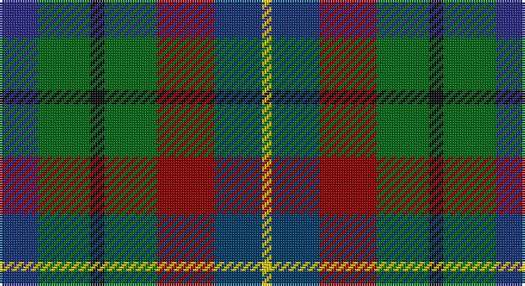

This page is one **sett** — a single exact thread-count. It belongs to the [tartan](/setts/db8g11k3g11r12dt10ly2/)
(the same proportion at any scale), whose colour order is pattern [BGKGRBY](/stripes/bgkgrby/).

Sourced from house-of-tartan.  It is a [7 stripe tartan](/stripes/stripes7/).

Original link http://www.house-of-tartan.scotland.net/house/TartanViewjs.asp?colr=Def&tnam=2477

## Provenance

Earliest known date: 1998 Created to celebrate the referendum result for the re-establishment of a Scottish Parliament as well as to provide a Parliamentary livery tartan.

## Thread count
DB/16 G22 K6 G22 DR24 DBa20 Y/4

One full sett is **208 threads**.

## Palette

Palette: <strong>Tartan Register</strong>
<table><thead><tr><th>Colour</th><th>Threads</th><th>Shade</th><th>Base</th><th>OKLCh</th></tr></thead><tbody><tr><td>DB/</td><td style="text-align:right;font-variant-numeric:tabular-nums">16</td><td><code style="background-color:#2C2C80;">#2C2C80</code> <small style="color:#888">#2C2C80</small></td><td>B <code style="background-color:#2A418A;">#2A418A</code></td><td><small style="color:#888">oklch(35.0% 0.138 276.6)</small></td></tr><tr><td>G</td><td style="text-align:right;font-variant-numeric:tabular-nums">22</td><td><code style="background-color:#006818;">#006818</code> <small style="color:#888">#006818</small></td><td>G <code style="background-color:#006100;">#006100</code></td><td><small style="color:#888">oklch(45.0% 0.142 145.0)</small></td></tr><tr><td>K</td><td style="text-align:right;font-variant-numeric:tabular-nums">6</td><td><code style="background-color:#101010;">#101010</code> <small style="color:#888">#101010</small></td><td>K <code style="background-color:#000000;">#000000</code></td><td><small style="color:#888">oklch(17.3% 0.000 89.9)</small></td></tr><tr><td>G</td><td style="text-align:right;font-variant-numeric:tabular-nums">22</td><td><code style="background-color:#006818;">#006818</code> <small style="color:#888">#006818</small></td><td>G <code style="background-color:#006100;">#006100</code></td><td><small style="color:#888">oklch(45.0% 0.142 145.0)</small></td></tr><tr><td>DR</td><td style="text-align:right;font-variant-numeric:tabular-nums">24</td><td><code style="background-color:#880000;">#880000</code> <small style="color:#888">#880000</small></td><td>R <code style="background-color:#CC0000;">#CC0000</code></td><td><small style="color:#888">oklch(39.4% 0.162 29.2)</small></td></tr><tr><td>DBa</td><td style="text-align:right;font-variant-numeric:tabular-nums">20</td><td><code style="background-color:#003C64;">#003C64</code> <small style="color:#888">#003C64</small></td><td>B <code style="background-color:#2A418A;">#2A418A</code></td><td><small style="color:#888">oklch(34.5% 0.089 246.0)</small></td></tr><tr><td>Y/</td><td style="text-align:right;font-variant-numeric:tabular-nums">4</td><td><code style="background-color:#E8C000;">#E8C000</code> <small style="color:#888">#E8C000</small></td><td>Y <code style="background-color:#F2BF00;">#F2BF00</code></td><td><small style="color:#888">oklch(81.9% 0.168 93.7)</small></td></tr></tbody></table>

# Sample pattern

## Nearest tartans

The nearest existing variants by ΔTartan distance, with this tartan at the top so the swatches line up against it.

ΔTartan

Tartan

Sett

—

<a href="/ttd/edit/#slug=db8g11k3g11r12dt10ly2~x2">Parliament Trade Tartan</a> <a class="nn-out" href="/variants/s7/db8g11k3g11r12dt10ly2~x2/" title="open its dictionary page">↗</a>

0.97

<a href="/ttd/edit/#slug=r1dy7g7k7b7dy7r1~x4&amp;base=db8g11k3g11r12dt10ly2~x2">Tennant (Clan)</a> <a class="nn-out" href="/variants/s7/r1dy7g7k7b7dy7r1~x4/" title="open its dictionary page">↗</a>

1.19

<a href="/ttd/edit/#slug=db14g18k3g18r20k14lo3~x2&amp;base=db8g11k3g11r12dt10ly2~x2">Scottish Parliament (unofficial)</a> <a class="nn-out" href="/variants/s7/db14g18k3g18r20k14lo3~x2/" title="open its dictionary page">↗</a>

1.26

<a href="/ttd/edit/#slug=r1dy7db7k7g7dy7r1~x4&amp;base=db8g11k3g11r12dt10ly2~x2">Tennant Family Tartan</a> <a class="nn-out" href="/variants/s7/r1dy7db7k7g7dy7r1~x4/" title="open its dictionary page">↗</a>

1.27

<a href="/ttd/edit/#slug=r3db12k12dg12b2dg12w3~x2&amp;base=db8g11k3g11r12dt10ly2~x2">Game Fair</a> <a class="nn-out" href="/variants/s7/r3db12k12dg12b2dg12w3~x2/" title="open its dictionary page">↗</a>

1.27

<a href="/ttd/edit/#slug=g5dg5gi5db5dbi5dg10w2~x8&amp;base=db8g11k3g11r12dt10ly2~x2">Pollard (2014)</a> <a class="nn-out" href="/variants/s7/g5dg5gi5db5dbi5dg10w2~x8/" title="open its dictionary page">↗</a>

1.33

<a href="/ttd/edit/#slug=r4g11k11g2n11y3~x4&amp;base=db8g11k3g11r12dt10ly2~x2">Casely</a> <a class="nn-out" href="/variants/s6/r4g11k11g2n11y3~x4/" title="open its dictionary page">↗</a>

1.40

<a href="/ttd/edit/#slug=g2lo1g5k4do5r1~x4&amp;base=db8g11k3g11r12dt10ly2~x2">Forres</a> <a class="nn-out" href="/variants/s6/g2lo1g5k4do5r1~x4/" title="open its dictionary page">↗</a>

1.42

<a href="/ttd/edit/#slug=b2db3k1db3o3g4r1~x8&amp;base=db8g11k3g11r12dt10ly2~x2">New York City</a> <a class="nn-out" href="/variants/s7/b2db3k1db3o3g4r1~x8/" title="open its dictionary page">↗</a>

1.42

<a href="/ttd/edit/#slug=k4g16k14lo3n16r4~x2&amp;base=db8g11k3g11r12dt10ly2~x2">Birse</a> <a class="nn-out" href="/variants/s6/k4g16k14lo3n16r4~x2/" title="open its dictionary page">↗</a>

1.42

<a href="/ttd/edit/#slug=r2k1g7k6n7db2n7k6g7k1lo2~x4&amp;base=db8g11k3g11r12dt10ly2~x2">Smith of Pennilands (Clan)</a> <a class="nn-out" href="/variants/s11/r2k1g7k6n7db2n7k6g7k1lo2~x4/" title="open its dictionary page">↗</a>

## Neighbour map

Every grey dot is one of 14360 variants placed by the first two principal components of the ΔTartan feature space (44% of its variance). Red is this tartan; blue dots are its nearest — click one to open its page.

<svg viewBox="0 0 640 380" role="img" style="max-width:100%;height:auto;border:1px solid #e0e0e0;border-radius:4px;display:block" xmlns="http://www.w3.org/2000/svg"><image href="/nn/cloud.v1.png" width="640" height="380"/><a href="/variants/s7/r1dy7g7k7b7dy7r1~x4/"><circle cx="151.6" cy="254.5" r="4" fill="#3465a4"><title>Tennant (Clan)</title></circle></a><a href="/variants/s7/db14g18k3g18r20k14lo3~x2/"><circle cx="143.2" cy="247.0" r="4" fill="#3465a4"><title>Scottish Parliament (unofficial)</title></circle></a><a href="/variants/s7/r1dy7db7k7g7dy7r1~x4/"><circle cx="167.7" cy="262.2" r="4" fill="#3465a4"><title>Tennant Family Tartan</title></circle></a><a href="/variants/s7/r3db12k12dg12b2dg12w3~x2/"><circle cx="149.9" cy="237.5" r="4" fill="#3465a4"><title>Game Fair</title></circle></a><a href="/variants/s7/g5dg5gi5db5dbi5dg10w2~x8/"><circle cx="77.0" cy="254.9" r="4" fill="#3465a4"><title>Pollard (2014)</title></circle></a><a href="/variants/s6/r4g11k11g2n11y3~x4/"><circle cx="133.1" cy="264.8" r="4" fill="#3465a4"><title>Casely</title></circle></a><a href="/variants/s6/g2lo1g5k4do5r1~x4/"><circle cx="166.5" cy="269.7" r="4" fill="#3465a4"><title>Forres</title></circle></a><a href="/variants/s7/b2db3k1db3o3g4r1~x8/"><circle cx="76.6" cy="265.1" r="4" fill="#3465a4"><title>New York City</title></circle></a><a href="/variants/s6/k4g16k14lo3n16r4~x2/"><circle cx="127.3" cy="255.8" r="4" fill="#3465a4"><title>Birse</title></circle></a><a href="/variants/s11/r2k1g7k6n7db2n7k6g7k1lo2~x4/"><circle cx="93.6" cy="207.8" r="4" fill="#3465a4"><title>Smith of Pennilands (Clan)</title></circle></a><circle cx="115.4" cy="248.3" r="5" fill="#c00000"/></svg>

ID: /variants/s7/db8g11k3g11r12dt10ly2~x2/
