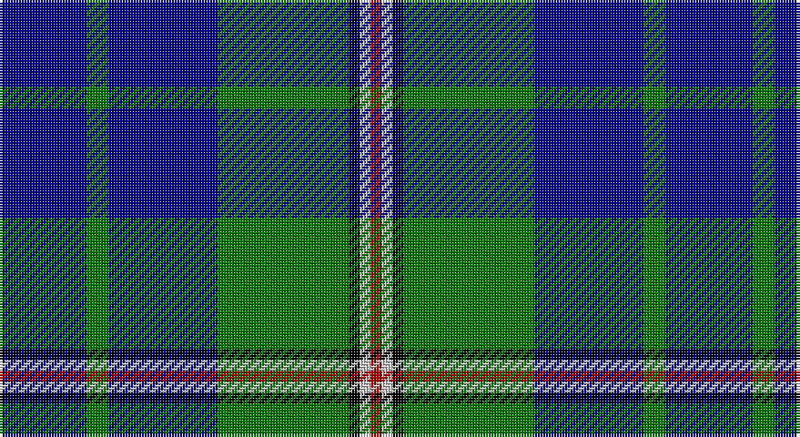

This page is one **sett** — a single exact thread-count. It belongs to the [tartan](/setts/db8g2db10g12k1lb1r1/)
(the same proportion at any scale), whose colour order is pattern [BGBGKWR](/stripes/bgbgkwr/).

Part of the [Nowell/Noel](/tartans/nowell-noel/) tartan — the named design grouping this sett with its other cloths.

Sourced from register-of-tartans.  It is a [7 stripe tartan](/stripes/stripes7/).

Original link https://www.tartanregister.gov.uk/tartanDetails.aspx?ref=3206

## Register references

External register numbers recorded for this tartan.

- Scottish Register of Tartans: [3206](https://www.tartanregister.gov.uk/tartanDetails.aspx?ref=3206)
- Scottish Tartans Authority (ITI): 4108

## Thread count
DB/32 G8 DB40 G48 K4 N4 DR/4

One full sett is **244 threads**.

## Palette

Palette: <strong>Tartan Register</strong> <small style="color:#888">(7 of 8 colours)</small>
<table><thead><tr><th>Colour</th><th>Threads</th><th>Shade</th><th>Base</th><th>OKLCh</th></tr></thead><tbody><tr><td>DB/</td><td style="text-align:right;font-variant-numeric:tabular-nums">32</td><td><code style="background-color:#00008C;">#00008C</code> <small style="color:#888">#00008C</small></td><td>B <code style="background-color:#2A418A;">#2A418A</code></td><td><small style="color:#888">oklch(28.9% 0.200 264.1)</small></td></tr><tr><td>G</td><td style="text-align:right;font-variant-numeric:tabular-nums">8</td><td><code style="background-color:#007800;">#007800</code> <small style="color:#888">#007800</small></td><td>G <code style="background-color:#006100;">#006100</code></td><td><small style="color:#888">oklch(49.6% 0.169 142.5)</small></td></tr><tr><td>DB</td><td style="text-align:right;font-variant-numeric:tabular-nums">40</td><td><code style="background-color:#00008C;">#00008C</code> <small style="color:#888">#00008C</small></td><td>B <code style="background-color:#2A418A;">#2A418A</code></td><td><small style="color:#888">oklch(28.9% 0.200 264.1)</small></td></tr><tr><td>G</td><td style="text-align:right;font-variant-numeric:tabular-nums">48</td><td><code style="background-color:#007800;">#007800</code> <small style="color:#888">#007800</small></td><td>G <code style="background-color:#006100;">#006100</code></td><td><small style="color:#888">oklch(49.6% 0.169 142.5)</small></td></tr><tr><td>K</td><td style="text-align:right;font-variant-numeric:tabular-nums">4</td><td><code style="background-color:#000000;">#000000</code> <small style="color:#888">#000000</small></td><td>K <code style="background-color:#000000;">#000000</code></td><td><small style="color:#888">oklch(0.0% 0.000 0.0)</small></td></tr><tr><td>N</td><td style="text-align:right;font-variant-numeric:tabular-nums">4</td><td><code style="background-color:#C8C8C8;">#C8C8C8</code> <small style="color:#888">#C8C8C8</small></td><td>W <code style="background-color:#F7F7F7;">#F7F7F7</code></td><td><small style="color:#888">oklch(83.3% 0.000 89.9)</small></td></tr><tr><td>DR/</td><td style="text-align:right;font-variant-numeric:tabular-nums">4</td><td><code style="background-color:#B00000;">#B00000</code> <small style="color:#888">#B00000</small></td><td>R <code style="background-color:#CC0000;">#CC0000</code></td><td><small style="color:#888">oklch(47.5% 0.195 29.2)</small></td></tr></tbody></table>

# Sample pattern

## Nearest tartans

The nearest existing variants by ΔTartan distance, with this tartan at the top so the swatches line up against it.

ΔTartan

Tartan

Sett

—

<a href="/ttd/edit/#slug=db8g2db10g12k1lb1r1~x4">Nowell/Noel</a> <a class="nn-out" href="/variants/s7/db8g2db10g12k1lb1r1~x4/" title="open its dictionary page">↗</a>

1.04

<a href="/variants/s6/k4t24k2g13t2ki3~x4/">Vance (Family Association) Corporate Family Tartan</a>

1.28

<a href="/ttd/edit/#slug=r2db6g15b9db30b9g6lo2~x2&amp;base=db8g2db10g12k1lb1r1~x4">Miller</a> <a class="nn-out" href="/variants/s8/r2db6g15b9db30b9g6lo2~x2/" title="open its dictionary page">↗</a>

1.39

<a href="/ttd/edit/#slug=r4db24w2g13db2k3~x4&amp;base=db8g2db10g12k1lb1r1~x4">Vance (Family Association)</a> <a class="nn-out" href="/variants/s6/r4db24w2g13db2k3~x4/" title="open its dictionary page">↗</a>

1.40

<a href="/ttd/edit/#slug=db24g3db3g3lo2g18r2~x2&amp;base=db8g2db10g12k1lb1r1~x4">Greenways Marketing Intl (Corporate)</a> <a class="nn-out" href="/variants/s7/db24g3db3g3lo2g18r2~x2/" title="open its dictionary page">↗</a>

1.41

<a href="/ttd/edit/#slug=db3g4db20g24k2lb3r1~x2&amp;base=db8g2db10g12k1lb1r1~x4">Nowell/Noel (Name)</a> <a class="nn-out" href="/variants/s7/db3g4db20g24k2lb3r1~x2/" title="open its dictionary page">↗</a>

1.43

<a href="/ttd/edit/#slug=k5g32db32r3db3ly3~x2&amp;base=db8g2db10g12k1lb1r1~x4">Carmichael</a> <a class="nn-out" href="/variants/s6/k5g32db32r3db3ly3~x2/" title="open its dictionary page">↗</a>

1.44

<a href="/ttd/edit/#slug=dg2k1dg12r4dg3db9lb2~x4&amp;base=db8g2db10g12k1lb1r1~x4">Lee (Personal)</a> <a class="nn-out" href="/variants/s7/dg2k1dg12r4dg3db9lb2~x4/" title="open its dictionary page">↗</a>

1.44

<a href="/ttd/edit/#slug=t3k2g2k1db10w1~x8&amp;base=db8g2db10g12k1lb1r1~x4">Isle of Harris (District)</a> <a class="nn-out" href="/variants/s6/t3k2g2k1db10w1~x8/" title="open its dictionary page">↗</a>

1.44

<a href="/ttd/edit/#slug=k7db4dg31db3ly2db27lb4~x2&amp;base=db8g2db10g12k1lb1r1~x4">Wishart Htg (Clan)</a> <a class="nn-out" href="/variants/s7/k7db4dg31db3ly2db27lb4~x2/" title="open its dictionary page">↗</a>

1.45

<a href="/ttd/edit/#slug=dg4db12r3db12dg32lb4&amp;base=db8g2db10g12k1lb1r1~x4">MacIntyre L</a> <a class="nn-out" href="/variants/s6/dg4db12r3db12dg32lb4/" title="open its dictionary page">↗</a>

## Neighbour map

Every grey dot is one of 14360 variants placed by the first two principal components of the ΔTartan feature space (44% of its variance). Red is this tartan; blue dots are its nearest — click one to open its page.

<svg viewBox="0 0 640 380" role="img" style="max-width:100%;height:auto;border:1px solid #e0e0e0;border-radius:4px;display:block" xmlns="http://www.w3.org/2000/svg"><image href="/nn/cloud.v1.png" width="640" height="380"/><a href="/variants/s6/k4t24k2g13t2ki3~x4/"><circle cx="260.6" cy="179.0" r="4" fill="#3465a4"><title>Vance (Family Association) Corporate Family Tartan</title></circle></a><a href="/variants/s8/r2db6g15b9db30b9g6lo2~x2/"><circle cx="229.9" cy="181.6" r="4" fill="#3465a4"><title>Miller</title></circle></a><a href="/variants/s6/r4db24w2g13db2k3~x4/"><circle cx="276.8" cy="179.4" r="4" fill="#3465a4"><title>Vance (Family Association)</title></circle></a><a href="/variants/s7/db24g3db3g3lo2g18r2~x2/"><circle cx="312.1" cy="197.7" r="4" fill="#3465a4"><title>Greenways Marketing Intl (Corporate)</title></circle></a><a href="/variants/s7/db3g4db20g24k2lb3r1~x2/"><circle cx="283.3" cy="146.8" r="4" fill="#3465a4"><title>Nowell/Noel (Name)</title></circle></a><a href="/variants/s6/k5g32db32r3db3ly3~x2/"><circle cx="250.5" cy="189.2" r="4" fill="#3465a4"><title>Carmichael</title></circle></a><a href="/variants/s7/dg2k1dg12r4dg3db9lb2~x4/"><circle cx="248.2" cy="195.6" r="4" fill="#3465a4"><title>Lee (Personal)</title></circle></a><a href="/variants/s6/t3k2g2k1db10w1~x8/"><circle cx="243.1" cy="185.7" r="4" fill="#3465a4"><title>Isle of Harris (District)</title></circle></a><a href="/variants/s7/k7db4dg31db3ly2db27lb4~x2/"><circle cx="246.6" cy="169.8" r="4" fill="#3465a4"><title>Wishart Htg (Clan)</title></circle></a><a href="/variants/s6/dg4db12r3db12dg32lb4/"><circle cx="301.0" cy="219.4" r="4" fill="#3465a4"><title>MacIntyre L</title></circle></a><circle cx="264.3" cy="189.0" r="5" fill="#c00000"/></svg>

ID: /variants/s7/db8g2db10g12k1lb1r1~x4/
