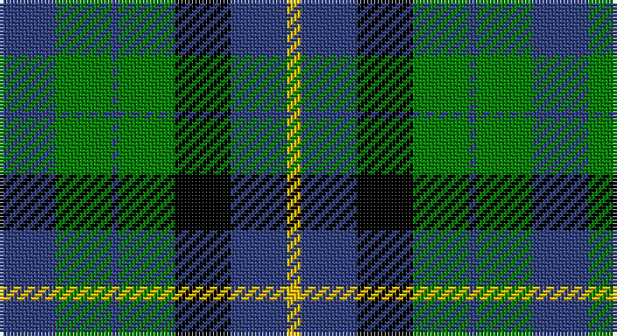

This page is one **sett** — a single exact thread-count. It belongs to the [tartan](/setts/db8g8db1g8k8db8ly2/)
(the same proportion at any scale), whose colour order is pattern [BGBGKBY](/stripes/bgbgkby/).

Part of the [MacKay](/tartans/mackay/) tartan — the named design grouping this sett with its other cloths.

Sourced from weddslist.  It is a [7 stripe tartan](/stripes/stripes7/).

Original link http://www.weddslist.com/cgi-bin/tartans/pg.pl?source=sts

## Also known as

This cloth is also recorded under:

- MacKay #2
- MacKay Plaid
- MacKay V
- MacKay VS
- MacKay, Blue
- MacKay, Plaid

## Thread count
B/16 G16 B2 G16 K16 B16 Y/4

One full sett is **152 threads**.

## Palette

Palette: <strong>Ingles Buchan</strong> <small style="color:#888">(1 of 4 colours)</small>
<table><thead><tr><th>Colour</th><th>Threads</th><th>Shade</th><th>Base</th><th>OKLCh</th></tr></thead><tbody><tr><td>B/</td><td style="text-align:right;font-variant-numeric:tabular-nums">16</td><td><code style="background-color:#304080;">#304080</code> <small style="color:#888">#304080</small></td><td>B <code style="background-color:#2A418A;">#2A418A</code></td><td><small style="color:#888">oklch(39.4% 0.109 270.2)</small></td></tr><tr><td>G</td><td style="text-align:right;font-variant-numeric:tabular-nums">16</td><td><code style="background-color:#008000;">#008000</code> <small style="color:#888">#008000</small></td><td>G <code style="background-color:#006100;">#006100</code></td><td><small style="color:#888">oklch(52.0% 0.177 142.5)</small></td></tr><tr><td>B</td><td style="text-align:right;font-variant-numeric:tabular-nums">2</td><td><code style="background-color:#304080;">#304080</code> <small style="color:#888">#304080</small></td><td>B <code style="background-color:#2A418A;">#2A418A</code></td><td><small style="color:#888">oklch(39.4% 0.109 270.2)</small></td></tr><tr><td>G</td><td style="text-align:right;font-variant-numeric:tabular-nums">16</td><td><code style="background-color:#008000;">#008000</code> <small style="color:#888">#008000</small></td><td>G <code style="background-color:#006100;">#006100</code></td><td><small style="color:#888">oklch(52.0% 0.177 142.5)</small></td></tr><tr><td>K</td><td style="text-align:right;font-variant-numeric:tabular-nums">16</td><td><code style="background-color:#000000;">#000000</code> <small style="color:#888">#000000</small></td><td>K <code style="background-color:#000000;">#000000</code></td><td><small style="color:#888">oklch(0.0% 0.000 0.0)</small></td></tr><tr><td>B</td><td style="text-align:right;font-variant-numeric:tabular-nums">16</td><td><code style="background-color:#304080;">#304080</code> <small style="color:#888">#304080</small></td><td>B <code style="background-color:#2A418A;">#2A418A</code></td><td><small style="color:#888">oklch(39.4% 0.109 270.2)</small></td></tr><tr><td>Y/</td><td style="text-align:right;font-variant-numeric:tabular-nums">4</td><td><code style="background-color:#F0C000;">#F0C000</code> <small style="color:#888">#F0C000</small></td><td>Y <code style="background-color:#F2BF00;">#F2BF00</code></td><td><small style="color:#888">oklch(82.7% 0.169 90.5)</small></td></tr></tbody></table>

# Sample pattern

## Compared to the master

This cloth is one sett of its design; the master sett (the exemplar the design is anchored on) is below for comparison.

<figure style="margin:0"><figcaption style="color:#888;font-size:smaller">this sett</figcaption></figure>
<figure style="margin:0"><figcaption style="color:#888;font-size:smaller"><a href="/setts/db8dg8db1dg8k8db8ly2/">master sett →</a></figcaption></figure>

## Nearest tartans

The nearest existing variants by ΔTartan distance, with this tartan at the top so the swatches line up against it.

ΔTartan

Tartan

Sett

—

<a href="/ttd/edit/#slug=db8g8db1g8k8db8ly2~x2">MacKay</a> <a class="nn-out" href="/variants/s7/db8g8db1g8k8db8ly2~x2/" title="open its dictionary page">↗</a>

0.44

<a href="/ttd/edit/#slug=k8dg8k1dg8k8b8w2~x2&amp;base=db8g8db1g8k8db8ly2~x2">Unidentified No 31</a> <a class="nn-out" href="/variants/s7/k8dg8k1dg8k8b8w2~x2/" title="open its dictionary page">↗</a>

0.57

<a href="/ttd/edit/#slug=db4g6w1g6k6db6k2~x4&amp;base=db8g8db1g8k8db8ly2~x2">MacNeil of Colonsay</a> <a class="nn-out" href="/variants/s7/db4g6w1g6k6db6k2~x4/" title="open its dictionary page">↗</a>

0.77

<a href="/ttd/edit/#slug=k8g8k1g8k8b8w2~x2&amp;base=db8g8db1g8k8db8ly2~x2">Unnamed, No 31</a> <a class="nn-out" href="/variants/s7/k8g8k1g8k8b8w2~x2/" title="open its dictionary page">↗</a>

0.89

<a href="/ttd/edit/#slug=t3g6k6t4r1t1~x2&amp;base=db8g8db1g8k8db8ly2~x2">Wellington, or Waterloo</a> <a class="nn-out" href="/variants/s6/t3g6k6t4r1t1~x2/" title="open its dictionary page">↗</a>

0.92

<a href="/ttd/edit/#slug=b10k3b10k14r2g14k4~x2&amp;base=db8g8db1g8k8db8ly2~x2">Fletcher #2</a> <a class="nn-out" href="/variants/s7/b10k3b10k14r2g14k4~x2/" title="open its dictionary page">↗</a>

0.99

<a href="/ttd/edit/#slug=k12g12k2g12k12db12t3~x2&amp;base=db8g8db1g8k8db8ly2~x2">MacIntyre</a> <a class="nn-out" href="/variants/s7/k12g12k2g12k12db12t3~x2/" title="open its dictionary page">↗</a>

1.03

<a href="/ttd/edit/#slug=g8k2t1g4k6db6k1~x2&amp;base=db8g8db1g8k8db8ly2~x2">MacCallum</a> <a class="nn-out" href="/variants/s7/g8k2t1g4k6db6k1~x2/" title="open its dictionary page">↗</a>

1.07

<a href="/ttd/edit/#slug=k7g6w1g6k7db7k1~x4&amp;base=db8g8db1g8k8db8ly2~x2">MacLaggan</a> <a class="nn-out" href="/variants/s7/k7g6w1g6k7db7k1~x4/" title="open its dictionary page">↗</a>

1.10

<a href="/ttd/edit/#slug=k6g6r1g6k6db6k1~x2&amp;base=db8g8db1g8k8db8ly2~x2">MacCallum</a> <a class="nn-out" href="/variants/s7/k6g6r1g6k6db6k1~x2/" title="open its dictionary page">↗</a>

1.13

<a href="/ttd/edit/#slug=k4w2g13k13t12k2~x2&amp;base=db8g8db1g8k8db8ly2~x2">Melville</a> <a class="nn-out" href="/variants/s6/k4w2g13k13t12k2~x2/" title="open its dictionary page">↗</a>

## Neighbour map

Every grey dot is one of 14360 variants placed by the first two principal components of the ΔTartan feature space (44% of its variance). Red is this tartan; blue dots are its nearest — click one to open its page.

<svg viewBox="0 0 640 380" role="img" style="max-width:100%;height:auto;border:1px solid #e0e0e0;border-radius:4px;display:block" xmlns="http://www.w3.org/2000/svg"><image href="/nn/cloud.v1.png" width="640" height="380"/><a href="/variants/s7/k8dg8k1dg8k8b8w2~x2/"><circle cx="152.2" cy="253.5" r="4" fill="#3465a4"><title>Unidentified No 31</title></circle></a><a href="/variants/s7/db4g6w1g6k6db6k2~x4/"><circle cx="119.8" cy="262.7" r="4" fill="#3465a4"><title>MacNeil of Colonsay</title></circle></a><a href="/variants/s7/k8g8k1g8k8b8w2~x2/"><circle cx="128.3" cy="241.2" r="4" fill="#3465a4"><title>Unnamed, No 31</title></circle></a><a href="/variants/s6/t3g6k6t4r1t1~x2/"><circle cx="128.4" cy="245.2" r="4" fill="#3465a4"><title>Wellington, or Waterloo</title></circle></a><a href="/variants/s7/b10k3b10k14r2g14k4~x2/"><circle cx="131.7" cy="239.8" r="4" fill="#3465a4"><title>Fletcher #2</title></circle></a><a href="/variants/s7/k12g12k2g12k12db12t3~x2/"><circle cx="130.6" cy="263.7" r="4" fill="#3465a4"><title>MacIntyre</title></circle></a><a href="/variants/s7/g8k2t1g4k6db6k1~x2/"><circle cx="171.2" cy="232.3" r="4" fill="#3465a4"><title>MacCallum</title></circle></a><a href="/variants/s7/k7g6w1g6k7db7k1~x4/"><circle cx="152.4" cy="250.4" r="4" fill="#3465a4"><title>MacLaggan</title></circle></a><a href="/variants/s7/k6g6r1g6k6db6k1~x2/"><circle cx="141.2" cy="259.4" r="4" fill="#3465a4"><title>MacCallum</title></circle></a><a href="/variants/s6/k4w2g13k13t12k2~x2/"><circle cx="166.3" cy="239.3" r="4" fill="#3465a4"><title>Melville</title></circle></a><circle cx="145.0" cy="249.4" r="5" fill="#c00000"/></svg>

ID: /variants/s7/db8g8db1g8k8db8ly2~x2/
