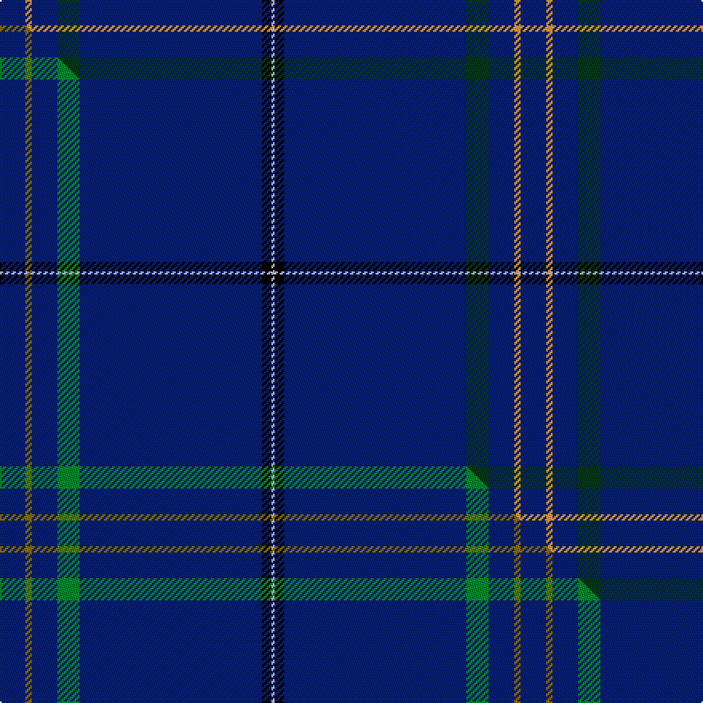

This page is one **sett** — a single exact thread-count. It belongs to the [tartan](/setts/db8lo2db8dg7db57k3lb1/)
(the same proportion at any scale), whose colour order is pattern [BYBGBKW](/stripes/bybgbkw/).

Part of the [Cullen](/tartans/cullen/) tartan — the named design grouping this sett with its other cloths.

Sourced from tartans-authority.  It is a [7 stripe tartan](/stripes/stripes7/).

Original link http://www.tartansauthority.com/tartan-ferret/display/10858/

## Register references

External register numbers recorded for this tartan.

- Scottish Register of Tartans: [10858](https://www.tartanregister.gov.uk/tartanDetails?ref=10858)
- Scottish Tartans Authority (ITI): 10858

## Thread count
DB/16 LO4 DB16 DG14 DB114 K6 LB/2

One full sett is **326 threads**.

## Palette
<table><thead><tr><th>Colour</th><th>Shade</th><th>OKLCh</th></tr></thead><tbody><tr><td>LB</td><td><code style="background-color:#B5BBDE;">#B5BBDE</code> <small style="color:#888">#B5BBDE</small></td><td><small style="color:#888">oklch(79.9% 0.050 277.6)</small></td></tr><tr><td>DB</td><td><code style="background-color:#082077;">#082077</code> <small style="color:#888">#082077</small></td><td><small style="color:#888">oklch(30.0% 0.149 265.1)</small></td></tr><tr><td>LO</td><td><code style="background-color:#FF9C34;">#FF9C34</code> <small style="color:#888">#FF9C34</small></td><td><small style="color:#888">oklch(77.9% 0.161 61.8)</small></td></tr><tr><td>DG</td><td><code style="background-color:#053819;">#053819</code> <small style="color:#888">#053819</small></td><td><small style="color:#888">oklch(30.0% 0.075 151.3)</small></td></tr><tr><td>K</td><td><code style="background-color:#000000;">#000000</code> <small style="color:#888">#000000</small></td><td><small style="color:#888">oklch(0.0% 0.000 0.0)</small></td></tr></tbody></table>

# Sample pattern

## Compared to the master

This cloth is one sett of its design; the master sett (the exemplar the design is anchored on) is below for comparison.

Its **ΔTartan distance** from the master is **0.72** — the same measure the nearest-tartans table ranks by (0 is identical; a re-scale of the same cloth is near 0, a recolour or a different proportion further).

<figure class="master-compare" style="margin:0">

this sett
master sett ★

<figcaption style="color:#888;font-size:smaller">One weave of this sett against the <a href="/setts/db8y2db8g7db57k3lb1/">master sett ★</a>, split on the diagonal: a shared proportion runs seamlessly across it with only the shades shifting; a different proportion breaks on it.</figcaption>
</figure>

## Nearest tartan variants

The nearest existing variants by ΔTartan distance, with this cloth at the top so the swatches line up against it.

ΔTartan

Threads

Variant

Sett

—

326

<a href="/variants/s7/db8lo2db8dg7db57k3lb1~x2/">Cullen (Christian Hill)</a>

<a href="/ttd/edit/#slug=db8y2db8g7db57k3lb1~x2&amp;base=db8lo2db8dg7db57k3lb1~x2" title="compare in the TTD">0.30</a>

326

<a href="/variants/s7/db8y2db8g7db57k3lb1~x2/">Cullen (Christian Hill) (Personal)</a>

<a href="/ttd/edit/#slug=db60g10db3lb6y2db9r2w2~x2&amp;base=db8lo2db8dg7db57k3lb1~x2" title="compare in the TTD">1.40</a>

252

<a href="/variants/s8/db60g10db3lb6y2db9r2w2~x2/">St. Petersburg City (District)</a>

<a href="/ttd/edit/#slug=w2db4r2db90w2db4r1~x2~r2109032&amp;base=db8lo2db8dg7db57k3lb1~x2" title="compare in the TTD">1.50</a>

414

<a href="/variants/s7/w2db4r2db90w2db4r1~x2~r2109032/">Spirit of Ulster</a>

<a href="/ttd/edit/#slug=w2db4r2db90w2db4r1~x2&amp;base=db8lo2db8dg7db57k3lb1~x2" title="compare in the TTD">1.50</a>

414

<a href="/variants/s7/w2db4r2db90w2db4r1~x2/">Spirit of Ulster (Fashion)</a>

<a href="/ttd/edit/#slug=r3db2r1db18g1db2~x4&amp;base=db8lo2db8dg7db57k3lb1~x2" title="compare in the TTD">1.50</a>

196

<a href="/variants/s6/r3db2r1db18g1db2~x4/">Lynch</a>

<a href="/ttd/edit/#slug=n3db2w1db50y1db2r3~x2~n2203265-db1003265&amp;base=db8lo2db8dg7db57k3lb1~x2" title="compare in the TTD">1.50</a>

236

<a href="/variants/s7/n3db2w1db50y1db2r3~x2~n2203265-db1003265/">Easton (2014)</a>

<a href="/ttd/edit/#slug=r3db2ly1db50w1db2lb3~x2&amp;base=db8lo2db8dg7db57k3lb1~x2" title="compare in the TTD">1.50</a>

236

<a href="/variants/s7/r3db2ly1db50w1db2lb3~x2/">Easton (2014)</a>

1.79

—

<a href="/variants/s9/db80dg1db2dr4lr1n5db8ly2dg2~x2~db0705267-lr2800000-n1900000/">Crichton Clan Tartan</a>

<a href="/ttd/edit/#slug=db45k3db10o4k1w2~x4&amp;base=db8lo2db8dg7db57k3lb1~x2" title="compare in the TTD">1.87</a>

332

<a href="/variants/s6/db45k3db10o4k1w2~x4/">Wylie</a>

<a href="/ttd/edit/#slug=db122r11w4r15y4db6y4db30&amp;base=db8lo2db8dg7db57k3lb1~x2" title="compare in the TTD">1.99</a>

240

<a href="/variants/s8/db122r11w4r15y4db6y4db30/">Inverness, Duke of York</a>

## Neighbour map

Every grey dot is one of 13620 variants placed by the first two principal components of the ΔTartan feature space (42% of its variance). Red is this tartan; blue dots are its nearest — click one to open its page.

<svg viewBox="0 0 640 380" role="img" style="max-width:100%;height:auto;border:1px solid #e0e0e0;border-radius:4px;display:block" xmlns="http://www.w3.org/2000/svg"><image href="/nn/cloud.v1.png" width="640" height="380"/><a href="/variants/s7/db8y2db8g7db57k3lb1~x2/"><circle cx="599.2" cy="91.3" r="4" fill="#3465a4"><title>Cullen (Christian Hill) (Personal)</title></circle></a><a href="/variants/s8/db60g10db3lb6y2db9r2w2~x2/"><circle cx="470.2" cy="89.2" r="4" fill="#3465a4"><title>St. Petersburg City (District)</title></circle></a><a href="/variants/s7/w2db4r2db90w2db4r1~x2~r2109032/"><circle cx="626.0" cy="103.5" r="4" fill="#3465a4"><title>Spirit of Ulster</title></circle></a><a href="/variants/s7/w2db4r2db90w2db4r1~x2/"><circle cx="626.0" cy="103.0" r="4" fill="#3465a4"><title>Spirit of Ulster (Fashion)</title></circle></a><a href="/variants/s6/r3db2r1db18g1db2~x4/"><circle cx="577.0" cy="173.5" r="4" fill="#3465a4"><title>Lynch</title></circle></a><a href="/variants/s7/n3db2w1db50y1db2r3~x2~n2203265-db1003265/"><circle cx="626.0" cy="83.4" r="4" fill="#3465a4"><title>Easton (2014)</title></circle></a><a href="/variants/s7/r3db2ly1db50w1db2lb3~x2/"><circle cx="617.9" cy="76.2" r="4" fill="#3465a4"><title>Easton (2014)</title></circle></a><a href="/variants/s9/db80dg1db2dr4lr1n5db8ly2dg2~x2~db0705267-lr2800000-n1900000/"><circle cx="626.0" cy="76.3" r="4" fill="#3465a4"><title>Crichton Clan Tartan</title></circle></a><a href="/variants/s6/db45k3db10o4k1w2~x4/"><circle cx="559.7" cy="89.5" r="4" fill="#3465a4"><title>Wylie</title></circle></a><a href="/variants/s8/db122r11w4r15y4db6y4db30/"><circle cx="551.0" cy="114.2" r="4" fill="#3465a4"><title>Inverness, Duke of York</title></circle></a><circle cx="622.4" cy="98.5" r="5" fill="#c00000"/><text x="320" y="376" text-anchor="middle" font-size="11" fill="#999">ground</text><text x="11" y="190" text-anchor="middle" font-size="11" fill="#999" transform="rotate(-90 11 190)">complexity</text></svg>

ID: /variants/s7/db8lo2db8dg7db57k3lb1~x2/
