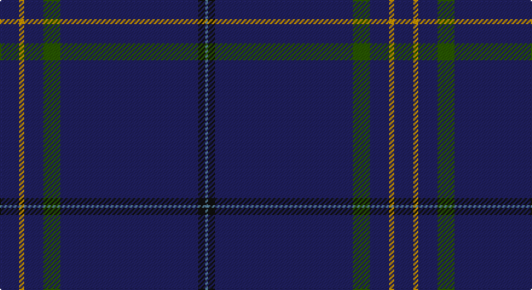

This page is one **sett** — a single exact thread-count. It belongs to the [tartan](/setts/db8lo2db8dg7db57k3t1/)
(the same proportion at any scale), whose colour order is pattern [BKBGBYB](/stripes/bkbgbyb/).

Sourced from tartans-authority.  It is a [7 stripe tartan](/stripes/stripes7/).

Original link http://www.tartansauthority.com/tartan-ferret/display/10858/

## Register references

External register numbers recorded for this tartan.

- Scottish Register of Tartans: [10858](https://www.tartanregister.gov.uk/tartanDetails?ref=10858)
- Scottish Tartans Authority (ITI): 10858

## Thread count
DB/16 DY4 DB16 G14 DB114 K6 B/2

One full sett is **326 threads**.

## Palette

Palette: <strong>Tartan Register</strong> <small style="color:#888">(4 of 5 colours)</small>
<table><thead><tr><th>Colour</th><th>Threads</th><th>Shade</th><th>Base</th><th>OKLCh</th></tr></thead><tbody><tr><td>DB/</td><td style="text-align:right;font-variant-numeric:tabular-nums">16</td><td><code style="background-color:#202060;">#202060</code> <small style="color:#888">#202060</small></td><td>B <code style="background-color:#2A418A;">#2A418A</code></td><td><small style="color:#888">oklch(28.9% 0.111 276.9)</small></td></tr><tr><td>DY</td><td style="text-align:right;font-variant-numeric:tabular-nums">4</td><td><code style="background-color:#D09800;">#D09800</code> <small style="color:#888">#D09800</small></td><td>Y <code style="background-color:#F2BF00;">#F2BF00</code></td><td><small style="color:#888">oklch(71.4% 0.147 82.1)</small></td></tr><tr><td>DB</td><td style="text-align:right;font-variant-numeric:tabular-nums">16</td><td><code style="background-color:#202060;">#202060</code> <small style="color:#888">#202060</small></td><td>B <code style="background-color:#2A418A;">#2A418A</code></td><td><small style="color:#888">oklch(28.9% 0.111 276.9)</small></td></tr><tr><td>G</td><td style="text-align:right;font-variant-numeric:tabular-nums">14</td><td><code style="background-color:#285800;">#285800</code> <small style="color:#888">#285800</small></td><td>G <code style="background-color:#006100;">#006100</code></td><td><small style="color:#888">oklch(41.0% 0.122 135.8)</small></td></tr><tr><td>DB</td><td style="text-align:right;font-variant-numeric:tabular-nums">114</td><td><code style="background-color:#202060;">#202060</code> <small style="color:#888">#202060</small></td><td>B <code style="background-color:#2A418A;">#2A418A</code></td><td><small style="color:#888">oklch(28.9% 0.111 276.9)</small></td></tr><tr><td>K</td><td style="text-align:right;font-variant-numeric:tabular-nums">6</td><td><code style="background-color:#101010;">#101010</code> <small style="color:#888">#101010</small></td><td>K <code style="background-color:#000000;">#000000</code></td><td><small style="color:#888">oklch(17.3% 0.000 89.9)</small></td></tr><tr><td>B/</td><td style="text-align:right;font-variant-numeric:tabular-nums">2</td><td><code style="background-color:#5C8CA8;">#5C8CA8</code> <small style="color:#888">#5C8CA8</small></td><td>B <code style="background-color:#2A418A;">#2A418A</code></td><td><small style="color:#888">oklch(61.7% 0.067 235.0)</small></td></tr></tbody></table>

# Sample pattern

## Nearest tartans

The nearest existing variants by ΔTartan distance, with this tartan at the top so the swatches line up against it.

ΔTartan

Tartan

Sett

—

<a href="/ttd/edit/#slug=db8lo2db8dg7db57k3t1~x2">Cullen (Christian Hill)</a> <a class="nn-out" href="/variants/s7/db8lo2db8dg7db57k3t1~x2/" title="open its dictionary page">↗</a>

1.62

<a href="/ttd/edit/#slug=k5o1k41dg8k8ly1k5~x2&amp;base=db8lo2db8dg7db57k3t1~x2">Callaghan</a> <a class="nn-out" href="/variants/s7/k5o1k41dg8k8ly1k5~x2/" title="open its dictionary page">↗</a>

1.91

<a href="/ttd/edit/#slug=db73g16db10r8db10k4db10w2~x2&amp;base=db8lo2db8dg7db57k3t1~x2">Scotch Whisky Heritage Centre</a> <a class="nn-out" href="/variants/s8/db73g16db10r8db10k4db10w2~x2/" title="open its dictionary page">↗</a>

1.92

<a href="/ttd/edit/#slug=db80dg1db2r4lr1n5db8lo2dg2~x2&amp;base=db8lo2db8dg7db57k3t1~x2">Crichton (Clan)</a> <a class="nn-out" href="/variants/s9/db80dg1db2r4lr1n5db8lo2dg2~x2/" title="open its dictionary page">↗</a>

2.00

<a href="/ttd/edit/#slug=g8dt13w1dt40r5dt40w1dt13g8k4~x2&amp;base=db8lo2db8dg7db57k3t1~x2">London Scottish Rugby Club Corporate Sport Tartan</a> <a class="nn-out" href="/variants/s10/g8dt13w1dt40r5dt40w1dt13g8k4~x2/" title="open its dictionary page">↗</a>

2.07

<a href="/ttd/edit/#slug=t8lo2t8dg7t57k3lb1~x2&amp;base=db8lo2db8dg7db57k3t1~x2">Cullen (Christian Hill) (Personal)</a> <a class="nn-out" href="/variants/s7/t8lo2t8dg7t57k3lb1~x2/" title="open its dictionary page">↗</a>

2.09

<a href="/ttd/edit/#slug=r3db2ly1db50w1db2t3~x2&amp;base=db8lo2db8dg7db57k3t1~x2">Easton (2014)</a> <a class="nn-out" href="/variants/s7/r3db2ly1db50w1db2t3~x2/" title="open its dictionary page">↗</a>

2.09

<a href="/ttd/edit/#slug=db51b4db7m2db2g2db2dg10db13w2~x2&amp;base=db8lo2db8dg7db57k3t1~x2">Visit Scotland</a> <a class="nn-out" href="/variants/s10/db51b4db7m2db2g2db2dg10db13w2~x2/" title="open its dictionary page">↗</a>

2.21

<a href="/ttd/edit/#slug=k75g2k4dp10db1dp4db1dp4k4~x2&amp;base=db8lo2db8dg7db57k3t1~x2">Laird (Restricted)</a> <a class="nn-out" href="/variants/s9/k75g2k4dp10db1dp4db1dp4k4~x2/" title="open its dictionary page">↗</a>

2.25

<a href="/ttd/edit/#slug=db7dt5lr6dt5r7dt2db2dt70lr2&amp;base=db8lo2db8dg7db57k3t1~x2">United States Trade sett Tartan</a> <a class="nn-out" href="/variants/s9/db7dt5lr6dt5r7dt2db2dt70lr2/" title="open its dictionary page">↗</a>

2.36

<a href="/variants/s6/db33g3r1~x2/">Norwich No.030</a>

## Neighbour map

Every grey dot is one of 14360 variants placed by the first two principal components of the ΔTartan feature space (44% of its variance). Red is this tartan; blue dots are its nearest — click one to open its page.

<svg viewBox="0 0 640 380" role="img" style="max-width:100%;height:auto;border:1px solid #e0e0e0;border-radius:4px;display:block" xmlns="http://www.w3.org/2000/svg"><image href="/nn/cloud.v1.png" width="640" height="380"/><a href="/variants/s7/k5o1k41dg8k8ly1k5~x2/"><circle cx="626.0" cy="196.0" r="4" fill="#3465a4"><title>Callaghan</title></circle></a><a href="/variants/s8/db73g16db10r8db10k4db10w2~x2/"><circle cx="540.4" cy="142.6" r="4" fill="#3465a4"><title>Scotch Whisky Heritage Centre</title></circle></a><a href="/variants/s9/db80dg1db2r4lr1n5db8lo2dg2~x2/"><circle cx="626.0" cy="96.3" r="4" fill="#3465a4"><title>Crichton (Clan)</title></circle></a><a href="/variants/s10/g8dt13w1dt40r5dt40w1dt13g8k4~x2/"><circle cx="567.2" cy="164.2" r="4" fill="#3465a4"><title>London Scottish Rugby Club Corporate Sport Tartan</title></circle></a><a href="/variants/s7/t8lo2t8dg7t57k3lb1~x2/"><circle cx="626.0" cy="132.5" r="4" fill="#3465a4"><title>Cullen (Christian Hill) (Personal)</title></circle></a><a href="/variants/s7/r3db2ly1db50w1db2t3~x2/"><circle cx="626.0" cy="108.6" r="4" fill="#3465a4"><title>Easton (2014)</title></circle></a><a href="/variants/s10/db51b4db7m2db2g2db2dg10db13w2~x2/"><circle cx="562.0" cy="140.6" r="4" fill="#3465a4"><title>Visit Scotland</title></circle></a><a href="/variants/s9/k75g2k4dp10db1dp4db1dp4k4~x2/"><circle cx="626.0" cy="131.6" r="4" fill="#3465a4"><title>Laird (Restricted)</title></circle></a><a href="/variants/s9/db7dt5lr6dt5r7dt2db2dt70lr2/"><circle cx="571.0" cy="136.2" r="4" fill="#3465a4"><title>United States Trade sett Tartan</title></circle></a><a href="/variants/s6/db33g3r1~x2/"><circle cx="626.0" cy="226.0" r="4" fill="#3465a4"><title>Norwich No.030</title></circle></a><circle cx="626.0" cy="151.9" r="5" fill="#c00000"/></svg>

ID: /variants/s7/db8lo2db8dg7db57k3t1~x2/
