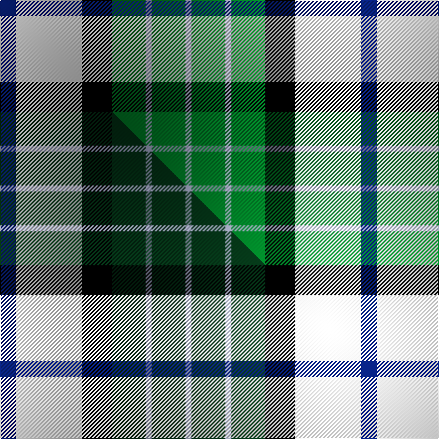

This is one **variant** — a specific cloth: this exact thread count and colourway, with its own
provenance below. It is one weaving of the [sett](/setts/db8w33k15g17lb3g17lb3/) (the scale-free proportion — the
same cloth at any scale or shade), whose colour order is pattern [BWKGWGW](/stripes/bwkgwgw/).

Part of the [MacRobart Dress](/tartans/macrobart-dress/) tartan — the named design grouping this sett with its other cloths.

Sourced from weddslist.  It is a [7 stripe tartan](/stripes/stripes7/).

Original link [http://www.weddslist.com/cgi-bin/tartans/pg.pl?source=sts](http://www.weddslist.com/cgi-bin/tartans/pg.pl?source=sts)

Dataset <small>— provenance for this record, inherited from the source manifest</small>

<dl class="dataset-prov">
<dt>source</dt><dd><a href="/sources/weddslist/">Weddslist</a></dd>
<dt>data captured from</dt><dd><a href="https://github.com/thetartan/tartan-database/blob/master/data/weddslist/data.csv">https://github.com/thetartan/tartan-database/blob/master/data/weddslist/data.csv</a></dd>
<dt>data date</dt><dd>2016-11-17 <small>(dataset default)</small></dd>
<dt>licence</dt><dd><a href="https://creativecommons.org/licenses/by-nc-nd/4.0/">CC BY-NC-ND 4.0</a></dd>
</dl>

Capture chain <small>— the hands this data passed through, oldest first; each capture carries its own licence</small>

<ol class="capture-chain">
<li><a href="https://www.weddslist.com/tartans/">Weddslist</a> <small>the living privately compiled reference</small></li>
<li><a href="https://github.com/thetartan/tartan-database">thetartan/tartan-database</a> <small>2016-2017</small> · <a href="https://creativecommons.org/licenses/by-nc-nd/4.0/">CC BY-NC-ND 4.0</a> <small>Levko Kravets's frozen compilation — the capture we vendored, and where its CC licence text came from</small></li>
<li>this dictionary <small>captured 2026-06-10 · commit 5bf86c7566</small> <small>each re-capture is a git commit to data/sources</small></li>
</ol>

## Thread count
DB/16 W66 K30 G34 LB6 G34 LB/6

One full sett is **362 threads**.

## Palette
<table><thead><tr><th>Colour</th><th>Shade</th><th>OKLCh</th></tr></thead><tbody><tr><td>DB</td><td><code style="background-color:#082077;">#082077</code> <small style="color:#888">#082077</small></td><td><small style="color:#888">oklch(30.0% 0.149 265.1)</small></td></tr><tr><td>LB</td><td><code style="background-color:#B5BBDE;">#B5BBDE</code> <small style="color:#888">#B5BBDE</small></td><td><small style="color:#888">oklch(79.9% 0.050 277.6)</small></td></tr><tr><td>G</td><td><code style="background-color:#008B2A;">#008B2A</code> <small style="color:#888">#008B2A</small></td><td><small style="color:#888">oklch(55.4% 0.170 145.9)</small></td></tr><tr><td>K</td><td><code style="background-color:#000000;">#000000</code> <small style="color:#888">#000000</small></td><td><small style="color:#888">oklch(0.0% 0.000 0.0)</small></td></tr><tr><td>W</td><td><code style="background-color:#F7F7F7;">#F7F7F7</code> <small style="color:#888">#F7F7F7</small></td><td><small style="color:#888">oklch(97.6% 0.000 89.9)</small></td></tr></tbody></table>

# Sample pattern

## Compared to the master

This cloth is one sett of its design; the master sett (the exemplar the design is anchored on) is below for comparison.

Its **ΔTartan distance** from the master is **0.15** — the same measure the nearest-tartans table ranks by (0 is identical; a re-scale of the same cloth is near 0, a recolour or a different proportion further).

<figure class="master-compare" style="margin:0">

this sett
master sett ★

<figcaption style="color:#888;font-size:smaller">One weave of this sett against the <a href="/setts/db8w33k15dg17lb3dg17lb3/">master sett ★</a>, split on the diagonal: a shared proportion runs seamlessly across it with only the shades shifting; a different proportion breaks on it.</figcaption>
</figure>

## Nearest tartan variants

The nearest existing variants by ΔTartan distance, with this cloth at the top so the swatches line up against it.

ΔTartan

Threads

Variant

Sett

—

362

<a href="/variants/s7/db8w33k15g17lb3g17lb3~x2/">MacRobart, dress</a>

<a href="/ttd/edit/#slug=db8w33k15dg17lb3dg17lb3~x2&amp;base=db8w33k15g17lb3g17lb3~x2" title="compare in the TTD">0.15</a>

362

<a href="/variants/s7/db8w33k15dg17lb3dg17lb3~x2/">MacRobart Dress (Personal)</a>

<a href="/ttd/edit/#slug=o5g2o2g26k9lr9lb13w5~x2~lr2800000-lb3203246&amp;base=db8w33k15g17lb3g17lb3~x2" title="compare in the TTD">1.80</a>

264

<a href="/variants/s8/o5g2o2g26k9lr9lb13w5~x2~lr2800000-lb3203246/">Alexander of Menstry Htg (Personal)</a>

<a href="/ttd/edit/#slug=o5g2o2g26k9lr9lb13w5~x2~g2203152-lr2800000-lb3203246&amp;base=db8w33k15g17lb3g17lb3~x2" title="compare in the TTD">1.80</a>

264

<a href="/variants/s8/o5g2o2g26k9lr9lb13w5~x2~g2203152-lr2800000-lb3203246/">Alexander of Menstry Hunting</a>

<a href="/ttd/edit/#slug=db7w30k13g9r6g16k2y7~x2&amp;base=db8w33k15g17lb3g17lb3~x2" title="compare in the TTD">2.02</a>

332

<a href="/variants/s8/db7w30k13g9r6g16k2y7~x2/">MacLaren Dress Clan Tartan</a>

<a href="/ttd/edit/#slug=db2w12k8g8r2g8k1lo2~x2&amp;base=db8w33k15g17lb3g17lb3~x2" title="compare in the TTD">2.03</a>

164

<a href="/variants/s8/db2w12k8g8r2g8k1lo2~x2/">MacLaren Dress (Clan)</a>

<a href="/ttd/edit/#slug=db2w12k8g8r2g8k1y2~x2&amp;base=db8w33k15g17lb3g17lb3~x2" title="compare in the TTD">2.03</a>

164

<a href="/variants/s8/db2w12k8g8r2g8k1y2~x2/">MacLaren Dress</a>

<a href="/ttd/edit/#slug=w4k2w18k11db2g18ly2~x2&amp;base=db8w33k15g17lb3g17lb3~x2" title="compare in the TTD">2.21</a>

216

<a href="/variants/s7/w4k2w18k11db2g18ly2~x2/">Barbour - Ancient</a>

<a href="/ttd/edit/#slug=w7r1w14k6y2k6g14r2g10y1~x2~w3600000-r2209032&amp;base=db8w33k15g17lb3g17lb3~x2" title="compare in the TTD">2.47</a>

236

<a href="/variants/s10/w7r1w14k6y2k6g14r2g10y1~x2~w3600000-r2209032/">Spanish shirt</a>

<a href="/ttd/edit/#slug=k20w4r4w20dg20w5dg2g2~x2~dg1705151-g2307139&amp;base=db8w33k15g17lb3g17lb3~x2" title="compare in the TTD">2.53</a>

264

<a href="/variants/s8/k20w4r4w20dg20w5dg2g2~x2~dg1705151-g2307139/">Hackett, William (Coatbridge) (Personal)</a>

<a href="/ttd/edit/#slug=k22g21k5g12lb12n3w4~x2&amp;base=db8w33k15g17lb3g17lb3~x2" title="compare in the TTD">2.56</a>

264

<a href="/variants/s7/k22g21k5g12lb12n3w4~x2/">Disciples of Christ Motorcycle Ministry (Switzerland)</a>

## Neighbour map

Every grey dot is one of 13621 variants placed by the first two principal components of the ΔTartan feature space (42% of its variance). Red is this tartan; blue dots are its nearest — click one to open its page.

<svg viewBox="0 0 640 380" role="img" style="max-width:100%;height:auto;border:1px solid #e0e0e0;border-radius:4px;display:block" xmlns="http://www.w3.org/2000/svg"><image href="/nn/cloud.v1.png" width="640" height="380"/><a href="/variants/s7/db8w33k15dg17lb3dg17lb3~x2/"><circle cx="100.9" cy="181.2" r="4" fill="#3465a4"><title>MacRobart Dress (Personal)</title></circle></a><a href="/variants/s8/o5g2o2g26k9lr9lb13w5~x2~lr2800000-lb3203246/"><circle cx="112.2" cy="153.9" r="4" fill="#3465a4"><title>Alexander of Menstry Htg (Personal)</title></circle></a><a href="/variants/s8/o5g2o2g26k9lr9lb13w5~x2~g2203152-lr2800000-lb3203246/"><circle cx="119.8" cy="153.8" r="4" fill="#3465a4"><title>Alexander of Menstry Hunting</title></circle></a><a href="/variants/s8/db7w30k13g9r6g16k2y7~x2/"><circle cx="69.8" cy="149.8" r="4" fill="#3465a4"><title>MacLaren Dress Clan Tartan</title></circle></a><a href="/variants/s8/db2w12k8g8r2g8k1lo2~x2/"><circle cx="83.2" cy="158.6" r="4" fill="#3465a4"><title>MacLaren Dress (Clan)</title></circle></a><a href="/variants/s8/db2w12k8g8r2g8k1y2~x2/"><circle cx="83.6" cy="159.1" r="4" fill="#3465a4"><title>MacLaren Dress</title></circle></a><a href="/variants/s7/w4k2w18k11db2g18ly2~x2/"><circle cx="121.3" cy="178.2" r="4" fill="#3465a4"><title>Barbour - Ancient</title></circle></a><a href="/variants/s10/w7r1w14k6y2k6g14r2g10y1~x2~w3600000-r2209032/"><circle cx="119.5" cy="155.5" r="4" fill="#3465a4"><title>Spanish shirt</title></circle></a><a href="/variants/s8/k20w4r4w20dg20w5dg2g2~x2~dg1705151-g2307139/"><circle cx="112.8" cy="164.7" r="4" fill="#3465a4"><title>Hackett, William (Coatbridge) (Personal)</title></circle></a><a href="/variants/s7/k22g21k5g12lb12n3w4~x2/"><circle cx="115.8" cy="202.7" r="4" fill="#3465a4"><title>Disciples of Christ Motorcycle Ministry (Switzerland)</title></circle></a><circle cx="101.3" cy="185.4" r="5" fill="#c00000"/><text x="320" y="376" text-anchor="middle" font-size="11" fill="#999">ground</text><text x="11" y="190" text-anchor="middle" font-size="11" fill="#999" transform="rotate(-90 11 190)">complexity</text></svg>

ID: /variants/s7/db8w33k15g17lb3g17lb3~x2/
