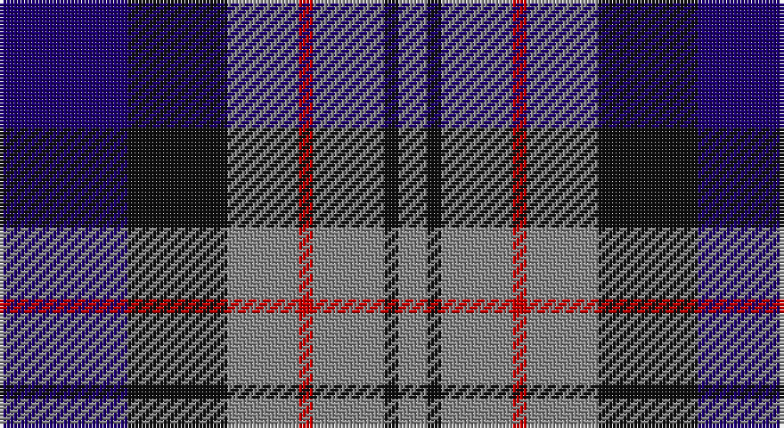

This page is one **sett** — a single exact thread-count. It belongs to the [tartan](/setts/db9k7o5r1o5k1o2/)
(the same proportion at any scale), whose colour order is pattern [BKRRRKR](/stripes/bkrrrkr/).

Sourced from tartans-authority.  It is a [7 stripe tartan](/stripes/stripes7/).

Original link http://www.tartansauthority.com/tartan-ferret/display/5709/

## Also known as

This cloth is also recorded under:

- Greyhound Grenadiers #2

## Register references

External register numbers recorded for this tartan.

- Scottish Tartans Authority (ITI): 5709

## Thread count
DB/36 K28 N20 R4 N20 K4 N/8

One full sett is **196 threads**.

## Palette

Palette: <strong>Tartan Register</strong>
<table><thead><tr><th>Colour</th><th>Threads</th><th>Shade</th><th>Base</th><th>OKLCh</th></tr></thead><tbody><tr><td>DB/</td><td style="text-align:right;font-variant-numeric:tabular-nums">36</td><td><code style="background-color:#1C0070;">#1C0070</code> <small style="color:#888">#1C0070</small></td><td>B <code style="background-color:#2A418A;">#2A418A</code></td><td><small style="color:#888">oklch(26.3% 0.162 277.1)</small></td></tr><tr><td>K</td><td style="text-align:right;font-variant-numeric:tabular-nums">28</td><td><code style="background-color:#101010;">#101010</code> <small style="color:#888">#101010</small></td><td>K <code style="background-color:#000000;">#000000</code></td><td><small style="color:#888">oklch(17.3% 0.000 89.9)</small></td></tr><tr><td>N</td><td style="text-align:right;font-variant-numeric:tabular-nums">20</td><td><code style="background-color:#888888;">#888888</code> <small style="color:#888">#888888</small></td><td>R <code style="background-color:#CC0000;">#CC0000</code></td><td><small style="color:#888">oklch(62.7% 0.000 89.9)</small></td></tr><tr><td>R</td><td style="text-align:right;font-variant-numeric:tabular-nums">4</td><td><code style="background-color:#C80000;">#C80000</code> <small style="color:#888">#C80000</small></td><td>R <code style="background-color:#CC0000;">#CC0000</code></td><td><small style="color:#888">oklch(52.3% 0.215 29.2)</small></td></tr><tr><td>N</td><td style="text-align:right;font-variant-numeric:tabular-nums">20</td><td><code style="background-color:#888888;">#888888</code> <small style="color:#888">#888888</small></td><td>R <code style="background-color:#CC0000;">#CC0000</code></td><td><small style="color:#888">oklch(62.7% 0.000 89.9)</small></td></tr><tr><td>K</td><td style="text-align:right;font-variant-numeric:tabular-nums">4</td><td><code style="background-color:#101010;">#101010</code> <small style="color:#888">#101010</small></td><td>K <code style="background-color:#000000;">#000000</code></td><td><small style="color:#888">oklch(17.3% 0.000 89.9)</small></td></tr><tr><td>N/</td><td style="text-align:right;font-variant-numeric:tabular-nums">8</td><td><code style="background-color:#888888;">#888888</code> <small style="color:#888">#888888</small></td><td>R <code style="background-color:#CC0000;">#CC0000</code></td><td><small style="color:#888">oklch(62.7% 0.000 89.9)</small></td></tr></tbody></table>

# Sample pattern

## Nearest tartans

The nearest existing variants by ΔTartan distance, with this tartan at the top so the swatches line up against it.

ΔTartan

Tartan

Sett

—

<a href="/ttd/edit/#slug=db9k7o5r1o5k1o2~x4">Greyhound Grenadiers (Corporate)</a> <a class="nn-out" href="/variants/s7/db9k7o5r1o5k1o2~x4/" title="open its dictionary page">↗</a>

0.54

<a href="/ttd/edit/#slug=dp3k1dp8k6dg8k1w2~x2&amp;base=db9k7o5r1o5k1o2~x4">Baillie (Highland Society)</a> <a class="nn-out" href="/variants/s7/dp3k1dp8k6dg8k1w2~x2/" title="open its dictionary page">↗</a>

0.81

<a href="/ttd/edit/#slug=k6lb3k8db7lo2db7lb1~x4&amp;base=db9k7o5r1o5k1o2~x4">St. Johnstone F.C. (Sports)</a> <a class="nn-out" href="/variants/s7/k6lb3k8db7lo2db7lb1~x4/" title="open its dictionary page">↗</a>

1.03

<a href="/ttd/edit/#slug=dp17k18w2g17k3g17w2k18dp17g3~x2&amp;base=db9k7o5r1o5k1o2~x4">Wilson's No.076</a> <a class="nn-out" href="/variants/s10/dp17k18w2g17k3g17w2k18dp17g3~x2/" title="open its dictionary page">↗</a>

1.06

<a href="/ttd/edit/#slug=db2ly1db7w1k7w2~x6&amp;base=db9k7o5r1o5k1o2~x4">Hawick Rugby Club (Corporate)</a> <a class="nn-out" href="/variants/s6/db2ly1db7w1k7w2~x6/" title="open its dictionary page">↗</a>

1.06

<a href="/ttd/edit/#slug=ly8k4o39k37dt36k6dt7&amp;base=db9k7o5r1o5k1o2~x4">Oceanic (Corporate?)</a> <a class="nn-out" href="/variants/s7/ly8k4o39k37dt36k6dt7/" title="open its dictionary page">↗</a>

1.09

<a href="/ttd/edit/#slug=r8k18r6k18b27k2w3~x2&amp;base=db9k7o5r1o5k1o2~x4">MacKean (Personal)</a> <a class="nn-out" href="/variants/s7/r8k18r6k18b27k2w3~x2/" title="open its dictionary page">↗</a>

1.09

<a href="/ttd/edit/#slug=r7k4db28k24t24k4db4~x2&amp;base=db9k7o5r1o5k1o2~x4">MacCorquodale</a> <a class="nn-out" href="/variants/s7/r7k4db28k24t24k4db4~x2/" title="open its dictionary page">↗</a>

1.09

<a href="/ttd/edit/#slug=r5db35k25db8ly10r5~x2&amp;base=db9k7o5r1o5k1o2~x4">University of Notre Dame</a> <a class="nn-out" href="/variants/s6/r5db35k25db8ly10r5~x2/" title="open its dictionary page">↗</a>

1.09

<a href="/ttd/edit/#slug=r2b1db8b8o8b1o1~x2&amp;base=db9k7o5r1o5k1o2~x4">Over Mountain</a> <a class="nn-out" href="/variants/s7/r2b1db8b8o8b1o1~x2/" title="open its dictionary page">↗</a>

1.11

<a href="/ttd/edit/#slug=k1db8r6g8k1~x4&amp;base=db9k7o5r1o5k1o2~x4">Edinburgh Tattoo 50th (Commemorative</a> <a class="nn-out" href="/variants/s5/k1db8r6g8k1~x4/" title="open its dictionary page">↗</a>

## Neighbour map

Every grey dot is one of 14360 variants placed by the first two principal components of the ΔTartan feature space (44% of its variance). Red is this tartan; blue dots are its nearest — click one to open its page.

<svg viewBox="0 0 640 380" role="img" style="max-width:100%;height:auto;border:1px solid #e0e0e0;border-radius:4px;display:block" xmlns="http://www.w3.org/2000/svg"><image href="/nn/cloud.v1.png" width="640" height="380"/><a href="/variants/s7/dp3k1dp8k6dg8k1w2~x2/"><circle cx="177.0" cy="227.0" r="4" fill="#3465a4"><title>Baillie (Highland Society)</title></circle></a><a href="/variants/s7/k6lb3k8db7lo2db7lb1~x4/"><circle cx="180.5" cy="244.1" r="4" fill="#3465a4"><title>St. Johnstone F.C. (Sports)</title></circle></a><a href="/variants/s10/dp17k18w2g17k3g17w2k18dp17g3~x2/"><circle cx="155.0" cy="208.0" r="4" fill="#3465a4"><title>Wilson's No.076</title></circle></a><a href="/variants/s6/db2ly1db7w1k7w2~x6/"><circle cx="196.8" cy="218.7" r="4" fill="#3465a4"><title>Hawick Rugby Club (Corporate)</title></circle></a><a href="/variants/s7/ly8k4o39k37dt36k6dt7/"><circle cx="172.9" cy="210.3" r="4" fill="#3465a4"><title>Oceanic (Corporate?)</title></circle></a><a href="/variants/s7/r8k18r6k18b27k2w3~x2/"><circle cx="229.8" cy="195.6" r="4" fill="#3465a4"><title>MacKean (Personal)</title></circle></a><a href="/variants/s7/r7k4db28k24t24k4db4~x2/"><circle cx="144.1" cy="220.5" r="4" fill="#3465a4"><title>MacCorquodale</title></circle></a><a href="/variants/s6/r5db35k25db8ly10r5~x2/"><circle cx="220.4" cy="222.4" r="4" fill="#3465a4"><title>University of Notre Dame</title></circle></a><a href="/variants/s7/r2b1db8b8o8b1o1~x2/"><circle cx="170.9" cy="207.6" r="4" fill="#3465a4"><title>Over Mountain</title></circle></a><a href="/variants/s5/k1db8r6g8k1~x4/"><circle cx="142.3" cy="233.7" r="4" fill="#3465a4"><title>Edinburgh Tattoo 50th (Commemorative</title></circle></a><circle cx="185.3" cy="222.0" r="5" fill="#c00000"/></svg>

ID: /variants/s7/db9k7o5r1o5k1o2~x4/
